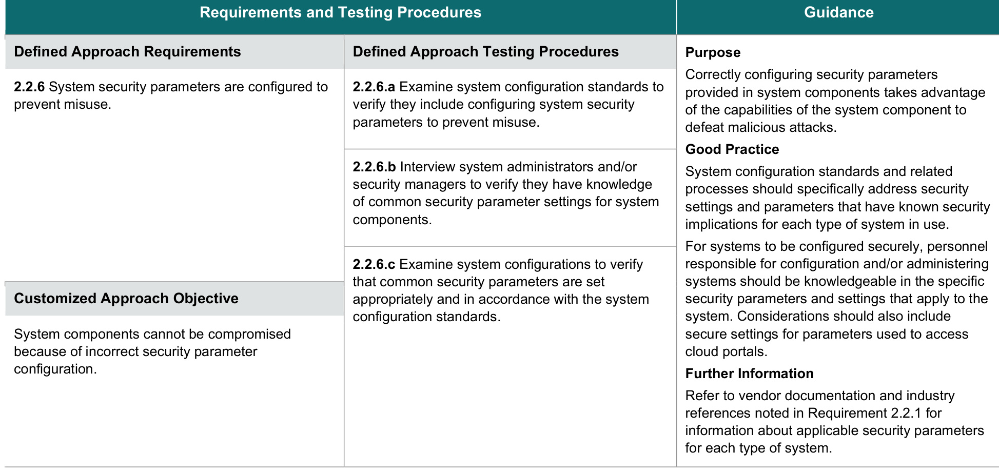
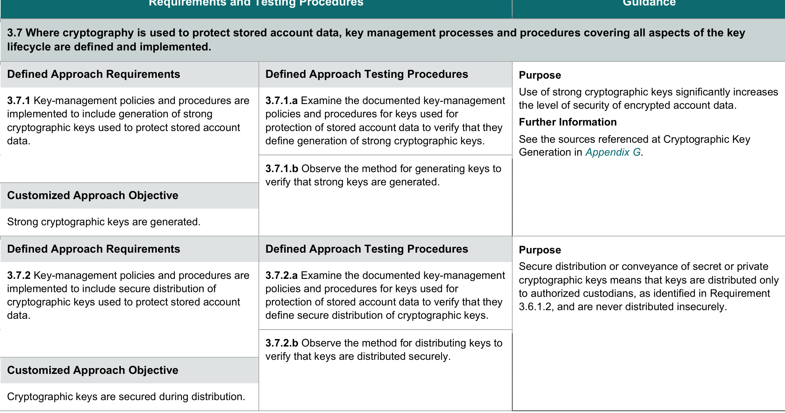
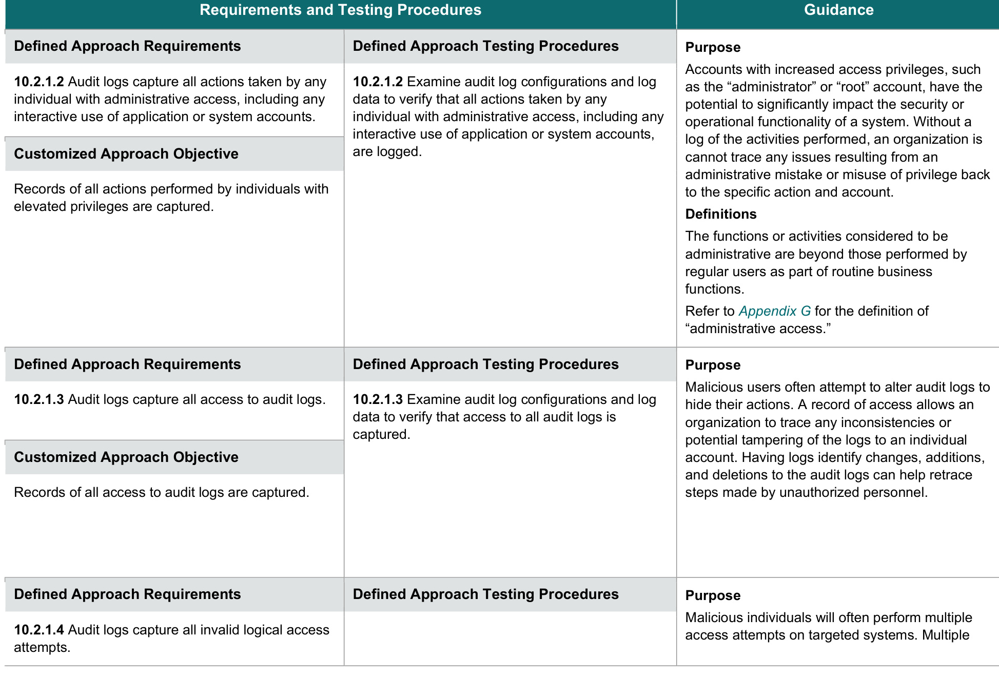
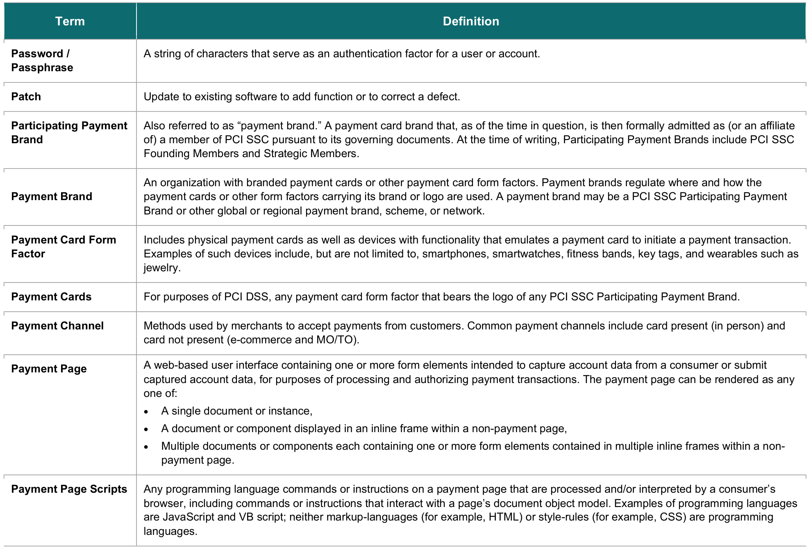
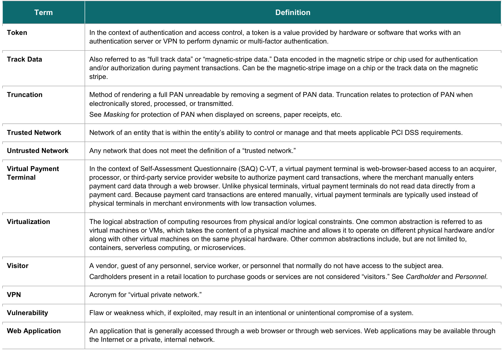

# Payment Card Industry Data Security Standard  

# Document Changes  

  

# Contents  

1Introduction and PCI Data Security Standard Overview ................................................................................................................................... 1   
2PCI DSS Applicability Information ....................................................................................................................................................................... 4   
3Relationship between PCI DSS and PCI SSC Software Standards .................................................................................................................. 7   
4Scope of PCI DSS Requirements ......................................................................................................................................................................... 9   
5Best Practices for Implementing PCI DSS into Business-as-Usual Processes ............................................................................................ 19   
6For Assessors: Sampling for PCI DSS Assessments...................................................................................................................................... 22   
7Description of Timeframes Used in PCI DSS Requirements .......................................................................................................................... 25   
8Approaches for Implementing and Validating PCI DSS .................................................................................................................................. 28   
9Protecting Information About an Entity’s Security Posture ........................................................................................................................... 30   
10 Testing Methods for PCI DSS Requirements .................................................................................................................................................... 31   
11 Instructions and Content for Report on Compliance ....................................................................................................................................... 32   
12 PCI DSS Assessment Process ........................................................................................................................................................................... 33   
13 Additional References ......................................................................................................................................................................................... 34   
14 PCI DSS Versions ................................................................................................................................................................................................ 35   
15 Detailed PCI DSS Requirements and Testing Procedures .............................................................................................................................. 36   
Build and Maintain a Secure Network and Systems ............................................................................................................................................. 38   
Protect Account Data ............................................................................................................................................................................................. 74   
Maintain a Vulnerability Management Program .................................................................................................................................................. 119   
Implement Strong Access Control Measures ...................................................................................................................................................... 161   
Regularly Monitor and Test Networks ................................................................................................................................................................. 236   
Maintain an Information Security Policy .............................................................................................................................................................. 290   
Appendix A Additional PCI DSS Requirements ............................................................................................................................................. 334   
Appendix B Compensating Controls ............................................................................................................................................................... 369   
Appendix C Compensating Controls Worksheet ........................................................................................................................................... 371   
Appendix D Customized Approach ................................................................................................................................................................. 372   
Appendix E Sample Templates to Support Customized Approach ............................................................................................................. 374   
Appendix F Leveraging the PCI Software Security Framework to Support Requirement 6 ..................................................................... 375   
Appendix G  

# 1Introduction and PCI Data Security Standard Overview  

The Payment Card Industry Data Security Standard (PCI DSS) was developed to encourage and enhance payment account data security and facilitate the broad adoption of consistent data security measures globally. PCI DSS provides a baseline of technical and operational requirements designed to protect account data. While specifically designed to focus on environments with payment account data, PCI DSS can also be used to protect against threats and secure other elements in the payment ecosystem.  

Table 1 shows the 12 principal PCI DSS requirements.  

Table 1. Principal PCI DSS Requirements   

  

This document, the Payment Card Industry Data Security Standard Requirements and Testing Procedures, consists of the 12 PCI DSS principal requirements, detailed security requirements, corresponding testing procedures, and other information pertinent to each requirement. The following sections provide detailed guidelines and best practices to assist entities to prepare for, conduct, and report the results of a PCI DSS assessment. The PCI DSS requirements and testing procedures begin on page 43.  

PCI DSS comprises a minimum set of requirements for protecting account data and may be enhanced by additional controls and practices to further mitigate risks, and to incorporate local, regional, and sector laws and regulations. Additionally, legislation or regulatory requirements may require specific protection of personal information or other data elements (for example, cardholder name).  

# Limitations  

If any of the requirements contained in this standard conflict with country, state, or local laws, the country, state, or local law will apply.  

# PCI DSS Resources  

The PCI Security Standards Council (PCI SSC) website ( www.pcisecuritystandards.org ) provides the following additional resources to assist organizations with their PCI DSS assessments and validations:  

Document Library, including: – PCI DSS Summary of Changes – PCI DSS Quick Reference Guide – Information Supplements and Guidelines – Prioritized Approach for PCI DSS – Report on Compliance (ROC) Reporting Template and Reporting Instructions – Self-Assessment Questionnaires (SAQs) and SAQ Instructions and Guidelines – Attestations of Compliance (AOCs )  
Frequently Asked Questions (FAQs)   
PCI for Small Merchants website   
PCI training courses and informational webinars   
List of Qualified Security Assessors (QSAs) and Approved Scanning Vendors (ASVs)  

There are over 60 guidance documents and information supplements available on the PCI SSC website that provide specific guidance and considerations for PCI DSS. Examples include:  

Note: Information Supplements complement PCI DSS and identify additional considerations and recommendations for meeting PCI DSS requirements. Information Supplements do not supersede, replace, or extend PCI DSS or any of its requirements.  

Guidance for PCI DSS Scoping and Network Segmentation   
PCI SSC Cloud Computing Guidelines   
Multi-Factor Authentication Guidance   
Third-Party Security Assurance   
Effective Daily Log Monitoring   
Penetration Testing Guidance   
Best Practices for Implementing a Security Awareness Program   
Best Practices for Maintaining PCI DSS Compliance   
PCI DSS for Large Organizations   
Use of SSL/Early TLS and Impact on ASV Scans   
Use of SSL/Early TLS for POS POI Terminal Connections   
Tokenization Product Security Guidelines   
Protecting Telephone-Based Payment Card Data  

Refer to the Document Library at www.pcisecuritystandards.org for information about these and other resources. In addition, refer to Appendix $\Game$ for definitions of PCI DSS terms.  

# 2PCI DSS Applicability Information  

PCI DSS is intended for all entities that store, process, or transmit cardholder data (CHD) and/or sensitive authentication data (SAD) or could impact the security of the cardholder data and/or sensitive authentication data. This includes all entities involved in payment account processing —including merchants, processors, acquirers, issuers, and other service providers.  

Whether any entity is required to comply with or validate their compliance to PCI DSS is at the discretion of those organizations that manage compliance programs (such as payment brands and acquirers); contact these organizations for any additional criteria.  

# Defining Account Data, Cardholder Data, and Sensitive Authentication Data  

Cardholder data and sensitive authentication data are considered account data and are defined as follows: PCI DSS requirements apply to entities with environments where account data (cardholder data and/or sensitive authentication data) is stored, processed, or transmitted, and entities with environments that can impact the security of cardholder data and/or sensitive authentication data. Some PCI DSS requirements may also apply to entities with environments that do not store, process, or transmit account data for example, entities that outsource payment operations or management of their cardholder data environment (CDE) 1. Entities that outsource their payment environments or payment operations to third parties remain responsible for ensuring that the account data is protected by the third party per applicable PCI DSS requirements.  

Table 2. Account Data   

  

The primary account number (PAN) is the defining factor for cardholder data. The term account data therefore covers the following: the full PAN, any other elements of cardholder data that are present with the PAN, and any elements of sensitive authentication data.  

If cardholder name, service code, and/or expiration date are stored, processed, or transmitted with the PAN, or are otherwise present in the CDE, they must be protected in accordance with the PCI DSS requirements applicable to cardholder data.  

If an entity stores, processes, or transmits PAN, then a CDE exists to which PCI DSS requirements will apply. Some requirements may not be applicable, for example if the entity does not store PAN, then the requirements relating to the protection of stored PAN in Requirement 3 will not be applicable to the entity.  

Even if an entity does not store, process, or transmit PAN, some PCI DSS requirements may still apply. Consider the following:  

If the entity stores SAD, requirements specifically related to SAD storage in Requirement 3 will be applicable.   
If the entity engages third-party service providers to store, process or transmit PAN on its behalf, requirements related to the management of service providers in Requirement 12 will be applicable.   
If the entity can impact the security of cardholder data and/or sensitive authentication data because the security of an entity’s infrastructure can affect how cardholder data is processed (for example, via a web server that controls the generation of a payment form or page) some requirements will be applicable.   
If cardholder data is only present on physical media (for example paper), requirements relating to the security and disposal of physical media in Requirement 9 will be applicable.   
Requirements related to an incident response plan are applicable to all entities, to ensure that there are procedures to follow in the event of a suspected or actual breach of the confidentiality of cardholder data .  

# Use of Account Data, Sensitive Authentication Data, Cardholder Data, and Primary Account Number in PCI DSS  

PCI DSS includes requirements that specifically refer to account data, cardholder data, and sensitive authentication data. It is important to note that each of these types of data are different and the terms are not interchangeable. Specific references within requirements to account data, cardholder data, or sensitive authentication data are purposeful, and the requirements apply specifically to the type of data that is referenced.  

# Elements of Account Data and Storage Requirements  

Table 3 identifies the elements of cardholder and sensitive authentication data, whether storage of each data element is permitted or prohibited, and whether each data element must be rendered unreadable—for example, with strong cryptography—when stored. This table is not exhaustive and is presented to illustrate only how the stated requirements apply to the different data elements.  

Table 3. Account Data Element Storage Requirements   

  

If PAN is stored with other elements of cardholder data, only the PAN must be rendered unreadable according to PCI DSS Requirement 3.5.1.  

Sensitive authentication data must not be stored after authorization, even if encrypted. This applies even for environments where there is no PAN present.  

# 3Relationship between PCI DSS and PCI SSC Software Standards  

PCI SSC supports the use of secure payment software within cardholder data environments (CDE) via the Software Security Framework (SSF), which consists of the Secure Software Standard and the Secure Software Lifecycle (Secure SLC) Standard. Software that is PCI SSC validated and listed provides assurance that the software has been developed using secure practices and has met a defined set of software security requirements.  

The PCI SSC secure software programs include listings of payment software and software vendors that have been validated as meeting the applicable PCI SSC Software Standards. Validated Software : Payment software listed on the PCI SSC website as a Validated Payment Application (PA-DSS) or Validated Payment Software (the Secure Software Standard) has been evaluated by a qualified assessor to confirm the software meets the security requirements within that standard. The security requirements in these standards are focused on protecting the integrity and confidentiality of payment transactions and account data.  

Qualified Software Vendors : The Secure SLC Standard defines security requirements for software vendors to integrate secure software development practices throughout the entire software lifecycle. Software vendors that have been validated as meeting the Secure SLC Standard are listed on the PCI SSC website as a Secure SLC Qualified Vendor.  

Note: PA-DSS and the related program were retired in October 2022. Refer to the PCI SSC List of Validated Payment Applications for   
expiry dates for PA-DSS validated   
applications. Since the expiry date,   
applications are listed as “Acceptable only for Pre-Existing Deployments.” Whether an entity can continue to use a PA-DSS application with an expired listing is at the discretion of   
organizations that manage compliance   
programs (such as payment brands and   
acquirers); entities should contact these   
organizations for more details.  

For more information about the SSF or PA-DSS, refer to the respective Program Guides at www.pcisecuritystandards.org All software that stores, processes, or transmits account data, or that could impact the security of cardholder data and/or sensitive authentication data, is in scope for an entity’s PCI DSS assessment. While the use of validated payment software supports the security of an entity’s CDE, the use of such software does not by itself make an entity PCI DSS compliant. The entity’s PCI DSS assessment should include verification that the software is properly configured and securely implemented to support applicable PCI DSS requirements. Additionally, if PCI-listed payment software has been customized, a more in-depth review will be required during the PCI DSS assessment because the software may no longer be representative of the version that was originally validated.  

Because security threats are constantly evolving, software that is no longer supported by the vendor (for example, identified by the vendor as “end of life”) may not offer the same level of security as supported versions. Entities are strongly encouraged to keep their software current and updated to the latest software versions available.  

Entities that develop their own software are encouraged to refer to PCI SSC’s software security standards and consider the requirements therein as best practices to use in their development environments. Secure payment software implemented in a PCI DSS compliant environment will help minimize the potential for security breaches leading to compromises of account data and fraud. See Bespoke and Custom Software .  

# Applicability of PCI DSS to Payment Software Vendors  

PCI DSS may apply to a payment software vendor if the vendor is also a service provider that stores, processes, or transmits account data, or has access to their customers’ account data—for example, in the role of a payment service provider or via remote access to a customer environment. Software vendors to which PCI DSS may be applicable include those offering payment services, as well as cloud service providers offering payment terminals in the cloud, software as a service (SaaS), e-commerce in the cloud, and other cloud payment services.  

# Bespoke and Custom Software  

All bespoke and custom software that stores, processes, or transmits account data, or that could impact the security of cardholder data and/or sensitive authentication data, is in scope for an entity’s PCI DSS assessment.  

Bespoke and custom software that has been developed and maintained in accordance with one of PCI SSC’s Software Security Framework standards (the Secure Software Standard or the Secure SLC standard) will support an entity in meeting PCI DSS Requirement 6.  

Note: PCI DSS Requirement 6 fully applies to bespoke and custom software that has not been developed and maintained in accordance with one of PCI SSC’s Software Security Framework standards. Entities that use software vendors to develop bespoke or custom software that could impact the security of their cardholder data and/or sensitive authentication data are responsible for ensuring those software vendors develop the software according to PCI DSS Requirement 6.  

See Appendix F for more details.  

# 4Scope of PCI DSS Requirements  

PCI DSS requirements apply to:  

The cardholder data environment (CDE), which is comprised of:  

– System components, people, and processes that store, process, or transmit cardholder data and/or sensitive authentication data, and,   
– System components that may not store, process, or transmit CHD/SAD but have unrestricted connectivity to system components that store, process, or transmit CHD/SAD.  

# AND  

System components, people, and processes that could impact the security of cardholder data and/or sensitive authentication data. 4“System components” include network devices, servers, computing devices, virtual components, cloud components, and software. Examples of system components include but are not limited to:  

Systems that store, process, or transmit account data (for example, payment terminals, authorization systems, clearing systems, payment middleware systems, payment back-office systems, shopping cart and store front systems, payment gateway/switch systems, fraud monitoring systems).   
Systems that provide security services (for example, authentication servers, access control servers, security information and event management (SIEM) systems, physical security systems (for example, badge access or CCTV), multi-factor authentication systems, anti-malware systems).   
Systems that facilitate segmentation (for example, internal network security controls).   
Systems that could impact the security of account data or the CDE (for example, name resolution, or e-commerce (web) redirection servers).   
Virtualization components such as virtual machines, virtual switches/routers, virtual appliances, virtual applications/desktops, and hypervisors.   
Cloud infrastructure and components, both external and on premises, and including instantiations of containers or images, virtual private clouds, cloud-based identity and access management, CDEs residing on premises or in the cloud, service meshes with containerized applications, and container orchestration tools.   
Network components, including but not limited to network security controls, switches, routers, VoIP network devices, wireless access points, network appliances, and other security appliances.   
Server types, including but not limited to web, application, database, authentication, mail, proxy, Network Time Protocol (NTP), and Domain Name System (DNS).   
End-user devices, such as computers, laptops, workstations, administrative workstations, tablets, and mobile devices.   
Printers, and multi-function devices that scan, print, and fax.   
Storage of account data in any format (for example, paper, data files, audio files, images, and video recordings).   
Applications, software, and software components, serverless applications, including all purchased, subscribed (for example, Softwareas-a-Service), bespoke and custom software, including internal and external (for example, Internet) applications.   
Tools, code repositories, and systems that implement software configuration management or for deployment of objects to the CDE or to systems that can impact the CDE.  

Figure 1 shows considerations for scoping system components for PCI DSS.  

  
Figure 1. Understanding PCI DSS Scoping  

# Annual PCI DSS Scope Confirmation  

The first step in preparing for a PCI DSS assessment is for the entity to accurately determine the scope of the review. The assessed entity must confirm the accuracy of their PCI DSS scope according to PCI DSS Requirement 12.5.2 by identifying all locations and flows of account data, and identifying all systems that are connected to or, if compromised, could impact the CDE (for example, authentication servers, remote access servers, logging servers) to ensure they are included in the PCI DSS scope. All types of systems and locations should be considered during the scoping process, including backup/recovery sites and fail-over systems.  

The minimum steps for an entity to confirm the accuracy of their PCI DSS scope are specified in PCI DSS Requirement 12.5.2. The entity is expected to retain documentation to show how PCI DSS scope was determined. The documentation is retained for assessor review and for reference during the entity’s next PCI DSS scope confirmation activity. For each PCI DSS assessment, the assessor validates that the entity accurately defined and documented the scope of the assessment.  

Note : This annual confirmation of PCI DSS scope is defined at PCI DSS Requirement at 12.5.2 and is an activity expected to be performed by the entity. This activity is not the same, nor is it intended to be replaced by, the scoping confirmation performed by the entity’s assessor during the assessment.  

# Segmentation  

Segmentation (or isolation) of the CDE from the remainder of an entity’s network is not a PCI DSS requirement. However, it is strongly recommended as a method that may reduce the:  

Scope of the PCI DSS assessment   
Cost of the PCI DSS assessment   
Cost and difficulty of implementing and maintaining PCI DSS controls  

Risk to an organization relative to payment account data (reduced by consolidating that data into fewer, more controlled locations) Without adequate segmentation (sometimes called a "flat network"), the entire network is in scope for the PCI DSS assessment. Segmentation can be achieved using a number of physical or logical methods, such as properly configured internal network security controls, routers with strong access control lists, or other technologies that restrict access to a particular segment of a network. To be considered out of scope for PCI DSS, a system component must be properly segmented (isolated) from the CDE, such that the out-of-scope system component could not impact the security of cardholder data and/or sensitive authentication data, even if that component was compromised.  

An important prerequisite to reduce the scope of the CDE is a clear understanding of business needs and processes related to the storage, processing, and transmission of account data. Restricting account data to as few locations as possible by eliminating unnecessary data and consolidating necessary data may require reengineering of long-standing business practices.  

Documenting account data flows via a data-flow diagram helps an entity fully understand how account data comes into an organization, where it resides within the organization, and how it traverses through various systems within the organization. Data-flow diagrams also illustrate all locations where account data is stored, processed, and transmitted. This information supports an entity implementing segmentation and can also support confirming that segmentation is being used to isolate the CDE from out-of-scope networks.  

If segmentation is used to reduce the scope of the PCI DSS assessment, the assessor must verify that the segmentation is adequate to reduce the scope of the assessment, as illustrated in Figure 2. At a high level, adequate segmentation isolates systems that store, process, or transmit account data from those that do not. However, the adequacy of a specific segmentation implementation is highly variable and depends on several factors such as a given network's configuration, the technologies deployed, and other controls that may be implemented.  

# Figure 2. Segmentation and Impact to PCI DSS Scope  

  

# Wireless  

If wireless technology is used to store, process, or transmit account data (for example, wireless point-of-sale devices), or if a wireless local area network (WLAN) is part of or connected to the CDE, the PCI DSS requirements and testing procedures for securing wireless environments apply and must be performed.  

Rogue wireless detection must be performed per PCI DSS Requirement 11.2.1 even when wireless is not used within the CDE and the entity has a policy that prohibits the use of wireless technology within its environment. This is because of the ease with which a wireless access point can be attached to a network, the difficulty in detecting its presence, and the increased risk presented by unauthorized wireless devices.  

Before wireless technology is implemented, an entity should carefully evaluate the need for the technology against the risk. Consider deploying wireless technology only for non-sensitive data transmission.  

# When Cardholder Data and/or Sensitive Authentication Data is Accidentally Received via an Unintended Channel  

There could be occurrences where an entity receives cardholder data and/or sensitive authentication data unsolicited via an insecure communication channel that was not intended for the purpose of receiving sensitive data. In this situation, the entity can choose to either:  

Include the channel in the scope of their CDE and secure it according to PCI DSS Or  

Securely delete the data and implement measures to prevent the channel from being used in the future for sending such data.  

# Encrypted Cardholder Data and Impact on PCI DSS Scope  

Encryption of cardholder data with strong cryptography is an acceptable method of rendering the data unreadable according to PCI DSS Requirement 3.5. However, encryption alone is generally insufficient to render the cardholder data out of scope for PCI DSS and does not remove the need for PCI DSS in that environment. The entity’s environment is still in scope for PCI DSS due to the presence of cardholder data. For example, for a merchant card-present environment, there is physical access to the payment cards to complete a transaction and there may also be paper reports or receipts with cardholder data. Similarly, in merchant card-not-present environments, such as mailorder/telephone-order and e-commerce, payment card details are provided via channels that need to be evaluated and protected according to PCI DSS.  

The following are each in scope for PCI DSS:  

Systems performing encryption and/or decryption of cardholder data, and systems performing key management functions, Encrypted cardholder data that is not isolated from the encryption and decryption and key management processes,  

Encrypted cardholder data that is present on a system or media that also contains the decryption key, Encrypted cardholder data that is present in the same environment as the decryption key, Encrypted cardholder data that is accessible to an entity that also has access to the decryption key. Note : A PCI-listed P2PE solution can significantly reduce the number of PCI DSS requirements applicable to a merchant’s cardholder data environment. However, it does not completely remove the applicability of PCI DSS in the merchant environment.  

# Encrypted Cardholder Data and Impact to PCI DSS Scope for Third-Party Service Providers  

Where a third-party service provider (TPSP) receives and/or stores only data encrypted by another entity, and where they do not have the ability to decrypt the data, the TPSP may be able to consider the encrypted data out of scope if certain conditions are met. This is because responsibility for the data generally remains with the entity, or entities, with the ability to decrypt the data or impact the security of the encrypted data. Determining which party is responsible for specific PCI DSS controls will depend on several factors, including who has access to the decryption keys, the role performed by each party, and the agreement between parties. Responsibilities should be clearly defined and documented to ensure both the TPSP and the entity providing the encrypted data understand which entity is responsible for which security controls.  

As an example, a TPSP providing storage services receives and stores encrypted cardholder data provided by customers for back-up purposes. This TPSP does not have access to the encryption or decryption keys, nor does it perform any key management for its customers. The TPSP can exclude any such encrypted data when determining its PCI DSS scope. However, the TPSP does maintain responsibility for controlling access to the encrypted data storage as part of its service agreements with its customers.  

Responsibility for ensuring that the encrypted data and the cryptographic keys are protected according to applicable PCI DSS requirements is often shared between entities. In the above example, the customer determines which of their personnel are authorized to access the storage media, and the storage facility is responsible for managing the physical and/or logical access controls to ensure that only persons authorized by the customer are granted access to the storage media. The specific PCI DSS requirements applicable to a TPSP will depend on the services provided and the agreement between the two parties. In the example of a TPSP providing storage services, the physical and logical access controls provided by the TPSP will need to be reviewed at least annually. This review could be performed as part of the merchant’s PCI DSS assessment or, alternatively, the review could be performed, and controls validated, by the TPSP with appropriate evidence provided to the merchant. For information about “appropriate evidence,” see Options for TPSPs to Validate PCI DSS Compliance for TPSP Services that Meet Customers’ PCI DSS Requirements.  

As another example, a TPSP that receives only encrypted cardholder data for the purposes of routing to other entities, and that does not have access to the data or cryptographic keys, may not have any PCI DSS responsibility for that encrypted data. In this scenario, where the TPSP is not providing any security services or access controls, they may be considered the same as a public or untrusted network, and it would be the responsibility of the entity(s) sending/receiving account data through the TPSP’s network to ensure PCI DSS controls are applied to protect the data being transmitted.  

# Use of Third-Party Service Providers  

An entity (referred to as the “customer” in this section) might choose to use a third-party service provider (TPSP) to store, process, or transmit account data or to manage in-scope system components on the customer’s behalf. Use of a TPSP may have an impact on the security of a customer’s CDE.  

Note : Use of a PCI DSS compliant TPSP does not make a customer PCI DSS compliant, nor does it remove the customer’s responsibility for its own PCI DSS compliance. Even if a customer uses a TPSP, that customer remains responsible for confirming its own compliance as requested by organizations that manage compliance programs (for example, payment brands and acquirers). Customers should contact these organizations for any requirements.  

# Using TPSPs and the Impact on Customers Meeting PCI DSS Requirement 12.8  

There are many different scenarios where a customer might use one or more TPSPs for functions within or related to the customer’s CDE. In all scenarios where a TPSP is used, the customer must manage and oversee all their TPSP relationships and monitor the PCI DSS compliance status of their TPSPs in accordance with Requirement 12.8, including TPSPs that:  

Have access to the customer’s CDE,  

Manage in-scope system components on the customer’s behalf, and/or  

Can impact the security of the customer’s cardholder data and/or sensitive authentication data.  

Managing TPSP relationships in accordance with Requirement 12.8 includes performing due diligence, having appropriate agreements in place, identifying which requirements apply to the customer and which apply to the TPSP, and monitoring the compliance status of TPSPs at least annually.  

Requirement 12.8 does not specify that the customer’s TPSPs must be PCI DSS compliant, only that the customer monitors their compliance status as specified in the requirement. Therefore, a TPSP does not need to be PCI DSS compliant for its customer to meet Requirement 12.8.  

# Impact of Using TPSPs for Services that Meet Customers’ PCI DSS Requirements  

When the TPSP provides a service that meets a PCI DSS requirement(s) on the customer’s behalf or where that service may impact the security of the customer’s cardholder data and/or sensitive authentication data, then those requirements are in scope for the customer’s assessment and the compliance of that service will impact the customer’s PCI DSS compliance. The TPSP must demonstrate it meets applicable PCI DSS requirements for those requirements to be in place for its customers. For example, if an entity engages a TPSP to manage its network security controls, and the TPSP does not provide evidence that it meets the applicable requirements in PCI DSS Requirement 1, then those requirements are not in place for the customer’s assessment. As another example, TPSPs that store backups of cardholder data on behalf of customers would need to meet the applicable requirements related to access controls, physical security, etc., for their customers to consider those requirements in place for their assessments.  

# Importance of Understanding Responsibilities Between TPSP Customers and TPSPs  

When a TPSP provides a service that meets a PCI DSS requirement(s) on the customer’s behalf or where that service may impact the security of the customer’s cardholder data and/or sensitive authentication data, it is important that customers and TPSPs clearly identify and understand the following:  

The services and system components included in the scope of the TPSP’s PCI DSS assessment, The specific PCI DSS requirements and sub-requirements covered by the TPSP’s PCI DSS assessment, Any requirements that are the responsibility of the TPSP’s customers to include in their own PCI DSS assessments, and Any PCI DSS requirements for which the responsibility is shared between the TPSP and its customers.  

For example, a cloud provider should clearly define which of its IP addresses are scanned as part of its quarterly vulnerability scan process and which IP addresses are their customers’ responsibility to scan.  

Per Requirement 12.9.2, TPSPs are required to support their customers’ requests for information about the TPSP’s PCI DSS compliance status related to the services provided to customers, and about which PCI DSS requirements are the responsibility of the TPSP, which are the responsibility of the customer, and any responsibilities shared between the customer and the TPSP. Refer to Information Supplement: Third-Party Security Assurance for a sample responsibility matrix template that may be used for documenting and clarifying how responsibilities are shared between TPSPs and customers.  

Note that not all TPSP relationships require that TPSPs provide customers with documentation of how responsibilities are shared between TPSPs and customers. TPSPs are only required to share such documentation if that TPSP is meeting a PCI DSS requirement(s) on the customer’s behalf, if responsibility for meeting a PCI DSS requirement is shared between the TPSP and its customer, or if the TPSP’s service may impact the security of the customer’s cardholder data and/or sensitive authentication data. While a TPSP may not be required to provide its customers with such documentation because there are no shared responsibilities, the TPSP still needs to support customers by providing their PCI DSS compliance status information, so that customers can manage and monitor their TPSPs in accordance with PCI DSS Requirement 12.8.  

# Options for TPSPs to Validate PCI DSS Compliance for TPSP Services that Meet Customers’ PCI DSS Requirements  

TPSPs are responsible for demonstrating their PCI DSS compliance as requested by organizations that manage compliance programs (for example, payment brands and acquirers). TPSPs should contact these organizations for any requirements.  

When a TPSP provides services that are intended to meet or facilitate meeting a customer’s PCI DSS requirements or that may impact the security of a customer’s cardholder data and/or sensitive authentication data, these requirements are in scope for the customer’s PCI DSS assessments. There are two options for TPSPs to validate compliance in this scenario:  

Annual assessment : TPSP undergoes an annual PCI DSS assessment(s) and provides evidence to its customers to show the TPSP meets the applicable PCI DSS requirements; or  

Multiple, on-demand assessments : If a TPSP does not undergo an annual PCI DSS assessment, it must undergo assessments upon request of their customers and/or participate in each of its customers’ PCI DSS assessments, with the results of each review provided to the respective customer(s).  

If the TPSP undergoes its own PCI DSS assessment, it is expected to provide sufficient evidence to its customers to verify that the scope of the TPSP’s PCI DSS assessment covered the services applicable to the customer, and that the relevant PCI DSS requirements were examined and determined to be in place. If the provider has an PCI DSS Attestation of Compliance (AOC), it is expected that the TPSP provides the AOC to customers upon request. The customer may also request relevant sections of the TPSP’s PCI DSS Report on Compliance (ROC). The ROC may be redacted to protect any confidential information.  

If the TPSP does not undergo its own PCI DSS assessment and therefore does not have an AOC, the TPSP is expected to provide specific evidence related to the applicable PCI DSS requirements, so that the customer (or its assessor) is able to confirm that the TPSP is meeting those PCI DSS requirements.  

# TPSP’s Presence on a Payment Brand List(s) of PCI DSS Compliant Service Providers  

For a customer that is monitoring a TPSP’s compliance status in accordance with Requirement 12.8, the TPSP’s presence on a payment brand’s list of PCI DSS compliant service providers may be sufficient evidence of the TPSP’s compliance status if it is clear from the list that the services applicable to the customer were covered by the TPSP’s PCI DSS assessment. If it is not clear from the list, the customer should obtain other written confirmation that addresses the TPSP’s PCI DSS compliance status.  

For a customer that is looking for evidence of PCI DSS compliance for requirements that a TPSP meets on a customer’s behalf or where the service provided can impact the security of the customer’s cardholder data and/or sensitive authentication data, the TPSP’s presence on a payment brand’s list of PCI DSS compliant service providers is not sufficient evidence that the applicable PCI DSS requirements for that TPSP were included in the assessment. If the TPSP has an PCI DSS AOC, it is expected to provide it to customers upon request.  

# 5Best Practices for Implementing PCI DSS into Business-as-Usual Processes  

An entity that implements business-as-usual processes, otherwise known as BAU, as part of their overall security strategy is taking measures to ensure that the security controls implemented to secure data and an environment continue to be implemented correctly and functioning properly as normal course of business.  

Some PCI DSS requirements are intended to act as BAU processes by monitoring security controls to ensure their effectiveness on an ongoing basis. This oversight by the entity assists with providing reasonable assurance that the compliance of its environment is preserved between PCI DSS assessments. While there are currently some BAU requirements defined within the standard, an entity should adopt additional BAU processes specific to their organization and environment when possible. BAU processes are a way to verify that automated and manual controls are performing as expected. Regardless of whether a PCI DSS requirement is automated or manual, it is important for BAU processes to detect anomalies, and alert and report so that responsible individuals address the situation in a timely manner.  

Examples of how PCI DSS should be incorporated into BAU activities include, but are not limited to:  

Assigning overall responsibility and accountability for PCI DSS compliance to an individual or team. This can include a charter defined by executive management for a specific PCI DSS compliance program and communication to executive management.   
Developing performance metrics to measure the effectiveness of security initiatives and continuous monitoring of security controls, including those that are heavily relied upon, such as network security controls, intrusion-detection systems/intrusion-prevention systems (IDS/IPS), change-detection mechanisms, anti-malware solutions, and access controls, to ensure they are operating effectively and as intended.   
Reviewing logged data more frequently to gain insights to trends or behaviors that may not be obvious with only monitoring.   
Ensuring that all failures in security controls are detected and responded to promptly. Processes to respond to security control failures should include: – Restoring the security control. – Identifying the cause of failure. – Identifying and addressing any security issues that arose during the failure of the security control. – Implementing mitigation, such as process or technical controls, to prevent the cause of the failure from recurring. – Resuming monitoring of the security control, perhaps with enhanced monitoring for a period of time, to verify the control is operating effectively.  

Reviewing changes that could introduce security risks to the environment (for example, addition of new systems, changes in system or network configurations) prior to completing the change, and including the following:  

– Perform a risk assessment to determine the potential impact to PCI DSS scope (for example, a new network security control rule that permits connectivity between a system in the CDE and another system could bring additional systems or networks into scope for PCI DSS). – Identify PCI DSS requirements applicable to systems and networks affected by the changes (for example, if a new system is in scope for PCI DSS, it would need to be configured per system configuration standards, including change-detection mechanisms, anti-malware software, patches, and audit logging. These new systems and networks would need to be added to the inventory of inscope system components and to the quarterly vulnerability scan schedule). – Update PCI DSS scope and implement security controls as appropriate. – Update documentation to reflect implemented changes.   
Reviewing the impact to PCI DSS scope and requirements upon changes to organizational structure (for example, a company merger or acquisition).   
Reviewing external connections and third-party access periodically.   
For entities that use third parties for software development, periodically confirming that those software development activities continue to comply with software development requirements in Requirement 6.   
Performing periodic reviews to confirm that PCI DSS requirements continue to be in place and personnel follow established processes. Periodic reviews should cover all facilities and locations, including retail outlets and data centers, whether self-managed or if a TPSP is used. For example, periodic reviews can be used to confirm that configuration standards have been applied to applicable systems, default vendor accounts and passwords are removed or disabled, patches and anti-malware solutions are up to date, audit logs are being reviewed, and so on. The frequency of periodic reviews should be determined by the entity as appropriate for the size and complexity of their environment, if not otherwise stated in PCI DSS.  

These reviews can also be used to verify that required evidence for a PCI DSS assessment is being maintained. For example, evidence of audit logs, vulnerability scan reports, and reviews of network security control rulesets are necessary to assist the entity in preparing for its next PCI DSS assessment.  

Establishing communication with all impacted parties, both external and internal, about newly identified threats and changes to the organization structure. Communication materials should help recipients understand the impact of threats, mitigating steps, and contact points for further information or escalation.  

Reviewing hardware and software technologies at least once every 12 months to confirm that they continue to be supported by the vendor and can meet the entity’s security requirements, including PCI DSS. If technologies are no longer supported by the vendor or cannot meet the entity’s security needs, the entity should prepare a remediation plan, including replacement of the technology, as necessary.  

Note : Some best practices in this section are also included as PCI DSS requirements for certain entities. For example, those undergoing a full PCI DSS assessment, service providers validating to the additional “service provider only” requirements, and designated entities that are required to validate according to Appendix A3: Designated Entities Supplemental Validation.  

Each entity should consider implementing these best practices into their environment, even if the entity is not required to validate to them (for example, merchants undergoing self-assessment).  

Refer to Best Practices for Maintaining PCI DSS Compliance in the Document Library on the PCI SSC website for additional guidance.  

# 6For Assessors: Sampling for PCI DSS Assessments  

Sampling is an option for assessors conducting PCI DSS assessments to facilitate the assessment process when there are large numbers of items in a population being tested.  

While it is acceptable for an assessor to sample from similar items in a population being tested as part of its review of an entity’s PCI DSS compliance, it is not acceptable for an entity to apply PCI DSS requirements to only a sample of its environment (for example, requirements for quarterly vulnerability scans apply to all system components). Similarly, it is not acceptable for an assessor to review only a sample of PCI DSS requirements for compliance.  

While sampling allows assessors to test less than $100\%$ of a given sampling population, assessors should always strive for the most complete review possible. Assessors are encouraged to use automated processes or other mechanisms if the complete population, regardless of size, can be tested quickly and efficiently with minimal impact on the resources of the entity being assessed. Where automated processes are not available to test $100\%$ of a population, sampling is an equally acceptable approach.  

After considering the overall scope, complexity, and consistency of the environment being assessed, and the nature (automated or manual) of the processes used by an entity to meet a requirement, the assessor may independently select representative samples from the populations being reviewed in order to assess the entity’s compliance with PCI DSS requirements. Samples must be a representative selection of all variants of the population and must be sufficiently large to provide the assessor with assurance that controls are implemented as expected across the entire population. Where testing the periodic performance of a requirement (for example, weekly or quarterly, or periodically), the assessor should attempt to select a sample that represents the entire period covered by the assessment so that the assessor may make a reasonable judgment that the requirement was met throughout the assessment period. Testing the same sample of items year after year could allow unknown variations in the non-sampled items to remain undetected. Assessors must revalidate the sampling rationale for each assessment and consider previous sample sets. Different samples must be selected for each assessment.  

Appropriate selection of the sample depends on what is being considered in examining the sample members. For example, determining the presence of anti-malware on servers known to be affected by malicious software may lead to determining the population to be all servers in the environment, or all servers in the environment that are running a particular operating system, or all servers that are not mainframes, etc. Selection of an appropriate sample would then include representatives of ALL members of the identified population, including all servers running the identified operating system including all versions, as well as servers within the population that are used for different functions (for example, web servers, application servers, and database servers).  

In the case that a specific configuration item is being considered, the population might be appropriately divided, and separate sample groups identified. For example, a sample of all servers may not be appropriate when reviewing an operating system configuration setting, where different operating systems are present within the environment. In this case, samples from each operating system type would be appropriate in identifying that the configuration has been appropriately set for each operating system. Each sample set should include servers that are representative of each operating system type, including version, as well as representative functions.  

Other examples of sampling include selections of personnel with similar or varied roles, based on the requirement being assessed, for example, a sample of administrators vs. a sample of all employees.  

The assessor is required to use professional judgment in the planning, performance, and evaluation of the sample to support their conclusion about whether and how the entity has met a requirement. The assessor’s goal in sampling is to obtain enough evidence to have a reasonable basis for their opinion. When independently selecting samples, assessors should consider the following:  

The assessor must select the sample from the complete population without influence from the assessed entity.  

If the entity has standardized processes and controls in place that ensure consistency and which is applied to each item in the population, the sample can be smaller than if the entity has no standardized processes/controls in place. The sample must be large enough to provide the assessor with reasonable assurance that items in the population adhere to the standardized processes that are applied to each item in the population. The assessor must verify that the standardized controls are implemented and working effectively.   
If the entity has more than one type of standardized process in place (for example, for different types of business facilities/system components), the sample must include items subject to each type of process. For example, populations could be divided into subpopulations based on characteristics that may impact the consistency of the assessed requirements, such as the use of different processes or tools. Samples would then be selected from each sub-population.   
If the entity has no standardized PCI DSS processes/controls in place and each item in the population is managed through nonstandardized processes, the sample must be larger for the assessor to be assured that the PCI DSS requirements are appropriately applied to each item in the population.   
Samples of system components must include every type and combination being used. When an entity has more than one CDE, samples must include populations across all in-scope system components. For example, where applications are sampled, the sample must include all versions and platforms for each type of application.   
Sample sizes must always be greater than one unless there is only one item in the given population, or an automated control is used where the assessor has confirmed the control is functioning as programmed for each assessed sample population.   
If the assessor relies on standardized processes and controls being in place as a basis for selecting a sample, but then finds out during testing that standardized processes and controls are not in place or not operating effectively, the assessor should then increase the sample size to attempt to gain assurance that PCI DSS requirements are being met.  

For each instance where sampling is used, the assessor must:  

Document the rationale behind the sampling technique and sample size.   
Validate and document the standardized processes and controls used to determine sample size.   
Explain how the sample is appropriate and representative of the overall population.  

Figure 3 shows considerations for determining sample size.  

  
Figure 3. PCI DSS Sampling Considerations  

Note : In PCI DSS v4.0, specific references to sampling have been removed from all testing procedures. These references were removed because calling out sampling only in some testing procedures may have implied that sampling was mandatory for those testing procedures (which it was not) or that sampling was only allowable where it was specifically mentioned. Assessors should select samples when it is appropriate to the population being tested, and, per above, render those decisions after considering the overall scope and complexity of an environment.  

# 7Description of Timeframes Used in PCI DSS Requirements  

Certain PCI DSS requirements have been established with specific timeframes for activities that need to be performed consistently via a regularly scheduled and repeatable process. The intent is that the activity is performed at an interval as close to that timeframe as possible without exceeding it. The entity has the discretion to perform an activity more often than specified (for example, performing an activity monthly where the PCI DSS requirement specifies it be performed every three months).  

Table 4 outlines the frequency for the different time periods used in PCI DSS Requirements. For other PCI DSS requirements, where the standard does not define a minimum frequency for recurring activities but instead allows for the requirement to be met “periodically,” the entity is expected to define the frequency as appropriate for its business. The frequency defined by the entity must be supported by the entity’s security policy and the risk analysis conducted according to PCI DSS Requirement 12.3.1. The entity must also be able to demonstrate that the frequency it has defined is appropriate for the activity to be effective and to meet the intent of the requirement.  

Table 4. PCI DSS Requirement Timeframes   

  

  

In both cases, where PCI DSS specifies a required frequency and where PCI DSS allows for “periodic” performance, the entity is expected to have documented and implemented processes to ensure that activities are performed within a reasonable timeframe, including at least the following:  

The entity is promptly notified any time an activity is not performed per its defined schedule,   
The entity determines the events that led to missing a scheduled activity,   
The entity performs the activity as soon as possible after it is missed and either gets back on schedule or establishes a new schedule, The entity produces documentation that shows the above elements occurred.  

When an entity has the above processes in place to detect and address when a scheduled activity is missed, a reasonable approach is allowable, meaning that if an activity is required to be performed at least once every three months, the entity is not automatically noncompliant if the activity is performed late where the entity’s documented and implemented process (per above) was followed. However, where no such process is in place and/or the activity was not performed according to schedule due to oversight, mismanagement, or lack of  

monitoring, the entity has not met the requirement. In such cases, the requirement will only be in place when the entity 1) documents (or reconfirms) the process per above to ensure the scheduled activity occurs on time, 2) re-establishes the schedule, and 3) provides evidence that the entity has performed the scheduled activity at least once per their schedule.  

Note : Where an entity is being assessed for the first time against a PCI DSS requirement with a defined timeframe, it is considered an initial PCI DSS assessment for that requirement. This means the entity has never undergone a prior assessment to that requirement, where the assessment resulted in submission of a compliance validation document (for example, an AOC, SAQ, or ROC).  

For an initial assessment against a requirement that has a defined timeframe, it is not required that the activity has been performed for every such timeframe during the previous year, if the assessor verifies:  

The activity was performed in accordance with the applicable requirement within the most recent timeframe (for example, the most recent three-month or six-month period), and  

The entity has documented policies and procedures for continuing to perform the activity within the defined timeframe. For subsequent years after the initial assessment, the activity must have been performed at least once within each required timeframe. For example, an activity required at least every three months must have been performed at least four times during the previous year at an interval that does not exceed 90-92 days.  

# 8Approaches for Implementing and Validating PCI DSS  

To support flexibility in how security objectives are met, there are two approaches for implementing and validating to PCI DSS. Entities should identify the approach best suited to their security implementation and use that approach to validate the controls.  

  

Most PCI DSS requirements can be met using either the defined or customized approach. However, several requirements do not have a stated Customized Approach Objective; the customized approach is not an option for these requirements.  

Entities can use both the defined and customized approaches within their environment. This means an entity could use the defined approach to meet some requirements and use the customized approach to meet other requirements. This also means that an entity could use the defined approach to meet a given PCI DSS requirement for one system component or within one environment and use the customized approach to meet that same PCI DSS requirement for a different system component or within a different environment. In this way, a PCI DSS assessment could include both defined and customized testing procedures.  

Figure 4 shows the two validation options for PCI DSS v4.x.  

  
Figure 4. PCI DSS Validation Approaches  

# 9Protecting Information About an Entity’s Security Posture  

The processes related to becoming and maintaining a PCI DSS compliant environment results in many artifacts that an entity may consider sensitive and may want to protect as such, including such items as the following:  

The Report on Compliance or Self-Assessment Questionnaire (the associated Attestation of Compliance is not considered sensitive and third-party service providers (TPSPs) are expected to share their AOC with customers).   
Network diagrams and account data-flow diagrams, and security configurations and rules.   
System configuration standards.   
Cryptography and key management methods and protocols.  

Entities should review all the artifacts related to PCI DSS controls or the assessment and protect them in accordance with the entity’s security policies for this type of information.  

TPSPs are required (PCI DSS Requirement 12.9) to support their customers with the following:  

Information needed for customers to monitor the TPSPs’ PCI DSS compliance status (to enable the customer to comply with Requirement 12.8), and   
Evidence that the TPSP is meeting applicable PCI DSS requirements where the TPSP’s services are intended to meet or facilitate meeting a customer’s PCI DSS requirements, or where those services may impact the security of a customer’s cardholder data and/or sensitive authentication data.  

This section does not impact or negate a TPSP’s obligation to support and provide information to their customers per Requirement 12.9. For more details about expectations for TPSPs and relationships between TPSPs and customers, see Use of Third-Party Service Providers  

# Protection of Confidential and Sensitive Information by Qualified Security Assessor Companies  

Each Qualified Security Assessor (QSA) Company signs an agreement with PCI SSC that they will adhere to the Qualification Requirements for QSAs. The Protection of Confidential and Sensitive Information section of that document includes the following:  

“The QSA company must have and adhere to a documented process for protection of confidential and sensitive information. This must include adequate physical, electronic, and procedural safeguards consistent with industry-accepted practices to protect confidential and sensitive information against any threats or unauthorized access during storage, processing, and/or communicating of this information. “The QSA Company must maintain the privacy and confidentiality of information obtained in the course of performing its duties and obligations as a QSA Company, unless (and to the extent) disclosure is required by legal authority.”  

# 10 Testing Methods for PCI DSS Requirements  

The testing methods identified in the Testing Procedures for each requirement describe the expected activities to be performed by the assessor to determine whether the entity has met the requirement. The intent behind each testing method is described as follows:  

Examine: The assessor critically evaluates data evidence. Common examples include documents (electronic or physical), screenshots, configuration files, audit logs, and data files.   
Observe: The assessor watches an action or views something in the environment. Examples of observation subjects include personnel performing a task or process, system components performing a function or responding to input, environmental conditions, and physical controls.   
Interview: The assessor converses with individual personnel. Interview objectives may include confirmation of whether an activity is performed, descriptions of how an activity is performed, and whether personnel have particular knowledge or understanding.  

The testing methods are intended to allow the assessed entity to demonstrate how they have met a requirement. They also provide the assessed entity and the assessor with a common understanding of the assessment activities to be performed. The specific items to be examined or observed and personnel to be interviewed should be appropriate for both the requirement being assessed and each entity’s particular implementation. When documenting the assessment results, the assessor identifies the testing activities performed and the result of each activity.  

# 11 Instructions and Content for Report on Compliance  

Instructions and content for the Report on Compliance (ROC) are provided in the PCI DSS Report on Compliance (ROC) Template  

The PCI DSS Report on Compliance (ROC) Template must be used as the template for creating a PCI DSS Report on Compliance.  

Whether any entity is required to comply with or validate their compliance to PCI DSS is at the discretion of those organizations that manage compliance programs (such as payment brands and acquirers). Entities should contact these organizations to determine any reporting requirements and instructions.  

# 12 PCI DSS Assessment Process  

The PCI DSS assessment process includes the following high-level steps: 5  

1. Confirm the scope of the PCI DSS assessment.   
2. Perform the PCI DSS assessment of the environment.   
3. Complete the applicable report for the assessment according to PCI DSS guidance and instructions.   
4. Complete the Attestation of Compliance for Service Providers or Merchants, as applicable, in its entirety. Official Attestations of Compliance are only available on the PCI SSC website.   
5. Submit the applicable PCI SSC documentation and the Attestation of Compliance, along with any other requested documentation— such as ASV scan reports—to the requesting organization (those that manage compliance programs such as payment brands and acquirers (for merchants), or other requesters (for service providers)).   
6. If required, perform remediation to address requirements that are not in place and provide an updated report.  

Note: PCI DSS requirements are not considered to be in place if controls are not yet implemented or are scheduled to be completed at a future date. After any open or not-in-place items are addressed by the entity, the assessor will reassess to validate that the remediation is completed and that all requirements are satisfied. Refer to the following resources (available on the PCI SSC website) to document the PCI DSS assessment:  

For instructions about completing reports on compliance (ROC), refer to the PCI DSS Report on Compliance (ROC) Template.   
For instructions about completing self-assessment questionnaires (SAQ), refer to the PCI DSS SAQ Instructions and Guidelines.   
For instructions about submitting PCI DSS compliance validation reports, refer to the PCI DSS Attestation of Compliance.  

# 13 Additional References  

Table 5 lists external organizations referenced within PCI DSS requirements or related guidance. These external organizations and their references are provided as information only and do not replace or extend any PCI DSS requirement.  

Table 5. External Organizations Referenced in PCI DSS Requirements   

  

# 14 PCI DSS Versions  

As of the published date of this document, PCI DSS v4.0.1 is the current version of the standard.  

Questions about the use of previous versions should be directed to those organizations that manage compliance programs (such as payment brands and acquirers).  

Table 6 summarizes PCI DSS versions and their relevant dates. 6  

Table 6. PCI DSS Versions   

  

# 15 Detailed PCI DSS Requirements and Testing Procedures  

Figure 5 describes the column headings and content for the PCI DSS requirements.  

  

# Additional Requirements for Service Providers Only  

Some requirements apply only when the entity being assessed is a service provider. These are identified within the requirement as “ Additional requirement for service providers only” and apply in addition to all other applicable requirements. Where the entity being assessed is both a merchant and a service provider, requirements noted as “ Additional requirement for service providers only” apply to the service provider portion of the entity’s business. Requirements identified with “ Additional requirement for service providers only” are also recommended as best practices for consideration by all entities.  

# Appendices with Additional PCI DSS Requirements for Different Types of Entities  

In addition to the 12 principal requirements, PCI DSS Appendix A contains additional PCI DSS requirements for different types of entities. The sections within Appendix A include:  

Appendix A1: Additional PCI DSS Requirements for Multi-Tenant Service Providers.   
Appendix A2: Additional PCI DSS Requirements for Entities using SSL/Early TLS for Card-Present POS POI Terminal Connections.   
Appendix A3: Designated Entities Supplemental Validation (DESV).  

# Build and Maintain a Secure Network and Systems  

Requirement 1: Install and Maintain Network Security Controls  

# Sections  

1.1 Processes and mechanisms for installing and maintaining network security controls are defined and understood.  

1.2 Network security controls (NSCs) are configured and maintained.  

1.3 Network access to and from the cardholder data environment is restricted.  

1.4 Network connections between trusted and untrusted networks are controlled.  

1.5 Risks to the CDE from computing devices that are able to connect to both untrusted networks and the CDE are mitigated.  

# Overview  

Network security controls (NSCs), such as firewalls and other network security technologies, are network policy enforcement points that typically control network traffic between two or more logical or physical network segments (or subnets) based on pre-defined policies or rules NSCs examine all network traffic entering (ingress) and leaving (egress) a segment and decide, based on the policies defined, whether the network traffic is allowed to pass or whether it should be rejected. Typically, NSCs are placed between environments with different security needs or levels of trust, however in some environments NSCs control the traffic to individual devices irrespective of trust boundaries. Policy enforcement generally occurs at layer 3 of the OSI model, but data present in higher layers is also frequently used to determine policy decisions.  

Traditionally this function has been provided by physical firewalls; however, now this functionality may be provided by virtual devices, cloud access controls, virtualization/container systems, and other software-defined networking technology.  

NSCs are used to control traffic within an entity’s own networks—for example, between highly sensitive and less sensitive areas—and also to protect the entity’s resources from exposure to untrusted networks. The cardholder data environment (CDE) is an example of a more sensitive area within an entity’s network. Often, seemingly insignificant paths to and from untrusted networks can provide unprotected pathways into sensitive systems. NSCs provide a key protection mechanism for any computer network.  

Common examples of untrusted networks include the Internet, dedicated connections such as business-to-business communication channels, wireless networks, carrier networks (such as cellular), third-party networks, and other sources outside the entity’s ability to control. Furthermore, untrusted networks also include corporate networks that are considered out-of-scope for PCI DSS, because they are not assessed, and therefore must be treated as untrusted because the existence of security controls has not been verified. While an entity may consider an internal network to be trusted from an infrastructure perspective, if a network is out of scope for PCI DSS, that network must be considered untrusted for PCI DSS.  

Refer to Appendix $\Game$ for definitions of PCI DSS terms.  

# Requirements and Testing Procedures  

# Guidance  

1.1 Processes and mechanisms for installing and maintaining network security controls are defined and understood.  

Defined Approach Requirements 1.1.1 All security policies and operational procedures that are identified in Requirement 1 are:  

•Documented.   
•Kept up to date.   
•In use.   
•Known to all affected parties.  

# Customized Approach Objective  

Expectations, controls, and oversight for meeting activities within Requirement 1 are defined, understood, and adhered to by affected personnel. All supporting activities are repeatable, consistently applied, and conform to management’s intent.  

# Defined Approach Testing Procedures  

1. 1.1 Examine documentation and interview personnel to verify that security policies and operational procedures identified in Requirement 1 are managed in accordance with all elements specified in this requirement.  

# Purpose  

Requirement 1.1.1 is about effectively managing and maintaining the various policies and procedures specified throughout Requirement 1. While it is important to define the specific policies or procedures called out in Requirement 1, it is equally important to ensure they are properly documented, maintained, and disseminated.  

# Good Practice  

It is important to update policies and procedures as needed to address changes in processes, technologies, and business objectives. For these reasons, consider updating these documents as soon as possible after a change occurs and not only on a periodic cycle.  

# Definitions  

Security policies define the entity’s security objectives and principles. Operational procedures describe how to perform activities, and define the controls, methods, and processes that are followed to achieve the desired result in a consistent manner and in accordance with policy objectives.  

# Requirements and Testing Procedures  

# Guidance  

# Defined Approach Requirements  

# Defined Approach Testing Procedures  

# Purpose  

1.1.2 Roles and responsibilities for performing activities in Requirement 1 are documented, assigned, and understood.  

1.1.2.a Examine documentation to verify that descriptions of roles and responsibilities for performing activities in Requirement 1 are documented and assigned.  

If roles and responsibilities are not formally assigned, personnel may not be aware of their day-to-day responsibilities and critical activities may not occur.  

# Good Practice  

1.1.2.b Interview personnel responsible for performing activities in Requirement 1 to verify that roles and responsibilities are assigned as documented and are understood.  

Roles and responsibilities may be documented within policies and procedures or maintained within separate documents.  

As part of communicating roles and responsibilities, entities can consider having personnel acknowledge their acceptance and understanding of their assigned roles and responsibilities.  

# Customized Approach Objective  

Day-to-day responsibilities for performing all the activities in Requirement 1 are allocated. Personnel are accountable for successful, continuous operation of these requirements.  

# Examples  

A method to document roles and responsibilities is a responsibility assignment matrix that includes who is responsible, accountable, consulted, and informed (also called a RACI matrix).  

  

# Requirements and Testing Procedures  

# Guidance  

# Defined Approach Requirements  

1.2.2 All changes to network connections and to configurations of NSCs are approved and managed in accordance with the change control process defined at Requirement 6.5.1.  

# Customized Approach Objective  

Defined Approach Testing Procedures Changes to network connections and NSCs cannot result in misconfiguration, implementation of insecure services, or unauthorized network connections.  

# Applicability Notes  

Changes to network connections include the addition, removal, or modification of a connection. Changes to NSC configurations include those related to the component itself as well as those affecting how it performs its security function.  

# Purpose  

1.2.2.a Examine documented procedures to verify that changes to network connections and configurations of NSCs are included in the formal change control process in accordance with Requirement 6.5.1.  

1.2.2.b Examine network configuration settings to identify changes made to network connections. Interview responsible personnel and examine change control records to verify that identified changes to network connections were approved and managed in accordance with Requirement 6.5.1.  

1.2.2.c Examine network configuration settings to identify changes made to configurations of NSCs. Interview responsible personnel and examine change control records to verify that identified changes to configurations of NSCs were approved and managed in accordance with Requirement 6.5.1.  

Following a structured change control process for all changes to NSCs reduces the risk that a change could introduce a security vulnerability.  

# Good Practice  

Changes should be approved by individuals with the appropriate authority and knowledge to understand the impact of the change. Verification should provide reasonable assurance that the change did not adversely impact the security of the network and that the change performs as expected.  

To avoid having to address security issues introduced by a change, all changes should be approved prior to being implemented and verified after the change is implemented. Once approved and verified, network documentation should be updated to include the changes to prevent inconsistencies between network documentation and the actual configuration.  

# Requirements and Testing Procedures  

# Guidance  

# Defined Approach Requirements  

1.2.3 An accurate network diagram(s) is maintained that shows all connections between the CDE and other networks, including any wireless networks.  

# Customized Approach Objective  

A representation of the boundaries between the CDE, all trusted networks, and all untrusted networks, is maintained and available.  

1.2.3.a Examine diagram(s) and network configurations to verify that an accurate network diagram(s) exists in accordance with all elements specified in this requirement.  

# Applicability Notes  

A current network diagram(s) or other technical or topological solution that identifies network connections and devices can be used to meet this requirement.  

# Defined Approach Testing Procedures  

1.2.3.b Examine documentation and interview responsible personnel to verify that the network diagram(s) is accurate and updated when there are changes to the environment.  

# Purpose  

Maintaining an accurate and up-to-date network diagram(s) prevents network connections and devices from being overlooked and unknowingly left unsecured and vulnerable to compromise. A properly maintained network diagram(s) helps an organization verify its PCI DSS scope by identifying systems connecting to and from the CDE.  

# Good Practice  

All connections to and from the CDE should be   
identified, including systems providing security,   
management, or maintenance services to CDE   
system components. Entities should consider   
including the following in their network diagrams:   
•All locations, including retail locations, data centers, corporate locations, cloud providers, etc.   
•Clear labeling of all network segments.   
•All security controls providing segmentation, including unique identifiers for each control (for example, name of control, make, model, and version).   
•All in-scope system components, including NSCs, web app firewalls, anti-malware solutions, change management solutions, IDS/IPS, log aggregation systems, payment terminals, payment applications, HSMs, etc.  

(continued on next page)  

# Requirements and Testing Procedures  

# Guidance  

  

# Requirements and Testing Procedures  

# Guidance  

  

# Requirements and Testing Procedures  

# Guidance  

Defined Approach Requirements  

1.2.5 All services, protocols, and ports allowed are identified, approved, and have a defined business need.  

# Customized Approach Objective  

Unauthorized network traffic (services, protocols, or packets destined for specific ports) cannot enter or leave the network.  

# Defined Approach Testing Procedures  

1.2.5.a Examine documentation to verify that a list exists of all allowed services, protocols, and ports, including business justification and approval for each.  

1.2.5.b Examine configuration settings for NSCs to verify that only approved services, protocols, and ports are in use.  

# Purpose  

Compromises often happen due to unused or insecure services (for example, telnet and FTP), protocols, and ports, since these can lead to unnecessary points of access being opened into the CDE. Additionally, services, protocols, and ports that are enabled but not in use are often overlooked and left unsecured and unpatched. By identifying the services, protocols, and ports necessary for business, entities can ensure that all other services, protocols, and ports are disabled or removed.  

# Good Practice  

The security risk associated with each service, protocol, and port allowed should be understood. Approvals should be granted by personnel independent of those managing the configuration. Approving personnel should possess knowledge and accountability appropriate for making approval decisions.  

# Requirements and Testing Procedures  

# Guidance  

# Defined Approach Requirements  

1.2.6 Security features are defined and implemented for all services, protocols, and ports that are in use and considered to be insecure, such that the risk is mitigated.  

# Defined Approach Testing Procedures  

1.2.6.a Examine documentation that identifies all insecure services, protocols, and ports in use to verify that for each, security features are defined to mitigate the risk.  

1.2.6.b Examine configuration settings for NSCs to verify that the defined security features are implemented for each identified insecure service, protocol, and port.  

# Purpose  

Compromises take advantage of insecure network configurations.  

# Good Practice  

If insecure services, protocols, or ports are necessary for business, the risk posed by these services, protocols, and ports should be clearly understood and accepted by the organization, the use of the service, protocol, or port should be justified, and the security features that mitigate the risk of using these services, protocols, and ports should be defined and implemented by the entity.  

# Customized Approach Objective  

The specific risks associated with the use of insecure services, protocols, and ports are understood, assessed, and appropriately mitigated.  

# Further Information  

For guidance on services, protocols, or ports considered to be insecure, refer to industry standards and guidance (for example, from NIST, ENISA, OWASP).  

# Requirements and Testing Procedures  

# Guidance  

Defined Approach Requirements  

# Defined Approach Testing Procedures  

# Purpose  

1.2.7 Configurations of NSCs are reviewed at least once every six months to confirm they are relevant and effective.  

1.2.7.a Examine documentation to verify procedures are defined for reviewing configurations of NSCs at least once every six months.  

# Customized Approach Objective  

NSC configurations that allow or restrict access to trusted networks are verified periodically to ensure that only authorized connections with a current business justification are permitted.  

1.2.7.b Examine documentation of reviews of configurations for NSCs and interview responsible personnel to verify that reviews occur at least once every six months.  

1.2.7.c Examine configurations for NSCs to verify that configurations identified as no longer being supported by a business justification are removed or updated.  

Such a review gives the organization an opportunity to clean up any unneeded, outdated, or incorrect rules and configurations which could be utilized by an unauthorized person. Furthermore, it ensures that all rules and configurations allow only authorized services, protocols, and ports that match the documented business justifications.  

# Good Practice  

This review, which can be implemented using manual, automated, or system-based methods, is intended to confirm that the settings that manage traffic rules, what is allowed in and out of the network, match the approved configurations. The review should provide confirmation that all permitted access has a justified business reason. Any discrepancies or uncertainties about a rule or configuration should be escalated for resolution. While this requirement specifies that this review occur at least once every six months, organizations with a high volume of changes to their network configurations may wish to consider performing reviews more frequently to ensure that the configurations continue to meet the needs of the business.  

# Requirements and Testing Procedures  

# Guidance  

# Defined Approach Requirements  

1.2.8 Configuration files for NSCs are: •Secured from unauthorized access. •Kept consistent with active network configurations.  

# Customized Approach Objective  

NSCs cannot be defined or modified using untrusted configuration objects (including files).  

# Applicability Notes  

Any file or setting used to configure or synchronize NSCs is considered to be a “configuration file.” This includes files, automated and system-based controls, scripts, settings, infrastructure as code, or other parameters that are backed up, archived, or stored remotely.  

# Defined Approach Testing Procedures  

1.2.8 Examine configuration files for NSCs to verify they are in accordance with all elements specified in this requirement.  

# Purpose  

To prevent unauthorized configurations from being applied to the network, stored files with configurations for network controls need to be kept up to date and secured against unauthorized changes.  

Keeping configuration information current and secure ensures that the correct settings for NSCs are applied whenever the configuration is run.  

# Examples  

If the secure configuration for a router is stored in non-volatile memory, when that router is restarted or rebooted, these controls should ensure that its secure configuration is reinstated.  

  

  

# Requirements and Testing Procedures  

# Guidance  

# Defined Approach Requirements  

1.3.3 NSCs are installed between all wireless networks and the CDE, regardless of whether the wireless network is a CDE, such that:  

•All wireless traffic from wireless networks into the CDE is denied by default.   
•Only wireless traffic with an authorized business purpose is allowed into the CDE.  

# Customized Approach Objective  

Unauthorized traffic cannot traverse network boundaries between any wireless networks and wired environments in the CDE.  

# Defined Approach Testing Procedures  

1.3.3 Examine configuration settings and network diagrams to verify that NSCs are implemented between all wireless networks and the CDE, in accordance with all elements specified in this requirement.  

# Purpose  

The known (or unknown) implementation and exploitation of wireless technology within a network is a common path for malicious individuals to gain access to the network and account data. If a wireless device or network is installed without the entity’s knowledge, a malicious individual could easily and “invisibly” enter the network. If NSCs do not restrict access from wireless networks into the CDE, malicious individuals that gain unauthorized access to the wireless network can easily connect to the CDE and compromise account information.  

  

# Requirements and Testing Procedures  

# Guidance  

# Defined Approach Requirements  

1.4.2 Inbound traffic from untrusted networks to trusted networks is restricted to:  

•Communications with system components that are authorized to provide publicly accessible services, protocols, and ports.   
•Stateful responses to communications initiated by system components in a trusted network.   
•All other traffic is denied.  

# Customized Approach Objective  

Only traffic that is authorized or that is a response to a system component in the trusted network can enter a trusted network from an untrusted network.  

# Applicability Notes  

The intent of this requirement is to address communication sessions between trusted and untrusted networks, rather than the specifics of protocols.  

This requirement does not limit the use of UDP or other connectionless network protocols if state is maintained by the NSC.  

# Defined Approach Testing Procedures  

1.4.2 Examine vendor documentation and configurations of NSCs to verify that inbound traffic from untrusted networks to trusted networks is restricted in accordance with all elements specified in this requirement.  

# Purpose  

Ensuring that public access to a system component is specifically authorized reduces the risk of system components being unnecessarily exposed to untrusted networks.  

# Good Practice  

System components that provide publicly accessible services, such as email, web, and DNS servers, are the most vulnerable to threats originating from untrusted networks.  

Ideally, such systems are placed within a dedicated trusted network that is public facing (for example, a DMZ) but that is separated via NSCs from more sensitive internal systems, which helps protect the rest of the network in the event these externally accessible systems are compromised. This functionality is intended to prevent malicious actors from accessing the organization's internal network from the Internet, or from using services, protocols, or ports in an unauthorized manner.  

Where this functionality is provided as a built-in feature of an NSC, the entity should ensure that its configurations do not result in the functionality being disabled or bypassed.  

# Definitions  

Maintaining the "state" (or status) for each connection into a network means the NSC “knows” whether an apparent response to a previous connection is a valid, authorized response (since the NSC retains each connection’s status) or whether it is malicious traffic trying to fool the NSC into allowing the connection.  

# Requirements and Testing Procedures  

# Guidance  

# Defined Approach Requirements  

1.4.3 Anti-spoofing measures are implemented to detect and block forged source IP addresses from entering the trusted network.  

# Customized Approach Objective  

Packets with forged IP source addresses cannot enter a trusted network.  

# Defined Approach Testing Procedures  

1.4.3 Examine vendor documentation and configurations for NSCs to verify that anti-spoofing measures are implemented to detect and block forged source IP addresses from entering the trusted network.  

# Purpose  

Filtering packets coming into the trusted network helps to, among other things, ensure packets are not “spoofed” to appear as if they are coming from an organization’s own internal network. For example, anti-spoofing measures prevent internal addresses originating from the Internet from passing into the DMZ.  

# Good Practice  

Products usually come with anti-spoofing set as a default and may not be configurable. Entities should consult the vendor's documentation for more information.  

# Examples  

Normally, a packet contains the IP address of the computer that originally sent it so other computers in the network know where the packet originated. Malicious individuals will often try to spoof (or imitate) the sending IP address to fool the target system into believing the packet is from a trusted source.  

# Requirements and Testing Procedures  

# Guidance  

Defined Approach Requirements  

1.4.4 System components that store cardholder data are not directly accessible from untrusted networks.  

# Customized Approach Objective  

Stored cardholder data cannot be accessed from untrusted networks.  

Applicability Notes  

This requirement is not intended to apply to storage of account data in volatile memory but does apply where memory is being treated as persistent storage (for example, RAM disk). Account data can only be stored in volatile memory during the time necessary to support the associated business process (for example, until completion of the related payment card transaction).  

# Defined Approach Testing Procedures  

1.4.4.a Examine the data-flow diagram and network diagram to verify that it is documented that system components storing cardholder data are not directly accessible from the untrusted networks.  

1.4.4.b Examine configurations of NSCs to verify that controls are implemented such that system components storing cardholder data are not directly accessible from untrusted networks.  

# Purpose  

Cardholder data that is directly accessible from an untrusted network, for example, because it is stored on a system within the DMZ or in a cloud database service, is easier for an external attacker to access because there are fewer defensive layers to penetrate. Using NSCs to ensure that system components that store cardholder data (such as a database or a file) can only be directly accessed from trusted networks can prevent unauthorized network traffic from reaching the system component.  

# Requirements and Testing Procedures  

# Guidance  

  

# Requirements and Testing Procedures  

Guidance  

1.5 Risks to the CDE from computing devices that are able to connect to both untrusted networks and the CDE are mitigated.  

# Defined Approach Requirements  

Defined Approach Testing Procedures  

CDE as follows:   
•Specific configuration settings are defined to prevent threats being introduced into the entity’s network.   
•Security controls are actively running.   
•Security controls are not alterable by users of the computing devices unless specifically documented and authorized by management on a case-by-case basis for a limited period.  

1.5.1.a Examine policies and configuration standards and interview personnel to verify security controls for computing devices that connect to both untrusted networks, and the CDE, are implemented in accordance with all elements specified in this requirement.  

1.5.1.b Examine configuration settings on computing devices that connect to both untrusted networks and the CDE to verify settings are implemented in accordance with all elements specified in this requirement.  

# Purpose  

Computing devices that are allowed to connect to the Internet from outside the corporate environment—for example, desktops, laptops, tablets, smartphones, and other mobile computing devices used by employees—are more vulnerable to Internet-based threats.  

Use of security controls such as host-based controls (for example, personal firewall software or end-point protection solutions), network-based security controls (for example, firewalls, networkbased heuristics inspection, and malware simulation), or hardware, helps to protect devices from Internet-based attacks, which could use the device to gain access to the organization’s systems and data when the device reconnects to the network.  

# Customized Approach Objective  

Devices that connect to untrusted environments and also connect to the CDE cannot introduce threats to the entity’s CDE.  

(continued on next page)  

# Requirements and Testing Procedures  

# Guidance  

# Applicability Notes  

These security controls may be temporarily disabled only if there is legitimate technical need, as authorized by management on a case-by-case basis. If these security controls need to be disabled for a specific purpose, it must be formally authorized. Additional security measures may also need to be implemented for the period during which these security controls are not active.  

This requirement applies to employee-owned and company-owned computing devices. Systems that cannot be managed by corporate policy introduce weaknesses and provide opportunities that malicious individuals may exploit.  

# Good Practice  

The specific configuration settings are determined by the entity and should be consistent with its network security policies and procedures.  

Where there is a legitimate need to temporarily disable security controls on a company-owned or employee-owned device that connects to both an untrusted network and the CDE—for example, to support a specific maintenance activity or investigation of a technical problem—the reason for taking such action is understood and approved by an appropriate management representative. Any disabling or altering of these security controls, including on administrators’ own devices, is performed by authorized personnel.  

It is recognized that administrators have privileges that may allow them to disable security controls on their own computers, but there should be alerting mechanisms in place when such controls are disabled and follow up that occurs to ensure processes were followed.  

# Examples  

Practices include forbidding split-tunneling of VPNs for employee-owned or corporate-owned mobile devices and requiring that such devices boot up into a VPN.  

# Requirement 2: Apply Secure Configurations to All System Components  

# Sections  

2.1 Processes and mechanisms for applying secure configurations to all system components are defined and understood.  

2.2 System components are configured and managed securely.  

2.3 Wireless environments are configured and managed securely.  

Overview  

Malicious individuals, both external and internal to an entity, often use default passwords and other vendor default settings to compromise systems. These passwords and settings are well known and are easily determined via public information.  

Applying secure configurations to system components reduces the means available to an attacker to compromise the system. Changing default passwords, removing unnecessary software, functions, and accounts, and disabling or removing unnecessary services all help to reduce the potential attack surface.  

Refer to Appendix $\Game$ for definitions of PCI DSS terms.  

# Requirements and Testing Procedures  

# Guidance  

2.1 Processes and mechanisms for applying secure configurations to all system components are defined and understood.  

Defined Approach Requirements 2.1.1 All security policies and operational procedures that are identified in Requirement 2 are:  

•Documented.   
•Kept up to date.   
•In use.   
•Known to all affected parties.  

# Customized Approach Objective  

Expectations, controls, and oversight for meeting activities within Requirement 2 are defined and adhered to by affected personnel. All supporting activities are repeatable, consistently applied, and conform to management’s intent.  

# Defined Approach Testing Procedures  

2.1.1 Examine documentation and interview personnel to verify that security policies and operational procedures identified in Requirement 2 are managed in accordance with all elements specified in this requirement.  

# Purpose  

Requirement 2.1.1 is about effectively managing and maintaining the various policies and procedures specified throughout Requirement 2. While it is important to define the specific policies or procedures called out in Requirement 2, it is equally important to ensure they are properly documented, maintained, and disseminated.  

# Good Practice  

It is important to update policies and procedures as needed to address changes in processes, technologies, and business objectives. For this reason, consider updating these documents as soon as possible after a change occurs and not only on a periodic cycle  

# Definitions  

Security policies define the entity’s security  

objectives and principles.   
Operational procedures describe how to perform activities, and define the controls, methods, and processes that are followed to achieve the   
desired result in a consistent manner and in accordance with policy objectives.  

# Requirements and Testing Procedures  

# Guidance  

# Defined Approach Requirements  

2.1.2 Roles and responsibilities for performing activities in Requirement 2 are documented, assigned, and understood.  

# Defined Approach Testing Procedures  

2.1.2.a Examine documentation to verify that descriptions of roles and responsibilities for performing activities in Requirement 2 are documented and assigned.  

# Purpose  

If roles and responsibilities are not formally assigned, personnel may not be aware of their day-to-day responsibilities and critical activities may not occur.  

# Good Practice  

# Customized Approach Objective  

Day-to-day responsibilities for performing all the activities in Requirement 2 are allocated. Personnel are accountable for successful, continuous operation of these requirements.  

2.1.2.b Interview personnel with responsibility for performing activities in Requirement 2 to verify that roles and responsibilities are assigned as documented and are understood.  

Roles and responsibilities may be documented within policies and procedures or maintained within separate documents.  

As part of communicating roles and responsibilities, entities can consider having personnel acknowledge their acceptance and understanding of their assigned roles and responsibilities.  

# Examples  

A method to document roles and responsibilities is a responsibility assignment matrix that includes who is responsible, accountable, consulted, and informed (also called a RACI matrix).  

# Requirements and Testing Procedures  

# Guidance  

2.2 System components are configured and managed securely.  

# Defined Approach Requirements  

2.2.1 Configuration standards are developed, implemented, and maintained to:  

•Cover all system components.   
•Address all known security vulnerabilities.   
•Be consistent with industry-accepted system hardening standards or vendor hardening recommendations.   
•Be updated as new vulnerability issues are identified, as defined in Requirement 6.3.1.   
•Be applied when new systems are configured and verified as in place before or immediately after a system component is connected to a production environment.  

# Customized Approach Objective  

All system components are configured securely and consistently and in accordance with industryaccepted hardening standards or vendor recommendations.  

2.2.1.a Examine system configuration standards to verify they define processes that include all elements specified in this requirement.   
2.2.1.b Examine policies and procedures and interview personnel to verify that system   
configuration standards are updated as new vulnerability issues are identified, as defined in Requirement 6.3.1.   
2.2.1.c Examine configuration settings and   
interview personnel to verify that system   
configuration standards are applied when new systems are configured and verified as being in place before or immediately after a system   
component is connected to a production   
environment.  

# Purpose  

There are known weaknesses with many operating systems, databases, network devices, software, applications, container images, and other devices used by an entity or within an entity’s environment. There are also known ways to configure these system components to fix security vulnerabilities. Fixing security vulnerabilities reduces the opportunities available to an attacker.  

By developing standards, entities ensure their system components will be configured consistently and securely and will address the protection of devices for which full hardening may be more difficult.  

# Good Practice  

Keeping up to date with current industry guidance will help the entity maintain secure configurations. The specific controls to be applied to a system will vary and should be appropriate for the type and function of the system.  

Numerous security organizations have established system-hardening guidelines and recommendations, which advise how to correct common, known weaknesses.  

# Further Information  

Sources for guidance on configuration standards include but are not limited to: Center for Internet Security (CIS), International Organization for Standardization (ISO), National Institute of Standards and Technology (NIST), Cloud Security Alliance, and product vendors.  

# Requirements and Testing Procedures  

# Guidance  

# Defined Approach Requirements  

2.2.2 Vendor default accounts are managed as follows:  

•If the vendor default account(s) will be used, the default password is changed per Requirement 8.3.6.   
•If the vendor default account(s) will not be used,  

the account is removed or disabled.  

# Customized Approach Objective  

System components cannot be accessed using default passwords.  

# Applicability Notes  

This applies to ALL vendor default accounts and passwords, including, but not limited to, those used by operating systems, software that provides security services, application and system accounts, point-of-sale (POS) terminals, payment applications, and Simple Network Management Protocol (SNMP) defaults.  

This requirement also applies where a system component is not installed within an entity’s environment, for example, software and applications that are part of the CDE and are accessed via a cloud subscription service.  

# Defined Approach Testing Procedures  

2.2.2.a Examine system configuration standards to verify they include managing vendor default accounts in accordance with all elements specified in this requirement.  

2.2.2.b Examine vendor documentation and observe a system administrator logging on using vendor default accounts to verify accounts are implemented in accordance with all elements specified in this requirement.  

2.2.2.c Examine configuration files and interview personnel to verify that all vendor default accounts that will not be used are removed or disabled.  

# Purpose  

Malicious individuals often use vendor default account names and passwords to compromise operating systems, applications, and the systems on which they are installed. Because these default settings are often published and are well known, changing these settings will make systems less vulnerable to attack.  

# Good Practice  

All vendor default accounts should be identified, and their purpose and use understood. It is important to establish controls for application and system accounts, including those used to deploy and maintain cloud services so that they do not use default passwords and are not usable by unauthorized individuals.  

Where a default account is not intended to be used, changing the default password to a unique password that meets PCI DSS Requirement 8.3.6, removing any access to the default account, and then disabling the account, will prevent a malicious individual from re-enabling the account and gaining access with the default password.  

Using an isolated staging network to install and configure new systems is recommended and can also be used to confirm that default credentials have not been introduced into production environments.  

# Examples  

Defaults to be considered include user IDs, passwords, and other authentication credentials commonly used by vendors in their products.  

# Requirements and Testing Procedures  

# Guidance  

# Defined Approach Requirements  

2.2.3 Primary functions requiring different security levels are managed as follows:  

•Only one primary function exists on a system component,  

•Primary functions with differing security levels that exist on the same system component are isolated from each other,  

# OR  

•Primary functions with differing security levels on the same system component are all secured to the level required by the function with the highest security need.  

# Customized Approach Objective  

Primary functions with lower security needs cannot affect the security of primary functions with higher security needs on the same system component.  

# Defined Approach Testing Procedures  

2.2.3.a Examine system configuration standards to verify they include managing primary functions requiring different security levels as specified in this requirement.  

2.2.3.b Examine system configurations to verify that primary functions requiring different security levels are managed per one of the ways specified in this requirement.  

2.2.3.c Where virtualization technologies are used, examine the system configurations to verify that system functions requiring different security levels are managed in one of the following ways:  

•Functions with differing security needs do not co-exist on the same system component.   
•Functions with differing security needs that exist on the same system component are isolated from each other.   
•Functions with differing security needs on the same system component are all secured to the level required by the function with the highest security need.  

# Purpose  

Systems containing a combination of services, protocols, and daemons for their primary function will have a security profile appropriate to allow that function to operate effectively. For example, systems that need to be directly connected to the Internet would have a particular profile, like a DNS server, web server, or an e-commerce server. Conversely, other system components may operate a primary function comprising a different set of services, protocols, and daemons that perform functions that an entity does not want exposed to the Internet. This requirement aims to ensure that different functions do not impact the security profiles of other services in a way which may cause them to operate at a higher or lower security level.  

# Good Practice  

Ideally, each function should be placed on different system components. This can be achieved by implementing only one primary function on each system component. Another option is to isolate primary functions on the same system component that have different security levels, for example, isolating web servers (which need to be directly connected to the Internet) from application and database servers.  

(continued on next page)  

# Requirements and Testing Procedures  

Guidance  

  

# Requirements and Testing Procedures  

# Guidance  

# Defined Approach Requirements  

2.2.4 Only necessary services, protocols, daemons, and functions are enabled, and all unnecessary functionality is removed or disabled.  

# Customized Approach Objective  

System components cannot be compromised by exploiting unnecessary functionality present in the system component.  

# Defined Approach Testing Procedures  

2.2.4.a Examine system configuration standards to verify necessary services, protocols, daemons, and functions are identified and documented.  

2.2.4.b Examine system configurations to verify the following:  

•All unnecessary functionality is removed or disabled.   
•Only required functionality, as documented in the configuration standards, is enabled.  

# Purpose  

Unnecessary services and functions can provide additional opportunities for malicious individuals to gain access to a system. By removing or disabling all unnecessary services, protocols, daemons, and functions, organizations can focus on securing the functions that are required and reduce the risk that unknown or unnecessary functions will be exploited.  

# Good Practice  

There are many protocols that could be enabled by default that are commonly used by malicious individuals to compromise a network. Disabling or removing all services, functions, and protocols that are not used minimizes the potential attack surface—for example, by removing or disabling an unused FTP or web server.  

# Examples  

Unnecessary functionality may include, but is not limited to scripts, drivers, features, subsystems, file systems, interfaces (USB and Bluetooth), and unnecessary web servers.  

# Requirements and Testing Procedures  

# Guidance  

  

  

# Requirements and Testing Procedures  

# Guidance  

Defined Approach Requirements  

2.2.7 All non-console administrative access is encrypted using strong cryptography.  

# Defined Approach Testing Procedures  

# Customized Approach Objective  

Cleartext administrative authorization factors cannot be read or intercepted from any network transmissions.  

2.2.7.a Examine system configuration standards to verify they include encrypting all non-console administrative access using strong cryptography.  

# Applicability Notes  

This includes administrative access via browserbased interfaces and application programming interfaces (APIs).  

2.2.7.b Observe an administrator log on to system components and examine system configurations to verify that non-console administrative access is managed in accordance with this requirement.  

2.2.7.c Examine settings for system components and authentication services to verify that insecure remote login services are not available for nonconsole administrative access.  

2.2.7.d Examine vendor documentation and interview personnel to verify that strong cryptography for the technology in use is implemented according to industry best practices and/or vendor recommendations.  

# Purpose  

If non-console (including remote) administration does not use encrypted communications, administrative authorization factors (such as IDs and passwords) can be revealed to an eavesdropper. A malicious individual could use this information to access the network, become administrator, and steal data.  

# Good Practice  

Whichever security protocol is used, it should be configured to use only secure versions and configurations to prevent use of an insecure connection—for example, by using only trusted certificates, supporting only strong encryption, and not supporting fallback to weaker, insecure protocols or methods.  

# Examples  

Cleartext protocols (such as HTTP, telnet, etc.) do not encrypt traffic or logon details, making it easy for an eavesdropper to intercept this information. Non-console access may be facilitated by technologies that provide alternative access to systems, including but not limited to, out-of-band (OOB), lights-out management (LOM), Intelligent Platform Management Interface (IPMI), and keyboard, video, mouse (KVM) switches with remote capabilities. These and other non-console access technologies and methods must be secured with strong cryptography.  

# Further Information  

Refer to industry standards and best practices such as NIST SP 800-52 and SP 800-57 .  

# Requirements and Testing Procedures  

# Guidance  

2.3 Wireless environments are configured and managed securely.  

# Defined Approach Requirements  

2.3.1 For wireless environments connected to the CDE or transmitting account data, all wireless vendor defaults are changed at installation or are confirmed to be secure, including but not limited to:  

•Default wireless encryption keys.   
•Passwords on wireless access points.   
•SNMP defaults.   
•Any other security-related wireless vendor defaults.  

# Customized Approach Objective  

Wireless networks cannot be accessed using vendor default passwords or default configurations.  

# Applicability Notes  

This includes, but is not limited to, default wireless encryption keys, passwords on wireless access points, SNMP defaults, and any other securityrelated wireless vendor defaults.  

# Defined Approach Testing Procedures  

2.3.1.a Examine policies and procedures and interview responsible personnel to verify that processes are defined for wireless vendor defaults to either change them upon installation or to confirm them to be secure in accordance with all elements of this requirement.  

2.3.1.b Examine vendor documentation and observe a system administrator logging into wireless devices to verify:  

•SNMP defaults are not used.   
•Default passwords/passphrases on wireless access points are not used.  

2.3.1.c Examine vendor documentation and wireless configuration settings to verify other security-related wireless vendor defaults were changed, if applicable.  

# Purpose  

If wireless networks are not implemented with sufficient security configurations (including changing default settings), wireless sniffers can eavesdrop on the traffic, easily capture data and passwords, and easily enter and attack the network.  

# Good Practice  

Wireless passwords should be constructed so that they are resistant to offline brute force attacks.  

# Requirements and Testing Procedures  

# Guidance  

# Defined Approach Requirements  

2.3.2 For wireless environments connected to the CDE or transmitting account data, wireless encryption keys are changed as follows:  

•Whenever personnel with knowledge of the key leave the company or the role for which the knowledge was necessary.   
•Whenever a key is suspected of or known to be compromised.  

# Customized Approach Objective  

Knowledge of wireless encryption keys cannot allow unauthorized access to wireless networks.  

# Defined Approach Testing Procedures  

2.3.2 Interview responsible personnel and examine key-management documentation to verify that wireless encryption keys are changed in accordance with all elements specified in this requirement.  

# Purpose  

Changing wireless encryption keys whenever someone with knowledge of the key leaves the organization or moves to a role that no longer requires knowledge of the key, helps keep knowledge of keys limited to only those with a business need to know.  

Also, changing wireless encryption keys whenever a key is suspected or known to be comprised makes a wireless network more resistant to compromise.  

# Good Practice  

This goal can be accomplished in multiple ways, including periodic changes of keys, changing keys via a defined “joiners-movers-leavers” (JML) process, implementing additional technical controls, and not using fixed pre-shared keys. In addition, any keys that are known to be, or suspected of being, compromised should be managed in accordance with the entity’s incident response plan at Requirement 12.10.1.  

# Protect Account Data  

Requirement 3: Protect Stored Account Data  

# Sections  

3.1 Processes and mechanisms for protecting stored account data are defined and understood.   
3.2 Storage of account data is kept to a minimum.   
3.3 Sensitive authentication data (SAD) is not stored after authorization.   
3.4 Access to displays of full PAN and ability to copy PAN are restricted.   
3.5 Primary account number (PAN) is secured wherever it is stored.   
3.6 Cryptographic keys used to protect stored account data are secured.   
3.7 Where cryptography is used to protect stored account data, key management processes and procedures covering all aspects of the key   
lifecycle are defined and implemented.  

# Overview  

Protection methods such as encryption, truncation, masking, and hashing are critical components of account data protection. If an intruder circumvents other security controls and gains access to encrypted account data, the data is unreadable without the proper cryptographic keys and is unusable to that intruder. Other effective methods of protecting stored data should also be considered as potential risk-mitigation opportunities. For example, methods for minimizing risk include not storing account data unless necessary, truncating cardholder data if full PAN is not needed, and not sending unprotected PANs using end-user messaging technologies such as e-mail and instant messaging.  

If account data is present in non-persistent memory (for example, RAM, volatile memory), encryption of PAN is not required. However, proper controls must be in place to ensure that memory maintains a non-persistent state. Data should be removed from volatile memory once the business purpose (for example, the associated transaction) is complete. In the case that data storage becomes persistent, all applicable PCI DSS Requirements will apply including encryption of stored data.  

Requirement 3 applies to protection of stored account data unless specifically called out in an individual requirement. Refer to Appendix $G$ for definitions of “strong cryptography” and other PCI DSS terms.  

# Requirements and Testing Procedures  

# Guidance  

3.1 Processes and mechanisms for protecting stored account data are defined and understood.  

Defined Approach Requirements 3.1.1 All security policies and operational procedures that are identified in Requirement 3 are:  

•Documented.   
•Kept up to date.   
•In use.   
•Known to all affected parties.  

# Customized Approach Objective  

Expectations, controls, and oversight for meeting activities within Requirement 3 are defined and adhered to by affected personnel. All supporting activities are repeatable, consistently applied, and conform to management’s intent.  

Defined Approach Testing Procedures 3.1.1 Examine documentation and interview personnel to verify that security policies and operational procedures identified in Requirement 3 are managed in accordance with all elements specified in this requirement.  

# Purpose  

Requirement 3.1.1 is about effectively managing and maintaining the various policies and procedures specified throughout Requirement 3. While it is important to define the specific policies or procedures called out in Requirement 3, it is equally important to ensure they are properly documented, maintained, and disseminated.  

# Good Practice  

It is important to update policies and procedures as needed to address changes in processes, technologies, and business objectives. For this reason, consider updating these documents as soon as possible after a change occurs and not only on a periodic cycle.  

# Definitions  

Security policies define the entity’s security objectives and principles. Operational procedures describe how to perform activities, and define the controls, methods, and processes that are followed to achieve the desired result in a consistent manner and in accordance with policy objectives.  

  

# Requirements and Testing Procedures  

# Guidance  

3.2 Storage of account data is kept to a minimum. Defined Approach Requirements 3.2.1 Account data storage is kept to a minimum through implementation of data retention and disposal policies, procedures, and processes that include at least the following:  

•Coverage for all locations of stored account data.   
•Coverage for any sensitive authentication data (SAD) stored prior to completion of authorization. This bullet is a best practice until its effective date; refer to Applicability Notes below for details.   
•Limiting data storage amount and retention time to that which is required for legal or regulatory, and/or business requirements.   
•Specific retention requirements for stored account data that defines length of retention period and includes a documented business justification.   
•Processes for secure deletion or rendering account data unrecoverable when no longer needed per the retention policy.   
•A process for verifying, at least once every three months, that stored account data exceeding the defined retention period has been securely deleted or rendered unrecoverable.  

# Customized Approach Objective  

Account data is retained only where necessary and for the least amount of time needed and is securely deleted or rendered unrecoverable when no longer needed.  

Defined Approach Testing Procedures 3.2.1.a Examine the data retention and disposal policies, procedures, and processes and interview personnel to verify processes are defined to include all elements specified in this requirement. 3.2.1.b Examine files and system records on system components where account data is stored to verify that the data storage amount and retention time does not exceed the requirements defined in the data retention policy.  

3.2.1.c Observe the mechanisms used to render account data unrecoverable to verify data cannot be recovered.  

# Purpose  

A formal data retention policy identifies what data needs to be retained, for how long, and where that data resides so it can be securely destroyed or deleted as soon as it is no longer needed. The only account data that may be stored after authorization is the primary account number or PAN (rendered unreadable), expiration date, cardholder name, and service code.  

The storage of SAD data prior to the completion of the authorization process is also included in the data retention and disposal policy so that storage of this sensitive data is kept to minimum, and only retained for the defined amount of time.  

# Good Practice  

When identifying locations of stored account data, consider all processes and personnel with access to the data, as data could have been moved and stored in different locations than originally defined. Storage locations that are often overlooked include backup and archive systems, removable data storage devices, paper-based media, and audio recordings.  

To define appropriate retention requirements, an entity first needs to understand its own business needs as well as any legal or regulatory obligations that apply to its industry or to the type of data being retained. Implementing an automated process to ensure data is automatically and securely deleted upon its defined retention limit can help ensure that account data is not retained beyond what is necessary for business, legal, or regulatory purposes.  

(continued on next page)  

# Requirements and Testing Procedures  

# Guidance  

# Applicability Notes  

Where account data is stored by a TPSP (for example, in a cloud environment), entities are responsible for working with their service providers to understand how the TPSP meets this requirement for the entity. Considerations include ensuring that all geographic instances of a data element are securely deleted.  

The bullet above (for coverage of SAD stored prior to completion of authorization) is a best practice until 31 March 2025, after which it will be required as part of Requirement 3.2.1 and must be fully considered during a PCI DSS assessment.  

Methods of eliminating data when it exceeds the retention period include secure deletion to complete removal of the data or rendering it unrecoverable and unable to be reconstructed. Identifying and securely eliminating stored data that has exceeded its specified retention period prevents unnecessary retention of data that is no longer needed. This process may be automated, manual, or a combination of both.  

The deletion function in most operating systems is not “secure deletion” as it allows deleted data to be recovered, so instead, a dedicated secure deletion function or application must be used to make data unrecoverable.  

Remember, if you don't need it, don't store it!  

# Examples  

An automated, programmatic procedure could be run to locate and remove data, or a manual review of data storage areas could be performed. Whichever method is used, it is a good idea to monitor the process to ensure it is completed successfully, and that the results are recorded and validated as being complete. Implementing secure deletion methods ensures that the data cannot be retrieved when it is no longer needed.  

# Further Information  

See NIST SP 800-88 Rev. 1, Guidelines for Media Sanitization .  

# Requirements and Testing Procedures  

# Guidance  

3.3 Sensitive authentication data (SAD) is not stored after authorization.  

Defined Approach Requirements 3.3.1 SAD is not stored after authorization, even if encrypted. All sensitive authentication data received is rendered unrecoverable upon completion of the authorization process.  

# Customized Approach Objective  

This requirement is not eligible for the customized approach.  

# Applicability Notes  

Issuers and companies that support issuing services, where there is a legitimate and documented business need to store SAD, are not required to meet this requirement. A legitimate business need is one that is necessary for the performance of the function being provided by or for the issuer. Refer to Requirement 3.3.3 for additional requirements specifically for these entities. Sensitive authentication data includes the data cited in Requirements 3.3.1.1 through 3.3.1.3.  

Defined Approach Testing Procedures 3.3.1.a If SAD is received, examine documented policies, procedures, and system configurations to verify the data is not stored after authorization.  

# Purpose  

3.3.1.b If SAD is received, examine the documented procedures and observe the secure data deletion processes to verify the data is rendered unrecoverable upon completion of the authorization process.  

SAD is very valuable to malicious individuals as it allows them to generate counterfeit payment cards and create fraudulent transactions. Therefore, the storage of SAD upon completion of the authorization process is prohibited.  

# Good Practice  

It may be acceptable for an entity to store SAD in nonpersistent memory for a short time after authorization is complete, if following conditions are met:  

•There is a legitimate business need to access SAD in memory after authorization is complete.   
•SAD is only ever stored in non-persistent memory (for example, RAM, volatile memory).   
•Controls are in place to ensure that memory maintains a non-persistent state.   
•SAD is removed as soon as the business purpose is complete.   
It is not permissible to store SAD in persistent memory.  

# Definitions  

The authorization process completes when a merchant receives a transaction response (for example, an approval or decline).  

Refer to Appendix $G$ for the definition of “authorization.”  

# Requirements and Testing Procedures  

# Guidance  

Defined Approach Requirements  

3.3.1.1 The full contents of any track are not stored upon completion of the authorization process.  

# Customized Approach Objective  

This requirement is not eligible for the customized approach.  

# Applicability Notes  

In the normal course of business, the following data elements from the track may need to be retained:  

•Cardholder name.   
•Primary account number (PAN).   
•Expiration date.   
•Service code.   
To minimize risk, store securely only these data elements as needed for business.  

# Defined Approach Testing Procedures  

3.3.1.1 Examine data sources to verify that the full contents of any track are not stored upon completion of the authorization process.  

# Purpose  

If full contents of any track (from the magnetic stripe on the back of a card if present, equivalent data contained on a chip, or elsewhere) is stored, malicious individuals who obtain that data can use it to reproduce payment cards and complete fraudulent transactions.  

# Definitions  

Full track data is alternatively called full track, track, track 1, track 2, and magnetic-stripe data. Each track contains a number of data elements, and this requirement specifies only those that may be retained post-authorization.  

# Examples  

Data sources to review to ensure that the full contents of any track are not retained upon completion of the authorization process include, but are not limited to:  

•Incoming transaction data.   
•All logs (for example, transaction, history, debugging, error).   
•History files.   
•Trace files.   
•Database schemas.   
•Contents of databases, and on-premise and cloud data stores.   
•Any existing memory/crash dump files.  

# Requirements and Testing Procedures  

# Guidance  

Defined Approach Requirements  

3.3.1.2 The card verification code is not stored upon completion of the authorization process.  

Customized Approach Objective  

This requirement is not eligible for the customized approach.  

# Applicability Notes  

The card verification code is the three- or four-digit number printed on the front or back of a payment card used to verify card-not-present transactions.  

Defined Approach Testing Procedures  

3.3.1.2 Examine data sources, to verify that the card verification code is not stored upon completion of the authorization process.  

# Purpose  

If card verification code data is stolen, malicious individuals can execute fraudulent Internet and mailorder/telephone-order (MO/TO) transactions. Not storing this data reduces the probability of it being compromised.  

# Examples  

If card verification codes are stored on paper media prior to completion of authorization, a method of erasing or covering the codes should prevent them from being read after authorization is complete. Example methods of rendering the codes unreadable include removing the code with scissors and applying a suitably opaque and un-removable marker over the code.  

Data sources to review to ensure that the card verification code is not retained upon completion of the authorization process include, but are not limited to:  

•Incoming transaction data.   
•All logs (for example, transaction, history, debugging, error).   
•History files.   
•Trace files.   
•Database schemas.   
•Contents of databases, and on-premise and cloud data stores.   
•Any existing memory/crash dump files.  

# Requirements and Testing Procedures  

# Guidance  

Defined Approach Requirements  

3.3.1.3 The personal identification number (PIN) and the PIN block are not stored upon completion of the authorization process.  

# Customized Approach Objective  

This requirement is not eligible for the customized approach.  

# Applicability Notes  

PIN blocks are encrypted during the natural course of transaction processes, but even if an entity encrypts the PIN block again, it is still not allowed to be stored after the completion of the authorization process.  

Defined Approach Testing Procedures 3.3.1.3 Examine data sources, to verify that PINs and PIN blocks are not stored upon completion of the authorization process.  

# Purpose  

PIN and PIN blocks should be known only to the card owner or entity that issued the card. If this data is stolen, malicious individuals can execute fraudulent PIN-based transactions (for example, in-store purchases and ATM withdrawals). Not storing this data reduces the probability of it being compromised.  

# Examples  

Data sources to review to ensure that PIN and PIN blocks are not retained upon completion of the authorization process include, but are not limited to:  

•Incoming transaction data.   
•All logs (for example, transaction, history, debugging, error).   
•History files.   
•Trace files.   
•Database schemas.   
•Contents of databases, and on-premise and cloud data stores.   
•Any existing memory/crash dump files.  

  

# Requirements and Testing Procedures  

# Guidance  

# Applicability Notes  

Whether SAD is permitted to be stored prior to authorization is determined by the organizations that manage compliance programs (for example, payment brands and acquirers). Contact these organizations for any additional criteria.  

This requirement applies to all storage of SAD, even if no PAN is present in the environment.  

Refer to Requirement 3.2.1 for an additional requirement that applies if SAD is stored prior to completion of authorization.  

Issuers and companies that support issuing services, where there is a legitimate and documented business need to store SAD,  are not required to meet this requirement. A legitimate business need is one that is necessary for the performance of the function being provided by or for the issuer.  

Refer to Requirement 3.3.3 for requirements specifically for these entities.  

This requirement does not replace how PIN blocks are required to be managed, nor does it mean that a properly encrypted PIN block needs to be encrypted again.  

This requirement is a best practice until 31 March 2025, after which it will be required and must be fully considered during a PCI DSS assessment.  

Definitions  

The authorization process is completed when a merchant receives a transaction response (for example, an approval or decline) . Refer to Appendix G for the definition of “authorization.”  

#  

  

# Requirements and Testing Procedures  

Guidance  

# Applicability Notes  

This requirement applies only to issuers and companies that support issuing services and store sensitive authentication data.  

Entities that issue payment cards or that perform or support issuing services will often create and control sensitive authentication data as part of the issuing function. It is allowable for companies that perform, facilitate, or support issuing services to store sensitive authentication data ONLY IF they have a legitimate business need to store such data.  

A legitimate issuing business need is one that is necessary for the performance of the function being provided by or for the issuer.  

The bullet above (for encrypting stored SAD with strong cryptography) is a best practice until 31 March 2025, after which it will be required as part of Requirement 3.3.3 and must be fully considered during a PCI DSS assessment.  

# Requirements and Testing Procedures  

# Guidance  

3.4 Access to displays of full PAN and ability to copy PAN are restricted.  

Defined Approach Requirements 3.4.1 PAN is masked when displayed (the BIN and last four digits are the maximum number of digits to be displayed), such that only personnel with a legitimate business need can see more than the BIN and last four digits of the PAN.  

(continued on next page)  

# Defined Approach Testing Procedures  

3.4.1.a Examine documented policies and procedures for masking the display of PANs to verify:  

•A list of roles that need access to more than the BIN and last four digits of the PAN (includes full PAN) is documented, together with a legitimate business need for each role to have such access.   
•PAN is masked when displayed such that only personnel with a legitimate business need can see more than the BIN and last four digits of the PAN.   
•All roles not specifically authorized to see the full PAN must only see masked PANs.  

3.4.1.b Examine system configurations to verify that full PAN is only displayed for roles with a documented business need, and that PAN is masked for all other requests.  

3.4.1.c Examine displays of PAN (for example, on screen, on paper receipts) to verify that PANs are masked when displayed, and that only those with a legitimate business need are able to see more than the BIN and/or last four digits of the PAN.  

# Purpose  

The display of full PAN on computer screens, payment card receipts, paper reports, etc. can result in this data being obtained by unauthorized individuals and used fraudulently. Ensuring that the full PAN is displayed only for those with a legitimate business need minimizes the risk of unauthorized persons gaining access to PAN data.  

# Good Practice  

Applying access controls according to defined roles is one way to limit access to viewing full PAN to only those individuals with a defined business need.  

The masking approach should always display only the number of digits needed to perform a specific business function. For example, if only the last four digits are needed to perform a business function, PAN should be masked to only show the last four digits. As another example, if a function needs to view the bank identification number (BIN) for routing purposes, unmask only the BIN digits for that function.  

(continued on next page)  

# Requirements and Testing Procedures  

# Guidance  

Customized Approach Objective PAN displays are restricted to the minimum number of digits necessary to meet a defined business need.  

Definitions  

Masking is not synonymous with truncation and these terms cannot be used interchangeably. Masking refers to the concealment of certain digits during display or printing, even when the entire PAN is stored on a system. This is different from truncation, in which the truncated digits are removed and cannot be retrieved within the system. Masked PAN could be “unmasked”, but there is no "un-truncation" without recreating the PAN from another source.  

# Applicability Notes  

This requirement does not supersede stricter requirements in place for displays of cardholder data— for example, legal or payment brand requirements for point-of-sale (POS) receipts.  

This requirement relates to protection of PAN where it is displayed on screens, paper receipts, printouts, etc., and is not to be confused with Requirement 3.5.1 for protection of PAN when stored, processed, or transmitted.  

Refer to Appendix $G$ for definitions of “masking” and “truncation.”  

# Further Information  

For more information about masking and truncation, see PCI SSC’s FAQs on these topics .  

# Requirements and Testing Procedures  

# Guidance  

# Defined Approach Requirements  

3.4.2 When using remote-access technologies, technical controls prevent copy and/or relocation of PAN for all personnel, except for those with documented, explicit authorization and a legitimate, defined business need.  

# Customized Approach Objective  

PAN cannot be copied or relocated by unauthorized personnel using remote-access technologies.  

# Defined Approach Testing Procedures  

3.4.2.a Examine documented policies and   
procedures and documented evidence for technical   
controls that prevent copy and/or relocation of PAN   
when using remote-access technologies onto local   
hard drives or removable electronic media to verify   
the following:   
•Technical controls prevent all personnel not specifically authorized from copying and/or relocating PAN.   
•A list of personnel with permission to copy and/or relocate PAN is maintained, together with the documented, explicit authorization and legitimate, defined business need.   
3.4.2.b Examine configurations for remote-access   
technologies to verify that technical controls to   
prevent copy and/or relocation of PAN for all   
personnel, unless explicitly authorized.   
3.4.2.c Observe processes and interview   
personnel to verify that only personnel with   
documented, explicit authorization and a   
legitimate, defined business need have permission   
to copy and/or relocate PAN when using remote  
access technologies.  

# Purpose  

Relocation of PAN to unauthorized storage devices is a common way for this data to be obtained and used fraudulently.  

Methods to ensure that only those with explicit authorization and a legitimate business reason can copy or relocate PAN minimizes the risk of unauthorized persons gaining access to PAN.  

# Good Practice  

Copying and relocation of PAN should only be done to storage devices that are permissible and authorized for that individual.  

# Definitions  

# Applicability Notes  

Storing or relocating PAN onto local hard drives, removable electronic media, and other storage devices brings these devices into scope for PCI DSS.  

This requirement is a best practice until 31 March 2025, after which it will be required and must be fully considered during a PCI DSS assessment.  

A virtual desktop is an example of a remote-access technology. Such remote access technologies often include tools to disable copy and/or relocation   
functionality.   
Storage devices include, but are not limited to, local hard drives, virtual drives, removable electronic media, network drives, and cloud storage.  

# Further Information  

Vendor documentation for the remote-access technology in use will provide information about the system settings needed to implement this requirement.  

# Requirements and Testing Procedures  

# Guidance  

3.5 Primary account number (PAN) is secured wherever it is stored.  

# Defined Approach Requirements  

3.5.1 PAN is rendered unreadable anywhere it is stored by using any of the following approaches:  

•One-way hashes based on strong cryptography of the entire PAN.   
•Truncation (hashing cannot be used to replace the truncated segment of PAN). – If hashed and truncated versions of the same PAN, or different truncation formats of the same PAN, are present in an environment, additional controls are in place such that the different versions cannot be correlated to reconstruct the original PAN.   
•Index tokens.   
•Strong cryptography with associated keymanagement processes and procedures.  

# Customized Approach Objective  

Cleartext PAN cannot be read from storage media.  

# Applicability Notes  

This requirement applies to PANs stored in primary storage (databases, or flat files such as text files spreadsheets) as well as non-primary storage (backup, audit logs, exception, or troubleshooting logs).  

This requirement does not preclude the use of temporary files containing cleartext PAN while encrypting and decrypting PAN.  

# Defined Approach Testing Procedures  

3.5.1.a Examine documentation about the system used to render PAN unreadable, including the vendor, type of system/process, and the encryption algorithms (if applicable) to verify that the PAN is rendered unreadable using any of the methods specified in this requirement.  

3.5.1.b Examine data repositories and audit logs, including payment application logs, to verify the PAN is rendered unreadable using any of the methods specified in this requirement.  

3.5.1.c If hashed and truncated versions of the same PAN are present in the environment, examine implemented controls to verify that the hashed and truncated versions cannot be correlated to reconstruct the original PAN.  

# Purpose  

Rendering stored PAN unreadable is a defense in depth control designed to protect the data if an unauthorized individual gains access to stored data by taking advantage of a vulnerability or misconfiguration of an entity’s primary access control.  

# Good Practice  

It is a relatively trivial effort for a malicious individual to reconstruct original PAN data if they have access to both the truncated and hashed versions of a PAN. Controls that prevent the correlation of this data will help ensure that the original PAN remains unreadable. Implementing keyed cryptographic hashes with associated key management processes and procedures in accordance with Requirement 3.5.1.1 is a valid additional control to prevent correlation.  

# Further Information  

For information about truncation formats and truncation   
in general, see PCI SSC’s FAQs on the topic.   
Sources for information about index tokens include:   
•PCI SSC’s Tokenization Product Security Guidelines (https://www.pcisecuritystandards.org/documents/T okenization_Product_Security_Guidelines.pdf )  
•ANSI X9.119-2-2017: Retail Financial Services - Requirements For Protection Of Sensitive Payment Card Data - Part 2: Implementing Post-Authorization Tokenization Systems  

# Requirements and Testing Procedures  

# Guidance  

  

Requirements and Testing Procedures   

  

# Requirements and Testing Procedures  

# Guidance  

# Defined Approach Requirements  

3.5.1.2 If disk-level or partition-level encryption (rather than file-, column-, or field-level database encryption) is used to render PAN unreadable, it is implemented only as follows:  

•On removable electronic media  

# OR  

•If used for non-removable electronic media, PAN is also rendered unreadable via another mechanism that meets Requirement 3.5.1.  

# Customized Approach Objective  

Encrypted PAN is only decrypted when there is a legitimate business need to access that PAN. (continued on next page)  

Defined Approach Testing Procedures 3.5.1.2.a Examine encryption processes to verify that, if disk-level or partition-level encryption is used to render PAN unreadable, it is implemented only as follows:  

•On removable electronic media,  

# OR  

•If used for non-removable electronic media, examine encryption processes used to verify that PAN is also rendered unreadable via another method that meets Requirement 3.5.1. 3.5.1.2.b Examine configurations and/or vendor documentation and observe encryption processes to verify the system is configured according to vendor documentation the result is that the disk or the partition is rendered unreadable.  

# Purpose  

Disk-level and partition-level encryption typically encrypts the entire disk or partition using the same key, with all data automatically decrypted when the system runs or when an authorized user requests it. For this reason, disk-level encryption is not appropriate to protect stored PAN on computers, laptops, servers, storage arrays, or any other system that provides transparent decryption upon user authentication.  

# Further Information  

Where available, following vendors’ hardening and industry best practice guidelines can assist in securing PAN on these devices.  

# Requirements and Testing Procedures  

# Guidance  

# Applicability Notes  

(continued)  

This requirement applies to any encryption method that provides clear-text PAN automatically when a system runs, even though an authorized user has not specifically requested that data.  

While disk or partition encryption may still be present on these types of devices, it cannot be the only mechanism used to protect PAN stored on those systems. Any stored PAN must also be rendered unreadable per Requirement 3.5.1—for example, through truncation or a data-level encryption mechanism. Full disk encryption helps to protect data in the event of physical loss of a disk and therefore its use is appropriate only for removable electronic media storage devices.  

Media that is part of a data center architecture (for example, hot-swappable drives, bulk tape-backups) is considered non-removable electronic media to which Requirement 3.5.1 applies.  

Disk or partition encryption implementations must also meet all other PCI DSS encryption and key-management requirements.  

For issuers and companies that support issuing services: This requirement does not apply to PANs being accessed for real-time transaction processing. However, it does apply to PANs stored for other purposes.  

This requirement is a best practice until 31 March 2025, after which it will be required and must be fully considered during a PCI DSS assessment.  

# Requirements and Testing Procedures  

# Guidance  

# Defined Approach Requirements  

3.5.1.3 If disk-level or partition-level encryption is used (rather than file-, column-, or field-level database encryption) to render PAN unreadable, it is managed as follows:  

•Logical access is managed separately and independently of native operating system authentication and access control mechanisms.   
•Decryption keys are not associated with user accounts.   
•Authentication factors (passwords, passphrases, or cryptographic keys) that allow access to unencrypted data are stored securely.  

# Customized Approach Objective  

Disk encryption implementations are configured to require independent authentication and logical access controls for decryption.  

# Applicability Notes  

Disk or partition encryption implementations must also meet all other PCI DSS encryption and key-management requirements.  

Defined Approach Testing Procedures 3.5.1.3.a If disk-level or partition-level encryption is used to render PAN unreadable, examine the system configuration and observe the authentication process to verify that logical access is implemented in accordance with all elements specified in this requirement.  

3.5.1.3.b Examine files containing authentication factors (passwords, passphrases, or cryptographic keys) and interview personnel to verify that authentication factors that allow access to unencrypted data are stored securely and are independent from the native operating system’s authentication and access control methods.  

# Purpose  

Disk-level encryption typically encrypts the entire disk or partition using the same key, with all data automatically decrypted when the system runs or when an authorized user requests it. Many disk-encryption solutions intercept operating system read/write operations and perform the appropriate cryptographic transformations without any special action by the user other than supplying a password or passphrase at system start-up or at the beginning of a session. This provides no protection from a malicious individual that has already managed to gain access to a valid user account.  

# Good Practice  

Full disk encryption helps to protect data in the event of physical loss of a disk and therefore its use is best limited only to removable electronic media storage devices.  

# Requirements and Testing Procedures  

# Guidance  

3.6 Cryptographic keys used to protect stored account data are secured.  

# Defined Approach Requirements  

3.6.1 Procedures are defined and implemented to protect cryptographic keys used to protect stored account data against disclosure and misuse that include:  

•Access to keys is restricted to the fewest number of custodians necessary.   
•Key-encrypting keys are at least as strong as the data-encrypting keys they protect.   
•Key-encrypting keys are stored separately from data-encrypting keys.   
•Keys are stored securely in the fewest possible locations and forms.  

# Customized Approach Objective  

Processes that protect cryptographic keys used to protect stored account data against disclosure and misuse are defined and implemented.  

# Applicability Notes  

This requirement applies to keys used to protect stored account data and to key-encrypting keys used to protect data-encrypting keys.  

The requirement to protect keys used to protect stored account data from disclosure and misuse applies to both data-encrypting keys and keyencrypting keys. Because one key-encrypting key may grant access to many data-encrypting keys, the key-encrypting keys require strong protection measures.  

# Defined Approach Testing Procedures  

3.6.1 Examine documented key-management policies and procedures to verify that processes to protect cryptographic keys used to protect stored account data against disclosure and misuse are defined to include all elements specified in this requirement.  

# Purpose  

Cryptographic keys must be strongly protected because those who obtain access will be able to decrypt data.  

# Good Practice  

Having a centralized key management system based on industry standards is recommended for managing cryptographic keys.  

# Further Information  

The entity’s key management procedures will benefit through alignment with industry requirements, Sources for information on cryptographic key management life cycles include:  

•ISO 11568-1 Banking — Key management (retail) — Part 1 : Principles (specifically Chapter 10 and the referenced Parts 2 & 4)   
•NIST SP 800-57 Part 1 Revision 5— Recommendation for Key Management, Part 1: General .  

# Requirements and Testing Procedures  

# Guidance  

# Defined Approach Requirements  

3.6.1.1 Additional requirement for service providers only: A documented description of the cryptographic architecture is maintained that includes:  

•Details of all algorithms, protocols, and keys used for the protection of stored account data, including key strength and expiry date.   
•Preventing the use of the same cryptographic keys in production and test environments. This bullet is a best practice until its effective date; refer to Applicability Notes below for details.   
•Description of the key usage for each key.   
•Inventory of any hardware security modules (HSMs), key management systems (KMS), and other secure cryptographic devices (SCDs) used for key management, including type and location of devices, to support meeting Requirement 12.3.4.  

# Customized Approach Objective  

Accurate details of the cryptographic architecture are maintained and available.   
(continued on next page)  

Defined Approach Testing Procedures 3.6.1.1 Additional testing procedure for service provider assessments only: Interview responsible personnel and examine documentation to verify that a document exists to describe the cryptographic architecture that includes all elements specified in this requirement.  

# Purpose  

Maintaining current documentation of the cryptographic architecture enables an entity to understand the algorithms, protocols, and cryptographic keys used to protect stored account data, as well as the devices that generate, use, and protect the keys. This allows an entity to keep pace with evolving threats to its architecture and plan for updates as the assurance level provided by different algorithms and key strengths changes. Maintaining such documentation also allows an entity to detect lost or missing keys or keymanagement devices and identify unauthorized additions to its cryptographic architecture.  

The use of the same cryptographic keys in both production and test environments introduces a risk of exposing the key if the test environment is not at the same security level as the production environment.  

# Good Practice  

Having an automated reporting mechanism can assist with maintenance of the cryptographic attributes.  

# Requirements and Testing Procedures  

Guidance Applicability Notes  

This requirement applies only when the entity being assessed is a service provider.  

In cloud HSM implementations, responsibility for the cryptographic architecture according to this Requirement will be shared between the cloud provider and the cloud customer. The bullet above (for including, in the cryptographic architecture, that the use of the same cryptographic keys in production and test is prevented) is a best practice until 31 March 2025, after which it will be required as part of Requirement 3.6.1.1 and must be fully considered during a PCI DSS assessment.  

# Requirements and Testing Procedures  

# Guidance  

# Defined Approach Requirements  

3.6.1.2 Secret and private keys used to protect stored account data are stored in one (or more) of the following forms at all times:  

•Encrypted with a key-encrypting key that is at least as strong as the data-encrypting key, and that is stored separately from the dataencrypting key.   
•Within a secure cryptographic device (SCD), such as a hardware security module (HSM) or PTS-approved point-of-interaction device.   
•As at least two full-length key components or key shares, in accordance with an industryaccepted method.  

# Customized Approach Objective  

Secret and private keys are stored in a secure form that prevents unauthorized retrieval or access.  

(continued on next page)  

# Defined Approach Testing Procedures  

3.6.1.2.a Examine documented procedures to   
verify it is defined that cryptographic keys used to encrypt/decrypt stored account data must exist only in one (or more) of the forms specified in this requirement.   
3.6.1.2.b Examine system configurations and key storage locations to verify that cryptographic keys used to encrypt/decrypt stored account data exist in one (or more) of the forms specified in this   
requirement.   
3.6.1.2.c Wherever key-encrypting keys are used, examine system configurations and key storage locations to verify:   
•Key-encrypting keys are at least as strong as the data-encrypting keys they protect.   
•Key-encrypting keys are stored separately from data-encrypting keys.  

# Purpose  

Storing cryptographic keys securely prevents unauthorized or unnecessary access that could result in the exposure of stored account data. Storing keys separately means they are stored such that if the location of one key is compromised, the second key is not also compromised.  

# Good Practice  

Where data-encrypting keys are stored in an HSM, the HSM interaction channel should be protected to prevent interception of encryption or decryption operations.  

# Requirements and Testing Procedures  

Guidance  

# Applicability Notes  

It is not required that public keys be stored in one of these forms.  

Cryptographic keys stored as part of a key management system (KMS) that employs SCDs are acceptable.  

A cryptographic key that is split into two parts does not meet this requirement. Secret or private keys stored as key components or key shares must be generated via one of the following:  

•Using an approved random number generator and within an SCD,  

# OR  

•According to ISO 19592 or equivalent industry standard for generation of secret key shares.  

# Defined Approach Requirements  

3.6.1.3 Access to cleartext cryptographic key components is restricted to the fewest number of custodians necessary.  

# Customized Approach Objective  

Access to cleartext cryptographic key components is restricted to necessary personnel.  

# Defined Approach Testing Procedures  

3.6.1.3 Examine user access lists to verify that access to cleartext cryptographic key components is restricted to the fewest number of custodians necessary.  

# Purpose  

Restricting the number of people who have access to cleartext cryptographic key components reduces the risk of stored account data being retrieved or rendered visible by unauthorized parties.   
Good Practice   
Only personnel with defined key custodian   
responsibilities (creating, altering, rotating, distributing, or otherwise maintaining encryption keys) should be granted access to key components.   
Ideally this will be a very small number of people.  

  

  

  

# Requirements and Testing Procedures  

# Guidance  

# Defined Approach Requirements  

3.7.4 Key management policies and procedures are implemented for cryptographic key changes for keys that have reached the end of their cryptoperiod, as defined by the associated application vendor or key owner, and based on industry best practices and guidelines, including the following:  

•A defined cryptoperiod for each key type in use. •A process for key changes at the end of the defined cryptoperiod.  

# Customized Approach Objective  

Cryptographic keys are not used beyond their defined cryptoperiod.  

# Defined Approach Testing Procedures  

3.7.4.a Examine the documented key-management policies and procedures for keys used for protection of stored account data to verify that they define changes to cryptographic keys that have reached the end of their cryptoperiod and include all elements specified in this requirement.  

3.7.4.b Interview personnel, examine   
documentation, and observe key storage locations to verify that keys are changed at the end of the defined cryptoperiod(s).  

# Purpose  

Changing encryption keys when they reach the end of their cryptoperiod is imperative to minimize the risk of someone obtaining the encryption keys and using them to decrypt data.  

# Definitions  

A cryptoperiod is the time span during which a cryptographic key can be used for its defined purpose. Cryptoperiods are often defined in terms of the period for which the key is active and/or the amount of ciphertext that has been produced by the key. Considerations for defining the cryptoperiod include, but are not limited to, the strength of the underlying algorithm, size or length of the key, risk of key compromise, and the sensitivity of the data being encrypted.  

# Further Information  

NIST SP 800-57 Part 1, Revision 5, Section 5.3 Cryptoperiods – provides guidance for establishing the time span during which a specific key is authorized for use by legitimate entities, or the keys for a given system will remain in effect. See Table 1 of SP 800-57 Part 1 for suggested cryptoperiods for different key types.  

# Requirements and Testing Procedures  

# Guidance  

# Defined Approach Requirements  

3.7.5 Key management policies procedures are implemented to include the retirement, replacement, or destruction of keys used to protect stored account data, as deemed necessary when:  

•The key has reached the end of its defined cryptoperiod.   
•The integrity of the key has been weakened, including when personnel with knowledge of a cleartext key component leaves the company, or the role for which the key component was known.   
•The key is suspected of or known to be compromised.  

Retired or replaced keys are not used for encryption operations.  

# Customized Approach Objective  

Keys are removed from active use when it is suspected or known that the integrity of the key is weakened.  

# Applicability Notes  

If retired or replaced cryptographic keys need to be retained, these keys must be securely archived (for example, by using a key-encryption key).  

# Defined Approach Testing Procedures  

3.7.5.a Examine the documented key-management policies and procedures for keys used for protection of stored account data and verify that they define retirement, replacement, or destruction of keys in accordance with all elements specified in this requirement.  

3.7.5.b Interview personnel to verify that processes are implemented in accordance with all elements specified in this requirement.  

# Purpose  

Keys that are no longer required, keys with weakened integrity, and keys that are known or suspected to be compromised, should be archived, revoked, and/or destroyed to ensure that the keys can no longer be used.  

If such keys need to be kept (for example, to support archived encrypted data), they should be strongly protected.  

# Good Practice  

Archived cryptographic keys should be used only for decryption/verification purposes.  

The encryption solution should provide for and facilitate a process to replace keys that are due for replacement or that are known to be, or suspected of being, compromised. In addition, any keys that are known to be, or suspected of being, compromised should be managed in accordance with the entity’s incident response plan per Requirement 12.10.1.  

# Further Information  

Industry best practices for archiving retired keys are outlined in NIST SP 800-57 Part 1, Revision 5, Section 8.3.1 , and includes maintaining the archive with a trusted third party and storing archived key information separately from operational data.  

# Requirements and Testing Procedures  

# Guidance  

# Defined Approach Requirements  

3.7.6 Where manual cleartext cryptographic keymanagement operations are performed by personnel, key-management policies and procedures are implemented, including managing these operations using split knowledge and dual control.  

# Customized Approach Objective  

Cleartext secret or private keys cannot be known by anyone. Operations involving cleartext keys cannot be carried out by a single person.  

# Applicability Notes  

This control is applicable for manual key  
management operations.   
A cryptographic key that is simply split into two parts   
does not meet this requirement. Secret or private   
keys stored as key components or key shares must   
be generated via one of the following:   
•Using an approved random number generator and within a secure cryptographic device (SCD), such as a hardware security module (HSM) or PTS-approved point-of-interaction device,  

OR  

•According to ISO 19592 or equivalent industry standard for generation of secret key shares.  

# Defined Approach Testing Procedures  

3.7.6.a Examine the documented key-management policies and procedures for keys used for protection of stored account data and verify that they define using split knowledge and dual control. 3.7.6.b Interview personnel and/or observe processes to verify that manual cleartext keys are managed with split knowledge and dual control.  

# Purpose  

Split knowledge and dual control of keys are used to eliminate the possibility of a single person having access to the whole key and therefore being able to gain unauthorized access to the data.  

# Definitions  

Split knowledge is a method in which two or more people separately have key components, where each person knows only their own key component, and the individual key components convey no knowledge of other components or of the original cryptographic key. Dual control requires two or more people to authenticate the use of a cryptographic key or perform a key-management function. No single person can access or use the authentication factor (for example, the password, PIN, or key) of another.  

# Good Practice  

Where key components or key shares are used, procedures should ensure that no single custodian ever has access to sufficient key components or shares to reconstruct the cryptographic key. For example, in an m-of-n scheme (for example, Shamir), where only two of any three components are required to reconstruct the cryptographic key, a custodian must not have current or prior knowledge of more than one component. If a custodian was previously assigned component A, which was then reassigned, the custodian should not then be assigned component B or C, as this would give the custodian knowledge of two components and the ability to recreate the key.  

(continued on next page)  

# Requirements and Testing Procedures  

Guidance   

  

# Requirements and Testing Procedures  

# Guidance  

  

# Requirements and Testing Procedures  

# Guidance  

# Defined Approach Requirements  

3.7.9 Additional requirement for service providers only: Where a service provider shares cryptographic keys with its customers for transmission or storage of account data, guidance on secure transmission, storage and updating of such keys is documented and distributed to the service provider’s customers.  

# Customized Approach Objective  

Customers are provided with appropriate key management guidance whenever they receive shared cryptographic keys.  

# Applicability Notes  

This requirement applies only when the entity being assessed is a service provider.  

# Defined Approach Testing Procedures  

3.7.9 Additional testing procedure for service provider assessments only: If the service provider shares cryptographic keys with its customers for transmission or storage of account data, examine the documentation that the service provider provides to its customers to verify it includes guidance on how to securely transmit, store, and update customers’ keys in accordance with all elements specified in Requirements 3.7.1 through 3.7.8 above.  

# Purpose  

Providing guidance to customers on how to securely transmit, store, and update cryptographic keys can help prevent keys from being mismanaged or disclosed to unauthorized entities.  

# Further Information  

Numerous industry standards for key management are cited above in the Guidance for Requirements 3.7.1- 3.7.8.  

# Requirement 4: Protect Cardholder Data with Strong Cryptography During Transmission Over Open, Public Networks  

Sections  

4.1 Processes and mechanisms for protecting cardholder data with strong cryptography during transmission over open, public networks are defined and understood.  

4.2 PAN is protected with strong cryptography during transmission  

# Overview  

The use of strong cryptography provides greater assurance in preserving data confidentiality, integrity, and non-repudiation. To protect against compromise, PAN must be encrypted during transmission over networks that are easily accessed by malicious individuals, including untrusted and public networks. Misconfigured wireless networks and vulnerabilities in legacy encryption and authentication protocols continue to be targeted by malicious individuals aiming to exploit these vulnerabilities to gain privileged access to cardholder data environments (CDE). Any transmissions of cardholder data over an entity’s internal network(s) will naturally bring that network into scope for PCI DSS since that network stores, processes, or transmits cardholder data. Any such networks must be evaluated and assessed against applicable PCI DSS requirements.  

Requirement 4 applies to transmissions of PAN unless specifically called out in an individual requirement. PAN transmissions can be protected by encrypting the data before it is transmitted, or by encrypting the session over which the data is transmitted, or both. While it is not required that strong cryptography be applied at both the data level and the session level, it is recommended. Refer to Appendix $\Game$ for definitions of “strong cryptography” and other PCI DSS terms.  

# Requirements and Testing Procedures  

# Guidance  

4.1 Processes and mechanisms for protecting cardholder data with strong cryptography during transmission over open, public networks are defined and understood.  

# Defined Approach Requirements  

4.1.1 All security policies and operational procedures that are identified in Requirement 4 are:  

•Documented.   
•Kept up to date.   
•In use.   
•Known to all affected parties.  

# Customized Approach Objective  

Expectations, controls, and oversight for meeting activities within Requirement 4 are defined and adhered to by affected personnel. All supporting activities are repeatable, consistently applied, and conform to management’s intent.  

Defined Approach Testing Procedures 4.1.1 Examine documentation and interview personnel to verify that security policies and operational procedures identified in Requirement 4 are managed in accordance with all elements specified in this requirement.  

# Purpose  

Requirement 4.1.1 is about effectively managing and maintaining the various policies and procedures specified throughout Requirement 4. While it is important to define the specific policies or procedures called out in Requirement 4, it is equally important to ensure they are properly documented, maintained, and disseminated.  

# Good Practice  

It is important to update policies and procedures as needed to address changes in processes, technologies, and business objectives. For this reason, consider updating these documents as soon as possible after a change occurs and not only on a periodic cycle.  

# Definitions  

Security policies define the entity’s security objectives and principles. Operational procedures describe how to perform activities, and define the controls, methods, and processes that are followed to achieve the desired result in a consistent manner and in accordance with policy objectives. Policies and procedures, including updates, are actively communicated to all affected personnel, and are supported by operating procedures describing how to perform activities.  

# Requirements and Testing Procedures  

# Guidance  

Defined Approach Requirements 4.1.2 Roles and responsibilities for performing activities in Requirement 4 are documented, assigned, and understood.  

Defined Approach Testing Procedures 4.1.2.a Examine documentation to verify that descriptions of roles and responsibilities for performing activities in Requirement 4 are documented and assigned.  

4.1.2.b Interview personnel with responsibility for performing activities in Requirement 4 to verify that roles and responsibilities are assigned as documented and are understood.  

# Purpose  

If roles and responsibilities are not formally assigned, personnel may not be aware of their day-to-day responsibilities and critical activities may not occur.  

# Good Practice  

Roles and responsibilities may be documented within policies and procedures or maintained within separate documents.  

As part of communicating roles and responsibilities, entities can consider having personnel acknowledge their acceptance and understanding of their assigned roles and responsibilities.  

# Customized Approach Objective  

Day-to-day responsibilities for performing all the activities in Requirement 4 are allocated. Personnel are accountable for successful, continuous operation of these requirements.  

# Examples  

A method to document roles and responsibilities is a responsibility assignment matrix that includes who is responsible, accountable, consulted, and informed (also called a RACI matrix).  

# Requirements and Testing Procedures  

# Guidance  

4.2 PAN is protected with strong cryptography during transmission.  

# Defined Approach Requirements  

4.2.1 Strong cryptography and security protocols are implemented as follows to safeguard PAN during transmission over open, public networks:  

•Only trusted keys and certificates are accepted.   
•Certificates used to safeguard PAN during transmission over open, public networks are confirmed as valid and are not expired or revoked. This bullet is a best practice until its effective date; refer to applicability notes below for details.   
•The protocol in use supports only secure versions or configurations and does not support fallback to, or use of insecure versions, algorithms, key sizes, or implementations.   
•The encryption strength is appropriate for the encryption methodology in use.  

# Customized Approach Objective  

Cleartext PAN cannot be read or intercepted from any transmissions over open, public networks.  

# Defined Approach Testing Procedures  

4.2.1.a Examine documented policies and procedures and interview personnel to verify processes are defined to include all elements specified in this requirement.  

Sensitive information must be encrypted during transmission over public networks because it is easy and common for a malicious individual to intercept and/or divert data while in transit.  

# Good Practice  

4.2.1.b Examine system configurations to verify that strong cryptography and security protocols are implemented in accordance with all elements specified in this requirement.  

4.2.1.c Examine cardholder data transmissions to verify that all PAN is encrypted with strong cryptography when it is transmitted over open, public networks.  

# Purpose  

The network and data-flow diagrams defined in Requirement 1 are useful resources for identifying all connection points where account data is transmitted or received over open, public networks.  

4.2.1.d Examine system configurations to verify that keys and/or certificates that cannot be verified as trusted are rejected.  

While not required, it is considered a good practice for entities to also encrypt PAN over their internal networks, and for entities to establish any new network implementations with encrypted communications.  

PAN transmissions can be protected by   
encrypting the data before it is transmitted, or by encrypting the session over which the data is   
transmitted, or both. While it is not required that strong cryptography be applied at both the data level and the session level, it is strongly   
recommended. If encrypted at the data level, the cryptographic keys used for protecting the data can be managed in accordance with   
Requirements 3.6 and 3.7. If the data is encrypted at the session level, designated key custodians should be assigned responsibility for managing transmission keys and certificates.  

(continued on next page)  

# Requirements and Testing Procedures  

# Guidance  

# Applicability Notes  

A self-signed certificate may also be acceptable if the certificate is issued by an internal CA within the organization, the certificate’s author is confirmed, and the certificate is verified—for example, via hash or signature—and has not expired.  

The bullet above (for confirming that certificates used to safeguard PAN during transmission over open, public networks are valid and are not expired or revoked) is a best practice until 31 March 2025, after which it will be required as part of Requirement 4.2.1 and must be fully considered during a PCI DSS assessment.  

Some protocol implementations (such as SSL, SSH v1.0, and early TLS) have known vulnerabilities that an attacker can use to gain access to the cleartext data. It is critical that entities maintain awareness of industry-defined deprecation dates for the cipher suites they are using and are prepared to migrate to newer versions or protocols when older ones are no longer deemed secure.  

Verifying that certificates are trusted helps ensure the integrity of the secure connection. To be considered trusted, a certificate should be issued from a trusted source, such as a trusted certificate authority (CA), and not be expired. Up-to-date Certificate Revocation Lists (CRLs) or Online Certificate Status Protocol (OCSP) can be used to validate certificates.  

Techniques to validate certificates may include certificate and public key pinning, where the trusted certificate or a public key is pinned either during development or upon its first use. Entities can also confirm with developers or review source code to ensure that clients and servers reject connections if the certificate is bad.  

For browser-based TLS certificates, certificate trust can often be verified by clicking on the lock icon that appears next to the address bar.  

(continued on next page)  

# Requirements and Testing Procedures  

# Guidance  

  

# Requirements and Testing Procedures  

# Guidance  

Defined Approach Requirements  

# Purpose  

4.2.1.1 An inventory of the entity’s trusted keys and certificates used to protect PAN during transmission is maintained.  

4.2.1.1.a Examine documented policies and procedures to verify processes are defined for the entity to maintain an inventory of its trusted keys and certificates.  

4.2.1.1.b Examine the inventory of trusted keys and certificates to verify it is kept up to date.  

The inventory of trusted keys helps the entity keep track of the algorithms, protocols, key strength, key custodians, and key expiry dates. This enables the entity to respond quickly to vulnerabilities discovered in encryption software, certificates, and cryptographic algorithms.  

# Good Practice  

For certificates, the inventory should include the issuing CA and certification expiration date.  

# Customized Approach Objective  

All keys and certificates used to protect PAN during transmission are identified and confirmed as trusted.  

# Applicability Notes  

This requirement is a best practice until 31 March 2025, after which it will be required and must be fully considered during a PCI DSS assessment.  

# Requirements and Testing Procedures  

# Guidance  

# Defined Approach Requirements  

4.2.1.2 Wireless networks transmitting PAN or connected to the CDE use industry best practices to implement strong cryptography for authentication and transmission.  

Customized Approach Objective Cleartext PAN cannot be read or intercepted from wireless network transmissions.  

# Defined Approach Testing Procedures  

4.2.1.2 Examine system configurations to verify that wireless networks transmitting PAN or connected to the CDE use industry best practices to implement strong cryptography for authentication and transmission.  

# Purpose  

Since wireless networks do not require physical media to connect, it is important to establish controls limiting who can connect and what transmission protocols will be used. Malicious users use free and widely available tools to eavesdrop on wireless communications. Use of strong cryptography can help limit disclosure of sensitive information across wireless networks. Wireless networks present unique risks to an organization; therefore, they must be identified and protected according to industry requirements. Strong cryptography for authentication and transmission of PAN is required to prevent malicious users from gaining access to the wireless network or utilizing wireless networks to access other internal networks or data.  

# Good Practice  

Wireless networks should not permit fallback or downgrade to an insecure protocol or lower encryption strength that does not meet the intent of strong cryptography.  

# Further Information  

Review the vendor’s specific documentation for more details on the choice of protocols, configurations, and settings related to cryptography.  

# Requirements and Testing Procedures  

# Guidance  

Defined Approach Requirements  

4.2.2 PAN is secured with strong cryptography whenever it is sent via end-user messaging technologies.  

# Customized Approach Objective  

Cleartext PAN cannot be read or intercepted from transmissions using end-user messaging technologies.  

Applicability Notes  

This requirement also applies if a customer, or other third party, requests that PAN is sent to them via end-user messaging technologies.  

There could be occurrences where an entity receives unsolicited cardholder data via an insecure communication channel that was not intended for transmissions of sensitive data. In this situation, the entity can choose to either include the channel in the scope of their CDE and secure it according to PCI DSS or delete the cardholder data and implement measures to prevent the channel from being used for cardholder data.  

# Defined Approach Testing Procedures  

4.2.2.a Examine documented policies and procedures to verify that processes are defined to secure PAN with strong cryptography whenever sent over end-user messaging technologies.  

4.2.2.b Examine system configurations and vendor documentation to verify that PAN is secured with strong cryptography whenever it is sent via enduser messaging technologies.  

# Purpose  

End-user messaging technologies typically can be easily intercepted by packet-sniffing during delivery across internal and public networks.  

# Good Practice  

The use of end-user messaging technology to send PAN should only be considered where there is a defined business need and should be controlled through the Acceptable Use Policies for end-user technologies defined by the entity according to Requirement 12.2.1.  

# Examples  

E-mail, instant messaging, SMS, and chat are examples of the type of end-user messaging technology that this requirement refers to.  

# Maintain a Vulnerability Management Program  

Requirement 5: Protect All Systems and Networks from Malicious Software  

# Sections  

5.1 Processes and mechanisms for protecting all systems and networks from malicious software are defined and understood.  

5.2 Malicious software (malware) is prevented, or detected and addressed.  

5.3 Anti-malware mechanisms and processes are active, maintained, and monitored.  

5.4 Anti-phishing mechanisms protect users against phishing attacks.  

Overview  

Malicious software (malware) is software or firmware designed to infiltrate or damage a computer system without the owner's knowledge or consent, with the intent of compromising the confidentiality, integrity, or availability of the owner’s data, applications, or operating system.  

Examples include viruses, worms, Trojans, spyware, ransomware, keyloggers, rootkits, malicious code, scripts, and links.  

Malware can enter the network during many business-approved activities, including employee e-mail (for example, via phishing) and use of the Internet, mobile computers, and storage devices, resulting in the exploitation of system vulnerabilities.  

Using anti-malware solutions that address all types of malware helps to protect systems from current and evolving malware threats.  

Refer to Appendix G for definitions of PCI DSS terms.  

# Requirements and Testing Procedures  

# Guidance  

5.1 Processes and mechanisms for protecting all systems and networks from malicious software are defined and understood.  

Defined Approach Requirements 5.1.1 All security policies and operational procedures that are identified in Requirement 5 are:  

•Documented.   
•Kept up to date.   
•In use.   
•Known to all affected parties.  

# Customized Approach Objective  

Expectations, controls, and oversight for meeting activities within Requirement 5 are defined and adhered to by affected personnel. All supporting activities are repeatable, consistently applied, and conform to management’s intent.  

# Defined Approach Testing Procedures  

5.1.1 Examine documentation and interview personnel to verify that security policies and operational procedures identified in Requirement 5 are managed in accordance with all elements specified in this requirement.  

# Purpose  

Requirement 5.1.1 is about effectively managing and maintaining the various policies and procedures specified throughout Requirement 5. While it is important to define the specific policies or procedures called out in Requirement 5, it is equally important to ensure they are properly documented, maintained, and disseminated.  

# Good Practice  

It is important to update policies and procedures as needed to address changes in processes, technologies, and business objectives. For this reason, consider updating these documents as soon as possible after a change occurs and not only on a periodic cycle.  

# Definitions  

Security policies define the entity’s security objectives and principles. Operational procedures describe how to perform activities, and define the controls, methods, and processes that are followed to achieve the desired result in a consistent manner and in accordance with policy objectives.  

#  

#  

  

# Requirements and Testing Procedures  

# Guidance  

5.2 Malicious software (malware) is prevented, or detected and addressed.  

Defined Approach Requirements 5.2.1 An anti-malware solution(s) is deployed on all system components, except for those system components identified in periodic evaluations per Requirement 5.2.3 that concludes the system components are not at risk from malware.  

# Customized Approach Objective  

Automated mechanisms are implemented to prevent systems from becoming an attack vector for malware.  

# Defined Approach Testing Procedures  

5.2.1.a Examine system components to verify that an anti-malware solution(s) is deployed on all system components, except for those determined to not be at risk from malware based on periodic evaluations per Requirement 5.2.3.  

5.2.1.b For any system components without an anti-malware solution, examine the periodic evaluations to verify the component was evaluated and the evaluation concludes that the component is not at risk from malware.  

# Purpose  

There is a constant stream of attacks targeting newly discovered vulnerabilities in systems previously regarded as secure. Without an antimalware solution that is updated regularly, new forms of malware can be used to attack systems, disable a network, or compromise data.  

# Good Practice  

It is beneficial for entities to be aware of "zero-day" attacks (those that exploit a previously unknown vulnerability) and consider solutions that focus on behavioral characteristics and will alert and react to unexpected behavior.  

# Definitions  

System components known to be affected by malware have active malware exploits available in the real world (not only theoretical exploits).  

# Requirements and Testing Procedures  

# Guidance  

# Defined Approach Requirements  

5.2.2 The deployed anti-malware solution(s): •Detects all known types of malware. •Removes, blocks, or contains all known types of malware.  

# Customized Approach Objective  

Malware cannot execute or infect other system components.  

# Defined Approach Testing Procedures  

5.2.2 Examine vendor documentation and   
configurations of the anti-malware solution(s) to verify that the solution:   
•Detects all known types of malware.   
•Removes, blocks, or contains all known types of malware.  

# Purpose  

It is important to protect against all types and forms of malware to prevent unauthorized access.  

# Good Practice  

Anti-malware solutions may include a combination of network-based controls, host-based controls, and endpoint security solutions. In addition to signaturebased tools, capabilities used by modern antimalware solutions include sandboxing, privilege escalation controls, and machine learning. Solution techniques include preventing malware from getting into the network and removing or containing malware that does get into the network.  

# Examples  

Types of malware include, but are not limited to, viruses, Trojans, worms, spyware, ransomware, keyloggers, rootkits, malicious code, scripts, and links.  

# Requirements and Testing Procedures  

# Guidance  

# Defined Approach Requirements  

5.2.3 Any system components that are not at risk for malware are evaluated periodically to include the following:  

•A documented list of all system components not at risk for malware.   
•Identification and evaluation of evolving malware threats for those system components.   
•Confirmation whether such system components continue to not require anti-malware protection.  

# Customized Approach Objective  

The entity maintains awareness of evolving malware threats to ensure that any systems not protected from malware are not at risk of infection.  

# Applicability Notes  

System components covered by this requirement are those for which there is no anti-malware solution deployed per Requirement 5.2.1.  

# Defined Approach Testing Procedures  

5.2.3.a Examine documented policies and procedures to verify that a process is defined for periodic evaluations of any system components that are not at risk for malware that includes all elements specified in this requirement.  

5.2.3.b Interview personnel to verify that the evaluations include all elements specified in this requirement.  

5.2.3.c Examine the list of system components identified as not at risk of malware and compare to the system components without an anti-malware solution deployed per Requirement 5.2.1 to verify that the system components match for both requirements.  

# Purpose  

Certain systems, at a given point in time, may not currently be commonly targeted or affected by malware. However, industry trends for malware can change quickly, so it is important for organizations to be aware of new malware that might affect their systems—for example, by monitoring vendor security notices and anti-malware forums to determine whether its systems might be coming under threat from new and evolving malware.  

# Good Practice  

If an entity determines that a particular system is not   
susceptible to any malware, the determination   
should be supported by industry evidence, vendor   
resources, and best practices.   
The following steps can help entities during their   
periodic evaluations:   
•Identification of all system types previously determined to not require malware protection.   
•Review of industry vulnerability alerts and notices to determine if new threats exist for any identified system.   
•A documented conclusion about whether the system types remain not susceptible to malware.   
•A strategy to add malware protection for any system types for which malware protection has become necessary.   
Trends in malware should be included in the   
identification of new security vulnerabilities at  

Requirement 6.3.1, and methods to address new trends should be incorporated into the entity’s configuration standards and protection mechanisms as needed.  

# Requirements and Testing Procedures  

# Guidance  

# Defined Approach Requirements  

5.2.3.1 The frequency of periodic evaluations of system components identified as not at risk for malware is defined in the entity’s targeted risk analysis, which is performed according to all elements specified in Requirement 12.3.1.  

# Customized Approach Objective  

Systems not known to be at risk from malware are re-evaluated at a frequency that addresses the entity’s risk.  

# Applicability Notes  

This requirement is a best practice until 31 March 2025, after which it will be required and must be fully considered during a PCI DSS assessment.  

# Defined Approach Testing Procedures  

5.2.3.1.a Examine the entity’s targeted risk analysis for the frequency of periodic evaluations of system components identified as not at risk for malware to verify the risk analysis was performed in accordance with all elements specified in Requirement 12.3.1.  

5.2.3.1.b Examine documented results of periodic evaluations of system components identified as not at risk for malware and interview personnel to verify that evaluations are performed at the frequency defined in the entity’s targeted risk analysis performed for this requirement.  

Purpose  

Entities determine the optimum period to undertake the evaluation based on criteria such as the complexity of each entity’s environment and the number of types of systems that are required to be evaluated.  

  

# Requirements and Testing Procedures  

# Guidance  

  

# Requirements and Testing Procedures  

# Guidance  

# Defined Approach Requirements  

5.3.2.1 If periodic malware scans are performed to meet Requirement 5.3.2, the frequency of scans is defined in the entity’s targeted risk analysis, which is performed according to all elements specified in Requirement 12.3.1.  

# Customized Approach Objective  

Scans by the malware solution are performed at a frequency that addresses the entity’s risk.  

# Applicability Notes  

This requirement applies to entities conducting periodic malware scans to meet Requirement 5.3.2. This requirement is a best practice until 31 March 2025, after which it will be required and must be fully considered during a PCI DSS assessment.  

# Defined Approach Testing Procedures  

5.3.2.1.a Examine the entity’s targeted risk analysis for the frequency of periodic malware scans to verify the risk analysis was performed in accordance with all elements specified in Requirement 12.3.1.  

5.3.2.1.b Examine documented results of periodic malware scans and interview personnel to verify scans are performed at the frequency defined in the entity’s targeted risk analysis performed for this requirement.  

Purpose  

Entities can determine the optimum period to undertake periodic scans based on their own assessment of the risks posed to their environments.  

# Requirements and Testing Procedures  

# Guidance  

# Defined Approach Requirements  

# Defined Approach Testing Procedures  

5.3.3 For removable electronic media, the antimalware solution(s):  

•Performs automatic scans of when the media is inserted, connected, or logically mounted,  

# Purpose  

5.3.3.a Examine anti-malware solution( s) configurations to verify that, for removable electronic media, the solution is configured to perform at least one of the elements specified in this requirement.  

Portable media devices are often overlooked as an entry method for malware. Attackers will often preload malware onto portable devices such as USB and flash drives; connecting an infected device to a computer then triggers the malware, introducing new threats within the environment.  

•Performs continuous behavioral analysis of systems or processes when the media is inserted, connected, or logically mounted. 5.3.3.b Examine system components with removable electronic media connected to verify that the solution(s) is enabled in accordance with at least one of the elements as specified in this requirement.  

5.3.3.c Examine logs and scan results to verify that the solution(s) is enabled in accordance with at least one of the elements specified in this requirement.  

# Customized Approach Objective  

Malware cannot be introduced to system components via external removable media.  

# Applicability Notes  

This requirement is a best practice until 31 March 2025, after which it will be required and must be fully considered during a PCI DSS assessment.  

# Requirements and Testing Procedures  

# Guidance  

  

# Requirements and Testing Procedures  

# Guidance  

# Defined Approach Requirements  

5.3.5 Anti-malware mechanisms cannot be disabled or altered by users, unless specifically documented, and authorized by management on a case-by-case basis for a limited time period.  

# Defined Approach Testing Procedures  

5.3.5.a Examine anti-malware configurations, to verify that the anti-malware mechanisms cannot be disabled or altered by users.  

Anti-malware mechanisms cannot be modified by unauthorized personnel.  

# Customized Approach Objective  

# Applicability Notes  

It is important that defensive mechanisms are always running so that malware is detected in real time. Ad-hoc starting and stopping of anti-malware solutions could allow malware to propagate unchecked and undetected.  

Anti-malware solutions may be temporarily disabled only if there is a legitimate technical need, as authorized by management on a case-by-case basis. If anti-malware protection needs to be disabled for a specific purpose, it must be formally authorized. Additional security measures may also need to be implemented for the period during which anti-malware protection is not active.  

# Purpose  

5.3.5.b Interview responsible personnel and observe processes to verify that any requests to disable or alter anti-malware mechanisms are specifically documented and authorized by management on a case-by-case basis for a limited time period.  

# Good Practice  

Where there is a legitimate need to temporarily disable a system’s anti-malware protection—for example, to support a specific maintenance activity or investigation of a technical problem—the reason for taking such action should be understood and approved by an appropriate management representative. Any disabling or altering of antimalware mechanisms, including on administrators’ own devices, should be performed by authorized personnel. It is recognized that administrators have privileges that may allow them to disable antimalware on their own computers, but there should be alerting mechanisms in place when such software is disabled and then follow up that occurs to ensure correct processes were followed.  

# Examples  

Additional security measures that may need to be implemented for the period during which antimalware protection is not active include disconnecting the unprotected system from the Internet while the anti-malware protection is disabled and running a full scan once it is reenabled.  

# Requirements and Testing Procedures  

# Guidance  

5.4 Anti-phishing mechanisms protect users against phishing attacks.  

Defined Approach Requirements  

5.4.1 Processes and automated mechanisms are in place to detect and protect personnel against phishing attacks.  

# Customized Approach Objective  

Mechanisms are in place to protect against and mitigate risk posed by phishing attacks.  

# Applicability Notes  

The focus of this requirement is on protecting personnel with access to system components inscope for PCI DSS.  

Meeting this requirement for technical and automated controls to detect and protect personnel against phishing is not the same as Requirement 12.6.3.1 for security awareness training. Meeting this requirement does not also meet the requirement for providing personnel with security awareness training, and vice versa.  

This requirement is a best practice until 31 March 2025, after which it will be required and must be fully considered during a PCI DSS assessment.  

# Defined Approach Testing Procedures  

5.4.1 Observe implemented processes and examine mechanisms to verify controls are in place to detect and protect personnel against phishing attacks.  

# Purpose  

Technical controls can limit the number of occasions personnel have to evaluate the veracity of a communication and can also limit the effects of individual responses to phishing.  

# Good Practice  

When developing anti-phishing controls, entities are encouraged to consider a combination of approaches. For example, using anti-spoofing controls such as Domain-based Message Authentication, Reporting & Conformance (DMARC), Sender Policy Framework (SPF), and Domain Keys Identified Mail (DKIM) will help stop phishers from spoofing the entity’s domain and impersonating personnel.  

The deployment of technologies for blocking phishing emails and malware before they reach personnel, such as link scrubbers and server-side anti-malware, can reduce incidents and decrease the time required by personnel to check and report phishing attacks. Additionally, training personnel to recognize and report phishing emails can allow similar emails to be identified and permit them to be removed before being opened.  

It is recommended (but not required) that antiphishing controls are applied across an entity’s entire organization.  

(continued on next page)  

# Requirements and Testing Procedures  

# Guidance  

  

# Requirement 6: Develop and Maintain Secure Systems and Software  

# Sections  

6.1 Processes and mechanisms for developing and maintaining secure systems and software are defined and understood.  

6.2 Bespoke and custom software are developed securely.  

6.3 Security vulnerabilities are identified and addressed.  

6.4 Public-facing web applications are protected against attacks.  

6.5 Changes to all system components are managed securely.  

Overview  

Actors with bad intentions can use security vulnerabilities to gain privileged access to systems. Many of these vulnerabilities are fixed by vendor provided security patches, which must be installed by the entities that manage the systems. All system components must have all appropriate software patches to protect against the exploitation and compromise of account data by malicious individuals and malicious software.  

Appropriate software patches are those patches that have been evaluated and tested sufficiently to determine that the patches do not conflict with existing security configurations. For bespoke and custom software, numerous vulnerabilities can be avoided by applying software lifecycle (SLC) processes and secure coding techniques.  

Code repositories that store application code, system configurations, or other configuration data that can impact the security of cardholder data and/or sensitive authentication data are in scope for PCI DSS assessments.  

See Relationship between PCI DSS and PCI SSC Software Standards on page 7 for information about the use of PCI SSC-validated software and software vendors, and how use of PCI SSC’s software standards may help with meeting controls in Requirement 6.  

Refer to Appendix G for definitions of PCI DSS terms.  

Note : Requirement 6 applies to all system components, except for section 6.2 for developing software securely, which applies only to bespoke and custom software used on any system component included in or connected to the CDE.  

# Requirements and Testing Procedures  

# Guidance  

6.1 Processes and mechanisms for developing and maintaining secure systems and software are defined and understood.  

Defined Approach Requirements 6.1.1 All security policies and operational procedures that are identified in Requirement 6 are:  

•Documented.   
•Kept up to date.   
•In use.   
•Known to all affected parties.  

Defined Approach Testing Procedures 6.1.1 Examine documentation and interview personnel to verify that security policies and operational procedures identified in Requirement 6 are managed in accordance with all elements specified in this requirement.  

# Purpose  

Requirement 6.1.1 is about effectively managing and maintaining the various policies and procedures specified throughout Requirement 6. While it is important to define the specific policies or procedures called out in Requirement 6, it is equally important to ensure they are properly documented, maintained, and disseminated.  

# Good Practice  

# Customized Approach Objective  

Expectations, controls, and oversight for meeting activities within Requirement 6 are defined and adhered to by affected personnel. All supporting activities are repeatable, consistently applied, and conform to management’s intent.  

It is important to update policies and procedures as needed to address changes in processes, technologies, and business objectives. For this reason, consider updating these documents as soon as possible after a change occurs and not only on a periodic cycle.  

# Definitions  

Security policies define the entity’s security objectives and principles. Operational procedures describe how to perform activities, and define the controls, methods, and processes that are followed to achieve the desired result in a consistent manner and in accordance with policy objectives.  

# Requirements and Testing Procedures  

# Guidance  

# Defined Approach Requirements  

6.1.2 Roles and responsibilities for performing activities in Requirement 6 are documented, assigned, and understood.  

# Defined Approach Testing Procedures  

6.1.2.a Examine documentation to verify that descriptions of roles and responsibilities for performing activities in Requirement 6 are documented and assigned.  

# Purpose  

If roles and responsibilities are not formally assigned, systems will not be securely maintained, and their security level will be reduced.  

# Good Practice  

6.1.2.b Interview personnel responsible for performing activities in Requirement 6 to verify that roles and responsibilities are assigned as documented and are understood.  

Roles and responsibilities may be documented within policies and procedures or maintained within separate documents.  

# Customized Approach Objective  

Day-to-day responsibilities for performing all the activities in Requirement 6 are allocated. Personnel are accountable for successful, continuous operation of these requirements.  

As part of communicating roles and responsibilities, entities can consider having personnel acknowledge their acceptance and understanding of their assigned roles and responsibilities.  

# Examples  

A method to document roles and responsibilities is a responsibility assignment matrix that includes who is responsible, accountable, consulted, and informed (also called a RACI matrix).  

# Requirements and Testing Procedures  

# Guidance  

6.2 Bespoke and custom software are developed securely. Defined Approach Requirements 6.2.1 Bespoke and custom software are developed securely, as follows:  

•Based on industry standards and/or best practices for secure development.   
•In accordance with PCI DSS (for example, secure authentication and logging).   
•Incorporating consideration of information security issues during each stage of the software development lifecycle.  

# Customized Approach Objective  

Bespoke and custom software is developed in accordance with PCI DSS and secure development processes throughout the software lifecycle.  

# Applicability Notes  

This applies to all software developed for or by the entity for the entity’s own use. This includes both bespoke and custom software. This does not apply to third-party software.  

Defined Approach Testing Procedures 6.2.1 Examine documented software development procedures to verify that processes are defined that include all elements specified in this requirement.  

# Purpose  

Without the inclusion of security during the requirements definition, design, analysis, and testing phases of software development, security vulnerabilities can be inadvertently or maliciously introduced into the production environment.  

# Good Practice  

Understanding how sensitive data is handled by the application—including when stored, transmitted, and in memory—can help identify where data needs to be protected.  

PCI DSS requirements must be considered when developing software to meet those requirements by design, rather than trying to retrofit the software later.  

# Examples  

Secure software lifecycle management methodologies and frameworks include PCI Software Security Framework, BSIMM, OPENSAMM, and works from NIST, ISO, and SAFECode.  

# Requirements and Testing Procedures  

# Guidance  

# Defined Approach Requirements  

6.2.2 Software development personnel working on bespoke and custom software are trained at least once every 12 months as follows:  

•On software security relevant to their job function and development languages.   
•Including secure software design and secure coding techniques.   
•Including, if security testing tools are used, how to use the tools for detecting vulnerabilities in software.  

# Customized Approach Objective  

Software development personnel remain knowledgeable about secure development practices; software security; and attacks against the languages, frameworks, or applications they develop. Personnel are able to access assistance and guidance when required.  

# Defined Approach Testing Procedures  

6.2.2.a Examine software development procedures to verify that processes are defined for training of software development personnel developing bespoke and custom software that includes all elements specified in this requirement.  

6.2.2.b Examine training records and interview personnel to verify that software development personnel working on bespoke and custom software received software security training that is relevant to their job function and development languages in accordance with all elements specified in this requirement.  

# Purpose  

Having staff knowledgeable in secure coding methods, including techniques defined in Requirement 6.2.4, will help minimize the number of security vulnerabilities introduced through poor coding practices.  

# Good Practice  

Training for developers may be provided in-house or by third parties.  

Training should include, but is not limited to, development languages in use, secure software design, secure coding techniques, use of techniques/methods for finding vulnerabilities in code, processes to prevent reintroducing previously resolved vulnerabilities, and how to use any automated security testing tools for detecting vulnerabilities in software.  

As industry-accepted secure coding practices change, organizational coding practices and developer training may need to be updated to address new threats.  

# Requirements and Testing Procedures  

# Guidance  

# Defined Approach Requirements  

6.2.3 Bespoke and custom software is reviewed prior to being released into production or to customers, to identify and correct potential coding vulnerabilities, as follows:  

•Code reviews ensure code is developed according to secure coding guidelines.   
•Code reviews look for both existing and emerging software vulnerabilities.   
•Appropriate corrections are implemented prior to release.  

# Customized Approach Objective  

Bespoke and custom software cannot be exploited via coding vulnerabilities.  

# Applicability Notes  

This requirement for code reviews applies to all bespoke and custom software (both internal and public facing), as part of the system development lifecycle.   
Public-facing web applications are also subject to additional controls, to address ongoing threats and vulnerabilities after implementation, as defined at PCI DSS Requirement 6.4.   
Code reviews may be performed using either   
manual or automated processes, or a combination of both.  

# Defined Approach Testing Procedures  

6.2.3.a Examine documented software development procedures and interview responsible personnel to verify that processes are defined that require all bespoke and custom software to be reviewed in accordance with all elements specified in this requirement.  

6.2.3.b Examine evidence of changes to bespoke and custom software to verify that the code changes were reviewed in accordance with all elements specified in this requirement.  

# Purpose  

Security vulnerabilities in bespoke and custom software are commonly exploited by malicious individuals to gain access to a network and compromise account data.  

Vulnerable code is far more difficult and expensive to address after it has been deployed or released into production environments. Requiring a formal review and signoff by management prior to release helps to ensure that code is approved and has been developed in accordance with policies and procedures.  

# Good Practice  

The following items should be considered for   
inclusion in code reviews:   
•Searching for undocumented features (implant tools, backdoors).   
•Confirming that software securely uses external components’ functions (libraries, frameworks, APIs, etc.). For example, if a third-party library providing cryptographic functions is used, verify that it was integrated securely.   
•Checking for correct use of logging to prevent sensitive data from getting into logs.   
•Analysis of insecure code structures that may contain potential vulnerabilities related to common software attacks identified in Requirement 6.2.4.   
•Checking the application’s behavior to detect logical vulnerabilities.  

# Requirements and Testing Procedures  

# Guidance  

# Defined Approach Requirements  

6.2.3.1 If manual code reviews are performed for bespoke and custom software prior to release to production, code changes are:  

•Reviewed by individuals other than the originating code author, and who are knowledgeable about code-review techniques and secure coding practices.   
•Reviewed and approved by management prior to release.  

# Customized Approach Objective  

The manual code review process cannot be bypassed and is effective at discovering security vulnerabilities.  

# Applicability Notes  

Manual code reviews can be conducted by knowledgeable internal personnel or knowledgeable third-party personnel.  

An individual that has been formally granted accountability for release control and who is neither the original code author nor the code reviewer fulfills the criteria of being management.  

# Defined Approach Testing Procedures  

6.2.3.1.a If manual code reviews are performed for bespoke and custom software prior to release to production, examine documented software development procedures and interview responsible personnel to verify that processes are defined for manual code reviews to be conducted in accordance with all elements specified in this requirement.  

6.2.3.1.b Examine evidence of changes to bespoke and custom software and interview personnel to verify that manual code reviews were conducted in accordance with all elements specified in this requirement.  

# Purpose  

Having code reviewed by someone other than the original author, who is both experienced in code reviews and knowledgeable about secure coding practices, minimizes the possibility that code containing security or logic errors that could affect the security of cardholder data is released into a production environment. Requiring management approval that the code was reviewed limits the ability for the process to be bypassed.  

# Good Practice  

Having a formal review methodology and review checklists has been found to improve the quality of the code review process.   
Code review is a tiring process, and for this reason, it is most effective when reviewers only review small amounts of code at a time.   
To maintain the effectiveness of code reviews, it is beneficial to monitor the general workload of   
reviewers and to have them review applications they are familiar with.   
Code reviews may be performed using either manual or automated processes, or a combination of both. Entitles that rely solely on manual code review   
should ensure that reviewers maintain their skills through regular training as new vulnerabilities are found, and new secure coding methods are   
recommended.  

# Further Information  

See the OWASP Code Review Guide  

# Requirements and Testing Procedures  

# Guidance  

# Defined Approach Requirements  

methods are defined and in use by software   
development personnel to prevent or mitigate   
common software attacks and related vulnerabilities   
in bespoke and custom software, including but not   
limited to the following:   
•Injection attacks, including SQL, LDAP, XPath, or other command, parameter, object, fault, or injection-type flaws.   
•Attacks on data and data structures, including attempts to manipulate buffers, pointers, input data, or shared data.   
•Attacks on cryptography usage, including attempts to exploit weak, insecure, or inappropriate cryptographic implementations, algorithms, cipher suites, or modes of operation.   
•Attacks on business logic, including attempts to abuse or bypass application features and functionalities through the manipulation of APIs, communication protocols and channels, clientside functionality, or other system/application functions and resources. This includes cross-site scripting (XSS) and cross-site request forgery (CSRF).   
•Attacks on access control mechanisms, including attempts to bypass or abuse identification, authentication, or authorization mechanisms, or attempts to exploit weaknesses in the implementation of such mechanisms.   
•Attacks via any “high-risk” vulnerabilities identified in the vulnerability identification process, as defined in Requirement 6.3.1.  

# Defined Approach Testing Procedures  

6.2.4 Examine documented procedures and interview responsible software development personnel to verify that software engineering techniques or other methods are defined and in use by developers of bespoke and custom software to prevent or mitigate all common software attacks as specified in this requirement.  

# Purpose  

Detecting or preventing common errors that result in vulnerable code as early as possible in the software development process lowers the probability that such errors make it through to production and lead to a compromise. Having formal engineering techniques and tools embedded in the development process will catch these errors early. This philosophy is sometimes called “shifting security left.”  

# Good Practice  

For both bespoke and custom software, the entity must ensure that code is developed focusing on the prevention or mitigation of common software attacks,  

including:   
•Attempts to exploit common coding vulnerabilities (bugs).   
•Attempts to exploit software design flaws.   
•Attempts to exploit implementation/configuration flaws.   
•Enumeration attacks – automated attacks that are actively exploited in payments and abuse identification, authentication, or authorization mechanisms. See the PCI Perspectives blog article “Beware of Account Testing Attacks .”  

(continued on next page)  

# Requirements and Testing Procedures  

# Guidance  

Customized Approach Objective  

Bespoke and custom software cannot be exploited via common attacks and related vulnerabilities.  

# Applicability Notes  

This applies to all software developed for or by the entity for the entity’s own use. This includes both bespoke and custom software. This does not apply to third-party software.  

Researching and documenting software engineering techniques or other methods helps to define how software developers prevent or mitigate various software attacks by features or countermeasures they build into software. This might include identification/authentication mechanisms, access control, input validation routines, etc. Developers should be familiar with different types of vulnerabilities and potential attacks and use measures to avoid potential attack vectors when developing code.  

# Examples  

Techniques include automated processes and practices that scan code early in the development cycle when code is checked in to confirm the vulnerabilities are not present.  

# Requirements and Testing Procedures  

# Guidance  

6.3 Security vulnerabilities are identified and addressed. Defined Approach Requirements 6.3.1 Security vulnerabilities are identified and managed as follows:  

•New security vulnerabilities are identified using industry-recognized sources for security vulnerability information, including alerts from international and national computer emergency response teams (CERTs).   
•Vulnerabilities are assigned a risk ranking based on industry best practices and consideration of potential impact.   
•Risk rankings identify, at a minimum, all vulnerabilities considered to be a high-risk or critical to the environment.   
•Vulnerabilities for bespoke and custom, and third-party software (for example operating systems and databases) are covered.  

# Customized Approach Objective  

New system and software vulnerabilities that may impact the security of cardholder data and/or sensitive authentication data are monitored, cataloged, and risk assessed.  

Defined Approach Testing Procedures 6.3.1.a Examine policies and procedures for identifying and managing security vulnerabilities to verify that processes are defined in accordance with all elements specified in this requirement.  

6.3.1.b Interview responsible personnel, examine documentation, and observe processes to verify that security vulnerabilities are identified and managed in accordance with all elements specified in this requirement.  

# Purpose  

Classifying the risks (for example, as critical, high, medium, or low) allows organizations to identify, prioritize, and address the highest risk items more quickly and reduce the likelihood that vulnerabilities posing the greatest risk will be exploited.  

# Good Practice  

Methods for evaluating vulnerabilities and assigning risk ratings will vary based on an organization’s environment and risk-assessment strategy.  

When an entity is assigning its risk rankings, it should consider using a formal, objective, justifiable methodology that accurately portrays the risks of the vulnerabilities pertinent to the organization and translates to an appropriate entity-assigned priority for resolution.  

Risk rankings should, at a minimum, identify all vulnerabilities considered to be a “high risk” to the environment. In addition to the risk ranking, vulnerabilities may be considered “critical” if they pose an imminent threat to the environment, impact critical systems, and/or would result in a potential compromise if not addressed. Examples of critical systems may include security systems, public-facing devices and systems, databases, and other systems that store, process, or transmit cardholder data.  

(continued on next page)  

# Requirements and Testing Procedures  

# Guidance  

# Applicability Notes  

This requirement is not achieved by, and is in addition to, performing vulnerability scans according to Requirements 11.3.1 and 11.3.2. This requirement is for a process to actively monitor industry sources for vulnerability information and for the entity to determine the risk ranking to be associated with each vulnerability.  

An organization’s processes for managing vulnerabilities should be integrated with other management processes—for example, risk management, change management, patch management, incident response, application security, as well as proper monitoring and logging of these processes. This process should include multiple sources of vulnerability information, including industry-recognized vulnerability databases (for example, the US National Vulnerability Database), CERTs, RSS feeds, information received from vendors and third parties, and vulnerabilities identified via internal and external vulnerability scans (Requirements 11.3.1 and 11.3.2). This will help to ensure all vulnerabilities are properly identified and addressed. Processes should support ongoing evaluation of vulnerabilities. For example, a vulnerability initially identified as low risk could become a higher risk later. Additionally, vulnerabilities individually considered to be low or medium risk, could collectively pose a high or critical risk if present on the same system, or if exploited on a low-risk system that could result in access to the CDE.  

(continued on next page)  

# Requirements and Testing Procedures  

# Guidance  

6.3.1 (continued)  

# Examples  

Some organizations that issue alerts to advise entities about urgent vulnerabilities requiring immediate patches/updates are national Computer Emergency Readiness/Response Teams (CERTs) and vendors.  

Criteria for ranking vulnerabilities may include criticality of a vulnerability identified in an alert from Forum of Incident Response and Security Teams (FIRST) or a CERT, consideration of the CVSS score, the classification by the vendor, and/or type of systems affected.  

# Further Information  

Trustworthy sources for vulnerability information include vendor websites, industry newsgroups, mailing lists, etc. If software is developed in-house, the internal development team should also consider sources of information about new vulnerabilities that may affect internally developed applications. Other methods to ensure new vulnerabilities are identified include solutions that automatically recognize and alert upon detection of unusual behavior. Processes should account for widely published exploits as well as “zero-day” attacks, which target previously unknown vulnerabilities.  

For bespoke and custom software, the organization may obtain information about libraries, frameworks, compilers, programming languages, etc. from public trusted sources (for example, special resources and resources from component developers). The organization may also independently analyze thirdparty components and identify vulnerabilities.  

# Requirements and Testing Procedures  

Guidance  

  

# Requirements and Testing Procedures  

# Guidance  

# Defined Approach Requirements  

6.3.2 An inventory of bespoke and custom software, and third-party software components incorporated into bespoke and custom software is maintained to facilitate vulnerability and patch management.  

# Defined Approach Testing Procedures  

6.3.2.a Examine documentation and interview personnel to verify that an inventory of bespoke and custom software and third-party software components incorporated into bespoke and custom software is maintained, and that the inventory is used to identify and address vulnerabilities.  

# Purpose  

Identifying and listing all the entity’s bespoke and custom software, and any third-party software that is incorporated into the entity’s bespoke and custom software enables the entity to manage vulnerabilities and patches.  

# Customized Approach Objective  

Vulnerabilities in third-party components (including libraries, APIs, etc.) embedded in an entity’s software also renders those applications vulnerable to attacks. Knowing which third-party components are used in the entity’s software and monitoring the availability of security patches to address known vulnerabilities is critical to ensuring the security of the software.  

Known vulnerabilities in third-party software components cannot be exploited in bespoke and custom software.  

6.3.2.b Examine software documentation, including for bespoke and custom software that integrates third-party software components, and compare it to the inventory to verify that the inventory includes the bespoke and custom software and third-party software components.  

# Good Practice  

# Applicability Notes  

An entity’s inventory should cover all payment software components and dependencies, including supported execution platforms or environments, thirdparty libraries, services, and other required functionalities.  

This requirement is a best practice until 31 March 2025, after which it will be required and must be fully considered during a PCI DSS assessment. There are many different types of solutions that can help with managing software inventories, such as software composition analysis tools, application discovery tools, and mobile device management.  

# Requirements and Testing Procedures  

# Guidance  

# Defined Approach Requirements  

6.3.3 All system components are protected from known vulnerabilities by installing applicable security patches/updates as follows:  

•Patches/updates for critical vulnerabilities (identified according to the risk ranking process at Requirement 6.3.1) are installed within one month of release.   
•All other applicable security patches/updates are installed within an appropriate time frame as determined by the entity’s assessment of the criticality of the risk to the environment as identified according to the risk ranking process at Requirement 6.3.1.  

# Customized Approach Objective  

System components cannot be compromised via the exploitation of a known vulnerability.  

Defined Approach Testing Procedures 6.3.3.a Examine policies and procedures to verify processes are defined for addressing vulnerabilities by installing applicable security patches/updates in accordance with all elements specified in this requirement.  

6.3.3.b Examine system components and related software and compare the list of installed security patches/updates to the most recent security patch/update information to verify vulnerabilities are addressed in accordance with all elements specified in this requirement.  

# Purpose  

New exploits are constantly being discovered, and these can permit attacks against systems that have previously been considered secure. If the most recent security patches/updates are not implemented on critical systems as soon as possible, a malicious actor can use these exploits to attack or disable a system or gain access to sensitive data.  

# Good Practice  

Prioritizing security patches/updates for critical infrastructure ensures that high-priority systems and devices are protected from vulnerabilities as soon as possible after a patch is released.  

An entity’s patching cadence should factor in any reevaluation of vulnerabilities and subsequent changes in the criticality of a vulnerability per Requirement 6.3.1. For example, a vulnerability initially identified as low risk could become a higher risk later. Additionally, vulnerabilities individually considered to be low or medium risk could collectively pose a high or critical risk if present on the same system, or if exploited on a low-risk system that could result in access to the CDE.  

(continued on next page)  

# Requirements and Testing Procedures  

Guidance  

  

# Requirements and Testing Procedures  

# Guidance  

6.4 Public-facing web applications are protected against attacks.  

# Defined Approach Requirements  

6.4.1 For public-facing web applications, new threats and vulnerabilities are addressed on an ongoing basis and these applications are protected against known attacks as follows:  

•Reviewing public-facing web applications via manual or automated application vulnerability security assessment tools or methods as follows:  

– At least once every 12 months and after significant changes.   
– By an entity that specializes in application security.   
– Including, at a minimum, all common software attacks in Requirement 6.2.4.   
– All vulnerabilities are ranked in accordance with requirement 6.3.1.   
– All vulnerabilities are corrected.   
– The application is re-evaluated after the corrections.  

# OR  

•Installing an automated technical solution(s) that continually detects and prevents web-based attacks as follows:  

– Installed in front of public-facing web applications to detect and prevent webbased attacks.   
– Actively running and up to date as applicable.   
– Generating audit logs.   
–Configured to either block web-based attacks or generate an alert that is immediately investigated.  

# Defined Approach Testing Procedures  

6.4.1 For public-facing web applications, ensure that either one of the required methods is in place as follows:  

•If manual or automated vulnerability security assessment tools or methods are in use, examine documented processes, interview personnel, and examine records of application security assessments to verify that publicfacing web applications are reviewed in accordance with all elements of this requirement specific to the tool/method.  

# OR  

•If an automated technical solution(s) is installed that continually detects and prevents webbased attacks, examine the system configuration settings and audit logs, and interview responsible personnel to verify that the automated technical solution(s) is installed in accordance with all elements of this requirement specific to the solution(s).  

# Purpose  

Public-facing web applications are those that are available to the public (not only for internal use). These applications are primary targets for attackers, and poorly coded web applications provide an easy path for attackers to gain access to sensitive data and systems.  

# Good Practice  

Manual or automated vulnerability security   
assessment tools or methods review and/or test the application for vulnerabilities.   
Common assessment tools include specialized web scanners that perform automatic analysis of web application protection.   
When using automated technical solutions, it is important to include processes that facilitate timely responses to alerts generated by the solutions so that any detected attacks can be mitigated.  

# Examples  

A web application firewall (WAF) installed in front of public-facing web applications to check all traffic is an example of an automated technical solution that detects and prevents web-based attacks (for example, the attacks included in Requirement 6.2.4). WAFs filter and block non-essential traffic at the application layer. A properly configured WAF helps to prevent application-layer attacks on applications that are improperly coded or configured.  

(continued on next page)  

# Requirements and Testing Procedures  

# Guidance  

Customized Approach Objective  

# Applicability Notes  

Public-facing web applications are protected against malicious attacks.  

This assessment is not the same as the vulnerability scans performed for Requirement 11.3.1 and 11.3.2.  

Another example of an automated technical solution is Runtime Application Self-Protection (RASP) technologies. When implemented correctly, RASP solutions can detect and block anomalous behavior by the software during execution. While WAFs typically monitor the application perimeter, RASP solutions monitor and block behavior within the application.  

This requirement will be superseded by Requirement 6.4.2 after 31 March 2025 when Requirement 6.4.2 becomes effective.  

# Requirements and Testing Procedures  

# Guidance  

# Defined Approach Requirements  

6.4.2 For public-facing web applications, an automated technical solution is deployed that continually detects and prevents web-based attacks, with at least the following:  

•Is installed in front of public-facing web applications and is configured to detect and prevent web-based attacks.   
•Actively running and up to date as applicable.   
•Generating audit logs.   
•Configured to either block web-based attacks or generate an alert that is immediately investigated.  

# Customized Approach Objective  

Public-facing web applications are protected in real time against malicious attacks.  

# Applicability Notes  

This new requirement will replace Requirement 6.4.1 once its effective date is reached. This requirement is a best practice until 31 March 2025, after which it will be required and must be fully considered during a PCI DSS assessment.  

# Defined Approach Testing Procedures  

6.4.2 For public-facing web applications, examine the system configuration settings and audit logs, and interview responsible personnel to verify that an automated technical solution that detects and prevents web-based attacks is in place in accordance with all elements specified in this requirement.  

# Purpose  

Public-facing web applications are primary targets for attackers, and poorly coded web applications provide an easy path for attackers to gain access to sensitive data and systems.  

# Good Practice  

When using automated technical solutions, it is important to include processes that facilitate timely responses to alerts generated by the solutions so that any detected attacks can be mitigated. Such solutions may also be used to automate mitigation, for example rate-limiting controls, which can be implemented to mitigate against brute-force attacks and enumeration attacks.  

# Examples  

A web application firewall (WAF), which can be either on-premise or cloud-based, installed in front of public-facing web applications to check all traffic, is an example of an automated technical solution that detects and prevents web-based attacks (for example, the attacks included in Requirement 6.2.4). WAFs filter and block non-essential traffic at the application layer. A properly configured WAF helps to prevent application-layer attacks on applications that are improperly coded or configured.  

# Requirements and Testing Procedures  

# Guidance  

# Defined Approach Requirements  

6.4.3 All payment page scripts that are loaded and executed in the consumer’s browser are managed as follows:  

•A method is implemented to confirm that each script is authorized.   
•A method is implemented to assure the integrity of each script.   
•An inventory of all scripts is maintained with written business or technical justification as to why each is necessary.  

# Customized Approach Objective  

Unauthorized code cannot be executed in the payment page as it is rendered in the consumer’s browser.  

# Defined Approach Testing Procedures  

6.4.3.a Examine policies and procedures to verify that processes are defined for managing all payment page scripts that are loaded and executed in the consumer’s browser, in accordance with all elements specified in this requirement.  

6.4.3.b Interview responsible personnel and examine inventory records and system configurations to verify that all payment page scripts that are loaded and executed in the consumer’s browser are managed in accordance with all elements specified in this requirement.  

# Purpose  

Scripts loaded and executed in the payment page can have their functionality altered without the entity’s knowledge and can also have the functionality to load additional external scripts (for example, advertising and tracking, tag management systems).  

Such seemingly harmless scripts can be used by potential attackers to upload malicious scripts that can read and exfiltrate cardholder data from the consumer browser.  

Ensuring that the functionality of all such scripts is understood to be necessary for the operation of the payment page minimizes the number of scripts that could be tampered with.  

Ensuring that scripts have been explicitly authorized reduces the probability of unnecessary scripts being added to the payment page without appropriate management approval. Where it is impractical for such authorization to occur before a script is changed or a new script is added to the page, the authorization should be confirmed as soon as possible after a change is made.  

Using techniques to prevent tampering with the script will minimize the probability of the script being modified to carry out unauthorized behavior, such as skimming the cardholder data from the payment page.  

(continued on next page)  

# Requirements and Testing Procedures  

# Guidance  

Applicability Notes  

This requirement applies to all scripts loaded from the entity’s environment and scripts loaded from third and fourth parties.  

This requirement also applies to scripts in the entity’s webpage(s) that includes a TPSP’s/ payment processor’s embedded payment page/form (for example, one or more inline frames or iframes).  

This requirement does not apply to an entity for scripts in a TPSP’s/payment processor’s embedded payment page/form (for example, one or more   
iframes), where the entity includes a   
TPSP’s/payment processor’s payment page/form on its webpage.  

Scripts in the TPSP’s/payment processor’s embedded payment page/form are the responsibility of the TPSP/payment processor to manage in accordance with this requirement.  

This requirement is a best practice until 31 March 2025, after which it will be required and must be fully considered during a PCI DSS assessment.  

# Good Practice  

Scripts may be authorized by manual or automated (e.g., workflow) processes.  

Where the payment page will be loaded into an inline frame (iframe), restricting the location that the payment page can be loaded from, using the parent page’s Content Security Policy (CSP) can help prevent unauthorized content being substituted for the payment page.  

Where an entity includes a TPSP’s/payment processor’s embedded payment page/form on its webpage, the entity should expect the TPSP/payment processor to provide evidence that the TPSP/payment processor is meeting this requirement, in accordance with the TPSP’s/payment processor’s PCI DSS assessment and Requirement 12.9.  

# Examples  

The integrity of scripts can be enforced by several   
different mechanisms including, but not limited to:   
•Sub-resource integrity (SRI), which allows the consumer browser to validate that a script has not been tampered with.   
•A CSP, which limits the locations the consumer browser can load a script from and transmit account data to.   
•Proprietary script or tag-management systems, which can prevent malicious script execution.  

# Requirements and Testing Procedures  

# Guidance  

6.5 Changes to all system components are managed securely. Defined Approach Requirements 6.5.1 Changes to all system components in the production environment are made according to established procedures that include:  

•Reason for, and description of, the change.   
•Documentation of security impact.   
•Documented change approval by authorized parties.   
•Testing to verify that the change does not adversely impact system security.   
•For bespoke and custom software changes, all updates are tested for compliance with Requirement 6.2.4 before being deployed into production.   
•Procedures to address failures and return to a secure state.  

# Customized Approach Objective  

All changes are tracked, authorized, and evaluated for impact and security, and changes are managed to avoid unintended effects to the security of system components.  

Defined Approach Testing Procedures 6.5.1.a Examine documented change control procedures to verify procedures are defined for changes to all system components in the production environment to include all elements specified in this requirement.  

6.5.1.b Examine recent changes to system components and trace those changes back to related change control documentation. For each change examined, verify the change is implemented in accordance with all elements specified in this requirement.  

# Purpose  

Change management procedures must be applied to all changes—including the addition, removal, or modification of any system component—in the production environment. It is important to document the reason for a change and the change description so that relevant parties understand and agree the change is needed. Likewise, documenting the impacts of the change allows all affected parties to plan appropriately for any processing changes.  

# Good Practice  

Approval by authorized parties confirms that the change is legitimate and that the change is sanctioned by the organization. Changes should be approved by individuals with the appropriate authority and knowledge to understand the impact of the change.  

Thorough testing by the entity confirms that the security of the environment is not reduced by implementing a change and that all existing security controls either remain in place or are replaced with equal or stronger security controls after the change. The specific testing to be performed will vary according to the type of change and system component(s) affected.  

For each change, it is important to have documented procedures that address any failures and provide instructions on how to return to a secure state in case the change fails or adversely affects the security of an application or system. These procedures will allow the application or system to be restored to its previous secure state.  

# Requirements and Testing Procedures  

# Guidance  

# Defined Approach Requirements  

6.5.2 Upon completion of a significant change, all applicable PCI DSS requirements are confirmed to be in place on all new or changed systems and networks, and documentation is updated as applicable.  

# Customized Approach Objective  

All system components are verified after a significant change to be compliant with the applicable PCI DSS requirements.  

# Applicability Notes  

These significant changes should also be captured and reflected in the entity’s annual PCI DSS scope confirmation activity per Requirement 12.5.2.  

# Defined Approach Testing Procedures  

6.5.2 Examine documentation for significant changes, interview personnel, and observe the affected systems/networks to verify that the entity confirmed applicable PCI DSS requirements were in place on all new or changed systems and networks and that documentation was updated as applicable.  

# Purpose  

Having processes to analyze significant changes helps ensure that all appropriate PCI DSS controls are applied to any systems or networks added or changed within the in-scope environment, and that PCI DSS requirements continue to be met to secure the environment.  

# Good Practice  

Building this validation into change management processes helps ensure that device inventories and configuration standards are kept up to date and security controls are applied where needed.  

# Examples  

Applicable PCI DSS requirements that could be   
impacted include, but are not limited to:   
•Network and data-flow diagrams are updated to reflect changes.   
•Systems are configured per configuration standards, with all default passwords changed and unnecessary services disabled.   
•Systems are protected with required controls—for example, file integrity monitoring (FIM), antimalware, patches, and audit logging.   
•Sensitive authentication data is not stored, and all account data storage is documented and incorporated into data retention policy and procedures.   
•New systems are included in the quarterly vulnerability scanning process.   
•Systems are scanned for internal and external vulnerabilities after significant changes per Requirements 11.3.1.3 and 11.3.2.1.  

  

# Requirements and Testing Procedures  

# Guidance  

# Defined Approach Requirements  

6.5.4 Roles and functions are separated between production and pre-production environments to provide accountability such that only reviewed and approved changes are deployed.  

# Customized Approach Objective  

Job roles and accountability that differentiate between pre-production and production activities are defined and managed to minimize the risk of unauthorized, unintentional, or inappropriate actions.  

# Applicability Notes  

In environments with limited personnel where individuals perform multiple roles or functions, this same goal can be achieved with additional procedural controls that provide accountability. For example, a developer may also be an administrator that uses an administrator-level account with elevated privileges in the development environment and, for their developer role, they use a separate account with user-level access to the production environment.  

Defined Approach Testing Procedures 6.5.4.a Examine policies and procedures to verify that processes are defined for separating roles and functions to provide accountability such that only reviewed and approved changes are deployed.  

6.5.4.b Observe processes and interview personnel to verify implemented controls separate roles and functions and provide accountability such that only reviewed and approved changes are deployed.  

# Purpose  

The goal of separating roles and functions between production and pre-production environments is to reduce the number of personnel with access to the production environment and account data and thereby minimize risk of unauthorized, unintentional, or inappropriate access to data and system components and help ensure that access is limited to those individuals with a business need for such access.  

The intent of this control is to separate critical activities to provide oversight and review to catch errors and minimize the chances of fraud or theft (since two people would need to collude in order to hide an activity).  

Separating roles and functions, also referred to as separation or segregation of duties, is a key internal control concept to protect an entity’s assets.  

  

  

# Implement Strong Access Control Measures  

Requirement 7: Restrict Access to System Components and Cardholder Data by Business Need to Know  

# Sections  

7.1 Processes and mechanisms for restricting access to system components and cardholder data by business need to know are defined and understood.  

7.2 Access to system components and data is appropriately defined and assigned.  

7.3 Access to system components and data is managed via an access control system(s).  

# Overview  

Unauthorized individuals may gain access to critical data or systems due to ineffective access control rules and definitions. To ensure critical data can only be accessed by authorized personnel, systems and processes must be in place to limit access based on need to know and according to job responsibilities.  

“Access” or “access rights” are created by rules that provide users access to systems, applications, and data, while “privileges” allow a user to perform a specific action or function in relation to that system, application, or data. For example, a user may have access rights to specific data, but whether they can only read that data, or can also change or delete the data is determined by the user’s assigned privileges.  

“Need to know” refers to providing access to only the least amount of data needed to perform a job.  

“Least privileges” refers to providing only the minimum level of privileges needed to perform a job.  

These requirements apply to user accounts and access for employees, contractors, consultants, and internal and external vendors and other third parties (for example, for providing support or maintenance services). Certain requirements also apply to application and system accounts used by the entity (also called “service accounts”).  

These requirements do not apply to consumers (cardholders)  

Refer to Appendix $\Game$ for definitions of PCI DSS terms.  

# Requirements and Testing Procedures  

# Guidance  

7.1 Processes and mechanisms for restricting access to system components and cardholder data by business need to know are defined and understood.  

# Defined Approach Requirements  

7.1.1 All security policies and operational procedures that are identified in Requirement 7 are:  

•Documented.   
•Kept up to date.   
•In use.   
•Known to all affected parties.  

# Customized Approach Objective  

Expectations, controls, and oversight for meeting activities within Requirement 7 are defined and adhered to by affected personnel. All supporting activities are repeatable, consistently applied, and conform to management’s intent.  

Defined Approach Testing Procedures 7.1.1 Examine documentation and interview personnel to verify that security policies and operational procedures identified in Requirement 7 are managed in accordance with all elements specified in this requirement.  

# Purpose  

Requirement 7.1.1 is about effectively managing and maintaining the various policies and procedures specified throughout Requirement 7. While it is important to define the specific policies or procedures called out in Requirement 7, it is equally important to ensure they are properly documented, maintained, and disseminated.  

# Good Practice  

It is important to update policies and procedures as needed to address changes in processes, technologies, and business objectives. For this reason, consider updating these documents as soon as possible after a change occurs and not only on a periodic cycle.  

# Definitions  

Security policies define the entity’s security objectives and principles. Operational procedures describe how to perform activities, and define the controls, methods, and processes that are followed to achieve the desired result in a consistent manner and in accordance with policy objectives.  

# Requirements and Testing Procedures  

# Guidance  

# Defined Approach Requirements  

7.1.2 Roles and responsibilities for performing activities in Requirement 7 are documented, assigned, and understood.  

# Customized Approach Objective  

Day-to-day responsibilities for performing all the activities in Requirement 7 are allocated. Personnel are accountable for successful, continuous operation of these requirements.  

# Defined Approach Testing Procedures  

7.1.2.a Examine documentation to verify that descriptions of roles and responsibilities for performing activities in Requirement 7 are documented and assigned.  

7.1.2.b Interview personnel with responsibility for performing activities in Requirement 7 to verify that roles and responsibilities are assigned as and are understood.  

# Purpose  

If roles and responsibilities are not formally assigned, personnel may not be aware of their day-to-day responsibilities, and critical activities may not occur.  

# Good Practice  

Roles and responsibilities may be documented within policies and procedures or maintained within separate documents.  

As part of communicating roles and responsibilities, entities can consider having personnel acknowledge their acceptance and understanding of their assigned roles and responsibilities.  

# Examples  

A method to document roles and responsibilities is a responsibility assignment matrix that includes who is responsible, accountable, consulted, and informed (also called a RACI matrix).  

# Requirements and Testing Procedures  

# Guidance  

7.2 Access to system components and data is appropriately defined and assigned.  

Defined Approach Requirements 7.2.1 An access control model is defined and includes granting access as follows:  

•Appropriate access depending on the entity’s business and access needs.   
•Access to system components and data resources that is based on users’ job classification and functions.   
•The least privileges required (for example, user, administrator) to perform a job function.  

# Customized Approach Objective  

Access requirements are established according to job functions following least-privilege and need-toknow principles.  

# Defined Approach Testing Procedures  

7.2.1.a Examine documented policies and procedures and interview personnel to verify the access control model is defined in accordance with all elements specified in this requirement.  

7.2.1.b Examine access control model settings and verify that access needs are appropriately defined in accordance with all elements specified in this requirement.  

# Purpose  

Defining an access control model that is appropriate for the entity’s technology and access control philosophy supports a consistent and uniform way of allocating access and reduces the possibility of errors such as the granting of excessive rights.  

# Good Practice  

A factor to consider when defining access needs is the separation of duties principle. This principle is intended to prevent fraud and misuse or theft of resources. For example, 1) dividing missioncritical functions and information system support functions among different individuals and/or functions, 2) establishing roles such that information system support activities are performed by different functions/individuals (for example, system management, programming, configuration management, quality assurance and testing, and network security), and 3) ensuring security personnel administering access control functions do not also administer audit functions. In environments where one individual performs multiple functions, such as administration and security operations, duties may be assigned so that no single individual has end-to-end control of a process without an independent checkpoint. For example, responsibility for configuration and responsibility for approving changes could be assigned to separate individuals.  

(continued on next page)  

# Requirements and Testing Procedures  

# Guidance  

  

# Requirements and Testing Procedures  

# Guidance  

# Defined Approach Requirements  

7.2.2 Access is assigned to users, including privileged users, based on:  

•Job classification and function. •Least privileges necessary to perform job responsibilities.  

# Defined Approach Testing Procedures  

7.2.2.a Examine policies and procedures to verify they cover assigning access to users in accordance with all elements specified in this requirement.  

7.2.2.b Examine user access settings, including for privileged users, and interview responsible management personnel to verify that privileges assigned are in accordance with all elements specified in this requirement.  

# Customized Approach Objective  

Access to systems and data is limited to only the access needed to perform job functions, as defined in the related access roles.  

Assigning least privileges helps prevent users without sufficient knowledge about the application from incorrectly or accidentally changing application configuration or altering its security settings. Enforcing least privilege also helps to minimize the scope of damage if an unauthorized person gains access to a user ID.  

# Purpose  

7.2.2.c Interview personnel responsible for assigning access to verify that privileged user access is assigned in accordance with all elements specified in this requirement.  

# Good Practice  

Access rights are granted to a user by   
assignment to one or several functions. Access is assigned depending on the specific user functions and with the minimum scope required for the job. When assigning privileged access, it is important to assign individuals only the privileges they need to perform their job (the “least privileges”). For example, the database administrator or backup administrator should not be assigned the same privileges as the overall systems administrator. Once needs are defined for user functions (per PCI DSS requirement 7.2.1), it is easy to grant individuals access according to their job   
classification and function by using the alreadycreated roles.   
Entities may wish to consider use of Privileged Access Management (PAM), which is a method to grant access to privileged accounts only when those privileges are required, immediately   
revoking that access once they are no longer needed.  

  

# Requirements and Testing Procedures  

# Guidance  

# Defined Approach Requirements  

7.2.4 All user accounts and related access privileges, including third-party/vendor accounts, are reviewed as follows:  

•At least once every six months.   
•To ensure user accounts and access remain appropriate based on job function.   
•Any inappropriate access is addressed.   
•Management acknowledges that access remains appropriate.  

# Customized Approach Objective  

Account privilege assignments are verified periodically by management as correct, and nonconformities are remediated.  

# Applicability Notes  

This requirement applies to all user accounts and related access privileges, including those used by personnel and third parties/vendors, and accounts used to access third-party cloud services.  

See Requirements 7.2.5 and 7.2.5.1 and 8.6.1 through 8.6.3 for controls for application and system accounts .  

This requirement is a best practice until 31 March 2025, after which it will be required and must be fully considered during a PCI DSS assessment.  

# Defined Approach Testing Procedures  

7.2.4.a Examine policies and procedures to verify they define processes to review all user accounts and related access privileges, including thirdparty/vendor accounts, in accordance with all elements specified in this requirement.  

7.2.4.b Interview responsible personnel and examine documented results of periodic reviews of user accounts to verify that all the results are in accordance with all elements specified in this requirement.  

# Purpose  

Regular review of access rights helps to detect excessive access rights remaining after user job responsibilities change, system functions change, or other modifications. If excessive user rights are not revoked in due time, they may be used by malicious users for unauthorized access.  

This review provides another opportunity to ensure that accounts for all terminated users have been removed (if any were missed at the time of termination), as well as to ensure that any third parties that no longer need access have had their access terminated.  

# Good Practice  

When a user transfers into a new role or a new department, typically the privileges and access associated with their former role are no longer required. Continued access to privileges or functions that are no longer required may introduce the risk of misuse or errors. Therefore, when responsibilities change, processes that revalidate access help to ensure user access is appropriate for the user’s new responsibilities. Entities can consider implementing a regular, repeatable process for conducting reviews of access rights, and assigning “data owners” that are responsible for managing and monitoring access to data related to their job function and that also ensure user access remains current and appropriate. As an example, a direct manager could review team access monthly, while the senior manager reviews their groups’ access quarterly, both making updates to access as needed. The intent of these best practices is to support and facilitate conducting the reviews at least once every 6 months.  

# Requirements and Testing Procedures  

# Guidance  

# Defined Approach Requirements  

7.2.5 All application and system accounts and related access privileges are assigned and managed as follows:  

•Based on the least privileges necessary for the operability of the system or application.   
•Access is limited to the systems, applications, or processes that specifically require their use.  

# Customized Approach Objective  

Access rights granted to application and system accounts are limited to only the access needed for the operability of that application or system.  

# Applicability Notes  

This requirement is a best practice until 31 March 2025, after which it will be required and must be fully considered during a PCI DSS assessment.  

# Defined Approach Testing Procedures  

7.2.5.a Examine policies and procedures to verify they define processes to manage and assign application and system accounts and related access privileges in accordance with all elements specified in this requirement.  

7.2.5.b Examine privileges associated with system and application accounts and interview responsible personnel to verify that application and system accounts and related access privileges are assigned and managed in accordance with all elements specified in this requirement.  

# Purpose  

It is important to establish the appropriate access level for application or system accounts. If such accounts are compromised, malicious users will receive the same access level as that granted to the application or system. Therefore, it is important to ensure limited access is granted to system and application accounts on the same basis as to user accounts.  

# Good Practice  

Entities may want to consider establishing a   
baseline when setting up these application and   
system accounts including the following as   
applicable to the organization:   
•Making sure that the account is not a member of a privileged group such as domain administrators, local administrators, or root.   
•Restricting which computers the account can be used on.   
•Restricting hours of use.   
•Removing any additional settings like VPN access and remote access.  

# Requirements and Testing Procedures  

# Guidance  

# Defined Approach Requirements  

7.2.5.1 All access by application and system accounts and related access privileges are reviewed as follows:  

•Periodically (at the frequency defined in the entity’s targeted risk analysis, which is performed according to all elements specified in Requirement 12.3.1).   
•The application/system access remains appropriate for the function being performed.   
•Any inappropriate access is addressed.   
•Management acknowledges that access remains appropriate.  

# Customized Approach Objective  

Application and system account privilege assignments are verified periodically by management as correct, and nonconformities are remediated.  

# Applicability Notes  

This requirement is a best practice until 31 March 2025, after which it will be required and must be fully considered during a PCI DSS assessment.  

# Defined Approach Testing Procedures  

7.2.5.1.a Examine policies and procedures to verify they define processes to review all application and system accounts and related access privileges in accordance with all elements specified in this requirement.  

7.2.5.1.b Examine the entity’s targeted risk analysis for the frequency of periodic reviews of application and system accounts and related access privileges to verify the risk analysis was performed in accordance with all elements specified in Requirement 12.3.1.  

7.2.5.1.c Interview responsible personnel and examine documented results of periodic reviews of system and application accounts and related privileges to verify that the reviews occur in accordance with all elements specified in this requirement.  

# Purpose  

Regular review of access rights helps to detect excessive access rights remaining after system functions change, or other application or system modifications occur. If excessive rights are not removed when no longer needed, they may be used by malicious users for unauthorized access.  

# Requirements and Testing Procedures  

# Guidance  

# Defined Approach Requirements  

7.2.6 All user access to query repositories of stored cardholder data is restricted as follows:  

•Via applications or other programmatic methods, with access and allowed actions based on user roles and least privileges.   
•Only the responsible administrator(s) can directly access or query repositories of stored CHD.  

# Customized Approach Objective  

Direct unfiltered (ad hoc) query access to cardholder data repositories is prohibited, unless performed by an authorized administrator.  

# Applicability Notes  

This requirement applies to controls for user access to query repositories of stored cardholder data. See Requirements 7.2.5 and 7.2.5.1 and 8.6.1 through 8.6.3 for controls for application and system accounts .  

# Defined Approach Testing Procedures  

7.2.6.a Examine policies and procedures and interview personnel to verify processes are defined for granting user access to query repositories of stored cardholder data, in accordance with all elements specified in this requirement.  

7.2.6.b Examine configuration settings for querying repositories of stored cardholder data to verify they are in accordance with all elements specified in this requirement.  

# Purpose  

The misuse of query access to repositories of cardholder data has been a regular cause of data breaches. Limiting such access to administrators reduces the risk of such access being abused by unauthorized users.  

# Definitions  

“Programmatic methods” means granting access through means such as database stored procedures that allow users to perform controlled actions to data in a table, rather than via direct, unfiltered access to the data repository by end users (except for the responsible administrator(s), who need direct access to the database for their administrative duties).  

# Good Practice  

Typical user actions include moving, copying, and deleting data. Also consider the scope of privilege needed when granting access. For example, access can be granted to specific objects such as data elements, files, tables, indexes, views, and stored routines. Granting access to repositories of cardholder data should follow the same process as all other granted access, meaning that it is based on roles, with only the privileges assigned to each user that are needed to perform their job functions.  

#  

  

  

# Requirement 8: Identify Users and Authenticate Access to System Components  

# Sections  

8.1 Processes and mechanisms for identifying users and authenticating access to system components are defined and understood.  

8.2 User identification and related accounts for users and administrators are strictly managed throughout an account’s lifecycle.  

8.3 Strong authentication for users and administrators is established and managed.  

8.4 Multi-factor authentication (MFA) is implemented to secure access into the CDE.  

# Overview  

Two fundamental principles of identifying and authenticating users are to 1) establish the identity of an individual or process on a computer system, and 2) prove or verify the user associated with the identity is who the user claims to be.  

Identification of an individual or process on a computer system is conducted by associating an identity with a person or process through an identifier, such as a user, system, or application ID. These IDs (also referred to as “accounts”) fundamentally establish the identity of an individual or process by assigning unique identification to each person or process to distinguish one user or process from another. When each user or process can be uniquely identified, it ensures there is accountability for actions performed by that identity. When such accountability is in place, actions taken can be traced to known and authorized users and processes.  

The element used to prove or verify the identity is known as the authentication factor. Authentication factors are 1) something you know, such as a password or passphrase, 2) something you have, such as a token device or smart card, or 3) something you are, such as a biometric element. The ID and the authentication factor together are considered authentication credentials and are used to gain access to the rights and privileges associated with a user, application, system, or service accounts.  

These requirements for identity and authentication are based on industry-accepted security principles and best practices to support the payment ecosystem. NIST Special Publication 800-63, Digital Identity Guidelines provides additional information on acceptable frameworks for digital identity and authentication factors. It is important to note that the NIST Digital Identity Guidelines is intended for US Federal Agencies and should be viewed in its entirety.  Many of the concepts and approaches defined in these guidelines are expected to work with each other and not as standalone parameters.  

Note : Unless otherwise stated in the requirement, these requirements apply to all accounts on all system components , unless specifically called out in an individual requirement, including but not limited to:  

Point-of-sale accounts   
Accounts with administrative capabilities   
System and application accounts   
All accounts used to view or access cardholder data or to access systems with cardholder data.  

This includes accounts used by employees, contractors, consultants, internal and external vendors, and other third parties (for example, for providing support or maintenance services).  

Certain requirements are not intended to apply to user accounts on point-of-sale terminals that have access to only one card number at a time to facilitate a single transaction. When items do not apply, they are noted directly within the specific requirement.  

# These requirements do not apply to accounts used by consumers (cardholders).  

Refer to Appendix G for definitions of PCI DSS terms.  

# Requirements and Testing Procedures  

# Guidance  

8.1 Processes and mechanisms for identifying users and authenticating access to system components are defined and understood.  

Defined Approach Requirements 8.1.1 All security policies and operational procedures that are identified in Requirement 8 are:  

•Documented.   
•Kept up to date.   
•In use.   
•Known to all affected parties.  

# Customized Approach Objective  

Expectations, controls, and oversight for meeting activities within Requirement 8 are defined and adhered to by affected personnel. All supporting activities are repeatable, consistently applied, and conform to management’s intent.  

# Defined Approach Testing Procedures  

8.1.1 Examine documentation and interview personnel to verify that security policies and operational procedures that are identified in Requirement 8 are managed in accordance with all elements specified in this requirement.  

# Purpose  

Requirement 8.1.1 is about effectively managing and maintaining the various policies and procedures specified throughout Requirement 8. While it is important to define the specific policies or procedures called out in Requirement 8, it is equally important to ensure they are properly documented, maintained, and disseminated.  

# Good Practice  

It is important to update policies and procedures as needed to address changes in processes, technologies, and business objectives. For this reason, consider updating these documents as soon as possible after a change occurs and not only on a periodic cycle.  

# Definitions  

Security policies define the entity’s security objectives and principles. Operational procedures describe how to perform activities, and define the controls, methods, and processes that are followed to achieve the desired result in a consistent manner and in accordance with policy objectives.  

# Requirements and Testing Procedures  

# Guidance  

  

# Requirements and Testing Procedures  

Guidance  

  

# Requirements and Testing Procedures  

# Guidance  

# Defined Approach Requirements  

8.2.2 Group, shared, or generic IDs, or other shared authentication credentials are only used when necessary on an exception basis, and are managed as follows:  

•ID use is prevented unless needed for an exceptional circumstance.   
•Use is limited to the time needed for the exceptional circumstance.   
•Business justification for use is documented.   
•Use is explicitly approved by management.   
•Individual user identity is confirmed before access to an account is granted.   
•Every action taken is attributable to an individual user.  

# Customized Approach Objective  

All actions performed by users with group, shared, or generic IDs are attributable to an individual person.  

# Applicability Notes  

This requirement is not intended to apply to user accounts within point-of-sale terminals that have access to only one card number at a time to facilitate a single transaction.  

# Defined Approach Testing Procedures  

8.2.2.a Examine user account lists on system components and applicable documentation to verify that shared authentication credentials are only used when necessary, on an exception basis, and are managed in accordance with all elements specified in this requirement.  

8.2.2.b Examine authentication policies and procedures to verify processes are defined for shared authentication credentials such that they are only used when necessary, on an exception basis, and are managed in accordance with all elements specified in this requirement.  

8.2.2.c Interview system administrators to verify that shared authentication credentials are only used when necessary, on an exception basis, and are managed in accordance with all elements specified in this requirement.  

# Purpose  

Group, shared, or generic (or default) IDs are typically delivered with software or operating systems—for example, root or with privileges associated with a specific function, such as an administrator.  

If multiple users share the same authentication credentials (for example, user ID and password), it becomes impossible to trace system access and activities to an individual. In turn, this prevents an entity from assigning accountability for, or having effective logging of, an individual’s actions since a given action could have been performed by anyone in the group with knowledge of the user ID and associated authentication factors.  

The ability to associate individuals to the actions performed with an ID is essential to provide individual accountability and traceability regarding who performed an action, what action was performed, and when that action occurred.  

# Good Practice  

If shared IDs are used for any reason, strong management controls need to be established to maintain individual accountability and traceability. (continued on next page)  

# Requirements and Testing Procedures  

# Guidance  

  

# Requirements and Testing Procedures  

# Guidance  

# Applicability Notes  

This requirement applies only when the entity being assessed is a service provider.   
This requirement is not intended to apply to service providers accessing their own shared services   
environments, where multiple customer   
environments are hosted.   
If service provider employees use shared   
authentication factors to remotely access customer premises, these factors must be unique per   
customer and managed in accordance with   
Requirement 8.2.2.  

Examples  

Technologies such as multi-factor mechanisms that provide a unique credential for each connection (such as a single-use password) could also meet the intent of this requirement.  

# Requirements and Testing Procedures  

# Guidance  

# Defined Approach Requirements  

8.2.4 Addition, deletion, and modification of user IDs, authentication factors, and other identifier objects are managed as follows:  

•Authorized with the appropriate approval. •Implemented with only the privileges specified on the documented approval.  

# Customized Approach Objective  

Lifecycle events for user IDs and authentication factors cannot occur without appropriate authorization.  

# Applicability Notes  

This requirement applies to all user accounts, including employees, contractors, consultants, temporary workers, and third-party vendors.  

# Defined Approach Testing Procedures  

8.2.4 Examine documented authorizations across various phases of the account lifecycle (additions, modifications, and deletions) and examine system settings to verify the activity has been managed in accordance with all elements specified in this requirement.  

# Purpose  

It is imperative that the lifecycle of a user ID (additions, deletions, and modifications) is controlled so that only authorized accounts can perform functions, actions are auditable, and privileges are limited to only what is required. Attackers often compromise an existing account and then escalate the privileges of that account to perform unauthorized acts, or they may create new IDs to continue their activity in the background. It is essential to detect and respond when user IDs are created or changed outside the normal change process or without corresponding authorization.  

# Defined Approach Requirements  

8.2.5 Access for terminated users is immediately revoked.  

# Customized Approach Objective  

The accounts of terminated users cannot be used.  

# Defined Approach Testing Procedures  

8.2.5.a Examine information sources for terminated users and review current user access lists—for both local and remote access—to verify that terminated user IDs have been deactivated or removed from the access lists.  

# Purpose  

If an employee or third party/vendor has left the company and still has access to the network via their user account, unnecessary or malicious access to cardholder data could occur—either by the former employee or by a malicious user who exploits the old and/or unused account.  

  

# Requirements and Testing Procedures  

# Guidance  

Customized Approach Objective Third-party remote access cannot be used except where specifically authorized and use is overseen by management.  

Good Practice  

Enabling access only for the time periods needed and disabling it as soon as it is no longer required helps prevent misuse of these connections.   
Additionally, consider assigning third parties a start and stop date for their access in accordance with their service contract.   
Monitoring third-party access helps ensure that third parties are accessing only the systems   
necessary and only during approved time frames. Any unusual activity using third-party accounts should be followed up and resolved.  

# Requirements and Testing Procedures  

# Guidance  

# Defined Approach Requirements  

8.2.8 If a user session has been idle for more than 15 minutes, the user is required to re-authenticate to re-activate the terminal or session.  

# Customized Approach Objective  

A user session cannot be used except by the authorized user.  

# Applicability Notes  

This requirement is not intended to apply to user accounts on point-of-sale terminals that have access to only one card number at a time to facilitate a single transaction.  

This requirement is not meant to prevent legitimate activities from being performed while the console/PC is unattended.  

# Defined Approach Testing Procedures  

8.2.8 Examine system configuration settings to verify that system/session idle timeout features for user sessions have been set to 15 minutes or less.  

# Purpose  

When users walk away from an open machine with access to system components or cardholder data, there is a risk that the machine may be used by others in the user’s absence, resulting in unauthorized account access and/or misuse.  

# Good Practice  

The re-authentication can be applied either at the system level to protect all sessions running on that machine or at the application level.  

Entities may also want to consider staging controls in succession to further restrict the access of an unattended session as time passes. For example, the screensaver may activate after 15 minutes and log off the user after an hour.  

However, timeout controls must balance the risk of access and exposure with the impact to the user and purpose of the access.  

If a user needs to run a program from an unattended computer, the user can log in to the computer to initiate the program, and then “lock” the computer so that no one else can use the user’s login while the computer is unattended.  

# Examples  

One way to meet this requirement is to configure an automated screensaver to launch whenever the console is idle for 15 minutes and requiring the logged-in user to enter their password to unlock the screen.  

# Requirements and Testing Procedures  

# Guidance  

8.3 Strong authentication for users and administrators is established and managed.  

# Defined Approach Requirements  

8.3.1 All user access to system components for users and administrators is authenticated via at least one of the following authentication factors:  

•Something you know, such as a password or passphrase.   
•Something you have, such as a token device or smart card.   
•Something you are, such as a biometric element.  

# Customized Approach Objective  

An account cannot be accessed except with a combination of user identity and an authentication factor.  

# Applicability Notes  

This requirement is not intended to apply to user accounts on point-of-sale terminals that have access to only one card number at a time to   
facilitate a single transaction.   
This requirement does not supersede multi-factor authentication (MFA) requirements but applies to those in-scope systems not otherwise subject to MFA requirements.  

A digital certificate is a valid option for “something you have” if it is unique for a particular user.  

# Defined Approach Testing Procedures  

8.3.1.a Examine documentation describing the authentication factor(s) used to verify that user access to system components is authenticated via at least one authentication factor specified in this requirement.  

8.3.1.b For each type of authentication factor used with each type of system component, observe an authentication to verify that authentication is functioning consistently with documented authentication factor(s).  

# Purpose  

When used in addition to unique IDs, an authentication factor helps protect user IDs from being compromised, since the attacker needs to have the unique ID and compromise the associated authentication factor(s).  

# Good Practice  

A common approach for a malicious individual to compromise a system is to exploit weak or nonexistent authentication factors (for example, passwords/passphrases). Requiring strong authentication factors helps protect against this attack.  

# Further Information  

See fidoalliance.org for more information about using tokens, smart cards, or biometrics as authentication factors.  

  

#  

#  

  

# Requirements and Testing Procedures  

# Guidance  

# Defined Approach Requirements  

8.3.4 Invalid authentication attempts are limited by:  

•Locking out the user ID after not more than 10 attempts.   
•Setting the lockout duration to a minimum of 30 minutes or until the user’s identity is confirmed.  

# Customized Approach Objective  

An authentication factor cannot be guessed in a brute force, online attack.  

# Applicability Notes  

This requirement is not intended to apply to user accounts on point-of-sale terminals that have access to only one card number at a time to facilitate a single transaction.  

# Defined Approach Testing Procedures  

8.3.4.a Examine system configuration settings to verify that authentication parameters are set to require that user accounts be locked out after not more than 10 invalid logon attempts.  

8.3.4.b Examine system configuration settings to verify that password parameters are set to require that once a user account is locked out, it remains locked for a minimum of 30 minutes or until the user’s identity is confirmed.  

# Purpose  

Without account-lockout mechanisms in place, an attacker can continually try to guess a password through manual or automated tools (for example, password cracking) until the attacker succeeds and gains access to a user’s account.  

If an account is locked out due to someone continually trying to guess a password, controls to delay reactivation of the locked account stop the malicious individual from guessing the password, as they will have to stop for a minimum of 30 minutes until the account is reactivated.  

# Good Practice  

Before reactivating a locked account, the user’s identity should be confirmed. For example, the administrator or help desk personnel can validate that the actual account owner is requesting reactivation, or there may be password reset selfservice mechanisms that the account owner uses to verify their identity.  

# Defined Approach Requirements  

8.3.5 If passwords/passphrases are used as authentication factors to meet Requirement 8.3.1, they are set and reset for each user as follows:  

•Set to a unique value for first-time use and upon reset.   
•Forced to be changed immediately after the first use.  

# Customized Approach Objective  

An initial or reset password/passphrase assigned to a user cannot be used by an unauthorized user.  

# Defined Approach Testing Procedures  

8.3.5 Examine procedures for setting and resetting passwords/passphrases (if used as authentication factors to meet Requirement 8.3.1) and observe security personnel to verify that   
passwords/passphrases are set and reset in   
accordance with all elements specified in this   
requirement.  

# Purpose  

If the same password/passphrase is used for every new user, an internal user, former employee, or malicious individual may know or easily discover the value and use it to gain access to accounts before the authorized user attempts to use the password.  

# Requirements and Testing Procedures  

# Guidance  

# Defined Approach Requirements  

8.3.6 If passwords/passphrases are used as   
authentication factors to meet Requirement 8.3.1,   
they meet the following minimum level of   
complexity:   
•A minimum length of 12 characters (or IF the system does not support 12 characters, a minimum length of eight characters).   
•Contain both numeric and alphabetic characters.  

# Customized Approach Objective  

A guessed password/passphrase cannot be verified by either an online or offline brute force attack.  

# Applicability Notes  

This requirement is not intended to apply to:  

•User accounts on point-of-sale terminals that have access to only one card number at a time to facilitate a single transaction.   
•Application or system accounts, which are governed by requirements in section 8.6.   
This requirement is a best practice until 31 March   
2025, after which it will be required and must be   
fully considered during a PCI DSS assessment.   
Until 31 March 2025, passwords must be a   
minimum length of seven characters in accordance   
with PCI DSS v3.2.1 Requirement 8.2.3.  

# Defined Approach Testing Procedures  

8.3.6 Examine system configuration settings to verify that user password/passphrase complexity parameters are set in accordance with all elements specified in this requirement.  

# Purpose  

Strong passwords/passphrases may be the first line of defense into a network since a malicious individual will often first try to find accounts with weak, static, or non-existent passwords. If passwords are short or easily guessable, it is relatively easy for a malicious individual to find these weak accounts and compromise a network under the guise of a valid user ID.  

# Good Practice  

Password/passphrase strength is dependent on password/passphrase complexity, length, and randomness. Passwords/passphrases should be sufficiently complex, so they are impractical for an attacker to guess or otherwise discover its value. Entities can consider adding increased complexity by requiring the use of special characters and upper- and lower-case characters, in addition to the minimum standards outlined by this requirement. Additional complexity increases the time required for offline brute force attacks of hashed passwords/passphrases.  

Another option for increasing the resistance of passwords to guessing attacks is by comparing proposed password/passphrases to a bad password list and having users provide new passwords for any passwords found on the list.  

# Requirements and Testing Procedures  

# Guidance  

Defined Approach Requirements  

8.3.7 Individuals are not allowed to submit a new password/passphrase that is the same as any of the last four passwords/passphrases used.  

# Customized Approach Objective  

A previously used password cannot be used to gain access to an account for at least 12 months.  

# Applicability Notes  

This requirement is not intended to apply to user accounts on point-of-sale terminals that have access to only one card number at a time to facilitate a single transaction.  

# Defined Approach Testing Procedures  

8.3.7 Examine system configuration settings to verify that password parameters are set to require that new passwords/passphrases cannot be the same as the four previously used   
passwords/passphrases.  

# Purpose  

If password history is not maintained, the effectiveness of changing passwords is reduced, as previous passwords can be reused over and over. Requiring that passwords cannot be reused for a period reduces the likelihood that passwords that have been guessed or brute-forced will be reused in the future.  

Passwords or passphrases may have previously been changed due to suspicion of compromise or because the password or passphrase exceeded its effective use period, both of which are reasons why previously used passwords should not be reused.  

# Requirements and Testing Procedures  

# Guidance  

# Defined Approach Requirements  

8.3.8 Authentication policies and procedures are documented and communicated to all users including:  

•Guidance on selecting strong authentication factors.   
•Guidance for how users should protect their authentication factors.   
•Instructions not to reuse previously used passwords/passphrases.   
•Instructions to change passwords/passphrases if there is any suspicion or knowledge that the password/passphrases have been compromised and how to report the incident.  

# Customized Approach Objective  

Users are knowledgeable about the correct use of authentication factors and can access assistance and guidance when required.  

# Defined Approach Testing Procedures  

8.3.8.a Examine procedures and interview personnel to verify that authentication policies and procedures are distributed to all users.  

8.3.8.b Review authentication policies and procedures that are distributed to users and verify they include the elements specified in this requirement.  

8.3.8.c Interview users to verify that they are familiar with authentication policies and procedures.  

# Purpose  

Communicating authentication policies and procedures to all users helps them to understand and abide by the policies.  

# Good Practice  

Guidance on selecting strong passwords may include suggestions to help personnel select   
hard-to-guess passwords that do not contain   
dictionary words or information about the user, such as the user ID, names of family members, date of birth, etc.   
Guidance for protecting authentication factors may include not writing down passwords or not saving them in insecure files, and being alert to malicious individuals who may try to exploit their passwords (for example, by calling an employee and asking for their password so the caller can “troubleshoot a problem”).   
Alternatively, entities can implement processes to confirm passwords meet password policy, for example, by comparing password choices to a list of unacceptable passwords and having users choose a new password for any that match with one on the list. Instructing users to change   
passwords if there is a chance the password is no longer secure can prevent malicious users from using a legitimate password to gain unauthorized access.  

# Requirements and Testing Procedures  

# Guidance  

# Defined Approach Requirements  

8.3.9 If passwords/passphrases are used as the only authentication factor for user access (i.e., in any single-factor authentication implementation) then either:  

•Passwords/passphrases are changed at least once every 90 days,  

# OR  

•The security posture of accounts is dynamically analyzed, and real-time access to resources is automatically determined accordingly.  

# Customized Approach Objective  

An undetected compromised password/passphrase cannot be used indefinitely.  

# Applicability Notes  

This requirement does not apply to in-scope system components where MFA is used.   
This requirement is not intended to apply to user accounts on point-of-sale terminals that have   
access to only one card number at a time to   
facilitate a single transaction.   
This requirement does not apply to service   
providers’ customer accounts but does apply to accounts for service provider personnel.  

# Defined Approach Testing Procedures  

8.3.9 If passwords/passphrases are used as the only authentication factor for user access, inspect system configuration settings to verify that passwords/passphrases are managed in accordance with ONE of the elements specified in this requirement.  

# Purpose  

Access to in-scope system components that are not in the CDE may be provided using a single authentication factor, such as a   
password/passphrase, token device or smart   
card, or biometric attribute. Where   
passwords/passphrases are employed as the only authentication factor for such access, additional controls are required to protect the integrity of the password/passphrase.  

# Good Practice  

Passwords/passphrases that are valid for a long time without a change provide malicious individuals with more time to break the password/phrase. Periodically changing passwords offers less time for a malicious individual to crack a password/passphrase and less time to use a compromised password. Using a password/passphrase as the only authentication factor provides a single point of failure if compromised. Therefore, in these implementations, controls are needed to minimize how long malicious activity could occur via a compromised password/passphrase.  

(continued on next page)  

# Requirements and Testing Procedures  

Guidance  

  

# Requirements and Testing Procedures  

# Guidance  

# Defined Approach Requirements  

8.3.10 Additional requirement for service providers only: If passwords/passphrases are used as the only authentication factor for customer user access to cardholder data (i.e., in any singlefactor authentication implementation), then guidance is provided to customer users including:  

•Guidance for customers to change their user passwords/passphrases periodically.   
•Guidance as to when, and under what circumstances, passwords/passphrases are to be changed.  

# Customized Approach Objective  

Passwords/passphrases for service providers’ customers cannot be used indefinitely.  

# Applicability Notes  

This requirement applies only when the entity being assessed is a service provider.   
This requirement does not apply to accounts of consumer users accessing their own payment card information.   
This requirement for service providers will be   
superseded by Requirement 8.3.10.1 once 8.3.10.1 becomes effective.  

Defined Approach Testing Procedures 8.3.10 Additional testing procedure for service provider assessments only: If  

passwords/passphrases are used as the only authentication factor for customer user access to cardholder data, examine guidance provided to customer users to verify that the guidance includes all elements specified in this requirement.  

# Purpose  

Using a password/passphrase as the only authentication factor provides a single point of failure if compromised. Therefore, in these implementations, controls are needed to minimize how long malicious activity could occur via a compromised password/passphrase.  

# Good Practice  

Passwords/passphrases that are valid for a long time without a change provide malicious individuals with more time to break the password/phrase. Periodically changing passwords offers less time for a malicious individual to crack a password/passphrase and less time to use a compromised password.  

# Requirements and Testing Procedures  

# Guidance  

# Defined Approach Requirements  

8.3.10.1 Additional requirement for service providers only: If passwords/passphrases are used as the only authentication factor for customer user access (i.e., in any single-factor authentication implementation) then either:  

•Passwords/passphrases are changed at least once every 90 days,  

# OR  

•The security posture of accounts is dynamically analyzed, and real-time access to resources is automatically determined accordingly.  

# Customized Approach Objective  

Passwords/passphrases for service providers’ customers cannot be used indefinitely.  

# Applicability Notes  

This requirement applies only when the entity being assessed is a service provider.   
This requirement does not apply to accounts of consumer users accessing their own payment card information.   
This requirement is a best practice until 31 March 2025, after which it will be required and must be fully considered during a PCI DSS assessment. Until this requirement is effective on 31 March 2025, service providers may meet either Requirement 8.3.10 or 8.3.10.1.  

Defined Approach Testing Procedures 8.3.10.1 Additional testing procedure for service provider assessments only: If passwords/passphrases are used as the only authentication factor for customer user access, inspect system configuration settings to verify that passwords/passphrases are managed in accordance with ONE of the elements specified in this requirement.  

# Purpose  

Using a password/passphrase as the only authentication factor provides a single point of failure if compromised. Therefore, in these implementations, controls are needed to minimize how long malicious activity could occur via a compromised password/passphrase.  

# Good Practice  

Passwords/passphrases that are valid for a long time without a change provide malicious individuals with more time to break the password/phrase. Periodically changing passwords offers less time for a malicious individual to crack a password/passphrase and less time to use a compromised password. Dynamically analyzing an account’s security posture is another option that allows for more rapid detection and response to address potentially compromised credentials. Such analysis takes a number of data points which may include device integrity, location, access times, and the resources accessed to determine in real time whether an account can be granted access to a requested resource. In this way, access can be denied and accounts blocked if it is suspected that account credentials have been compromised.  

# Further Information  

For information about using dynamic analysis to manage user access to resources, refer to NIST SP 800-207 Zero Trust Architecture .  

  

# Requirements and Testing Procedures  

# Guidance  

  

  

# Requirements and Testing Procedures  

# Guidance  

# Applicability Notes  

This requirement does not apply to:  

•Application or system accounts performing automated functions.   
•User accounts on point-of-sale terminals that have access to only one card number at a time to facilitate a single transaction.   
•User accounts that are only authenticated with phishing-resistant authentication factors.  

MFA is required for both types of access specified in Requirements 8.4.2 and 8.4.3. Therefore, applying MFA to one type of access does not replace the need to apply another instance of MFA to the other type of access. If an individual first connects to the entity’s network via remote access, and then later initiates a connection into the CDE from within the network, per this requirement the individual would authenticate using MFA twice, once when connecting via remote access to the entity’s network and once when connecting from the entity’s network into the CDE.  

(continued on next page)  

# Definitions  

Using one factor twice (for example, using two separate passwords) is not considered multifactor authentication.  

Refer to Appendix G for the definition of “phishing resistant authentication.”  

Requirements and Testing Procedures   

  

# Requirements and Testing Procedures  

# Guidance  

  

# Requirements and Testing Procedures  

Guidance Applicability Notes  

The requirement for MFA for remote access originating from outside the entity’s network applies to all user accounts that can access the network remotely, where that remote access leads to or could lead to access into the CDE. This includes all remote access by personnel (users and administrators), and third parties (including, but not limited to, vendors, suppliers, service providers, and customers).  

If remote access is to a part of the entity’s network that is properly segmented from the CDE, such that remote users cannot access or impact the CDE, MFA for remote access to that part of the network is not required. However, MFA is required for any remote access to networks with access to the CDE and is recommended for all remote access to the entity’s networks.  

The MFA requirements apply for all types of system components, including cloud, hosted systems, and on-premises applications, network security devices, workstations, servers, and endpoints, and includes access directly to an entity’s networks or systems as well as web-based access to an application or function.  

# Requirements and Testing Procedures  

# Guidance  

  

# Requirements and Testing Procedures  

# Guidance  

Applicability Notes  

This requirement is a best practice until 31 March 2025, after which it will be required and must be fully considered during a PCI DSS assessment.  

# Further Information  

For more information about MFA systems and features, refer to the following:   
PCI SSC’s Information Supplement: Multi-Factor Authentication   
PCI SSC’s Frequently Asked Questions (FAQs) on this topic.  

# Requirements and Testing Procedures  

# Guidance  

8.6 Use of application and system accounts and associated authentication factors is strictly managed.  

Defined Approach Requirements 8.6.1 If accounts used by systems or applications can be used for interactive login, they are managed as follows:  

•Interactive use is prevented unless needed for an exceptional circumstance.   
•Interactive use is limited to the time needed for the exceptional circumstance.   
•Business justification for interactive use is documented.   
•Interactive use is explicitly approved by management.   
•Individual user identity is confirmed before access to account is granted.   
•Every action taken is attributable to an individual user.  

# Customized Approach Objective  

When used interactively, all actions with accounts designated as system or application accounts are authorized and attributable to an individual person.  

# Applicability Notes  

This requirement is a best practice until 31 March 2025, after which it will be required and must be fully considered during a PCI DSS assessment.  

# Defined Approach Testing Procedures  

8.6.1 Examine application and system accounts that can be used interactively and interview administrative personnel to verify that application and system accounts are managed in accordance with all elements specified in this requirement.  

# Purpose  

Like individual user accounts, system and application accounts require accountability and strict management to ensure they are used only for the intended purpose and are not misused. Attackers often compromise system or application accounts to gain access to cardholder data.  

# Good Practice  

Where possible, configure system and application accounts to disallow interactive login to prevent unauthorized individuals from logging in and using the account with its associated system privileges, and to limit the machines and devices on which the account can be used.  

# Definitions  

Interactive login is the ability for a person to log into a system or application account in the same manner as a normal user account. Using system and application accounts this way means there is no accountability and traceability of actions taken by the user.  

Refer to Appendix G for the definition of “application and system accounts.”  

# Requirements and Testing Procedures  

# Guidance  

# Defined Approach Requirements  

8.6.2 Passwords/passphrases for any application and system accounts that can be used for interactive login are not hard coded in scripts, configuration/property files, or bespoke and custom source code.  

# Defined Approach Testing Procedures  

8.6.2.a Interview personnel and examine system development procedures to verify that processes are defined for application and system accounts that can be used for interactive login, specifying that passwords/passphrases are not hard coded in scripts, configuration/property files, or bespoke and custom source code.  

8.6.2.b Examine scripts, configuration/property files, and bespoke and custom source code for application and system accounts that can be used for interactive login, to verify   
passwords/passphrases for those accounts are not present.  

Not properly protecting passwords/passphrases used by application and system accounts, especially if those accounts can be used for interactive login, increases the risk and success of unauthorized use of those privileged accounts.  

# Purpose  

# Good Practice  

Changing these values due to suspected or confirmed disclosure can be particularly difficult to implement.  

# Customized Approach Objective  

Passwords/passphrases used by application and system accounts cannot be used by unauthorized personnel.  

Tools can facilitate both management and security of authentication factors for application and system accounts. For example, consider password vaults or other system-managed controls.  

# Applicability Notes  

Stored passwords/passphrases are required to be encrypted in accordance with PCI DSS Requirement 8.3.2. This requirement is a best practice until 31 March 2025, after which it will be required and must be fully considered during a PCI DSS assessment.  

# Requirements and Testing Procedures  

# Guidance  

# Defined Approach Requirements  

8.6.3 Passwords/passphrases for any application and system accounts are protected against misuse as follows:  

•Passwords/passphrases are changed periodically (at the frequency defined in the entity’s targeted risk analysis, which is performed according to all elements specified in Requirement 12.3.1) and upon suspicion or confirmation of compromise.   
•Passwords/passphrases are constructed with sufficient complexity appropriate for how frequently the entity changes the passwords/passphrases.  

# Customized Approach Objective  

Passwords/passphrases used by application and system accounts cannot be used indefinitely and are structured to resist brute-force and guessing attacks.  

# Applicability Notes  

This requirement is a best practice until 31 March 2025, after which it will be required and must be fully considered during a PCI DSS assessment.  

# Defined Approach Testing Procedures  

8.6.3.a Examine policies and procedures to verify that procedures are defined to protect passwords/passphrases for application or system accounts against misuse in accordance with all elements specified in this requirement.  

8.6.3.b Examine the entity’s targeted risk analysis for the change frequency and complexity for passwords/passphrases for application and system accounts to verify the risk analysis was performed in accordance with all elements specified in Requirement 12.3.1 and addresses:  

•The frequency defined for periodic changes to application and system passwords/passphrases.   
•The complexity defined for passwords/passphrases and appropriateness of the complexity relative to the frequency of changes.  

8.6.3.c Interview responsible personnel and examine system configuration settings to verify that passwords/passphrases for any application and system accounts are protected against misuse in accordance with all elements specified in this requirement.  

# Purpose  

Systems and application accounts pose more inherent security risk than user accounts because they often run in an elevated security context, with access to systems that may not be typically granted to user accounts, such as programmatic access to databases, etc. As a result, special consideration must be made to protect passwords/passphrases used for application and system accounts.  

# Good Practice  

Entities should consider the following risk factors   
when determining how to protect application and   
system passwords/passphrases against misuse:   
•How securely the passwords/passphrases are stored (for example, whether they are stored in a password vault).   
•Staff turnover.   
•The number of people with access to the authentication factor.   
•Whether the account can be used for interactive login.   
•Whether the security posture of accounts is dynamically analyzed, and real-time access to resources is automatically determined accordingly (see Requirement 8.3.9).   
All these elements affect the level of risk for   
application and system accounts and might   
impact the security of systems accessed by the   
system and application accounts.   
(continued on next page)  

# Requirements and Testing Procedures  

Guidance  

  

# Requirement 9: Restrict Physical Access to Cardholder Data  

# Sections  

9.1 Processes and mechanisms for restricting physical access to cardholder data are defined and understood.  

9.2 Physical access controls manage entry into facilities and systems containing cardholder data.  

9.3 Physical access for personnel and visitors is authorized and managed.  

9.4 Media with cardholder data is securely stored, accessed, distributed, and destroyed.  

9.5 Point of interaction (POI) devices are protected from tampering and unauthorized substitution.  

# Overview  

Any physical access to cardholder data or systems that store, process, or transmit cardholder data provides the opportunity for individuals to access and/or remove systems or hardcopies containing cardholder data; therefore, physical access should be appropriately restricted.  

There are three different areas mentioned in Requirement 9:  

1. Requirements that specifically refer to sensitive areas are intended to apply to those areas only. Each entity should identify the sensitive areas in its environments to ensure the appropriate physical controls are implemented.   
2. Requirements that specifically refer to the cardholder data environment (CDE) are intended to apply to the entire CDE, including any sensitive areas residing within the CDE.   
3. Requirements that specifically refer to the facility are referencing the types of controls that may be managed more broadly at the physical boundary of a business premise (such as a building) within which CDEs and sensitive areas reside. These controls often exist outside a CDE or sensitive area, for example a guard desk that identifies, badges, and logs visitors. The term “facility” is used to recognize that these controls may exist at different places within a facility, for instance, at building entry or at an internal entrance to a data center or office space.  

Refer to Appendix $\Game$ for definitions of “media,” “personnel,” “sensitive areas,” “visitors,” and other PCI DSS terms.  

# Requirements and Testing Procedures  

# Guidance  

9.1 Processes and mechanisms for restricting physical access to cardholder data are defined and understood.  

Defined Approach Requirements 9.1.1 All security policies and operational procedures that are identified in Requirement 9 are:  

•Documented.   
•Kept up to date.   
•In use.   
•Known to all affected parties.  

# Customized Approach Objective  

Expectations, controls, and oversight for meeting activities within Requirement 9 are defined and adhered to by affected personnel. All supporting activities are repeatable, consistently applied, and conform to management’s intent.  

# Defined Approach Testing Procedures  

9.1.1 Examine documentation and interview personnel to verify that security policies and operational procedures identified in Requirement 9 are managed in accordance with all elements specified in this requirement.  

# Purpose  

Requirement 9.1.1 is about effectively managing and maintaining the various policies and procedures specified throughout Requirement 9. While it is important to define the specific policies or procedures called out in Requirement 9, it is equally important to ensure they are properly documented, maintained, and disseminated.  

# Good Practice  

It is important to update policies and procedures as needed to address changes in processes, technologies, and business objectives. For this reason, consider updating these documents as soon as possible after a change occurs and not only on a periodic cycle.  

# Definitions  

Security policies define the entity’s security objectives and principles. Operational procedures describe how to perform activities, and define the controls, methods, and processes that are followed to achieve the desired result in a consistent manner and in accordance with policy objectives.  

Policies and procedures, including updates, are actively communicated to all affected personnel, and are supported by operating procedures describing how to perform activities.  

# Requirements and Testing Procedures  

# Guidance  

  

# Requirements and Testing Procedures  

# Guidance  

9.2 Physical access controls manage entry into facilities and systems containing cardholder data.  

Defined Approach Requirements  

9.2.1 Appropriate facility entry controls are in place to restrict physical access to systems in the CDE.  

# Customized Approach Objective  

System components in the CDE cannot be physically accessed by unauthorized personnel.  

# Applicability Notes  

This requirement does not apply to locations that are publicly accessible by consumers (cardholders).  

# Defined Approach Testing Procedures  

9.2.1 Observe entry controls and interview responsible personnel to verify that physical security controls are in place to restrict access to systems in the CDE.  

# Purpose  

Without physical access controls, unauthorized persons could potentially gain access to the CDE and sensitive information, or could alter system configurations, introduce vulnerabilities into the network, or destroy or steal equipment. Therefore, the purpose of this requirement is that physical access to the CDE is controlled via physical security controls such as badge readers or other mechanisms such as lock and key.  

# Good Practice  

Whichever mechanism meets this requirement, it must be sufficient for the organization to verify that only authorized personnel are granted access.  

# Examples  

Facility entry controls include physical security controls at each computer room, data center, and other physical areas with systems in the CDE. It can also include badge readers or other devices that manage physical access controls, such as lock and key with a current list of all individuals holding the keys.  

# Requirements and Testing Procedures  

# Guidance  

  

# Requirements and Testing Procedures  

# Guidance  

  

  

  

  

# Requirements and Testing Procedures  

# Guidance  

# Defined Approach Requirements  

9.3.2 Procedures are implemented for authorizing and managing visitor access to the CDE, including:  

•Visitors are authorized before entering.   
•Visitors are escorted at all times.   
•Visitors are clearly identified and given a badge or other identification that expires.   
•Visitor badges or other identification visibly distinguishes visitors from personnel.  

# Customized Approach Objective  

Requirements for visitor access to the CDE are defined and enforced. Visitors cannot exceed any authorized physical access allowed while in the CDE.  

# Purpose  

Visitor controls are important to reduce the ability of unauthorized and malicious persons to gain access to facilities and potentially to cardholder data.   
Visitor controls ensure visitors are identifiable as visitors so personnel can monitor their activities, and that their access is restricted to just the   
duration of their legitimate visit.  

# Definitions  

Refer to Appendix $G$ for the definition of “visitor.”  

  

  

  

  

# Requirements and Testing Procedures  

# Guidance  

  

  

# Requirements and Testing Procedures  

# Guidance  

# Defined Approach Requirements  

9.4.6 Hard-copy materials with cardholder data are destroyed when no longer needed for business or legal reasons, as follows:  

•Materials are cross-cut shredded, incinerated, or pulped so that cardholder data cannot be reconstructed.  

•Materials are stored in secure storage containers prior to destruction.  

# Customized Approach Objective  

Cardholder data cannot be recovered from media that has been destroyed or which is pending destruction.  

# Applicability Notes  

These requirements for media destruction when that media is no longer needed for business or legal reasons are separate and distinct from PCI DSS Requirement 3.2.1, which is for securely deleting cardholder data when no longer needed per the entity’s cardholder data retention policies.  

Defined Approach Testing Procedures 9.4.6.a Examine the media destruction policy to verify that procedures are defined to destroy hardcopy media with cardholder data when no longer needed for business or legal reasons in accordance with all elements specified in this requirement.  

9.4.6.b Observe processes and interview personnel to verify that hard-copy materials are cross-cut shredded, incinerated, or pulped such that cardholder data cannot be reconstructed. 9.4.6.c Observe storage containers used for materials that contain information to be destroyed to verify that the containers are secure.  

# Purpose  

If steps are not taken to destroy information contained on hard-copy media before disposal, malicious individuals may retrieve information from the disposed media, leading to a data compromise. For example, malicious individuals may use a technique known as “dumpster diving,” where they search through trashcans and recycle bins looking for hard-copy materials with information they can use to launch an attack. Securing storage containers used for materials that are going to be destroyed prevents sensitive information from being captured while the materials are being collected.  

# Good Practice  

Consider “to-be-shredded” containers with a lock that prevents access to its contents or that physically prevent access to the inside of the container.  

# Further Information  

See NIST Special Publication 800-88, Revision 1: Guidelines for Media Sanitization .  

# Requirements and Testing Procedures  

# Guidance  

# Defined Approach Requirements  

9.4.7 Electronic media with cardholder data is destroyed when no longer needed for business or legal reasons via one of the following:  

•The electronic media is destroyed. •The cardholder data is rendered unrecoverable so that it cannot be reconstructed.  

# Customized Approach Objective  

Cardholder data cannot be recovered from media that has been erased or destroyed.  

# Applicability Notes  

These requirements for media destruction when that media is no longer needed for business or legal reasons are separate and distinct from PCI DSS Requirement 3.2.1, which is for securely deleting cardholder data when no longer needed per the entity’s cardholder data retention policies.  

Defined Approach Testing Procedures 9.4.7.a Examine the media destruction policy to verify that procedures are defined to destroy electronic media when no longer needed for business or legal reasons in accordance with all elements specified in this requirement.  

9.4.7.b Observe the media destruction process and interview responsible personnel to verify that electronic media with cardholder data is destroyed via one of the methods specified in this requirement.  

# Purpose  

If steps are not taken to destroy information contained on electronic media when no longer needed, malicious individuals may retrieve information from the disposed media, leading to a data compromise. For example, malicious individuals may use a technique known as “dumpster diving,” where they search through trashcans and recycle bins looking for information they can use to launch an attack.  

# Good Practice  

The deletion function in most operating systems allows deleted data to be recovered, so instead, a dedicated secure deletion function or application should be used to make data unrecoverable.  

# Examples  

Methods for securely destroying electronic media include secure wiping in accordance with industry-accepted standards for secure deletion, degaussing, or physical destruction (such as grinding or shredding hard disks).  

# Further Information  

See NIST Special Publication 800-88, Revision 1: Guidelines for Media Sanitization  

# Requirements and Testing Procedures  

# Guidance  

9.5 Point-of-interaction (POI) devices are protected from tampering and unauthorized substitution.  

Defined Approach Requirements  

# Defined Approach Testing Procedures  

# Purpose  

9.5.1 POI devices that capture payment card data via direct physical interaction with the payment card form factor are protected from tampering and unauthorized substitution, including the following:  

•Maintaining a list of POI devices.   
•Periodically inspecting POI devices to look for tampering or unauthorized substitution.   
•Training personnel to be aware of suspicious behavior and to report tampering or unauthorized substitution of devices.  

# Customized Approach Objective  

The entity has defined procedures to protect and manage point-of-interaction devices. Expectations, controls, and oversight for the management and protection of POI devices are defined and adhered to by affected personnel.  

9.5.1 Examine documented policies and procedures to verify that processes are defined that include all elements specified in this requirement.  

Criminals attempt to steal payment card data by stealing and/or manipulating card-reading devices and terminals. Criminals will try to steal devices so they can learn how to break into them, and they often try to replace legitimate devices with fraudulent devices that send them payment card data every time a card is entered.  

They will also try to add “skimming” components to the outside of devices, which are designed to capture payment card data before it enters the device—for example, by attaching an additional card reader on top of the legitimate card reader so that the payment card data is captured twice: once by the criminal’s component and then by the device’s legitimate component. In this way, transactions may still be completed without interruption while the criminal is “skimming” the payment card data during the process.  

  

# Requirements and Testing Procedures  

Guidance  

Customized Approach Objective The identity and location of POI devices is recorded and known at all times.  

9.5.1.1.c Interview personnel to verify the list of POI devices is updated when devices are added, relocated, decommissioned, etc.  

Good Practice  

The method for maintaining a list of devices may be automated (for example, a device  
management system) or manual (for example, documented in electronic or paper records). For on-the-road devices, the location may include the name of the personnel to whom the device is assigned.   
Examples   
Methods to maintain device locations include identifying the address of the site or facility where the device is located.  

  

# Requirements and Testing Procedures  

# Guidance  

  

# Requirements and Testing Procedures  

# Guidance  

# Defined Approach Requirements  

9.5.1.2.1 The frequency of periodic POI device inspections and the type of inspections performed is defined in the entity’s targeted risk analysis, which is performed according to all elements specified in Requirement 12.3.1.  

# Customized Approach Objective  

POI devices are inspected at a frequency that addresses the entity’s risk.  

# Applicability Notes  

This requirement is a best practice until 31 March 2025, after which it will be required and must be fully considered during a PCI DSS assessment. Defined Approach Testing Procedures 9.5.1.2.1.a Examine the entity’s targeted risk analysis for the frequency of periodic POI device inspections and type of inspections performed to verify the risk analysis was performed in accordance with all elements specified in Requirement 12.3.1.  

9.5.1.2.1.b Examine documented results of periodic device inspections and interview personnel to verify that the frequency and type of POI device inspections performed match what is defined in the entity’s targeted risk analysis conducted for this requirement.  

# Purpose  

Entities are best placed to determine the frequency of POI device inspections based on the environment in which the device operates.  

# Good Practice  

The frequency of inspections will depend on factors such as the location of a device and whether the device is attended or unattended. For example, devices left in public areas without supervision by the organization’s personnel might have more frequent inspections than devices kept in secure areas or supervised when accessible to the public. In addition, many POI vendors include guidance in their user documentation about how often POI devices should be checked, and for what – entities should consult their vendors’ documentation and incorporate those recommendations into their periodic inspections.  

# Requirements and Testing Procedures  

# Guidance  

# Defined Approach Requirements  

9.5.1.3 Training is provided for personnel in POI environments to be aware of attempted tampering or replacement of POI devices, and includes:  

•Verifying the identity of any third-party persons claiming to be repair or maintenance personnel, before granting them access to modify or troubleshoot devices.   
•Procedures to ensure devices are not installed, replaced, or returned without verification.   
•Being aware of suspicious behavior around devices.   
•Reporting suspicious behavior and indications of device tampering or substitution to appropriate personnel.  

# Customized Approach Objective  

Personnel are knowledgeable about the types of attacks against POI devices, the entity’s technical and procedural countermeasures, and can access assistance and guidance when required.  

# Defined Approach Testing Procedures  

9.5.1.3.a Review training materials for personnel in POI environments to verify they include all elements specified in this requirement.  

9.5.1.3.b Interview personnel in POI environments to verify they have received training and know the procedures for all elements specified in this requirement .  

# Purpose  

Criminals will often pose as authorized maintenance personnel to gain access to POI devices.  

# Good Practice  

Personnel training should include being alert to and questioning anyone who shows up to do POI maintenance to ensure they are authorized and have a valid work order, including any agents, maintenance or repair personnel, technicians, service providers, or other third parties. All third parties requesting access to devices should always be verified before being provided access—for example, by checking with management or phoning the POI maintenance company, such as the vendor or acquirer, for verification. Many criminals will try to fool personnel by dressing for the part (for example, carrying toolboxes and dressed in work apparel), and could also be knowledgeable about locations of devices, so personnel should be trained to always follow procedures.  

Another trick that criminals use is to send a “new” POI device with instructions for swapping it with a legitimate device and “returning” the legitimate device. The criminals may even provide return postage to their specified address. Therefore, personnel should always verify with their manager or supplier that the device is legitimate and came from a trusted source before installing it or using it for business.  

(continued on next page)  

# Requirements and Testing Procedures  

# Guidance  

9.5.1.3 (continued)  

# Examples  

Suspicious behavior that personnel should be aware of includes attempts by unknown persons to unplug or open devices.  

Ensuring personnel are aware of mechanisms for reporting suspicious behavior and who to report such behavior to—for example, a manager or security officer—will help reduce the likelihood and potential impact of a device being tampered with or substituted.  

# Regularly Monitor and Test Networks  

Requirement 10: Log and Monitor All Access to System Components and Cardholder Data  

# Sections  

10.1 Processes and mechanisms for logging and monitoring all access to system components and cardholder data are defined and   
understood.   
10.2 Audit logs are implemented to support the detection of anomalies and suspicious activity, and the forensic analysis of events.   
10.3 Audit logs are protected from destruction and unauthorized modifications.   
10.4 Audit logs are reviewed to identify anomalies or suspicious activity.   
10.5 Audit log history is retained and available for analysis.   
10.6 Time-synchronization mechanisms support consistent time settings across all systems.  

10.7 Failures of critical security control systems are detected, reported, and responded to promptly.  

# Overview  

Logging mechanisms and the ability to track user activities are critical in preventing, detecting, or minimizing the impact of a data compromise. The presence of logs on all system components and in the cardholder data environment (CDE) allows thorough tracking, alerting, and analysis when something does go wrong. Determining the cause of a compromise is difficult, if not impossible, without system activity logs.  

This requirement applies to user activities, including those by employees, contractors, consultants, and internal and external vendors, and other third parties (for example, those providing support or maintenance services).  

These requirements do not apply to user activity of consumers (cardholders).  

Refer to Appendix $\Game$ for definitions of PCI DSS terms.  

# Requirements and Testing Procedures  

# Guidance  

10.1 Processes and mechanisms for logging and monitoring all access to system components and cardholder data are defined and understood.  

Defined Approach Requirements Defined Approach Testing Procedures 10.1.1 All security policies and operational procedures that are identified in Requirement 10 are:  

•Documented.   
•Kept up to date.   
•In use.   
•Known to all affected parties.  

# Customized Approach Objective  

Expectations, controls, and oversight for meeting activities within Requirement 10 are defined and adhered to by affected personnel. All supporting activities are repeatable, consistently applied, and conform to management’s intent.  

10.1.1 Examine documentation and interview personnel to verify that security policies and operational procedures identified in Requirement 10 are managed in accordance with all elements specified in this requirement.  

# Purpose  

Requirement 10.1.1 is about effectively managing and maintaining the various policies and procedures specified throughout Requirement 10. While it is important to define the specific policies or procedures called out in Requirement 10, it is equally important to ensure they are properly documented, maintained, and disseminated.  

# Good Practice  

It is important to update policies and procedures as needed to address changes in processes, technologies, and business objectives. For this reason, consider updating these documents as soon as possible after a change occurs and not only on a periodic cycle.  

# Definitions  

Security policies define the entity’s security objectives and principles. Operational procedures describe how to perform activities, and define the controls, methods, and processes that are followed to achieve the desired result in a consistent manner and in accordance with policy objectives.  

# Requirements and Testing Procedures  

# Guidance  

Defined Approach Requirements  

10.1.2 Roles and responsibilities for performing activities in Requirement 10 are documented, assigned, and understood.  

# Defined Approach Testing Procedures  

# Purpose  

10.1.2.a Examine documentation to verify that descriptions of roles and responsibilities for performing activities in Requirement 10 are documented and assigned.  

If roles and responsibilities are not formally assigned, personnel may not be aware of their day-to-day responsibilities and critical activities may not occur.  

# Good Practice  

# Customized Approach Objective  

Day-to-day responsibilities for performing all the activities in Requirement 10 are allocated. Personnel are accountable for successful, continuous operation of these requirements.  

10.1.2.b Interview personnel with responsibility for performing activities in Requirement 10 to verify that roles and responsibilities are assigned as defined and are understood.  

Roles and responsibilities may be documented within policies and procedures or maintained within separate documents.  

As part of communicating roles and responsibilities, entities can consider having personnel acknowledge their acceptance and understanding of their assigned roles and responsibilities.  

# Examples  

A method to document roles and responsibilities is a responsibility assignment matrix that includes who is responsible, accountable, consulted, and informed (also called a RACI matrix).  

# Guidance  

  

  

  

# Requirements and Testing Procedures  

# Guidance  

# Defined Approach Requirements  

10.2.1.5 Audit logs capture all changes to identification and authentication credentials including, but not limited to:  

•Creation of new accounts.   
•Elevation of privileges.   
•All changes, additions, or deletions to accounts with administrative access.  

# Customized Approach Objective  

Records of all changes to identification and authentication credentials are captured.  

# Defined Approach Testing Procedures  

10.2.1.5 Examine audit log configurations and log data to verify that changes to identification and authentication credentials are captured in accordance with all elements specified in this requirement.  

# Purpose  

Logging changes to authentication credentials (including elevation of privileges, additions, and deletions of accounts with administrative access) provides residual evidence of activities.  

Malicious users may attempt to manipulate authentication credentials to bypass them or impersonate a valid account.  

# Defined Approach Requirements  

10.2.1.6 Audit logs capture the following:  

•All initialization of new audit logs, and •All starting, stopping, or pausing of the existing audit logs.  

# Customized Approach Objective  

Records of all changes to audit log activity status are captured.  

# Defined Approach Testing Procedures  

10.2.1.6 Examine audit log configurations and log data to verify that all elements specified in this requirement are captured.  

# Purpose  

Turning off or pausing audit logs before performing illicit activities is common practice for malicious users who want to avoid detection. Initialization of audit logs could indicate that that a user disabled the log function to hide their actions.  

# Requirements and Testing Procedures  

# Guidance  

# Defined Approach Requirements  

10.2.1.7 Audit logs capture all creation and deletion of system-level objects.  

10.2.1.7 Examine audit log configurations and log data to verify that creation and deletion of system level objects is captured.  

# Purpose  

Malicious software, such as malware, often creates or replaces system-level objects on the target system to control a particular function or operation on that system. By logging when system-level objects are created or deleted, it will be easier to determine whether such modifications were authorized.  

Records of alterations that indicate a system has been modified from its intended functionality are captured.  

# Defined Approach Requirements  

10.2.2 Audit logs record the following details for each auditable event:  

•User identification.   
•Type of event.   
•Date and time.   
•Success and failure indication.   
•Origination of event.   
•Identity or name of affected data, system component, resource, or service (for example, name and protocol).  

# Customized Approach Objective  

Sufficient data to be able to identify successful and failed attempts and who, what, when, where, and how for each event listed in requirement 10.2.1 are captured.  

# Defined Approach Testing Procedures  

10.2.2 Interview personnel and examine audit log configurations and log data to verify that all elements specified in this requirement are included in log entries for each auditable event (from 10.2.1.1 through 10.2.1.7).  

# Purpose  

By recording these details for the auditable events at 10.2.1.1 through 10.2.1.7, a potential compromise can be quickly identified, with sufficient detail to facilitate following up on suspicious activities.  

#  

  

# Requirements and Testing Procedures  

# Guidance  

  

# Requirements and Testing Procedures  

# Guidance  

Defined Approach Requirements 10.3.4 File integrity monitoring or change-detection mechanisms is used on audit logs to ensure that existing log data cannot be changed without generating alerts.  

# Customized Approach Objective  

Stored activity records cannot be modified without an alert being generated.  

# Defined Approach Testing Procedures  

10.3.4 Examine system settings, monitored files, and results from monitoring activities to verify the use of file integrity monitoring or change-detection software on audit logs.  

Purpose  

File integrity monitoring or change-detection systems check for changes to critical files and notify when such changes are identified. For file integrity monitoring purposes, an entity usually monitors files that do not regularly change, but when changed, indicate a possible compromise.  

# Good Practice  

Software used to monitor changes to audit logs should be configured to provide alerts when existing log data or files are changed or deleted. However, new log data being added to an audit log should not generate an alert.  

# Requirements and Testing Procedures  

# Guidance  

10.4 Audit logs are reviewed to identify anomalies or suspicious activity.  

Defined Approach Requirements 10.4.1 The following audit logs are reviewed at least once daily:  

•All security events.   
•Logs of all system components that store, process, or transmit CHD and/or SAD.   
•Logs of all critical system components.   
•Logs of all servers and system components that perform security functions (for example, network security controls, intrusion-detection systems/intrusion-prevention systems (IDS/IPS), authentication servers).  

# Customized Approach Objective  

Potentially suspicious or anomalous activities are quickly identified to minimize impact.  

Defined Approach Testing Procedures 10.4.1.a Examine security policies and procedures to verify that processes are defined for reviewing all elements specified in this requirement at least once daily.  

10.4.1.b Observe processes and interview personnel to verify that all elements specified in this requirement are reviewed at least once daily  

# Purpose  

Many breaches occur months before being detected. Regular log reviews mean incidents can be quickly identified and proactively addressed.  

# Good Practice  

Checking logs daily (7 days a week, 365 days a year, including holidays) minimizes the amount of time and exposure of a potential breach. Log harvesting, parsing, and alerting tools, centralized log management systems, event log analyzers, and security information and event management (SIEM) solutions are examples of automated tools that can be used to meet this requirement.  

Daily review of security events—for example, notifications or alerts that identify suspicious or anomalous activities—as well as logs from critical system components, and logs from systems that perform security functions, such as firewalls, IDS/IPS, file integrity monitoring (FIM) systems, etc., is necessary to identify potential issues.  

The determination of “security event” will vary for each organization and may include consideration for the type of technology, location, and function of the device. Organizations may also wish to maintain a baseline of “normal” traffic to help identify anomalous behavior.  

An entity that uses third-party service providers to perform log review services is responsible to provide context about the entity’s environment to the service providers, so it understands the entity’s environment, has a baseline of “normal” traffic for the entity, and can detect potential security issues and provide accurate exceptions and anomaly notifications.  

# Requirements and Testing Procedures  

# Guidance  

Defined Approach Requirements  

10.4.1.1 Automated mechanisms are used to perform audit log reviews.  

Customized Approach Objective  

Potentially suspicious or anomalous activities are identified via a repeatable and consistent mechanism.  

# Applicability Notes  

This requirement is a best practice until 31 March 2025, after which it will be required and must be fully considered during a PCI DSS assessment.  

Defined Approach Testing Procedures  

10.4.1.1 Examine log review mechanisms and interview personnel to verify that automated mechanisms are used to perform log reviews.  

# Purpose  

Manual log reviews are difficult to perform, even for one or two systems, due to the amount of log data that is generated. However, using log harvesting, parsing, and alerting tools, centralized log management systems, event log analyzers, and security information and event management (SIEM) solutions can help facilitate the process by identifying log events that need to be reviewed.  

# Good Practice  

Establishing a baseline of normal audit activity patterns is critical to the effectiveness of an automated log review mechanism. The analysis of new audit activity against the established baseline can significantly improve the identification of suspicious or anomalous activities.  

The entity should keep logging tools aligned with any changes in their environment by periodically reviewing tool settings and updating settings to reflect any changes.  

# Further Information  

Refer to the Information Supplement: Effective Daily Log Monitoring for additional guidance.  

# Requirements and Testing Procedures  

# Guidance  

Defined Approach Requirements  

10.4.2 Logs of all other system components (those not specified in Requirement 10.4.1) are reviewed periodically.  

# Defined Approach Testing Procedures  

10.4.2.a Examine security policies and procedures to verify that processes are defined for reviewing logs of all other system components periodically. 10.4.2.b Examine documented results of log reviews and interview personnel to verify that log reviews are performed periodically.  

Purpose  

Periodic review of logs for all other system components (not specified in Requirement 10.4.1) helps to identify indications of potential issues or attempts to access critical systems via less-critical systems.  

# Customized Approach Objective  

Potentially suspicious or anomalous activities for other system components (not included in 10.4.1) are reviewed in accordance with the entity’s identified risk.  

# Applicability Notes  

This requirement is applicable to all other in-scope system components not included in Requirement 10.4.1.  

# Requirements and Testing Procedures  

# Guidance  

# Defined Approach Requirements  

10.4.2.1 The frequency of periodic log reviews for all other system components (not defined in Requirement 10.4.1) is defined in the entity’s targeted risk analysis, which is performed according to all elements specified in Requirement 12.3.1  

# Customized Approach Objective  

Log reviews for lower-risk system components are performed at a frequency that addresses the entity’s risk.  

# Applicability Notes  

This requirement is a best practice until 31 March 2025, after which it will be required and must be fully considered during a PCI DSS assessment.  

# Defined Approach Testing Procedures  

10.4.2.1.a Examine the entity’s targeted risk analysis for the frequency of periodic log reviews for all other system components (not defined in Requirement 10.4.1) to verify the risk analysis was performed in accordance with all elements specified at Requirement 12.3.1.  

10.4.2.1.b Examine documented results of periodic log reviews of all other system components (not defined in Requirement 10.4.1) and interview personnel to verify log reviews are performed at the frequency specified in the entity’s targeted risk analysis performed for this requirement.  

Purpose  

Entities can determine the optimum period to review these logs based on criteria such as the complexity of each entity’s environment, the number of types of systems that are required to be evaluated, and the functions of such systems.  

  

# Requirements and Testing Procedures  

# Guidance  

  

# Requirements and Testing Procedures  

# Guidance  

10.6 Time-synchronization mechanisms support consistent time settings across all systems.  

Defined Approach Requirements  

10.6.1 System clocks and time are synchronized using time-synchronization technology.  

# Customized Approach Objective  

Common time is established across all systems.  

# Applicability Notes  

Keeping time-synchronization technology current includes managing vulnerabilities and patching the technology according to PCI DSS Requirements 6.3.1 and 6.3.3.  

# Defined Approach Testing Procedures  

10.6.1 Examine system configuration settings to verify that time-synchronization technology is implemented and kept current.  

# Purpose  

Time synchronization technology is used to synchronize clocks on multiple systems. When clocks are not properly synchronized, it can be difficult, if not impossible, to compare log files from different systems and establish an exact sequence of events, which is crucial for forensic analysis following a breach. For post-incident forensics teams, the accuracy and consistency of time across all systems and the time of each activity are critical in determining how the systems were compromised.  

# Examples  

Network Time Protocol (NTP) is one example of time-synchronization technology.  

# Requirements and Testing Procedures  

# Guidance  

# Defined Approach Requirements  

10.6.2 Systems are configured to the correct and consistent time as follows:  

•One or more designated time servers are in use.   
•Only the designated central time server(s) receives time from external sources.   
•Time received from external sources is based on International Atomic Time or Coordinated Universal Time (UTC).   
•The designated time server(s) accept time updates only from specific industry-accepted external sources.   
•Where there is more than one designated time server, the time servers peer with one another to keep accurate time.   
•Internal systems receive time information only from designated central time server(s).  

# Customized Approach Objective  

The time on all systems is accurate and consistent.  

# Defined Approach Testing Procedures  

10.6.2 Examine system configuration settings for acquiring, distributing, and storing the correct time to verify the settings are configured in accordance with all elements specified in this requirement.  

# Purpose  

Using reputable time servers is a critical component of the time synchronization process. Accepting time updates from specific, industryaccepted external sources helps prevent a malicious individual from changing time settings on systems.  

# Good Practice  

Another option to prevent unauthorized use of internal time servers is to encrypt updates with a symmetric key and create access control lists that specify the IP addresses of client machines that will be provided with the time updates.  

  

# Requirements and Testing Procedures  

# Guidance  

10.7 Failures of critical security control systems are detected, reported, and responded to promptly.  

Defined Approach Requirements 10.7.1 Additional requirement for service providers only: Failures of critical security control systems are detected, alerted, and addressed promptly, including but not limited to failure of the following critical security control systems:  

•Network security controls.   
•IDS/IPS.   
•FIM.   
•Anti-malware solutions.   
•Physical access controls.   
•Logical access controls.   
•Audit logging mechanisms.   
•Segmentation controls (if used).  

# Customized Approach Objective  

Failures in critical security control systems are promptly identified and addressed.  

# Applicability Notes  

This requirement applies only when the entity being assessed is a service provider.  

This requirement will be superseded by Requirement 10.7.2 as of 31 March 2025. Defined Approach Testing Procedures 10.7.1.a Additional testing procedure for service provider assessments only: Examine documentation to verify that processes are defined for the prompt detection and addressing of failures of critical security control systems, including but not limited to failure of all elements specified in this requirement.  

10.7.1.b Additional testing procedure for service provider assessments only: Observe detection and alerting processes and interview personnel to verify that failures of critical security control systems are detected and reported, and that failure of a critical security control results in the generation of an alert.  

Purpose  

Without formal processes to detect and alert when critical security controls fail, failures may go undetected for extended periods and provide attackers ample time to compromise system components and steal account data from the CDE.  

# Good Practice  

The specific types of failures may vary, depending on the function of the device system component and technology in use. Typical failures include a system ceasing to perform its security function or not functioning in its intended manner, such as a firewall erasing all its rules or going offline.  

# Requirements and Testing Procedures  

# Guidance  

# Defined Approach Requirements  

10.7.2 Failures of critical security control systems are detected, alerted, and addressed promptly, including but not limited to failure of the following critical security control systems:  

•Network security controls.   
•IDS/IPS.   
•Change-detection mechanisms.   
•Anti-malware solutions.   
•Physical access controls.   
•Logical access controls.   
•Audit logging mechanisms.   
•Segmentation controls (if used).   
•Audit log review mechanisms.   
•Automated security testing tools (if used).  

# Customized Approach Objective  

Failures in critical security control systems are promptly identified and addressed.  

# Applicability Notes  

This requirement applies to all entities, including service providers, and will supersede Requirement 10.7.1 as of 31 March 2025. It includes two additional critical security control systems not in Requirement 10.7.1.  

This requirement is a best practice until 31 March 2025, after which it will be required and must be fully considered during a PCI DSS assessment.  

# Defined Approach Testing Procedures  

10.7.2.a Examine documentation to verify that processes are defined for the prompt detection and addressing of failures of critical security control systems, including but not limited to failure of all elements specified in this requirement.  

10.7.2.b Observe detection and alerting processes and interview personnel to verify that failures of critical security control systems are detected and reported, and that failure of a critical security control results in the generation of an alert.  

# Purpose  

Without formal processes to detect and alert when critical security controls fail, failures may go undetected for extended periods and provide attackers ample time to compromise system components and steal account data from the CDE.  

# Good Practice  

The specific types of failures may vary, depending on the function of the device system component and technology in use. However, typical failures include a system no longer performing its security function or not functioning in its intended manner—for example, a firewall erasing its rules or going offline.  

# Requirements and Testing Procedures  

# Guidance  

# Defined Approach Requirements  

10.7.3 Failures of any critical security control systems are responded to promptly, including but not limited to:  

•Restoring security functions.   
•Identifying and documenting the duration (date and time from start to end) of the security failure.   
•Identifying and documenting the cause(s) of failure and documenting required remediation.   
•Identifying and addressing any security issues that arose during the failure.   
•Determining whether further actions are required as a result of the security failure.   
•Implementing controls to prevent the cause of failure from reoccurring.   
•Resuming monitoring of security controls.  

# Customized Approach Objective  

Failures of critical security control systems are analyzed, contained, and resolved, and security controls restored to minimize impact. Resulting security issues are addressed, and measures taken to prevent reoccurrence.  

(continued on next page)  

# Defined Approach Testing Procedures  

10.7.3.a Examine documentation and interview personnel to verify that processes are defined and implemented to respond to a failure of any critical security control system and include at least all elements specified in this requirement.  

10.7.3.b Examine records to verify that failures of critical security control systems are documented to include:  

•Identification of cause(s) of the failure.   
•Duration (date and time start and end) of the security failure.   
•Details of the remediation required to address the root cause.  

# Purpose  

If alerts from failures of critical security control systems are not responded to quickly and effectively, attackers may use this time to insert malicious software, gain control of a system, or steal data from the entity’s environment.  

# Good Practice  

Documented evidence (for example, records within a problem management system) should provide support that processes and procedures are in place to respond to security failures. In addition, personnel should be aware of their responsibilities in the event of a failure. Actions and responses to the failure should be captured in the documented evidence.  

# Requirements and Testing Procedures  

Guidance  

# Applicability Notes  

This requirement applies only when the entity being assessed is a service provider until 31 March 2025, after which this requirement will apply to all entities. This is a current v3.2.1 requirement that applies to service providers only. However, this requirement is a best practice for all other entities until 31 March 2025, after which it will be required and must be fully considered during a PCI DSS assessment .  

# Requirement 11: Test Security of Systems and Networks Regularly  

# Sections  

11.1 Processes and mechanisms for regularly testing security of systems and networks are defined and understood.  

11.2 Wireless access points are identified and monitored, and unauthorized wireless access points are addressed.  

11.3 External and internal vulnerabilities are regularly identified, prioritized, and addressed.  

11.4 External and internal penetration testing is regularly performed, and exploitable vulnerabilities and security weaknesses are corrected.  

11.5 Network intrusions and unexpected file changes are detected and responded to.  

11.6 Unauthorized changes on payment pages are detected and responded to.  

Overview  

Vulnerabilities are being discovered continually by malicious individuals and researchers, as well as being introduced by new software. System components, processes, and bespoke and custom software should be tested frequently to ensure security controls continue to reflect a changing environment.  

Refer to Appendix $G$ for definitions of PCI DSS terms.  

# Requirements and Testing Procedures  

# Guidance  

11.1 Processes and mechanisms for regularly testing security of systems and networks are defined and understood.  

Defined Approach Requirements 11.1.1 All security policies and operational procedures that are identified in Requirement 11 are:  

•Documented.   
•Kept up to date.   
•In use.   
•Known to all affected parties.  

# Customized Approach Objective  

Expectations, controls, and oversight for meeting activities within Requirement 11 are defined and adhered to by affected personnel. All supporting activities are repeatable, consistently applied, and conform to management’s intent.  

Defined Approach Testing Procedures 11.1.1 Examine documentation and interview personnel to verify that security policies and operational procedures are managed in accordance with all elements specified in this requirement.  

# Purpose  

Requirement 11.1.1 is about effectively managing and maintaining the various policies and procedures specified throughout Requirement 11. While it is important to define the specific policies or procedures called out in Requirement 11, it is equally important to ensure they are properly documented, maintained, and disseminated.  

# Good Practice  

It is important to update policies and procedures as needed to address changes in processes, technologies, and business objectives. For this reason, consider updating these documents as soon as possible after a change occurs and not only on a periodic cycle.  

# Definitions  

Security policies define the entity’s security objectives and principles. Operational procedures describe how to perform activities, and define the controls, methods, and processes that are followed to achieve the desired result in a consistent manner and in accordance with policy objectives.  

# Requirements and Testing Procedures  

# Guidance  

  

# Requirements and Testing Procedures  

# Guidance  

  

# Requirements and Testing Procedures  

# Guidance  

# Applicability Notes  

The requirement applies even when a policy exists that prohibits the use of wireless technology.  

Methods used to meet this requirement must be sufficient to detect and identify both authorized and unauthorized devices, including unauthorized devices attached to devices that themselves are authorized.  

# Good Practice  

The size and complexity of an environment will dictate the appropriate tools and processes to be used to provide sufficient assurance that a rogue wireless access point has not been installed in the environment.  

For example, performing a detailed physical inspection of a single stand-alone retail kiosk in a shopping mall, where all communication components are contained within tamper-resistant and tamper-evident casings, may be sufficient to provide assurance that a rogue wireless access point has not been attached or installed. However, in an environment with multiple nodes (such as in a large retail store, call center, server room or data center), detailed physical inspection can be difficult. In this case, multiple methods may be combined, such as performing physical system inspections in conjunction with the results of a wireless analyzer.  

# Definitions  

This is also referred to as rogue access point detection.  

# Examples  

Methods that may be used include but are not limited to wireless network scans, physical/logical inspections of system components and infrastructure, network access control (NAC), or wireless IDS/IPS. NAC and wireless IDS/IPS are examples of automated monitoring tools.  

# Requirements and Testing Procedures  

# Guidance  

Defined Approach Requirements  

11.2.2 An inventory of authorized wireless access points is maintained, including a documented business justification.  

# Customized Approach Objective  

Unauthorized wireless access points are not mistaken for authorized wireless access points.  

# Defined Approach Testing Procedures  

11.2.2 Examine documentation to verify that an inventory of authorized wireless access points is maintained, and a business justification is documented for all authorized wireless access points.  

# Purpose  

An inventory of authorized wireless access points can help administrators quickly respond when unauthorized wireless access points are detected. This helps to proactively minimize the exposure of CDE to malicious individuals.  

# Good Practice  

If using a wireless scanner, it is equally important to have a defined list of known access points which, while not attached to the company’s network, will usually be detected during a scan. These non-company devices are often found in multi-tenant buildings or businesses located near one another. However, it is important to verify that these devices are not connected to the entity’s network port or through another networkconnected device and given an SSID resembling a nearby business. Scan results should note such devices and how it was determined that these devices could be “ignored.” In addition, detection of any unauthorized wireless access points that are determined to be a threat to the CDE should be managed following the entity’s incident response plan per Requirement 12.10.1.  

# Requirements and Testing Procedures  

# Guidance  

11.3 External and internal vulnerabilities are regularly identified, prioritized, and addressed.  

# Defined Approach Requirements  

# Defined Approach Testing Procedures  

# Purpose  

11.3.1 Internal vulnerability scans are performed as follows:  

•At least once every three months.   
•Vulnerabilities that are either high-risk or critical (according to the entity’s vulnerability risk rankings defined at Requirement 6.3.1) are resolved.   
•Rescans are performed that confirm all high-risk and all critical vulnerabilities (as noted above) have been resolved.   
•Scan tool is kept up to date with latest vulnerability information.   
•Scans are performed by qualified personnel and organizational independence of the tester exists.  

11.3.1.a Examine internal scan report results from the last 12 months to verify that internal scans occurred at least once every three months in the most recent 12-month period.  

11.3.1.b Examine internal scan report results from each scan and rescan run in the last 12 months to verify that all high-risk vulnerabilities and all critical vulnerabilities (defined in PCI DSS Requirement 6.3.1) are resolved.  

11.3.1.c Examine scan tool configurations and interview personnel to verify that the scan tool is kept up to date with the latest vulnerability information.  

11.3.1.d Interview responsible personnel to verify that the scan was performed by a qualified internal resource(s) or qualified external third party and that organizational independence of the tester exists.  

Identifying and addressing vulnerabilities promptly reduces the likelihood of a vulnerability being exploited and the potential compromise of a system component or cardholder data. Vulnerability scans conducted at least every three months provide this detection and identification.  

# Good Practice  

Vulnerabilities posing the greatest risk to the environment (for example, ranked high or critical per Requirement 6.3.1) should be resolved with the highest priority. Vulnerabilities identified during internal vulnerability scans should be part of a vulnerability management process that   
includes multiple vulnerability sources, as   
specified in Requirement 6.3.1.   
Multiple scan reports can be combined for the quarterly scan process to show that all systems were scanned and all applicable vulnerabilities were resolved as part of the three-month   
vulnerability scan cycle. However, additional documentation may be required to verify nonremediated vulnerabilities are in the process of being resolved.   
While scans are required at least once every three months, more frequent scans are   
recommended depending on the network   
complexity, frequency of change, and types of devices, software, and operating systems used.  

# Customized Approach Objective  

The security posture of all system components is verified periodically using automated tools designed to detect vulnerabilities operating inside the network. Detected vulnerabilities are assessed and rectified based on a formal risk assessment framework.  

(continued on next page) (continued on next page)  

# Requirements and Testing Procedures  

# Guidance  

# Applicability Notes  

Definitions  

It is not required to use a QSA or ASV to conduct internal vulnerability scans.  

Internal vulnerability scans can be performed by qualified, internal staff that are reasonably independent of the system component(s) being scanned (for example, a network administrator should not be responsible for scanning the network), or an entity may choose to have internal vulnerability scans performed by a firm specializing in vulnerability scanning.  

A vulnerability scan is a combination of automated tools, techniques, and/or methods run against external and internal devices and servers, designed to expose potential vulnerabilities in applications, operating systems, and network devices that could be found and exploited by malicious individuals.  

# Requirements and Testing Procedures  

# Guidance  

# Defined Approach Requirements  

11.3.1.1 All other applicable vulnerabilities (those not ranked as high-risk vulnerabilities or critical vulnerabilities according to the entity’s vulnerability risk rankings defined at Requirement 6.3.1) are managed as follows:  

•Addressed based on the risk defined in the entity’s targeted risk analysis, which is performed according to all elements specified in Requirement 12.3.1.   
•Rescans are conducted as needed.  

# Customized Approach Objective  

Lower ranked vulnerabilities (lower than high-risk or critical) are addressed at a frequency in accordance with the entity’s risk.  

# Applicability Notes  

The timeframe for addressing lower-risk vulnerabilities is subject to the results of a risk analysis per Requirement 12.3.1 that includes (minimally) identification of assets being protected, threats, and likelihood and/or impact of a threat being realized.  

This requirement is a best practice until 31 March 2025, after which it will be required and must be fully considered during a PCI DSS assessment.  

# Defined Approach Testing Procedures  

11.3.1.1.a Examine the entity’s targeted risk analysis that defines the risk for addressing all other applicable vulnerabilities (those not ranked as high-risk vulnerabilities or critical vulnerabilities according to the entity’s vulnerability risk rankings at Requirement 6.3.1) to verify the risk analysis was performed in accordance with all elements specified at Requirement 12.3.1.  

11.3.1.1.b Interview responsible personnel and examine internal scan report results or other documentation to verify that all other applicable vulnerabilities (those not ranked as high-risk vulnerabilities or critical vulnerabilities according to the entity’s vulnerability risk rankings at Requirement 6.3.1) are addressed based on the risk defined in the entity’s targeted risk analysis, and that the scan process includes rescans as needed to confirm the vulnerabilities have been addressed.  

Purpose  

All vulnerabilities, regardless of criticality, provide a potential avenue of attack and must therefore be addressed periodically, with the vulnerabilities that expose the most risk addressed more quickly to limit the potential window of attack.  

# Requirements and Testing Procedures  

# Guidance  

# Defined Approach Requirements  

11.3.1.2 Internal vulnerability scans are performed via authenticated scanning as follows:  

•Systems that are unable to accept credentials for authenticated scanning are documented.   
•Sufficient privileges are used for those systems that accept credentials for scanning.   
•If accounts used for authenticated scanning can be used for interactive login, they are managed in accordance with Requirement 8.2.2.  

# Customized Approach Objective  

Automated tools used to detect vulnerabilities can detect vulnerabilities local to each system, which are not visible remotely.  

# Applicability Notes  

The authenticated scanning tools can be either host-based or network-based.  

“Sufficient” privileges are those needed to access system resources such that a thorough scan can be conducted that detects known vulnerabilities.  

This requirement does not apply to system components that cannot accept credentials for scanning. Examples of systems that may not accept credentials for scanning include some network and security appliances, mainframes, and containers.  

This requirement is a best practice until 31 March 2025, after which it will be required and must be fully considered during a PCI DSS assessment.  

# Defined Approach Testing Procedures  

11.3.1.2.a Examine scan tool configurations to verify that authenticated scanning is used for internal scans, with sufficient privileges, for those systems that accept credentials for scanning.  

11.3.1.2.b Examine scan report results and interview personnel to verify that authenticated scans are performed.  

11.3.1.2.c If accounts used for authenticated scanning can be used for interactive login, examine the accounts and interview personnel to verify the accounts are managed following all elements specified in Requirement 8.2.2.  

11.3.1.2.d Examine documentation to verify that systems that are unable to accept credentials for authenticated scanning are defined.  

# Purpose  

Authenticated scanning provides greater insight into an entity’s vulnerability landscape since it can detect vulnerabilities that unauthenticated scans cannot detect. Attackers may leverage vulnerabilities that an entity is unaware of because certain vulnerabilities will only be detected with authenticated scanning.  

Authenticated scanning can yield significant additional information about an organization’s vulnerabilities.  

# Good Practice  

The credentials used for these scans should be considered highly privileged. They should be protected and controlled as such, following PCI DSS Requirements 7 and 8 (except for those requirements for multi-factor authentication and application and system accounts).  

# Requirements and Testing Procedures  

# Guidance  

# Defined Approach Requirements  

11.3.1.3 Internal vulnerability scans are performed after any significant change as follows:  

•Vulnerabilities that are either high-risk or critical (according to the entity’s vulnerability risk rankings defined at Requirement 6.3.1) are resolved.   
•Rescans are conducted as needed.   
•Scans are performed by qualified personnel and organizational independence of the tester exists (not required to be a QSA or ASV).  

# Customized Approach Objective  

The security posture of all system components is verified following significant changes to the network or systems, by using automated tools designed to detect vulnerabilities operating inside the network. Detected vulnerabilities are assessed and rectified based on a formal risk assessment framework.  

# Applicability Notes  

Authenticated internal vulnerability scanning per Requirement 11.3.1.2 is not required for scans performed after significant changes.  

# Defined Approach Testing Procedures  

11.3.1.3.a Examine change control documentation and internal scan reports to verify that system components were scanned after any significant changes.  

11.3.1.3.b Interview personnel and examine internal scan and rescan reports to verify that internal scans were performed after significant changes and that all high-risk vulnerabilities and all critical vulnerabilities (defined in PCI DSS Requirement 6.3.1) were resolved.  

11.3.1.3.c Interview personnel to verify that internal scans are performed by a qualified internal resource(s) or qualified external third party and that organizational independence of the tester exists.  

# Purpose  

Scanning an environment after any significant changes ensures that changes were completed appropriately such that the security of the environment was not compromised because of the change.  

# Good Practice  

Entities should perform scans after significant changes as part of the change process per Requirement 6.5.2 and before considering the change complete. All system components affected by the change will need to be scanned.  

# Requirements and Testing Procedures  

# Guidance  

# Defined Approach Requirements  

11.3.2 External vulnerability scans are performed as follows:  

•At least once every three months.   
•By a PCI SSC Approved Scanning Vendor (ASV).   
•Vulnerabilities are resolved and ASV Program Guide requirements for a passing scan are met.   
•Rescans are performed as needed to confirm that vulnerabilities are resolved per the ASV Program Guide requirements for a passing scan.  

# Customized Approach Objective  

This requirement is not eligible for the customized approach.  

# Applicability Notes  

For the initial PCI DSS assessment against this requirement, it is not required that four passing scans be completed within 12 months if the assessor verifies: 1) the most recent scan result was a passing scan, 2) the entity has documented policies and procedures requiring scanning at least once every three months, and 3) vulnerabilities noted in the scan results have been corrected as shown in a re-scan(s).  

(continued on next page )  

# Defined Approach Testing Procedures  

11.3.2.a Examine ASV scan reports from the last 12 months to verify that external vulnerability scans occurred at least once every three months in the most recent 12-month period.  

11.3.2.b Examine the ASV scan report from each scan and rescan run in the last 12 months to verify that vulnerabilities are resolved and the ASV Program Guide requirements for a passing scan are met.  

11.3.2.c Examine the ASV scan reports to verify that the scans were completed by a PCI SSC Approved Scanning Vendor (ASV).  

# Purpose  

Attackers routinely look for unpatched or vulnerable externally facing servers, which can be leveraged to launch a directed attack. Organizations must ensure these externally facing devices are regularly scanned for weaknesses and that vulnerabilities are patched or remediated to protect the entity.  

Because external networks are at greater risk of compromise, external vulnerability scanning must be performed at least once every three months by a PCI SSC Approved Scanning Vendor (ASV).  

# Good Practice  

While scans are required at least once every three months, more frequent scans are recommended depending on the network complexity, frequency of change, and types of devices, software, and operating systems used. Vulnerabilities identified during external vulnerability scans should be part of a vulnerability management process that includes multiple vulnerability sources, as specified in Requirement 6.3.1.  

Multiple scan reports can be combined to show that all systems were scanned and that all applicable vulnerabilities were resolved as part of the three-month vulnerability scan cycle. However, additional documentation may be required to verify non-remediated vulnerabilities are in the process of being resolved.  

# Further Information  

See the ASV Program Guide on the PCI SSC website.  

However, for subsequent years after the initial PCI DSS assessment, passing scans at least every three months must have occurred.  

ASV scanning tools can scan a vast array of network types and topologies. Any specifics about the target environment (for example, load balancers, third-party providers, ISPs, specific configurations, protocols in use, scan interference) should be worked out between the ASV and scan customer.  

Refer to the ASV Program Guide published on the PCI SSC website for scan customer responsibilities, scan preparation, etc.  

# Requirements and Testing Procedures  

# Guidance  

# Defined Approach Requirements  

11.3.2.1 External vulnerability scans are performed after any significant change as follows:  

•Vulnerabilities that are scored 4.0 or higher by the CVSS are resolved.   
•Rescans are conducted as needed.   
•Scans are performed by qualified personnel and organizational independence of the tester exists (not required to be a QSA or ASV).  

# Defined Approach Testing Procedures  

11.3.2.1.a Examine change control documentation and external scan reports to verify that system components were scanned after any significant changes.  

11.3.2.1.b Interview personnel and examine external scan and rescan reports to verify that external scans were performed after significant changes and that vulnerabilities scored 4.0 or higher by the CVSS were resolved.  

# Purpose  

Scanning an environment after any significant changes ensures that changes were completed appropriately such that the security of the environment was not compromised because of the change.  

# Good Practice  

Entities should include the need to perform scans after significant changes as part of the change process and before the change is considered complete. All system components affected by the change will need to be scanned.  

# Customized Approach Objective  

The security posture of all system components is verified following significant changes to the network or systems, by using tools designed to detect vulnerabilities operating from outside the network. Detected vulnerabilities are assessed and rectified based on a formal risk assessment framework.  

11.3.2.1.c Interview personnel to verify that external scans are performed by a qualified internal resource(s) or qualified external third party and that organizational independence of the tester exists.  

# Requirements and Testing Procedures  

# Guidance  

11.4 External and internal penetration testing is regularly performed, and exploitable vulnerabilities and security weaknesses are corrected.  

# Defined Approach Requirements  

# Defined Approach Testing Procedures  

11.4.1 A penetration testing methodology is defined, documented, and implemented by the entity, and includes:  

•Industry-accepted penetration testing approaches.   
•Coverage for the entire CDE perimeter and critical systems.   
•Testing from both inside and outside the network.   
•Testing to validate any segmentation and scopereduction controls.   
•Application-layer penetration testing to identify, at a minimum, the vulnerabilities listed in Requirement 6.2.4.   
•Network-layer penetration tests that encompass all components that support network functions as well as operating systems.   
•Review and consideration of threats and vulnerabilities experienced in the last 12 months.   
•Documented approach to assessing and addressing the risk posed by exploitable vulnerabilities and security weaknesses found during penetration testing. Retention of penetration testing results and remediation activities results for at least 12 months.  

11.4.1 Examine documentation and interview personnel to verify that the penetration-testing methodology defined, documented, and implemented by the entity includes all elements specified in this requirement.  

# Purpose  

Attackers spend a lot of time finding external and internal vulnerabilities to leverage to obtain access to cardholder data and then to exfiltrate that data. As such, entities need to test their networks thoroughly, just as an attacker would do. This testing allows the entity to identify and remediate weakness that might be leveraged to compromise the entity’s network and data, and then to take appropriate actions to protect the network and system components from such attacks.  

# Good Practice  

Penetration testing techniques will differ based on an organization’s needs and structure and should be suitable for the tested environment—for example, fuzzing, injection, and forgery tests might be appropriate. The type, depth, and complexity of the testing will depend on the specific environment and the needs of the organization.  

# Definitions  

Penetration tests simulate a real-world attack situation intending to identify how far an attacker could penetrate an environment, given differing amounts of information provided to the tester. This allows an entity to better understand its potential exposure and develop a strategy to defend against attacks. A penetration test differs from a vulnerability scan, as a penetration test is an active process that usually includes exploiting identified vulnerabilities.  

(continued on next page)  

# Requirements and Testing Procedures  

# Guidance  

Customized Approach Objective A formal methodology is defined for thorough technical testing that attempts to exploit vulnerabilities and security weaknesses via simulated attack methods by a competent manual attacker.  

# Applicability Notes  

Testing from inside the network (or “internal penetration testing”) means testing from both inside the CDE and into the CDE from trusted and untrusted internal networks.  

Testing from outside the network (or “external penetration testing”) means testing the exposed external perimeter of trusted networks, and critical systems connected to or accessible to public network infrastructures.  

Scanning for vulnerabilities alone is not a penetration test, nor is a penetration test adequate if the focus is solely on trying to exploit vulnerabilities found in a vulnerability scan. Conducting a vulnerability scan may be one of the first steps, but it is not the only step a penetration tester will perform to plan the testing strategy. Even if a vulnerability scan does not detect known vulnerabilities, the penetration tester will often gain enough knowledge about the system to identify possible security gaps.  

Penetration testing is a highly manual process. While some automated tools may be used, the tester uses their knowledge of systems to gain access into an environment. Often the tester will chain several types of exploits together with the goal of breaking through layers of defenses. For example, if the tester finds a way to gain access to an application server, the tester will then use the compromised server as a point to stage a new attack based on the resources to which the server has access. In this way, a tester can simulate the techniques used by an attacker to identify areas of potential weakness in the environment. The testing of security monitoring and detection methods—for example, to confirm the effectiveness of logging and file integrity monitoring mechanisms, should also be considered.  

(continued on next page)  

# Requirements and Testing Procedures  

# Guidance  

  

#  

  

# Requirements and Testing Procedures  

# Guidance  

# Defined Approach Requirements  

11.4.4 Exploitable vulnerabilities and security weaknesses found during penetration testing are  

corrected as follows:   
•In accordance with the entity’s assessment of the risk posed by the security issue as defined in Requirement 6.3.1.   
•Penetration testing is repeated to verify the corrections.  

# Customized Approach Objective  

Vulnerabilities and security weaknesses found while verifying system defenses are mitigated.  

Defined Approach Testing Procedures 11.4.4 Examine penetration testing results to verify that noted exploitable vulnerabilities and security weaknesses were corrected in accordance with all elements specified in this requirement.  

# Purpose  

The results of a penetration test are usually a prioritized list of vulnerabilities discovered by the exercise. Often a tester will have chained a number of vulnerabilities together to compromise a system component. Remediating the vulnerabilities found by a penetration test significantly reduces the probability that the same vulnerabilities will be exploited by a malicious attacker.  

Using the entity’s own vulnerability risk assessment process (see requirement 6.3.1) ensures that the vulnerabilities that pose the highest risk to the entity will be remediated more quickly.  

# Good Practice  

As part of the entity’s assessment of risk, entities should consider how likely the vulnerability is to be exploited and whether there are other controls present in the environment to reduce the risk.  

Any weaknesses that point to PCI DSS requirements not being met should be addressed.  

# Requirements and Testing Procedures  

# Guidance  

# Defined Approach Requirements  

11.4.5 If segmentation is used to isolate the CDE from other networks, penetration tests are performed on segmentation controls as follows:  

•At least once every 12 months and after any changes to segmentation controls/methods   
•Covering all segmentation controls/methods in use.   
•According to the entity’s defined penetration testing methodology.   
•Confirming that the segmentation controls/methods are operational and effective, and isolate the CDE from all out-of-scope systems.   
•Confirming effectiveness of any use of isolation to separate systems with differing security levels (see Requirement 2.2.3).   
•Performed by a qualified internal resource or qualified external third party.   
•Organizational independence of the tester exists (not required to be a QSA or ASV).  

# Customized Approach Objective  

If segmentation is used, it is verified periodically by technical testing to be continually effective, including after any changes, in isolating the CDE from all outof-scope systems.  

# Defined Approach Testing Procedures  

11.4.5.a Examine segmentation controls and review penetration-testing methodology to verify that penetration-testing procedures are defined to test all segmentation methods in accordance with all elements specified in this requirement.  

11.4.5.b Examine the results from the most recent penetration test to verify the penetration test covers and addresses all elements specified in this requirement.  

11.4.5.c Interview personnel to verify that the test was performed by a qualified internal resource or qualified external third party and that organizational independence of the tester exists (not required to be a QSA or ASV).  

# Purpose  

When an entity uses segmentation controls to isolate the CDE from internal untrusted networks, the security of the CDE is dependent on that segmentation functioning. Many attacks have involved the attacker moving laterally from what an entity deemed an isolated network into the CDE. Using penetration testing tools and techniques to validate that an untrusted network is indeed isolated from the CDE can alert the entity to a failure or misconfiguration of the segmentation controls, which can then be rectified.  

# Good Practice  

Techniques such as host discovery and port scanning can be used to verify out-of-scope segments have no access to the CDE.  

# Requirements and Testing Procedures  

# Guidance  

# Defined Approach Requirements  

11.4.6 Additional requirement for service providers only: If segmentation is used to isolate the CDE from other networks, penetration tests are performed on segmentation controls as follows:  

•At least once every six months and after any changes to segmentation controls/methods.   
•Covering all segmentation controls/methods in use.   
•According to the entity’s defined penetration testing methodology.   
•Confirming that the segmentation controls/methods are operational and effective, and isolate the CDE from all out-of-scope systems.   
•Confirming effectiveness of any use of isolation to separate systems with differing security levels (see Requirement 2.2.3).   
•Performed by a qualified internal resource or qualified external third party.   
•Organizational independence of the tester exists (not required to be a QSA or ASV).  

# Customized Approach Objective  

If segmentation is used, it is verified by technical testing to be continually effective, including after any changes, in isolating the CDE from out-of-scope systems.  

# Applicability Notes  

This requirement applies only when the entity being assessed is a service provider.  

Defined Approach Testing Procedures 11.4.6.a Additional testing procedure for service provider assessments only: Examine the results from the most recent penetration test to verify that the penetration covers and addressed all elements specified in this requirement.  

11.4.6.b Additional testing procedure for service provider assessments only: Interview personnel to verify that the test was performed by a qualified internal resource or qualified external third party and that organizational independence of the tester exists (not required to be a QSA or ASV).  

# Purpose  

Service providers typically have access to greater volumes of cardholder data or can provide an entry point that can be exploited to then compromise multiple other entities. Service providers also typically have larger and more complex networks that are subject to more frequent change. The probability of segmentation controls failing in complex and dynamic networks is greater in service-provider environments.  

Validating segmentation controls more frequently is likely to discover such failings before they can be exploited by an attacker attempting to pivot laterally from an out-of-scope untrusted network to the CDE.  

# Good Practice  

Although the requirement specifies that this scope validation is carried out at least once every six months and after significant change, this exercise should be performed as frequently as possible to ensure it remains effective at isolating the CDE from other networks.  

# Requirements and Testing Procedures  

# Guidance  

Defined Approach Requirements 11.4.7 Additional requirement for multi-tenant service providers only: Multi-tenant service providers support their customers for external penetration testing per Requirement 11.4.3 and 11.4.4.  

# Customized Approach Objective  

Multi-tenant service providers support their customers’ need for technical testing either by providing access or evidence that comparable technical testing has been undertaken. (continued on next page)  

Defined Approach Testing Procedures 11.4.7 Additional testing procedure for multitenant service providers only: Examine evidence to verify that multi-tenant service providers support their customers for external penetration testing per Requirement 11.4.3 and 11.4.4.  

Purpose  

Entities need to conduct penetration tests in accordance with PCI DSS to simulate attacker behavior and discover vulnerabilities in their environment. In shared and cloud environments, the multi-tenant service provider may be concerned about the activities of a penetration tester affecting other customers’ systems. Multi-tenant service providers cannot forbid penetration testing because this would leave their customers’ systems open to exploitation. Therefore, multi-tenant service providers must support customer requests to conduct penetration testing or for penetration testing results.  

# Requirements and Testing Procedures  

Guidance  

# Applicability Notes  

This requirement applies only when the entity being assessed is a multi-tenant service provider.  

To meet this requirement, a multi-tenant service provider may either:  

•Provide evidence to its customers to show that penetration testing has been performed according to Requirements 11.4.3 and 11.4.4 on the customers’ subscribed infrastructure, or  

•Provide prompt access to each of its customers, so customers can perform their own penetration testing.  

Evidence provided to customers can include redacted penetration testing results but needs to include sufficient information to prove that all elements of Requirements 11.4.3 and 11.4.4 have been met on the customer’s behalf.  

Refer also to Appendix A1: Additional PCI DSS Requirements for Multi-Tenant Service Providers This requirement is a best practice until 31 March 2025, after which it will be required and must be fully considered during a PCI DSS assessment.  

# Requirements and Testing Procedures  

# Guidance  

11.5 Network intrusions and unexpected file changes are detected and responded to.  

# Defined Approach Requirements  

11.5.1 Intrusion-detection and/or intrusionprevention techniques are used to detect and/or prevent intrusions into the network as follows:  

•All traffic is monitored at the perimeter of the CDE.   
•All traffic is monitored at critical points in the CDE.   
•Personnel are alerted to suspected compromises.   
•All intrusion-detection and prevention engines, baselines, and signatures are kept up to date.  

# Defined Approach Testing Procedures  

11.5.1.a Examine system configurations and network diagrams to verify that intrusion-detection and/or intrusion-prevention techniques are in place to monitor all traffic:  

•At the perimeter of the CDE.   
•At critical points in the CDE.  

11.5.1.b Examine system configurations and interview responsible personnel to verify intrusiondetection and/or intrusion-prevention techniques alert personnel of suspected compromises.  

# Purpose  

Intrusion-detection and/or intrusion-prevention techniques (such as IDS/IPS) compare the traffic coming into the network with known “signatures” and/or behaviors of thousands of compromise types (hacker tools, Trojans, and other malware), and then send alerts and/or stop the attempt as it happens. Without a proactive approach to detect unauthorized activity, attacks on (or misuse of) computer resources could go unnoticed for long periods of time. The impact of an intrusion into the CDE is, in many ways, a factor of the time that an attacker has in the environment before being detected.  

# Customized Approach Objective  

Mechanisms to detect real-time suspicious or anomalous network traffic that may be indicative of threat actor activity are implemented. Alerts generated by these mechanisms are responded to by personnel, or by automated means that ensure that system components cannot be compromised as a result of the detected activity.  

11.5.1.c Examine system configurations and vendor documentation to verify intrusion-detection and/or intrusion-prevention techniques are configured to keep all engines, baselines, and signatures up to date.  

# Good Practice  

Security alerts generated by these techniques should be continually monitored, so that the attempted or actual intrusions can be stopped, and potential damage limited.  

# Definitions  

Critical locations could include, but are not limited to, network security controls between network segments (for example, between a DMZ and an internal network or between an in-scope and outof-scope network) and points protecting connections between a less trusted and a more trusted system component.  

# Requirements and Testing Procedures  

# Guidance  

Defined Approach Requirements 11.5.1.1 Additional requirement for service providers only: Intrusion-detection and/or intrusion-prevention techniques detect, alert on/prevent, and address covert malware communication channels.  

Defined Approach Testing Procedures  

# Customized Approach Objective  

Purpose  

11.5.1.1.a Additional testing procedure for service provider assessments only: Examine documentation and configuration settings to verify that methods to detect and alert on/prevent covert malware communication channels are in place and operating.  

Mechanisms are in place to detect and alert/prevent covert communications with command-and-control systems. Alerts generated by these mechanisms are responded to by personnel, or by automated means that ensure that such communications are blocked.  

(continued on next page) 11.5.1.1.b Additional testing procedure for service provider assessments only: Examine the entity’s incident-response plan (Requirement 12.10.1) to verify it requires and defines a response in the event that covert malware communication channels are detected.  

11.5.1.1.c Additional testing procedure for service provider assessments only: Interview responsible personnel and observe processes to verify that personnel maintain knowledge of covert malware communication and control techniques and are knowledgeable about how to respond when malware is suspected.  

Detecting covert malware communication attempts (for example, DNS tunneling) can help block the spread of malware laterally inside a network and the exfiltration of data. When deciding where to place this control, entities should consider critical locations in the network, and likely routes for covert channels.  

When malware establishes a foothold in an infected environment, it often tries to establish a communication channel to a command-andcontrol (C&C) server. Through the C&C server, the attacker communicates with and controls malware on compromised systems to deliver malicious payloads or instructions, or to initiate data exfiltration. In many cases, the malware will communicate with the C&C server indirectly via botnets, bypassing monitoring, blocking controls, and rendering these methods ineffective to detect the covert channels.  

(continued on next page)  

# Requirements and Testing Procedures  

# Guidance  

# Applicability Notes  

This requirement applies only when the entity being assessed is a service provider.  

This requirement is a best practice until 31 March 2025, after which it will be required and must be fully considered during a PCI DSS assessment.  

Good Practice  

Methods that can help detect and address malware communications channels include realtime endpoint scanning, egress traffic filtering, an ”allow” listing, data loss prevention tools, and network security monitoring tools such as IDS/IPS. Additionally, DNS queries and responses are a key data source used by network defenders in support of incident response as well as intrusion discovery. When these transactions are collected for processing and analytics, they can enable a number of valuable security analytic scenarios.  

It is important that organizations maintain up-todate knowledge of malware modes of operation, as mitigating these can help detect and limit the impact of malware in the environment.  

# Requirements and Testing Procedures  

# Guidance  

# Defined Approach Requirements  

11.5.2 A change-detection mechanism (for example, file integrity monitoring tools) is deployed as follows:  

•To alert personnel to unauthorized modification (including changes, additions, and deletions) of critical files.   
•To perform critical file comparisons at least once weekly.  

# Customized Approach Objective  

Critical files cannot be modified by unauthorized personnel without an alert being generated. (continued on next page)  

# Defined Approach Testing Procedures  

11.5.2.a Examine system settings, monitored files, and results from monitoring activities to verify the use of a change-detection mechanism.  

11.5.2.b Examine settings for the change-detection mechanism to verify it is configured in accordance with all elements specified in this requirement.  

# Purpose  

Changes to critical system, configuration, or   
content files can be an indicator an attacker has accessed an organization’s system. Such   
changes can allow an attacker to take additional malicious actions, access cardholder data, and/or conduct activities without detection or record. A change detection mechanism will detect and evaluate such changes to critical files and   
generate alerts that can be responded to following defined processes so that personnel can take appropriate actions.   
(continued on next page)  

# Requirements and Testing Procedures  

# Guidance  

# Applicability Notes  

For change-detection purposes, critical files are usually those that do not regularly change, but the modification of which could indicate a system compromise or risk of compromise. Changedetection mechanisms such as file integrity monitoring products usually come pre-configured with critical files for the related operating system. Other critical files, such as those for custom applications, must be evaluated and defined by the entity (that is, the merchant or service provider).  

If not implemented properly and the output of the change-detection solution monitored, a malicious individual could add, remove, or alter configuration file contents, operating system programs, or application executables. Unauthorized changes, if undetected, could render existing security controls ineffective and/or result in cardholder data being stolen with no perceptible impact to normal processing.  

# Good Practice  

Examples of the types of files that should be monitored include, but are not limited to:  

•System executables.   
•Application executables.   
•Configuration and parameter files.   
•Centrally stored, historical, or archived audit logs.   
•Additional critical files determined by entity (for example, through risk assessment or other means).  

# Examples  

Change-detection solutions such as file integrity monitoring (FIM) tools check for changes, additions, and deletions to critical files, and notify when such changes are detected.  

# Requirements and Testing Procedures  

# Guidance  

11.6 Unauthorized changes on payment pages are detected and responded to.  

# Defined Approach Requirements  

# Defined Approach Testing Procedures  

# Purpose  

11.6.1 A change- and tamper-detection mechanism is deployed as follows:  

•To alert personnel to unauthorized modification (including indicators of compromise, changes, additions, and deletions) to the securityimpacting HTTP headers and the script contents of payment pages as received by the consumer browser.  

•The mechanism is configured to evaluate the received HTTP headers and payment pages. •The mechanism functions are performed as follows:  

11.6.1.a Examine system settings, monitored payment pages, and results from monitoring activities to verify the use of a change- and tamperdetection mechanism.  

11.6.1.b Examine configuration settings to verify the mechanism is configured in accordance with all elements specified in this requirement.  

11.6.1.c If the mechanism functions are performed at an entity-defined frequency, examine the entity’s targeted risk analysis for determining the frequency to verify the risk analysis was performed in accordance with all elements specified at Requirement 12.3.1.  

Many web pages now rely on assembling objects, including active content (primarily JavaScript), from multiple internet locations. Additionally, the content of many web pages is defined using content management and tag management systems that may not be possible to monitor using traditional change detection mechanisms.  

Therefore, the only place to detect changes or indicators of malicious activity is in the consumer browser as the page is constructed and all JavaScript interpreted.  

– Periodically (at the frequency defined in the entity’s targeted risk analysis, which is performed according to all elements specified in Requirement 12.3.1).  

By comparing the current version of the HTTP header and the active content of payment pages as received by the consumer browser with prior or known versions, it is possible to detect unauthorized changes that may indicate a skimming attack, or an attempt to disable a control designed to protect against, or to detect, skimming attacks. Additionally, by looking for known indicators of compromise and script elements or behavior  

11.6.1.d Examine configuration settings and interview personnel to verify the mechanism functions are performed either:  

•At least weekly  

# Customized Approach Objective  

E-commerce skimming code or techniques cannot be added to payment pages as received by the consumer browser without a timely alert being generated. Anti-skimming measures cannot be removed from payment pages without a prompt alert being generated.  

(continued on next page) •At the frequency defined in the entity’s targeted risk analysis performed for this requirement.  

(continued on next page)  

# Requirements and Testing Procedures  

# Guidance  

# Applicability Notes  

This requirement also applies to entities with a webpage(s) that includes a TPSP’s/payment processor’s embedded payment page/form (for example, one or more inline frames or iframes.) This requirement does not apply to an entity for scripts in a TPSP’s/payment processor’s embedded payment page/form (for example, one or more iframes), where the entity includes a TPSP’s/payment processor’s payment page/form on its webpage.  

Scripts in the TPSP’s/payment processor’s embedded payment page/form are the responsibility of the TPSP/payment processor to manage in accordance with this requirement.  

The intention of this requirement is not that an entity installs software in the systems or browsers of its consumers, but rather that the entity uses techniques such as those described under Examples in the Guidance column to prevent and detect unexpected script activities.  

This requirement is a best practice until 31 March 2025, after which it will be required and must be fully considered during a PCI DSS assessment.  

# Good Practice  

Where an entity includes a TPSP’s/payment   
processor’s embedded payment page/form on its webpage, the entity should expect the   
TPSP/payment processor to provide evidence that the TPSP/payment processor is meeting this   
requirement, in accordance with the   
TPSP’s/payment processor’s PCI DSS assessment and Requirement 12.9.  

# Examples  

Mechanisms that detect and report on changes to the headers and content of the payment page could include, but are not limited to, a combination of the following techniques:  

•Violations of the Content Security Policy (CSP) can be reported to the entity using the report-to or report-uri CSP directives.   
•Changes to the CSP itself can indicate tampering.   
•External monitoring by systems that request and analyze the received web pages (also known as synthetic user monitoring) can detect changes to JavaScript in payment pages and alert personnel.   
•Embedding tamper-resistant, tamper-detection script in the payment page can alert and block when malicious script behavior is detected.   
•Reverse proxies and Content Delivery Networks can detect changes in scripts and alert personnel.   
The above list of mechanisms is not exhaustive, and   
the use of any one mechanism is not necessarily a   
full detection and reporting mechanism.   
Often, these mechanisms are subscription or cloud  
based, but can also be based on custom and   
bespoke solutions.  

# Maintain an Information Security Policy  

Requirement 12: Support Information Security with Organizational Policies and Programs  

# Sections  

  

Overview  

The organization’s overall information security policy sets the tone for the whole entity and informs personnel what is expected of them. All personnel should be aware of the sensitivity of cardholder data and their responsibilities for protecting it.  

For the purposes of Requirement 12, “personnel” refers to full-time and part-time employees, temporary employees, contractors, and consultants with security responsibilities for protecting account data or that can impact the security of cardholder data and/or sensitive authentication data.  

Refer to Appendix $\Game$ for definitions of PCI DSS terms.  

# Requirements and Testing Procedures  

# Guidance  

12.1 A comprehensive information security policy that governs and provides direction for protection of the entity’s information assets is known and current.  

Defined Approach Requirements 12.1.1 An overall information security policy is:  

•Established.   
•Published.   
•Maintained.   
•Disseminated to all relevant personnel, as well as to relevant vendors and business partners.  

# Customized Approach Objective  

The strategic objectives and principles of information security are defined, adopted, and known to all personnel.  

Defined Approach Testing Procedures 12.1.1 Examine the information security policy and interview personnel to verify that the overall information security policy is managed in accordance with all elements specified in this requirement.  

# Purpose  

An organization’s overall information security policy ties to and governs all other policies and procedures that define protection of cardholder data.  

The information security policy communicates management’s intent and objectives regarding the protection of its most valuable assets, including cardholder data.  

Without an information security policy, individuals will make their own value decisions on the controls that are required within the organization which may result in the organization neither meeting its legal, regulatory, and contractual obligations, nor being able to adequately protect its assets in a consistent manner.  

To ensure the policy is implemented, it is important that all relevant personnel within the organization, as well as relevant third parties, vendors, and business partners are aware of the organization’s information security policy and their responsibilities for protecting information assets. (continued on next page)  

# Requirements and Testing Procedures  

# Guidance  

  

  

# Requirements and Testing Procedures  

# Guidance  

# Defined Approach Requirements  

12.1.4 Responsibility for information security is formally assigned to a Chief Information Security Officer or other information security knowledgeable member of executive management. .  

Customized Approach Objective A designated member of executive management is responsible for information security.  

# Defined Approach Testing Procedures  

12.1.4 Examine the information security policy to verify that information security is formally assigned to a Chief Information Security Officer or other information security-knowledgeable member of executive management.  

# Purpose  

To ensure someone with sufficient authority and responsibility is actively managing and championing the organization’s information security program, accountability and responsibility for information security needs to be assigned at the executive level within an organization.  

# Good Practice  

These executive management positions are often at the most senior level of management and are part of the chief executive level or C-level, typically reporting to the Chief Executive Officer or the Board of Directors. Information security knowledge for this executive management role can be indicated by work experience, education, and/or relevant professional certifications. The expectation is that this individual can provide assurance about the implementation of an effective security program and ensure the right technical experts are employed.  

Entities should also consider transition and/or succession plans for these key personnel to avoid potential gaps in critical security activities.  

# Requirements and Testing Procedures  

# Guidance  

12.2 Acceptable use policies for end-user technologies are defined and implemented.  

Defined Approach Requirements 12.2.1 Acceptable use policies for end-user technologies are documented and implemented, including:  

•Explicit approval by authorized parties. •Acceptable uses of the technology. •List of products approved by the company for employee use, including hardware and software.  

# Customized Approach Objective  

The use of end-user technologies is defined and managed to ensure authorized usage.  

# Applicability Notes  

Examples of end-user technologies for which acceptable use policies are expected include, but are not limited to, remote access and wireless technologies, laptops, tablets, mobile phones, and removable electronic media, email usage, and Internet usage.  

# Defined Approach Testing Procedures  

12.2.1 Examine the acceptable use policies for end-user technologies and interview responsible personnel to verify processes are documented and implemented in accordance with all elements specified in this requirement.  

# Purpose  

End-user technologies are a significant investment and may pose significant risk to an organization if not managed properly. Acceptable use policies outline the expected behavior from personnel when using the organization’s information technology and reflect the organization’s risk tolerance  

These policies instruct personnel on what they can and cannot do with company equipment and instruct personnel on correct and incorrect uses of company Internet and email resources. Such policies can legally protect an organization and allow it to act when the policies are violated.  

# Good Practice  

It is important that usage policies are supported by technical controls to manage the enforcement of the policies.  

Structuring polices as simple “do” and “do not” requirements that are linked to a purpose can help remove ambiguity and provide personnel with the context for the requirement.  

# Requirements and Testing Procedures  

# Guidance  

12.3 Risks to the cardholder data environment are formally identified, evaluated, and managed.  

# Defined Approach Requirements  

12.3.1 For each PCI DSS requirement that specifies completion of a targeted risk analysis, the analysis is documented and includes:  

•Identification of the assets being protected.   
•Identification of the threat(s) that the requirement is protecting against.   
•Identification of factors that contribute to the likelihood and/or impact of a threat being realized.   
•Resulting analysis that determines, and includes justification for, how the frequency or processes defined by the entity to meet the requirement minimize the likelihood and/or impact of the threat being realized.   
•Review of each targeted risk analysis at least once every 12 months to determine whether the results are still valid or if an updated risk analysis is needed.   
•Performance of updated risk analyses when needed, as determined by the annual review.  

# Customized Approach Objective  

Up to date knowledge and assessment of risks to the CDE are maintained.  

# Applicability Notes  

This requirement is a best practice until 31 March 2025, after which it will be required and must be fully considered during a PCI DSS assessment.  

# Defined Approach Testing Procedures  

12.3.1 Examine documented policies and procedures to verify a process is defined for performing targeted risk analyses for each PCI DSS requirement that specifies completion of a targeted risk analysis, and that the process includes all elements specified in this requirement.  

# Purpose  

Some PCI DSS requirements allow an entity to define how frequently an activity is performed based on the risk to the entity’s environment. Performing this risk analysis according to a methodology ensures validity and consistency with policies and procedures.  

This targeted risk analysis (as opposed to a traditional enterprise-wide risk assessment) focuses on those PCI DSS requirements that allow an entity flexibility about how frequently an entity performs a given control. For this risk analysis, the entity carefully evaluates each PCI DSS requirement that provides this flexibility and determines the frequency that supports adequate security for the entity, and the level of risk the entity is willing to accept.  

The risk analysis identifies the specific assets, such as the system components and data—for example, log files, or credentials—that the requirement is intended to protect, as well as the threat(s) or outcomes that the requirement is protecting the assets from—for example, malware, an undetected intruder, or misuse of credentials. Examples of factors that could contribute to likelihood or impact include any that could increase the vulnerability of an asset to a threat—for example, exposure to untrusted networks, complexity of environment, or high staff turnover—as well as the criticality of the system components, or volume and sensitivity of the data, being protected.  

(continued on next page)  

# Requirements and Testing Procedures  

# Guidance  

  

# Requirements and Testing Procedures  

# Guidance  

# Defined Approach Requirements  

12.3.2 A targeted risk analysis is performed for each PCI DSS requirement that the entity meets with the customized approach, to include:  

•Documented evidence detailing each element specified in Appendix D: Customized Approach (including, at a minimum, a controls matrix and risk analysis).   
•Approval of documented evidence by senior management.   
•Performance of the targeted analysis of risk at least once every 12 months.  

# Customized Approach Objective  

This requirement is part of the customized approach and must be met for those using the customized approach.  

# Applicability Notes  

This requirement only applies to entities using a Customized Approach.  

# Defined Approach Testing Procedures  

12.3.2 Examine the documented targeted riskanalysis for each PCI DSS requirement that the entity meets with the customized approach to verify that documentation for each requirement exists and is in accordance with all elements specified in this requirement.  

# Purpose  

A risk analysis following a repeatable and robust methodology enables an entity to meet the customized approach objective.  

# Definitions  

The customized approach to meeting a PCI DSS requirement allows entities to define the controls used to meet a given requirement’s stated Customized Approach Objective in a way that does not strictly follow the defined requirement. These controls are expected to at least meet or exceed the security provided by the defined requirement and require extensive documentation by the entity using the customized approach.  

# Further Information  

SeeAppendix D: Customized Approachforinstructions on how to document the required evidence for the customized approach. See PCI DSS v4.x: Sample Templates to Support Customized Approach on the PCI SSC website for templates that entities may use to document their customized controls. Note that while use of the templates is optional, the information specified within each template must be documented and provided to each entity’s assessor.  

# Requirements and Testing Procedures  

# Guidance  

# Defined Approach Requirements  

12.3.3 Cryptographic cipher suites and protocols in use are documented and reviewed at least once every 12 months, including at least the following:  

•An up-to-date inventory of all cryptographic cipher suites and protocols in use, including purpose and where used.   
•Active monitoring of industry trends regarding continued viability of all cryptographic cipher suites and protocols in use.   
•Documentation of a plan, to respond to anticipated changes in cryptographic vulnerabilities.  

# Customized Approach Objective  

The entity is able to respond quickly to any vulnerabilities in cryptographic protocols or algorithms, where those vulnerabilities affect protection of cardholder data.  

# Applicability Notes  

The requirement applies to all cryptographic cipher suites and protocols used to meet PCI DSS requirements, including, but not limited to, those used to render PAN unreadable in storage and transmission, to protect passwords, and as part of authenticating access.  

This requirement is a best practice until 31 March 2025, after which it will be required and must be fully considered during a PCI DSS assessment.  

# Defined Approach Testing Procedures  

12.3.3 Examine documentation for cryptographic suites and protocols in use and interview personnel to verify the documentation and review is in accordance with all elements specified in this requirement.  

# Purpose  

Protocols and encryption strengths may quickly change or be deprecated due to identification of vulnerabilities or design flaws. In order to support current and future data security needs, entities need to know where cryptography is used and understand how they would be able to respond rapidly to changes impacting the strength of their cryptographic implementations. Good Practice Cryptographic agility is important to ensure an alternative to the original encryption method or cryptographic primitive is available, with plans to upgrade to the alternative without significant change to system infrastructure. For example, if the entity is aware of when protocols or algorithms will be deprecated by standards bodies, proactive plans will help the entity to upgrade before the deprecation is impactful to operations.  

# Definitions  

“Cryptographic agility” refers to the ability to monitor and manage the encryption and related verification technologies deployed across an organization.  

# Further Information  

Refer to NIST SP 800-131a, Transitioning the Use of Cryptographic Algorithms and Key Lengths .  

# Requirements and Testing Procedures  

# Guidance  

# Defined Approach Requirements  

12.3.4 Hardware and software technologies in use are reviewed at least once every 12 months, including at least the following:  

•Analysis that the technologies continue to receive security fixes from vendors promptly.   
•Analysis that the technologies continue to support (and do not preclude) the entity’s PCI DSS compliance.   
•Documentation of any industry announcements or trends related to a technology, such as when a vendor has announced “end of life” plans for a technology.   
•Documentation of a plan, approved by senior management, to remediate outdated technologies, including those for which vendors have announced “end of life” plans.  

# Customized Approach Objective  

The entity’s hardware and software technologies are up to date and supported by the vendor. Plans to remove or replace all unsupported system components are reviewed periodically.  

# Applicability Notes  

This requirement is a best practice until 31 March 2025, after which it will be required and must be fully considered during a PCI DSS assessment.  

# Defined Approach Testing Procedures  

12.3.4 Examine documentation for the review of hardware and software technologies in use and interview personnel to verify that the review is in accordance with all elements specified in this requirement.  

# Purpose  

Hardware and software technologies are constantly evolving, and organizations need to be aware of changes to the technologies they use, as well as the evolving threats to those technologies to ensure that they can prepare for, and manage, vulnerabilities in hardware and software that will not be remediated by the vendor or developer. Good Practice  

Organizations should review firmware versions to ensure they remain current and supported by the vendors. Organizations also need to be aware of changes made by technology vendors to their products or processes to understand how such changes may impact the organization’s use of the technology.  

Regular reviews of technologies that impact or influence PCI DSS controls can assist with purchasing, usage, and deployment strategies, and ensure controls that rely on those technologies remain effective. These reviews include, but are not limited to, reviewing technologies that are no longer supported by the vendor and/or no longer meet the security needs of the organization.  

# Requirements and Testing Procedures  

# Guidance  

12.4 PCI DSS compliance is managed. Defined Approach Requirements  

12.4.1 Additional requirement for service   
providers only: Responsibility is established by   
executive management for the protection of   
cardholder data and a PCI DSS compliance   
program to include:   
•Overall accountability for maintaining PCI DSS compliance.   
•Defining a charter for a PCI DSS compliance program and communication to executive management.  

# Customized Approach Objective  

Executives are responsible and accountable for security of cardholder data.  

# Applicability Notes  

This requirement applies only when the entity being assessed is a service provider.   
Executive management may include C-level   
positions, board of directors, or equivalent. The specific titles will depend on the particular   
organizational structure.   
Responsibility for the PCI DSS compliance program may be assigned to individual roles and/or to   
business units within the organization.  

Defined Approach Testing Procedures 12.4.1 Additional testing procedure for service provider assessments only: Examine documentation to verify that executive management has established responsibility for the protection of cardholder data and a PCI DSS compliance program in accordance with all elements specified in this requirement.  

Purpose  

Executive management assignment of PCI DSS compliance responsibilities ensures executivelevel visibility into the PCI DSS compliance program and allows for the opportunity to ask appropriate questions to determine the effectiveness of the program and influence strategic priorities.  

# Requirements and Testing Procedures  

# Guidance  

# Defined Approach Requirements  

12.4.2 Additional requirement for service providers only: Reviews are performed at least once every three months to confirm that personnel are performing their tasks in accordance with all security policies and operational procedures. Reviews are performed by personnel other than those responsible for performing the given task and include, but are not limited to, the following tasks:  

•Daily log reviews.   
•Configuration reviews for network security controls.   
•Applying configuration standards to new systems.   
•Responding to security alerts.   
•Change-management processes.  

# Customized Approach Objective  

The operational effectiveness of critical PCI DSS controls is verified periodically by manual inspection of records.  

# Applicability Notes  

This requirement applies only when the entity being assessed is a service provider.  

Defined Approach Testing Procedures 12.4.2.a Additional testing procedure for service provider assessments only: Examine policies and procedures to verify that processes are defined for conducting reviews to confirm that personnel are performing their tasks in accordance with all security policies and all operational procedures, including but not limited to the tasks specified in this requirement.  

12.4.2.b Additional testing procedure for service provider assessments only: Interview responsible personnel and examine records of reviews to verify that reviews are performed:  

•At least once every three months. •By personnel other than those responsible for performing the given task.  

# Purpose  

Regularly confirming that security policies and procedures are being followed provides assurance that the expected controls are active and working as intended. This requirement is distinct from other requirements that specify a task to be performed. The objective of these reviews is not to reperform other PCI DSS requirements, but to confirm that security activities are being performed on an ongoing basis.  

# Good Practice  

These reviews can also be used to verify that appropriate evidence is being maintained—for example, audit logs, vulnerability scan reports, reviews of network security control rulesets—to assist in the entity’s preparation for its next PCI DSS assessment.  

# Examples  

Looking at Requirement 1.2.7 as one example, Requirement 12.4.2 is met by confirming, at least once every three months, that reviews of configurations of network security controls have occurred at the required frequency. On the other hand, Requirement 1.2.7 is met by reviewing those configurations as specified in the requirement.  

# Requirements and Testing Procedures  

# Guidance  

# Defined Approach Requirements  

12.4.2.1 Additional requirement for service providers only: Reviews conducted in accordance with Requirement 12.4.2 are documented to include:  

•Results of the reviews.   
•Documented remediation actions taken for any tasks that were found to not be performed at Requirement 12.4.2.   
•Review and sign-off of results by personnel assigned responsibility for the PCI DSS compliance program.  

# Customized Approach Objective  

Findings from operational effectiveness reviews are evaluated by management; appropriate remediation activities are implemented.  

# Applicability Notes  

This requirement applies only when the entity being assessed is a service provider.  

Defined Approach Testing Procedures 12.4.2.1 Additional testing procedure for service provider assessments only: Examine documentation from the reviews conducted in accordance with PCI DSS Requirement 12.4.2 to verify the documentation includes all elements specified in this requirement.  

Purpose  

The intent of these independent checks is to confirm whether security activities are being performed on an ongoing basis. These reviews can also be used to verify that appropriate evidence is being maintained—for example, audit logs, vulnerability scan reports, reviews of network security control rulesets—to assist in the entity’s preparation for its next PCI DSS assessment.  

  

# Requirements and Testing Procedures  

# Guidance  

# Defined Approach Requirements  

12.5.2 PCI DSS scope is documented and confirmed by the entity at least once every 12 months and upon significant change to the in-scope  

environment. At a minimum, the scoping validation   
includes:   
•Identifying all data flows for the various payment stages (for example, authorization, capture settlement, chargebacks, and refunds) and acceptance channels (for example, cardpresent, card-not-present, and e-commerce).   
•Updating all data-flow diagrams per Requirement 1.2.4.   
•Identifying all locations where account data is stored, processed, and transmitted, including but not limited to: 1) any locations outside of the currently defined CDE, 2) applications that process CHD, 3) transmissions between systems and networks, and 4) file backups.   
•Identifying all system components in the CDE, connected to the CDE, or that could impact security of the CDE.   
•Identifying all segmentation controls in use and the environment(s) from which the CDE is segmented, including justification for environments being out of scope.   
•Identifying all connections from third-party entities with access to the CDE.   
•Confirming that all identified data flows, account data, system components, segmentation controls, and connections from third parties with access to the CDE are included in scope.  

# Defined Approach Testing Procedures  

12.5.2.a Examine documented results of scope reviews and interview personnel to verify that the reviews are performed:  

•At least once every 12 months. •After significant changes to the in-scope environment.  

12.5.2.b Examine documented results of scope reviews performed by the entity to verify that PCI DSS scoping confirmation activity includes all elements specified in this requirement.  

# Purpose  

Frequent validation of PCI DSS scope helps to ensure PCI DSS scope remains up to date and aligned with changing business objectives, and therefore that security controls are protecting all appropriate system components.  

# Good Practice  

Accurate scoping involves critically evaluating the CDE and all connected system components to determine the necessary coverage for PCI DSS requirements. Scoping activities, including careful analysis and ongoing monitoring, help to ensure that in-scope systems are appropriately secured. When documenting account data locations, the entity can consider creating a table or spreadsheet that includes the following  

•Data stores (databases, files, cloud, etc.), including the purpose of data storage and the retention period,   
•Which CHD elements are stored (PAN, expiry date, cardholder name, and/or any elements of SAD prior to completion of authorization),   
•How data is secured (type of encryption and strength, hashing algorithm and strength, truncation, tokenization),   
•How access to data stores is logged, including a description of logging mechanism(s) in use (enterprise solution, application level, operating system level, etc.).  

(continued on next page)  

# Requirements and Testing Procedures  

# Guidance  

# Customized Approach Objective  

PCI DSS scope is verified periodically, and after significant changes, by comprehensive analysis and appropriate technical measures.  

Applicability Notes  

This annual confirmation of PCI DSS scope is an activity expected to be performed by the entity under assessment, and is not the same, nor is it intended to be replaced by, the scoping confirmation performed by the entity’s assessor during the annual assessment.  

In addition to internal systems and networks, all connections from third-party entities—for example, business partners, entities providing remote support services, and other service providers—need to be identified to determine inclusion for PCI DSS scope. Once the in-scope connections have been identified, the applicable PCI DSS controls can be implemented to reduce the risk of a third-party connection being used to compromise an entity’s CDE.  

A data discovery tool or methodology can be used to facilitate identifying all sources and locations of PAN, and to look for PAN that resides on systems and networks outside the currently defined CDE or in unexpected places within the defined CDE— for example, in an error log or memory dump file. This approach can help ensure that previously unknown locations of PAN are detected and that the PAN is either eliminated or properly secured.  

# Further Information  

For additional guidance, refer to Information Supplement: Guidance for PCI DSS Scoping and Network Segmentation .  

# Requirements and Testing Procedures  

# Guidance  

Defined Approach Requirements 12.5.2.1 Additional requirement for service providers only: PCI DSS scope is documented and confirmed by the entity at least once every six months and upon significant change to the in-scope environment. At a minimum, the scoping validation includes all the elements specified in Requirement 12.5.2.  

# Customized Approach Objective  

The accuracy of PCI DSS scope is verified to be continuously accurate by comprehensive analysis and appropriate technical measures.  

# Applicability Notes  

This requirement applies only when the entity being assessed is a service provider.  

This requirement is a best practice until 31 March 2025, after which it will be required and must be fully considered during a PCI DSS assessment. Defined Approach Testing Procedures 12.5.2.1.a Additional testing procedure for service provider assessments only: Examine documented results of scope reviews and interview personnel to verify that reviews per Requirement 12.5.2 are performed:  

•At least once every six months, and •After significant changes  

12.5.2.1.b Additional testing procedure for service provider assessments only: Examine documented results of scope reviews to verify that scoping validation includes all elements specified in Requirement 12.5.2.  

# Purpose  

Service providers typically have access to greater volumes of cardholder data than do merchants, or can provide an entry point that can be exploited to then compromise multiple other entities. Service providers also typically have larger and more complex networks that are subject to more frequent change. The probability of overlooked changes to scope in complex and dynamic networks is greater in service-providers environments.  

Validating PCI DSS scope more frequently is likely to discover such overlooked changes before they can be exploited by an attacker.  

# Requirements and Testing Procedures  

# Guidance  

Defined Approach Requirements 12.5.3 Additional requirement for service providers only: Significant changes to organizational structure result in a documented (internal) review of the impact to PCI DSS scope and applicability of controls, with results communicated to executive management.  

# Customized Approach Objective  

PCI DSS scope is confirmed after significant organizational change.  

# Applicability Notes  

This requirement applies only when the entity being assessed is a service provider.  

This requirement is a best practice until 31 March 2025, after which it will be required and must be fully considered during a PCI DSS assessment. Defined Approach Testing Procedures 12.5.3.a Additional testing procedure for service provider assessments only: Examine policies and procedures to verify that processes are defined such that a significant change to organizational structure results in documented review of the impact to PCI DSS scope and applicability of controls.  

12.5.3.b Additional testing procedure for service provider assessments only: Examine documentation (for example, meeting minutes) and interview responsible personnel to verify that significant changes to organizational structure resulted in documented reviews that included all elements specified in this requirement, with results communicated to executive management.  

# Purpose  

An organization’s structure and management define the requirements and protocol for effective and secure operations. Changes to this structure could have negative effects to existing controls and frameworks by reallocating or removing resources that once supported PCI DSS controls or inheriting new responsibilities that may not have established controls in place. Therefore, it is important to revisit PCI DSS scope and controls when there are changes to an organization’s structure and management to ensure controls are in place and active.  

# Examples  

Changes to organizational structure include, but are not limited to, company mergers or acquisitions, and significant changes or reassignments of personnel with responsibility for security controls.  

# Requirements and Testing Procedures  

# Guidance  

12.6 Security awareness education is an ongoing activity. Defined Approach Requirements 12.6.1 A formal security awareness program is implemented to make all personnel aware of the entity’s information security policy and procedures, and their role in protecting the cardholder data.  

# Customized Approach Objective  

Personnel are knowledgeable about the threat landscape, their responsibility for the operation of relevant security controls, and are able to access assistance and guidance when required.  

Defined Approach Testing Procedures 12.6.1 Examine the security awareness program to verify it provides awareness to all personnel about the entity’s information security policy and procedures, and personnel’s role in protecting the cardholder data.  

Purpose  

If personnel are not educated about their company’s information security policies and procedures and their own security responsibilities, security safeguards and processes that have been implemented may become ineffective through unintentional errors or intentional actions.  

# Requirements and Testing Procedures  

# Guidance  

# Defined Approach Requirements  

# Defined Approach Testing Procedures  

# Purpose  

12.6.2 The security awareness program is:   
•Reviewed at least once every 12 months, and   
•Updated as needed to address any new threats and vulnerabilities that may impact the security of the entity’s cardholder data and/or sensitive authentication data, or the information provided to personnel about their role in protecting cardholder data.  

# Customized Approach Objective  

The content of security awareness material is reviewed and updated periodically.  

Applicability Notes  

This requirement is a best practice until 31 March 2025, after which it will be required and must be fully considered during a PCI DSS assessment. 12.6.2 Examine security awareness program content, evidence of reviews, and interview personnel to verify that the security awareness program is in accordance with all elements specified in this requirement.  

The threat environment and an entity’s defenses are not static. As such, the security awareness program materials must be updated as frequently as needed to ensure that the education received by personnel is up to date and represents the current threat environment.  

# Requirements and Testing Procedures  

# Guidance  

# Defined Approach Requirements  

12.6.3 Personnel receive security awareness training as follows:  

•Upon hire and at least once every 12 months.   
•Multiple methods of communication are used.   
•Personnel acknowledge at least once every 12 months that they have read and understood the information security policy and procedures.  

# Defined Approach Testing Procedures  

12.6.3.a Examine security awareness program records to verify that personnel attend security awareness training upon hire and at least once every 12 months.  

# Purpose  

12.6.3.b Examine security awareness program materials to verify the program includes multiple methods of communicating awareness and educating personnel.  

Training of personnel ensures they receive the information about the importance of information security and that they understand their role in protecting the organization.  

Requiring an acknowledgment by personnel helps ensure that they have read and understood the security policies and procedures, and that they have made and will continue to make a commitment to comply with these policies.  

# Good Practice  

# Customized Approach Objective  

Personnel remain knowledgeable about the threat landscape, their responsibility for the operation of relevant security controls, and are able to access assistance and guidance when required.  

12.6.3.c Interview personnel to verify they have completed awareness training and are aware of their role in protecting cardholder data.  

12.6.3.d Examine security awareness program materials and personnel acknowledgments to verify that personnel acknowledge at least once every 12 months that they have read and understand the information security policy and procedures.  

Entities may incorporate new-hire training as part of the Human Resources onboarding process. Training should outline the security-related “dos” and “don’ts.” Periodic refresher training reinforces key security processes and procedures that may be forgotten or bypassed.  

Entities should consider requiring security awareness training anytime personnel transfer into roles where they can impact the security of cardholder data and/or sensitive authentication data from roles where they did not have this impact.  

Methods and training content can vary, depending on personnel roles.  

# Examples  

Different methods that can be used to provide security awareness and education include posters, letters, web-based training, in-person training, team meetings, and incentives. Personnel acknowledgments may be recorded in writing or electronically.  

# Requirements and Testing Procedures  

# Guidance  

# Defined Approach Requirements  

12.6.3.1 Security awareness training includes awareness of threats and vulnerabilities that could impact the security of cardholder data and/or sensitive authentication data, including but not limited to:  

•Phishing and related attacks.   
•Social engineering.  

# Customized Approach Objective  

Personnel are knowledgeable about their own human vulnerabilities and how threat actors will attempt to exploit such vulnerabilities. Personnel are able to access assistance and guidance when required.  

# Applicability Notes  

See Requirement 5.4.1 for guidance on the difference between technical and automated controls to detect and protect users from phishing attacks, and this requirement for providing users security awareness training about phishing and social engineering. These are two separate and distinct requirements, and one is not met by implementing controls required by the other one. This requirement is a best practice until 31 March 2025, after which it will be required and must be fully considered during a PCI DSS assessment.  

# Defined Approach Testing Procedures  

12.6.3.1 Examine security awareness training content to verify it includes all elements specified in this requirement.  

# Purpose  

Educating personnel on how to detect, react to, and report potential phishing and related attacks and social engineering attempts is essential to minimizing the probability of successful attacks.  

# Good Practice  

An effective security awareness program should include examples of phishing emails and periodic testing to determine the prevalence of personnel reporting such attacks. Training material an entity can consider for this topic include:  

•How to identify phishing and other social engineering attacks.   
•How to react to suspected phishing and social engineering.   
•Where and how to report suspected phishing and social engineering activity.  

An emphasis on reporting allows the organization to reward positive behavior, to optimize technical defenses (see Requirement 5.4.1), and to take immediate action to remove similar phishing emails that evaded technical defenses from recipient inboxes.  

# Requirements and Testing Procedures  

# Guidance  

# Defined Approach Requirements  

12.6.3.2 Security awareness training includes awareness about the acceptable use of end-user technologies in accordance with Requirement 12.2.1.  

# Defined Approach Testing Procedures  

Purpose  

12.6.3.2 Examine security awareness training content to verify it includes awareness about acceptable use of end-user technologies in accordance with Requirement 12.2.1.  

By including the key points of the acceptable use policy in regular training and the related context, personnel will understand their responsibilities and how these impact the security of an organization’s systems.  

# Customized Approach Objective  

Personnel are knowledgeable about their responsibility for the security and operation of enduser technologies and are able to access assistance and guidance when required.  

# Applicability Notes  

This requirement is a best practice until 31 March 2025, after which it will be required and must be fully considered during a PCI DSS assessment.  

# Requirements and Testing Procedures  

# Guidance  

12.7 Personnel are screened to reduce risks from insider threats. Defined Approach Requirements 12.7.1 Potential personnel who will have access to the CDE are screened, within the constraints of local laws, prior to hire to minimize the risk of attacks from internal sources.  

# Customized Approach Objective  

The risk related to allowing new members of staff access to the CDE is understood and managed.  

# Applicability Notes  

For those potential personnel to be hired for positions such as store cashiers, who only have access to one card number at a time when facilitating a transaction, this requirement is a recommendation only.  

# Defined Approach Testing Procedures  

12.7.1 Interview responsible Human Resource department management to verify that screening is conducted, within the constraints of local laws, prior to hiring potential personnel who will have access to the CDE.  

# Purpose  

Performing thorough screening prior to hiring potential personnel who are expected to be given access to the CDE provides entities with the information necessary to make informed risk decisions regarding personnel they hire that will have access to the CDE.  

Other benefits of screening potential personnel include helping to ensure workplace safety and confirming information provided by prospective employees on their resumes.  

# Good Practice  

Entities should consider screening for existing personnel anytime they transfer into roles where they have access to the CDE from roles where they did not have this access.  

To be effective, the level of screening should be appropriate for the position. For example, positions requiring greater responsibility or that have administrative access to critical data or systems may warrant more detailed or more frequent screening than positions with less responsibility and access.  

# Examples  

Screening options can include, as appropriate for the entity’s region, previous employment history, review of public information/social media resources, criminal record, credit history, and reference checks.  

# Requirements and Testing Procedures  

# Guidance  

12.8 Risk to information assets associated with third-party service provider (TPSP) relationships is managed.  

  

# Requirements and Testing Procedures  

# Guidance  

# Defined Approach Requirements  

12.8.2 Written agreements with TPSPs are maintained as follows:  

•Written agreements are maintained with all TPSPs with which account data is shared or that could affect the security of the CDE.   
•Written agreements include acknowledgments from TPSPs that TPSPs are responsible for the security of account data the TPSPs possess or otherwise store, process, or transmit on behalf of the entity, or to the extent that the TPSP could impact the security of the entity’s cardholder data and/or sensitive authentication data.  

# Customized Approach Objective  

Records are maintained of each TPSP’s acknowledgment of its responsibility to protect account data.  

Defined Approach Testing Procedures 12.8.2.a Examine policies and procedures to verify that processes are defined to maintain written agreements with all TPSPs in accordance with all elements specified in this requirement.  

12.8.2.b Examine written agreements with TPSPs to verify they are maintained in accordance with all elements as specified in this requirement.  

# Purpose  

The written acknowledgment from a TPSP demonstrates its commitment to maintaining proper security of account data that it obtains from its customers and that the TPSP is fully aware of the assets that could be affected during the provisioning of the TPSP’s service. The extent to which a specific TPSP is responsible for the security of account data will depend on the service provided and the responsibilities agreed between the provider and assessed entity (the customer).  

In conjunction with Requirement 12.9.1, this requirement is intended to promote a consistent level of understanding between parties about their applicable PCI DSS responsibilities. For example, the agreement may include the applicable PCI DSS requirements to be maintained as part of the provided service.  

# Requirements and Testing Procedures  

# Guidance  

# Applicability Notes  

The exact wording of an agreement will depend on the details of the service being provided, and the responsibilities assigned to each party. The agreement does not have to include the exact wording provided in this requirement.  

The TPSP’s written acknowledgment is a confirmation that states the TPSP is responsible for the security of the account data it may store, process, or transmit on behalf of the customer or to the extent the TPSP may impact the security of a customer’s cardholder data and/or sensitive authentication data.  

Evidence that a TPSP is meeting PCI DSS requirements (is not the same as a written acknowledgment specified in this requirement. For example, a PCI DSS Attestation of Compliance (AOC), a declaration on a company’s website, a policy statement, a responsibility matrix, or other evidence not included in a written agreement is not a written acknowledgment.  

# Good Practice  

The entity may also want to consider including in their written agreement with a TPSP that the TPSP will support the entity’s request for information per Requirement 12.9.2. Entities will also want to understand whether any TPSPs have “nested” relationships with other TPSPs, meaning the primary TPSP contracts with another TPSP(s) for the purposes of providing a service.  

It is important to understand whether the primary TPSP is relying on the secondary TPSP(s) to achieve overall compliance of a service, and what types of written agreements the primary TPSP has in place with the secondary TPSPs. Entities can consider including coverage in their written agreement for any “nested” TPSPs a primary TPSP may use.  

# Further Information  

Refer to the Information Supplement: Third-Party Security Assurance for further guidance.  

  

  

# Requirements and Testing Procedures  

# Guidance  

# Applicability Notes  

Where an entity has an agreement with a TPSP for meeting PCI DSS requirements on behalf of the entity (for example, via a firewall service), the entity must work with the TPSP to make sure the applicable PCI DSS requirements are met. If the TPSP does not meet those applicable PCI DSS requirements, then those requirements are also “not in place” for the entity.  

If a TPSP has a PCI DSS Attestation of Compliance (AOC), the expectation is that the TPSP should provide that to customers upon request to demonstrate their PCI DSS compliance status.  

If the TPSP did not undergo a PCI DSS assessment, it may be able to provide other sufficient evidence to demonstrate that it has met the applicable requirements without undergoing a formal compliance validation. For example, the TPSP can provide specific evidence to the entity’s assessor so the assessor can confirm applicable requirements are met. Alternatively, the TPSP can elect to undergo multiple on-demand assessments by each of its customers’ assessors, with each assessment targeted to confirm that applicable requirements are met.  

# Further Information  

For more information about third-party service   
providers, refer to:   
•PCI DSS section: Use of Third-Party Service Providers.   
•Information Supplement: Third-Party Security Assurance .  

# Requirements and Testing Procedures  

# Guidance  

Defined Approach Requirements 12.8.5 Information is maintained about which PCI DSS requirements are managed by each TPSP, which are managed by the entity, and any that are shared between the TPSP and the entity.  

# Customized Approach Objective  

Records detailing the PCI DSS requirements and related system components for which each TPSP is solely or jointly responsible, are maintained and reviewed periodically.  

# Defined Approach Testing Procedures  

12.8.5.a Examine policies and procedures to verify that processes are defined to maintain information about which PCI DSS requirements are managed by each TPSP, which are managed by the entity, and any that are shared between both the TPSP and the entity.  

12.8.5.b Examine documentation and interview personnel to verify the entity maintains information about which PCI DSS requirements are managed by each TPSP, which are managed by the entity, and any that are shared between both entities.  

# Purpose  

It is important that the entity understands which PCI DSS requirements and sub-requirements its TPSPs have agreed to meet, which requirements are shared between the TPSP and the entity, and for those that are shared, specifics about how the requirements are shared and which entity is responsible for meeting each sub-requirement. Without this shared understanding, it is inevitable that the entity and the TPSP will assume a given PCI DSS sub-requirement is the responsibility of the other party, and therefore that subrequirement may not be addressed at all. The specific information an entity maintains will depend on the particular agreement with their providers, the type of service, etc. TPSPs may define their PCI DSS responsibilities to be the same for all their customers; otherwise, this responsibility should be agreed upon by both the entity and TPSP.  

# Good Practice  

Entities can document these responsibilities via a matrix that identifies all applicable PCI DSS requirements and indicates for each requirement whether the entity or TPSP is responsible for meeting that requirement or whether it is a shared responsibility. This type of document is often referred to as a responsibility matrix .  

(continued on next page)  

# Requirements and Testing Procedures  

Guidance  

  

# Requirements and Testing Procedures  

# Guidance  

12.9 Third-party service providers (TPSPs) support their customers’ PCI DSS compliance.  

Defined Approach Requirements Defined Approach Testing Procedures 12.9.1 Additional requirement for service providers only: TPSPs provide written agreements to customers that include acknowledgments that TPSPs are responsible for the security of account data the TPSP possesses or otherwise stores, processes, or transmits on behalf of the customer, or to the extent that the TPSP could impact the security of the customer’s cardholder data and/or sensitive authentication data.  

TPSPs formally acknowledge their security responsibilities to their customers.  

Customized Approach Objective  

# Purpose  

12.9.1 Additional testing procedure for service provider assessments only: Examine TPSP policies, procedures, and templates used for written agreements to verify processes are defined for the TPSP to provide written acknowledgments to customers in accordance with all elements specified in this requirement.  

In conjunction with Requirement 12.8.2, this requirement is intended to promote a consistent level of understanding between TPSPs and their customers about their applicable PCI DSS responsibilities. The acknowledgment from the TPSP evidences the TPSP’s commitment to maintaining proper security of the account data that it obtains from its customers.  

The TPSP’s internal policies and procedures related to their customer engagement process and any templates used for written agreements should include provision of an applicable PCI DSS acknowledgement to its customers. The method by which the TPSP provides written acknowledgment should be agreed between the provider and its customers.  

(continued on next page)  

# Requirements and Testing Procedures  

Guidance Applicability Notes  

This requirement applies only when the entity being assessed is a service provider.  

The exact wording of an agreement will depend on the details of the service being provided, and the responsibilities assigned to each party. The agreement does not have to include the exact wording provided in this requirement.  

The TPSP’s written acknowledgment is a confirmation that states the TPSP is responsible for the security of the account data it may store, process, or transmit on behalf of the customer or to the extent the TPSP may impact the security of a customer’s cardholder data and/or sensitive authentication data.  

Evidence that a TPSP is meeting PCI DSS requirements is not the same as a written agreement specified in this requirement. For example, a PCI DSS Attestation of Compliance (AOC), a declaration on a company’s website, a policy statement, a responsibility matrix, or other evidence not included in a written agreement is not a written acknowledgment.  

# Requirements and Testing Procedures  

# Guidance  

# Defined Approach Requirements  

12.9.2 Additional requirement for service providers only: TPSPs support their customers’ requests for information to meet Requirements 12.8.4 and 12.8.5 by providing the following upon customer request:  

•PCI DSS compliance status information (Requirement 12.8.4).   
•Information about which PCI DSS requirements are the responsibility of the TPSP and which are the responsibility of the customer, including any shared responsibilities (Requirement 12.8.5), for any service the TPSP provides that meets a PCI DSS requirement(s) on behalf of customers or that can impact security of customers’ cardholder data or sensitive authentication data.  

# Customized Approach Objective  

TPSPs provide information as needed to support their customers’ PCI DSS compliance efforts.  

Applicability Notes  

This requirement applies only when the entity being assessed is a service provider.  

Defined Approach Testing Procedures 12.9.2 Additional testing procedure for service provider assessments only: Examine policies and procedures to verify processes are defined for the TPSPs to support customers’ request for information to meet Requirements 12.8.4 and 12.8.5 in accordance with all elements specified in this requirement.  

# Purpose  

If a TPSP does not provide the necessary information to enable its customers to meet their security and compliance requirements, the customers will not be able to protect cardholder data nor meet their own contractual obligations.  

# Good Practice  

If a TPSP has a PCI DSS Attestation of Compliance (AOC), the expectation is that the TPSP should provide that to customers upon request to demonstrate their PCI DSS compliance status.  

If the TPSP did not undergo a PCI DSS assessment, they may be able to provide other sufficient evidence to demonstrate that it has met the applicable requirements without undergoing a formal compliance validation. For example, the TPSP can provide specific evidence to the entity’s assessor so the assessor can confirm applicable requirements are met. Alternatively, the TPSP can elect to undergo multiple on-demand assessments by each of its customers’ assessors, with each assessment targeted to confirm that applicable requirements are met.  

TPSPs should provide sufficient evidence to their customers to verify that the scope of the TPSP’s PCI DSS assessment covered the services applicable to the customer and that the relevant PCI DSS requirements were examined and determined to be in place.  

(continued on next page)  

# Requirements and Testing Procedures  

Guidance  

  

# Requirements and Testing Procedures  

# Guidance  

12.10 Suspected and confirmed security incidents that could impact the CDE are responded to immediately.  

# Defined Approach Requirements  

12.10.1 An incident response plan exists and is ready to be activated in the event of a suspected or confirmed security incident. The plan includes, but is not limited to:  

•Roles, responsibilities, and communication and contact strategies in the event of a suspected or confirmed security incident, including notification of payment brands and acquirers, at a minimum.   
•Incident response procedures with specific containment and mitigation activities for different types of incidents.   
•Business recovery and continuity procedures.   
•Data backup processes.   
•Analysis of legal requirements for reporting compromises.   
•Coverage and responses of all critical system components.   
•Reference or inclusion of incident response procedures from the payment brands.  

# Customized Approach Objective  

A comprehensive incident response plan that meets card brand expectations is maintained.  

Defined Approach Testing Procedures 12.10.1.a Examine the incident response plan to verify that the plan exists and includes at least the elements specified in this requirement.  

12.10.1.b Interview personnel and examine documentation from previously reported incidents or alerts to verify that the documented incident response plan and procedures were followed.  

# Purpose  

Without a comprehensive incident response plan that is properly disseminated, read, and understood by the parties responsible, confusion and lack of a unified response could create further downtime for the business, unnecessary public media exposure, as well as risk of financial and/or reputational loss and legal liabilities.  

# Good Practice  

The incident response plan should be thorough and contain all the key elements for stakeholders (for example, legal, communications) to allow the entity to respond effectively in the event of a breach that could impact account data. It is important to keep the plan up to date with current contact information of all individuals designated as having a role in incident response. Other relevant parties for notifications may include customers, financial institutions (acquirers and issuers), and business partners.  

Entities should consider how to address all compromises of data within the CDE in their incident response plans, including compromises to account data, wireless encryption keys, encryption keys used for transmission and storage or account data or cardholder data, etc. (continued on next page)  

#  

#  

  

# Requirements and Testing Procedures  

# Guidance  

# Defined Approach Requirements  

12.10.3 Specific personnel are designated to be available on a 24/7 basis to respond to suspected or confirmed security incidents.  

# Customized Approach Objective  

Incidents are responded to immediately where appropriate.  

# Defined Approach Testing Procedures  

12.10.3 Examine documentation and interview responsible personnel occupying designated roles to verify that specific personnel are designated to be available on a 24/7 basis to respond to security incidents.  

# Purpose  

An incident could occur at any time, therefore if a person who is trained in incident response and familiar with the entity’s plan is available when an incident is detected, the entity’s ability to correctly respond to the incident is increased.  

# Good Practice  

Often, specific personnel are designated to be part of a security incident response team, with the team having overall responsibility for responding to incidents (perhaps on a rotating schedule basis) and managing those incidents in accordance with the plan. The incident response team can consist of core members who are permanently assigned or “on-demand” personnel who may be called up as necessary, depending on their expertise and the specifics of the incident. Having available resources to respond quickly to incidents minimizes disruption to the organization. Examples of types of activity the team or individuals should respond to include any evidence of unauthorized activity, detection of unauthorized wireless access points, critical IDS alerts, and reports of unauthorized critical system or content file changes.  

# Requirements and Testing Procedures  

# Guidance  

# Defined Approach Requirements  

12.10.4 Personnel responsible for responding to suspected and confirmed security incidents are appropriately and periodically trained on their incident response responsibilities.  

Customized Approach Objective Personnel are knowledgeable about their role and responsibilities in incident response and are able to access assistance and guidance when required.  

# Defined Approach Testing Procedures  

12.10.4 Examine training documentation and interview incident response personnel to verify that personnel are appropriately and periodically trained on their incident response responsibilities.  

# Purpose  

Without a trained and readily available incident response team, extended damage to the network could occur, and critical data and systems may become “polluted” by inappropriate handling of the targeted systems. This can hinder the success of a post-incident investigation.  

# Good Practice  

It is important that all personnel involved in incident response are trained and knowledgeable about managing evidence for forensics and investigations.  

# Defined Approach Requirements  

12.10.4.1 The frequency of periodic training for incident response personnel is defined in the entity’s targeted risk analysis, which is performed according to all elements specified in Requirement 12.3.1.  

# Customized Approach Objective  

Incident response personnel are trained at a frequency that addresses the entity’s risk.  

# Applicability Notes  

This requirement is a best practice until 31 March 2025, after which it will be required and must be fully considered during a PCI DSS assessment.  

# Defined Approach Testing Procedures  

12.10.4.1.a Examine the entity’s targeted risk analysis for the frequency of training for incident response personnel to verify the risk analysis was performed in accordance with all elements specified in Requirement 12.3.1.  

12.10.4.1.b Examine documented results of periodic training of incident response personnel and interview personnel to verify training is performed at the frequency defined in the entity’s targeted risk analysis performed for this requirement.  

# Purpose  

Each entity’s environment and incident response plan are different, and the approach will depend on a number of factors, including the size and complexity of the entity, the degree of change in the environment, the size of the incident response team, and the turnover in personnel. Performing a risk analysis will allow the entity to determine the optimum frequency for training personnel with incident response responsibilities.  

# Requirements and Testing Procedures  

# Guidance  

# Defined Approach Requirements  

12.10.5 The security incident response plan includes monitoring and responding to alerts from security monitoring systems, including but not limited to:  

•Intrusion-detection and intrusion-prevention systems.   
•Network security controls.   
•Change-detection mechanisms for critical files.   
•The change-and tamper-detection mechanism for payment pages. This bullet is a best practice until its effective date; refer to Applicability Notes below for details.   
•Detection of unauthorized wireless access points.  

# Customized Approach Objective  

Alerts generated by monitoring and detection technologies are responded to in a structured, repeatable manner.  

# Applicability Notes  

The bullet above (for monitoring and responding to alerts from a change- and tamper-detection mechanism for payment pages) is a best practice until 31 March 2025, after which it will be required as part of Requirement 12.10.5 and must be fully considered during a PCI DSS assessment.  

# Defined Approach Testing Procedures  

12.10.5 Examine documentation and observe incident response processes to verify that monitoring and responding to alerts from security monitoring systems are covered in the security incident response plan, including but not limited to the systems specified in this requirement.  

# Purpose  

Responding to alerts generated by security monitoring systems that are explicitly designed to focus on potential risk to data is critical to prevent a breach and therefore, this must be included in the incident-response processes.  

# Requirements and Testing Procedures  

# Guidance  

Defined Approach Requirements  

12.10.6 The security incident response plan is modified and evolved according to lessons learned and to incorporate industry developments.  

# Customized Approach Objective  

The effectiveness and accuracy of the incident response plan is reviewed and updated after each invocation.  

# Defined Approach Testing Procedures  

12.10.6.a Examine policies and procedures to verify that processes are defined to modify and evolve the security incident response plan according to lessons learned and to incorporate industry developments.  

12.10.6.b Examine the security incident response plan and interview responsible personnel to verify that the incident response plan is modified and evolved according to lessons learned and to incorporate industry developments.  

# Purpose  

Incorporating lessons learned into the incident response plan after an incident occurs and in-step with industry developments, helps keep the plan current and able to react to emerging threats and security trends.  

# Good Practice  

The lessons-learned exercise should include all levels of personnel. Although it is often included as part of the review of the entire incident, it   
should focus on how the entity’s response to the incident could be improved.   
It is important to not just consider elements of the response that did not have the planned outcomes but also to understand what worked well and   
whether lessons from those elements that worked well can be applied to areas of the plan that did not.   
Another way to optimize an entity’s incident   
response plan is to understand the attacks made against other organizations and use that   
information to fine-tune the entity’s detection, containment, mitigation, or recovery procedures.  

# Requirements and Testing Procedures  

# Guidance  

# Defined Approach Requirements  

12.10.7 Incident response procedures are in place, to be initiated upon the detection of stored PAN anywhere it is not expected, and include:  

•Determining what to do if PAN is discovered outside the CDE, including its retrieval, secure deletion, and/or migration into the currently defined CDE, as applicable.   
•Identifying whether sensitive authentication data is stored with PAN.   
•Determining where the account data came from and how it ended up where it was not expected.   
•Remediating data leaks or process gaps that resulted in the account data being where it was not expected.  

# Customized Approach Objective  

Processes are in place to quickly respond, analyze, and address situations in the event that cleartext PAN is detected where it is not expected.  

# Applicability Notes  

This requirement is a best practice until 31 March 2025, after which it will be required and must be fully considered during a PCI DSS assessment. Defined Approach Testing Procedures 12.10.7.a Examine documented incident response procedures to verify that procedures for responding to the detection of stored PAN anywhere it is not expected to exist, ready to be initiated, and include all elements specified in this requirement.  

12.10.7.b Interview personnel and examine records of response actions to verify that incident response procedures are performed upon detection of stored PAN anywhere it is not expected.  

# Purpose  

Having documented incident response procedures that are followed in the event that stored PAN is found anywhere it is not expected to be, helps to identify the necessary remediation actions and prevent future leaks.  

# Good Practice  

If PAN was found outside the CDE, analysis should be performed to 1) determine whether it was saved independently of other data or with sensitive authentication data, 2) identify the source of the data, and 3) identify the control gaps that resulted in the data being outside the CDE.  

Entities should consider whether there are contributory factors, such as business processes, user behavior, improper system configurations, etc. that caused the PAN to be stored in an unexpected location. If such contributory factors are present, they should be addressed per this Requirement to prevent recurrence.  

# Appendix A Additional PCI DSS Requirements  

This appendix contains additional PCI DSS requirements for different types of entities. The sections within this Appendix include:  

Appendix A1:  Additional PCI DSS Requirements for Multi-Tenant Service Providers   
Appendix A2:  Additional PCI DSS Requirements for Entities Using SSL/early TLS for Card-Present POS POI Terminal Connections   
Appendix A3:  Designated Entities Supplemental Validation (DESV)  

Guidance and applicability information is provided in each section.  

# Appendix A1: Additional PCI DSS Requirements for Multi-Tenant Service Providers  

# Sections  

A1.1 Multi-tenant service providers protect and separate all customer environments and data.  

A1.2 Multi-tenant service providers facilitate logging and incident response for all customers.  

# Overview  

All service providers are responsible for meeting PCI DSS requirements for their own environments as applicable to the services offered to their customers. In addition, multi-tenant service providers must meet the requirements in this Appendix.  

Multi-tenant service providers are a type of third-party service provider that offers various shared services to merchants and other service providers, where customers share system resources (such as physical or virtual servers), infrastructure, applications (including Software as a Service (SaaS)), and/or databases. Services may include, but are not limited to, hosting multiple entities on a single shared server, providing e-commerce and/or “shopping cart” services, webbased hosting services, payment applications, various cloud applications and services, and  payment gateway and processor services offered in a shared environment.  

Service providers that provide only shared data center services (often called co-location or “co-lo” providers), where equipment, space, and bandwidth are available on a rental basis, are not considered multi-tenant service providers for purposes of this Appendix.  

Note : Even though a multi-tenant service provider may meet these requirements, each customer is still responsible to comply with the PCI DSS requirements that are applicable to its environment and validate compliance as applicable. Often, there are PCI DSS requirements for which responsibility is shared between the provider and the customer (for perhaps different aspects of the environment). Requirements 12.8 and 12.9 delineate requirements specific to the relationships between all third-party service providers (TPSPs) and their customers, and the responsibilities of both. This includes defining the specific services the customer is receiving, along with which PCI DSS requirements are the responsibility of the customer to meet, which are the responsibility of the TPSP, and which requirements are shared between both customer and the TPSP.  

# Requirements and Testing Procedures  

# Guidance  

A1.1 Multi-tenant service providers protect and separate all customer environments and data.  

Defined Approach Requirements A1.1.1 Logical separation is implemented as follows:  

•The provider cannot access its customers’ environments without authorization.   
•Customers cannot access the provider’s environment without authorization.  

# Defined Approach Testing Procedures  

# Customized Approach Objective  

Without controls between the provider’s environment and the customer’s environment, a malicious actor within the provider’s environment could compromise the customer’s environment, and similarly, a malicious actor in a customer environment could compromise the provider and potentially other of the provider’s customers.  

# Applicability Notes  

# Good Practice  

Providers should ensure strong separation between the environments that are designed for customer access, for example, configuration and billing portals, and the provider’s private environment that should only be accessed by authorized provider personnel. Service provider access to customer environments is performed in accordance with requirement 8.2.3.  

# Purpose  

This requirement is a best practice until 31 March 2025, after which it will be required and must be fully considered during a PCI DSS assessment.  

Multi-tenant environments should be isolated from each other and from the provider’s infrastructure such that they can be separately managed entities with no connectivity between them.  

A1.1.1 Examine documentation and system and network configurations and interview personnel to verify that logical separation is implemented in accordance with all elements specified in this requirement.  

Customers cannot access the provider’s environment. The provider cannot access its customers’ environments without authorization.  

# Further Information  

Refer to the Information Supplement: PCI SSC Cloud Computing Guidelines for further guidance on cloud environments.  

  

# Requirements and Testing Procedures  

# Guidance  

# Defined Approach Requirements  

A1.1.4 The effectiveness of logical separation controls used to separate customer environments is confirmed at least once every six months via penetration testing.  

# Customized Approach Objective  

Segmentation of customer environments from other environments is periodically validated to be effective.  

# Applicability Notes  

The testing of adequate separation between customers in a multi-tenant service provider environment is in addition to the penetration tests specified in Requirement 11.4.6. This requirement is a best practice until 31 March 2025, after which it will be required and must be fully considered during a PCI DSS assessment.  

# Defined Approach Testing Procedures  

A1.1.4 Examine the results from the most recent penetration test to verify that testing confirmed the effectiveness of logical separation controls used to separate customer environments.  

# Purpose  

Multi-tenant services providers are responsible for managing the segmentation between their customers.  

Without technical assurance that segmentation controls are effective, it is possible that changes to the service provider’s technology would inadvertently create a vulnerability that could be exploited across all the service provider’s customers.  

# Good Practice  

Effectiveness of separation techniques can be confirmed by using service-provider-created temporary (mock-up) environments that represent customer environments and attempting to 1) access one temporary environment from another environment, and 2) access a temporary environment from the Internet.  

# Requirements and Testing Procedures  

# Guidance  

A1.2 Multi-tenant service providers facilitate logging and incident response for all customers.  

# Defined Approach Requirements  

A1.2.1 Audit log capability is enabled for each customer’s environment that is consistent with PCI DSS Requirement 10, including:  

•Logs are enabled for common third-party applications.   
•Logs are active by default.   
•Logs are available for review only by the owning customer.   
•Log locations are clearly communicated to the owning customer.   
•Log data and availability is consistent with PCI DSS Requirement 10.  

# Customized Approach Objective  

Log capability is available to all customers without affecting the confidentiality of other customers.  

# Defined Approach Testing Procedures  

A1.2.1 Examine documentation and system configuration settings to verify the provider has enabled audit log capability for each customer environment in accordance with all elements specified in this requirement.  

# Purpose  

Log information is useful for detecting and troubleshooting security incidents and is invaluable for forensic investigations. Customers therefore need to have access to these logs.  

However, log information can also be used by an attacker for reconnaissance, and so a customer’s log information must only be accessible by the customer that the log relates to.  

# Requirements and Testing Procedures  

# Guidance  

# Defined Approach Requirements  

A1.2.2 Processes or mechanisms are implemented to support and/or facilitate prompt forensic investigations in the event of a suspected or confirmed security incident for any customer.  

# Customized Approach Objective  

Forensic investigation is readily available to all customers in the event of a suspected or confirmed security incident.  

# Defined Approach Testing Procedures  

A1.2.2 Examine documented procedures to verify that the provider has processes or mechanisms to support and/or facilitate a prompt forensic investigation of related servers in the event of a suspected or confirmed security incident for any customer.  

# Purpose  

In the event of a suspected or confirmed breach of confidentiality of cardholder data, a customer’s forensic investigator aims to find the cause of the breach, exclude the attacker from the environment, and ensure all unauthorized access is removed. Prompt and efficient responses to forensic investigators’ requests can significantly reduce the time taken for the investigator to secure the customer’s environment.  

# Requirements and Testing Procedures  

# Guidance  

# Defined Approach Requirements  

A1.2.3 Processes or mechanisms are   
implemented for reporting and addressing   
suspected or confirmed security incidents and   
vulnerabilities, including:   
•Customers can securely report security incidents and vulnerabilities to the provider.   
•The provider addresses and remediates suspected or confirmed security incidents and vulnerabilities according to Requirement 6.3.1.  

# Customized Approach Objective  

Suspected or confirmed security incidents or vulnerabilities are discovered and addressed. Customers are informed where appropriate.  

# Applicability Notes  

This requirement is a best practice until 31 March 2025, after which it will be required and must be fully considered during a PCI DSS assessment.  

# Defined Approach Testing Procedures  

A1.2.3 Examine documented procedures and interview personnel to verify that the provider has a mechanism for reporting and addressing suspected or confirmed security incidents and vulnerabilities, in accordance with all elements specified in this requirement.  

# Purpose  

Security vulnerabilities in the provided services can impact the security of all the service provider’s customers and therefore must be managed in accordance with the service provider’s established processes, with priority given to resolving vulnerabilities that have the highest probability of compromise.  

Customers are likely to notice vulnerabilities and security misconfigurations while using the service. Implementing secure methods for customers to report security incidents and vulnerabilities encourages customers to report potential issues and enable the provider to quickly learn about and address potential issues within their environment.  

# Appendix A2: Additional PCI DSS Requirements for Entities Using SSL/Early TLS for Card-Present POS POI Terminal Connections  

# Sections  

A2.1 POI terminals using SSL and/or early TLS are confirmed as not susceptible to known SSL/TLS exploits.  

# Overview  

This Appendix applies only to entities using SSL/early TLS as a security control to protect POS POI terminals, including service providers that provide connections into POS POI terminals.  

Entities using SSL and early TLS for POS POI terminal connections must work toward upgrading to a strong cryptographic protocol as soon as possible. Additionally, SSL and/or early TLS must not be introduced into environments where those protocols don’t already exist. At the time of publication, the known vulnerabilities are difficult to exploit in POS POI payment terminals. However, new vulnerabilities could emerge at any time, and it is up to the organization to remain up to date with vulnerability trends and determine whether it is susceptible to any known exploits.  

The PCI DSS requirements directly affected are:  

•Requirement 2.2.5 : Where any insecure services, protocols, or daemons are present; business justification is documented, and additional security features are documented and implemented that reduce the risk of using insecure services, protocols, or daemons.  

•Requirement 2.2.7 : All non-console administrative access is encrypted using strong cryptography. •Requirement 4.2.1 : Strong cryptography and security protocols are implemented to safeguard PAN during transmission over open, public networks.  

SSL and early TLS must not be used as a security control to meet these requirements, except in the case of POS POI terminal connections, as detailed in this appendix. To support entities working to migrate from SSL/early TLS on POS POI terminals, the following provisions are included:  

•New POS POI terminal implementations must not use SSL or early TLS as a security control. •All POS POI terminal service providers must provide a secure service offering. •Service providers supporting existing POS POI terminal implementations that use SSL and/or early TLS must have a formal Risk Mitigation and Migration Plan in place.  

•POS POI terminals in card-present environments that can be verified as not being susceptible to any known exploits for SSL and early TLS, and the SSL/TLS termination points to which they connect , may continue using SSL/early TLS as a security control.  

Requirements in this Appendix are not eligible for the Customized Approach. Requirements and Testing Procedures  

# Guidance  

A2.1 POI terminals using SSL and/or early TLS are confirmed as not susceptible to known SSL/TLS exploits.  

Defined Approach Requirements  

# Defined Approach Testing Procedures  

# Purpose  

A2.1.1 Where POS POI terminals at the merchant or payment acceptance location use SSL and/or early TLS, the entity confirms the devices are not susceptible to any known exploits for those protocols.  

# Customized Approach Objective  

A2.1.1 For POS POI terminals using SSL and/or early TLS, confirm the entity has documentation (for example, vendor documentation, system/network configuration details) that verifies the devices are not susceptible to any known exploits for SSL/early TLS. POS POI terminals used in card-present environments can continue using SSL/early TLS when it can be shown that the POS POI terminal is not susceptible to the currently known exploits. This requirement is not eligible for the customized approach.  

# Good Practice  

However, SSL is outdated technology and could be susceptible to additional security vulnerabilities in the future; it is therefore strongly recommended that POS POI terminals be upgraded to a secure protocol as soon as possible. If SSL/early TLS is not needed in the environment, use of, and fallback to these versions should be disabled.  

# Further Information  

# Applicability Notes  

This requirement is intended to apply to the entity with the POS POI terminal, such as a merchant. This requirement is not intended for service providers who serve as the termination or connection point to those POS POI terminals. Requirements A2.1.2 and A2.1.3 apply to POS POI service providers.  

The allowance for POS POI terminals that are not currently susceptible to exploits is based on currently known risks. If new exploits are introduced to which POS POI terminals are susceptible, the POS POI terminals will need to be updated immediately.  

Refer to the current PCI SSC Information Supplements on SSL/Early TLS for further guidance.  

# Requirements and Testing Procedures  

# Guidance  

# Defined Approach Requirements  

A2.1.2 Additional requirement for service providers only: All service providers with existing connection points to POS POI terminals that use SSL and/or early TLS as defined in A2.1 have a formal Risk Mitigation and Migration Plan in place that includes:  

•Description of usage, including what data is being transmitted, types and number of systems that use and/or support SSL/early TLS, and type of environment.   
•Risk-assessment results and risk-reduction controls in place.   
•Description of processes to monitor for new vulnerabilities associated with SSL/early TLS.   
•Description of change control processes that are implemented to ensure SSL/early TLS is not implemented into new environments.   
•Overview of migration project plan to replace SSL/early TLS at a future date.  

# Customized Approach Objective  

This requirement is not eligible for the customized approach.  

# Applicability Notes  

This requirement applies only when the entity being assessed is a service provider.  

Defined Approach Testing Procedures A2.1.2 Additional testing procedure for service provider assessments only: Review the documented Risk Mitigation and Migration Plan to verify it includes all elements specified in this requirement.  

# Purpose  

POS POI termination points, including but not limited to service providers such as acquirers or acquirer processors, can continue using SSL/early TLS when it can be shown that the service provider has controls in place that mitigate the risk of supporting those connections for the service provider environment.  

# Good Practice  

Service providers should communicate to all customers using SSL/early TLS about the risks associated with its use and the need to migrate to a secure protocol.  

# Definitions  

The Risk Mitigation and Migration Plan is a document prepared by the entity that details its plans for migrating to a secure protocol and describes controls the entity has in place to reduce the risk associated with SSL/early TLS until the migration is complete.  

# Further Information  

Refer to the current PCI SSC Information Supplements on SSL/early TLS for further guidance on Risk Mitigation and Migration Plans.  

  

# Appendix A3: Designated Entities Supplemental Validation (DESV)  

# Sections  

A3.1 A PCI DSS compliance program is implemented.  

A3.2 PCI DSS scope is documented and validated.  

A3.3 PCI DSS is incorporated into business-as-usual (BAU) activities.  

A3.4 Logical access to the cardholder data environment is controlled and managed.  

A3.5 Suspicious events are identified and responded to.  

Overview  

This Appendix applies only to entities designated by a payment brand(s) or acquirer as requiring additional validation of existing PCI DSS requirements. An entity is required to undergo an assessment according to this Appendix ONLY if instructed to do so by an acquirer or a payment brand. Examples of entities that this Appendix could apply to include:  

•Those storing, processing, and/or transmitting large volumes of account data,  

•Those providing aggregation points for account data, or  

•Those that have suffered significant or repeated breaches of account data.  

Additionally, other PCI standards may reference completion of this Appendix.  

These supplemental validation steps are intended to provide greater assurance that PCI DSS controls are maintained effectively and on a continuous basis through validation of business-as-usual (BAU) processes and increased validation and scoping consideration.  

(continued on next page)  

(continued)  

Note : Some PCI DSS requirements in this Appendix have defined timeframes (for example, an activity that is to be performed at least once every three months or six months). For an initial assessment to such requirements, it is not required that an activity has been performed for every such timeframe during the previous year, if the assessor verifies:  

•The activity was performed in accordance with the applicable requirement within the most recent timeframe (for example, the most recent three-month or six-month period), and •The entity has documented policies and procedures for continuing to perform the activity within the defined timeframe.  

For subsequent years after the initial assessment, an activity must have been performed within each required timeframe. For example, an activity required at least every three months must have been performed at least four times during the previous year at an interval that does not exceed 90-92 days.  

Refer to section 7 Descriptions of Timeframes Used in PCI DSS Requirements for additional guidance about initial assessments.  

Not all requirements in PCI DSS apply to all entities that may undergo a PCI DSS assessment. It is for this reason that some PCI DSS Requirements are duplicated in this appendix. Any questions about this appendix should be addressed to acquirers or payment brands.  

  

# Requirements and Testing Procedures  

# Guidance  

# Defined Approach Requirements  

A3.1.2 A formal PCI DSS compliance program is in place that includes:  

•Definition of activities for maintaining and monitoring overall PCI DSS compliance, including business-as-usual activities.   
•Annual PCI DSS assessment processes.   
•Processes for the continuous validation of PCI DSS requirements (for example, daily, weekly, every three months, as applicable per the requirement).   
•A process for performing business-impact analysis to determine potential PCI DSS impacts for strategic business decisions.  

PCI DSS Reference :Requirements 1-12  

# Customized Approach Objective  

This requirement is not eligible for the customized approach.  

# Defined Approach Testing Procedures  

A3.1.2.a Examine information security policies and procedures to verify that processes are defined for a formal PCI DSS compliance program that includes all elements specified in this requirement. A3.1.2.b Interview personnel and observe compliance activities to verify that a formal PCI DSS compliance program is implemented in accordance with all elements specified in this requirement.  

# Purpose  

A formal compliance program allows an organization to monitor the health of its security controls, be proactive if a control fails, and effectively communicate activities and compliance status throughout the organization.  

# Good Practice  

The PCI DSS compliance program can be a dedicated program or part of overarching compliance and/or governance program, and should include a well-defined methodology that demonstrates consistent and effective evaluation. Strategic business decisions that should be analyzed for potential PCI DSS impacts may include mergers and acquisitions, new technology purchases, or new payment-acceptance channels.  

# Definitions  

Maintaining and monitoring an organization’s overall PCI DSS compliance includes identifying activities to be performed daily, weekly, monthly, every three months, or annually, and ensuring these activities are being performed accordingly (for example, using a security self-assessment or PDCA methodology).  

# Examples  

Methodologies that support the management of compliance programs include Plan-Do-Check-Act (PDCA), ISO 27001, COBIT, DMAIC, and Six Sigma.  

# Requirements and Testing Procedures  

# Guidance  

# Defined Approach Requirements  

A3.1.3 PCI DSS compliance roles and responsibilities are specifically defined and formally assigned to one or more personnel, including:  

•Managing PCI DSS business-as-usual activities.   
•Managing annual PCI DSS assessments.   
•Managing continuous validation of PCI DSS requirements (for example, daily, weekly, every three months, as applicable per the requirement).   
•Managing business-impact analysis to determine potential PCI DSS impacts for strategic business decisions.  

PCI DSS Reference :Requirement 12  

# Customized Approach Objective  

This requirement is not eligible for the customized approach.  

# Defined Approach Testing Procedures  

A3.1.3.a Examine information security policies and procedures and interview personnel to verify that PCI DSS compliance roles and responsibilities are specifically defined and formally assigned to one or more personnel in accordance with all elements of this requirement.  

A3.1.3.b Interview responsible personnel and verify they are familiar with and performing their designated PCI DSS compliance responsibilities.  

# Purpose  

The formal definition of specific PCI DSS compliance roles and responsibilities helps to ensure accountability and monitoring of ongoing PCI DSS compliance efforts.  

# Good Practice  

Ownership should be assigned to individuals with the authority to make risk-based decisions, and upon whom accountability rests for the specific function. Duties should be formally defined, and owners should be able to demonstrate an understanding of their responsibilities and accountability.  

Compliance roles may be assigned to a single owner or multiple owners for different requirement elements.  

#  

#  

  

# Requirements and Testing Procedures  

# Guidance  

A3.2 PCI DSS scope is documented and validated.  

# Defined Approach Requirements  

A3.2.1 PCI DSS scope is documented and   
confirmed for accuracy at least once every three   
months and upon significant changes to the in  
scope environment. At a minimum, the scoping   
validation includes:   
•Identifying all data flows for the various payment stages (for example, authorization, capture, settlement, chargebacks, and refunds) and acceptance channels (for example, cardpresent, card-not-present, and e-commerce).   
•Updating all data-flow diagrams per Requirement 1.2.4.   
•Identifying all locations where account data is stored, processed, and transmitted, including but not limited to 1) any locations outside of the currently defined CDE, 2) applications that process CHD, 3) transmissions between systems and networks, and 4) file backups.   
•For any account data found outside of the currently defined CDE, either 1) securely delete it, 2) migrate it into the currently defined CDE, or 3) expand the currently defined CDE to include it.   
•Identifying all system components in the CDE, connected to the CDE, or that could impact security of the CDE.  

(continued on next page)  

# Defined Approach Testing Procedures  

A3.2.1.a Examine documented results of scope reviews and interview personnel to verify that the reviews are performed:  

•At least once every three months. •After significant changes to the in-scope environment.  

A3.2.1.b Examine documented results of scope reviews occurring at least once every three months to verify that scoping validation includes all elements specified in this requirement.  

# Purpose  

Frequent validation of PCI DSS scope helps to ensure PCI DSS scope remains up to date and aligned with changing business objectives, and therefore that security controls are protecting all appropriate system components.  

# Good Practice  

Accurate scoping involves critically evaluating the   
CDE and all connected system components to   
determine the necessary coverage for PCI DSS   
requirements. Scoping activities, including careful   
analysis and ongoing monitoring, help to ensure   
that in-scope systems are appropriately secured.   
When documenting account data locations, the   
entity can consider creating a table or   
spreadsheet that includes the following   
information:   
•Data stores (databases, files, cloud, etc.), including purpose of data storage and the retention period,   
•Which CHD elements are stored (PAN, expiry date, cardholder name, and/or any elements of SAD prior to completion of authorization),   
•How data is secured (type of encryption and strength, hashing algorithm and strength, truncation, tokenization),   
•How access to data stores is logged, including a description of logging mechanism(s) in use (enterprise solution, application level, operating system level, etc.).  

(continued on next page)  

# Requirements and Testing Procedures  

# Guidance  

•Identifying all segmentation controls in use and the environment(s) from which the CDE is segmented, including justification for environments being out of scope   
•Identifying all connections to third-party entities with access to the CDE.   
•Confirming that all identified data flows, account data, system components, segmentation controls, and connections from third parties with access to the CDE are included in scope.  

PCI DSS Reference :Scope of PCI DSS Requirements, Requirement 12.  

# Customized Approach Objective  

This requirement is not eligible for the customized approach.  

In addition to internal systems and networks, all connections from third-party entities—for example, business partners, entities providing remote support services, and other service providers—need to be identified to determine inclusion for PCI DSS scope. Once the in-scope connections have been identified, the applicable PCI DSS controls can be implemented to reduce the risk of a third-party connection being used to compromise an entity’s CDE.  

A data discovery tool or methodology can be used to facilitate identifying all sources and locations of PAN, and to look for PAN that resides on systems and networks outside the currently defined CDE or in unexpected places within the defined CDE— for example, in an error log or memory dump file. This approach can help ensure that previously unknown locations of PAN are detected and that the PAN is either eliminated or properly secured.  

# Further Information  

Refer to Information Supplement: Guidance for PCI DSS Scoping and Network Segmentation for additional guidance.  

# Requirements and Testing Procedures  

# Guidance  

# Defined Approach Requirements  

A3.2.2 PCI DSS scope impact for all changes to systems or networks is determined, including additions of new systems and new network connections. Processes include:  

•Performing a formal PCI DSS impact assessment.   
•Identifying applicable PCI DSS requirements to the system or network.   
•Updating PCI DSS scope as appropriate.   
•Documented sign-off of the results of the impact assessment by responsible personnel (as defined in A3.1.3).  

PCI DSS Reference :Scope of PCI DSS Requirements; Requirements 1-12  

# Customized Approach Objective  

This requirement is not eligible for the customized approach.  

# Defined Approach Testing Procedures  

A3.2.2 Examine change documentation and interview personnel to verify that for each change to systems or networks the PCI DSS scope impact is determined, and includes all elements specified in this requirement.  

# Purpose  

Changes to systems or networks can have a significant impact on PCI DSS scope. For example, changes to network security control rulesets can bring whole network segments into scope, or new systems may be added to the CDE that have to be appropriately protected.  

A formal impact assessment performed in advance of a change gives the entity assurance that the change will not adversely affect the security of the CDE.  

# Good Practice  

Processes to determine the potential impact that changes to systems and networks may have on an entity’s PCI DSS scope may be performed as part of a dedicated PCI DSS compliance program or may fall under an entity’s overarching compliance and/or governance program.  

# Requirements and Testing Procedures  

# Guidance  

# Defined Approach Requirements  

A3.2.2.1 Upon completion of a change, all relevant PCI DSS requirements are confirmed to be implemented on all new or changed systems and networks, and documentation is updated as applicable.  

PCI DSS Reference :Scope of PCI DSS Requirements; Requirement 1-12  

Customized Approach Objective This requirement is not eligible for the customized approach.  

# Defined Approach Testing Procedures  

A3.2.2.1 Examine change records and the affected systems/networks, and interview personnel to verify that all relevant PCI DSS requirements were confirmed to be implemented and documentation updated as part of the change.  

# Purpose  

It is important to have processes to analyze all changes made to systems or networks, to ensure that all appropriate PCI DSS controls are applied to any systems or networks added to the in-scope environment due to a change.  

Building this validation into change management processes helps ensure that device inventories and configuration standards are kept up to date, and security controls are applied where needed.  

# Good Practice  

A change management process should include supporting evidence that PCI DSS requirements are implemented or preserved through an iterative process.  

# Examples  

PCI DSS requirements that should be verified   
include, but are not limited to:   
•Network diagrams are updated to reflect changes.   
•Systems are configured per configuration standards, with all default passwords changed and unnecessary services disabled.   
•Systems are protected with required controls—for example, file integrity monitoring, antimalware, patches, and audit logging.   
•Sensitive authentication data is not stored, and all account data storage is documented and incorporated into data-retention policy and procedures.   
•New systems are included in the quarterly vulnerability scanning process.  

# Requirements and Testing Procedures  

# Guidance  

# Defined Approach Requirements  

A3.2.3 Changes to organizational structure result in a formal (internal) review of the impact to PCI DSS scope and applicability of controls.  

PCI DSS Reference :Requirement 12  

# Customized Approach Objective  

This requirement is not eligible for the customized approach.  

# Defined Approach Testing Procedures  

A3.2.3 Examine policies and procedures to verify that a change to organizational structure results in formal a review of the impact on PCI DSS scope and applicability of controls.  

# Purpose  

An organization’s structure and management define the requirements and protocol for effective and secure operations. Changes to this structure could have negative effects to existing controls and frameworks by reallocating or removing resources that once supported PCI DSS controls or inheriting new responsibilities that may not have established controls in place. Therefore, it is important to revisit PCI DSS scope and controls when there are changes to an organization’s structure and management to ensure controls are in place and active.  

# Examples  

Changes to organizational structure include, but are not limited to, company mergers or acquisitions, and significant changes or reassignments of personnel with responsibility for security control.  

# Requirements and Testing Procedures  

# Guidance  

# Defined Approach Requirements  

A3.2.4 If segmentation is used, PCI DSS scope is confirmed as follows:  

•Per the entity’s methodology defined at Requirement 11.4.1.   
•Penetration testing is performed on segmentation controls at least once every six months and after any changes to segmentation controls/methods.   
•The penetration testing covers all segmentation controls/methods in use.   
•The penetration testing verifies that segmentation controls/methods are operational and effective, and isolate the CDE from all outof-scope systems.  

# PCI DSS Reference :Requirement 11  

# Customized Approach Objective  

This requirement is not eligible for the customized approach.  

# Defined Approach Testing Procedures  

A3.2.4 Examine the results from the most recent penetration test to verify that the test was conducted in accordance with all elements specified in this requirement.  

# Purpose  

PCI DSS normally requires segmentation controls to be verified by penetration testing every twelve months.  

Validating segmentation controls more frequently is likely to discover failings in segmentation before they can be exploited by an attacker attempting to pivot laterally from an out-of-scope untrusted network to the CDE.  

# Good Practice  

Although the requirement specifies that this scope validation is carried out at least once every six months and after a significant change, this exercise should be performed as frequently as possible to ensure it remains effective at isolating the CDE from other networks.  

# Further Information  

Refer to Information Supplement: Penetration Testing Guidance for additional guidance.  

# Requirements and Testing Procedures  

# Guidance  

# Defined Approach Requirements  

A3.2.5 A data-discovery methodology is implemented that:  

•Confirms PCI DSS scope.   
•Locates all sources and locations of cleartext PAN at least once every three months and upon significant changes to the CDE or processes.   
•Addresses the potential for cleartext PAN to reside on systems and networks outside the currently defined CDE.  

PCI DSS Reference :Scope of PCI DSS Requirements  

# Customized Approach Objective  

This requirement is not eligible for the customized approach  

# Defined Approach Testing Procedures  

A3.2.5.a Examine the documented data-discovery methodology to verify it includes all elements specified in this requirement.  

A3.2.5.b Examine results from recent data discovery efforts, and interview responsible personnel to verify that data discovery is performed at least once every three months and upon significant changes to the CDE or processes.  

# Purpose  

PCI DSS requires that, as part of the scoping exercise, assessed entities must identify and document the existence of all cleartext PAN in their environments. Implementing a datadiscovery methodology that identifies all sources and locations of cleartext PAN and looks for cleartext PAN on systems and networks outside the currently defined CDE or in unexpected places within the defined CDE—for example, in an error log or memory dump file— helps to ensure that previously unknown locations of cleartext PAN are detected and properly secured.  

# Examples  

A data-discovery process can be performed via a variety of methods, including, but not limited to 1) commercially available data-discovery software, 2) an in-house developed data-discovery program, or 3) a manual search. A combination of methodologies may also be used as needed. Regardless of the method used, the goal of the effort is to find all sources and locations of cleartext PAN (not just in the defined CDE).  

  

# Requirements and Testing Procedures  

# Guidance  

# Defined Approach Requirements  

A3.2.5.2 Response procedures are implemented to   
be initiated upon the detection of cleartext PAN   
outside the CDE to include:   
•Determining what to do if cleartext PAN is discovered outside the CDE, including its retrieval, secure deletion, and/or migration into the currently defined CDE, as applicable.   
•Determining how the data ended up outside the CDE.   
•Remediating data leaks or process gaps that resulted in the data being outside the CDE.   
•Identifying the source of the data.   
•Identifying whether any track data is stored with the PANs.  

# Customized Approach Objective  

This requirement is not eligible for the customized approach.  

# Defined Approach Testing Procedures  

A3.2.5.2.a Examine documented response procedures to verify that procedures for responding to the detection of cleartext PAN outside the CDE are defined and include all elements specified in this requirement.  

A3.2.5.2.b Interview personnel and examine records of response actions to verify that remediation activities are performed when cleartext PAN is detected outside the CDE.  

# Purpose  

Having documented response procedures that are followed in the event cleartext PAN is found outside the CDE helps to identify the necessary remediation actions and prevent future leaks.  

# Good Practice  

If PAN was found outside the CDE, an analysis should be performed to 1) determine whether it was saved independently of other data or with sensitive authentication data, 2) to identify the source of the data, and 3) identify the control gaps that resulted in the data being outside the CDE. Entities should consider whether contributory factors, such as business processes, user behavior, improper system configurations, etc., caused the PAN to be stored in an unexpected location. If such contributory factors are present, they should be addressed per this Requirement to prevent a recurrence.  

# Requirements and Testing Procedures  

# Guidance  

# Defined Approach Requirements  

A3.2.6 Mechanisms are implemented for detecting   
and preventing cleartext PAN from leaving the CDE   
via an unauthorized channel, method, or process,   
including mechanisms that are:   
•Actively running.   
•Configured to detect and prevent cleartext PAN leaving the CDE via an unauthorized channel, method, or process.   
•Generating audit logs and alerts upon detection of cleartext PAN leaving the CDE via an unauthorized channel, method, or process.  

PCI DSS Reference :Scope of PCI DSS Requirements, Requirement 12  

# Customized Approach Objective  

This requirement is not eligible for the customized approach.  

# Defined Approach Testing Procedures  

A3.2.6.a Examine documentation and observe implemented mechanisms to verify that the mechanisms are in accordance with all elements specified in this requirement.  

A3.2.6.b Examine audit logs and alerts, and interview responsible personnel to verify that alerts are investigated.  

# Purpose  

The use of mechanisms to detect and prevent unauthorized PAN from leaving the CDE allows an organization to detect and prevent situations that may lead to data loss.  

# Good Practice  

Coverage of the mechanisms should include, but not be limited to, e-mails, downloads to removable media, and output to printers.  

# Examples  

Mechanisms to detect and prevent unauthorized loss of cleartext PAN may include the use of appropriate tools such as data loss prevention (DLP) solutions as well as manual processes and procedures.  

# Requirements and Testing Procedures  

# Guidance  

  

# Requirements and Testing Procedures  

# Guidance  

A3.3 PCI DSS is incorporated into business-as-usual (BAU) activities.  

Defined Approach Requirements A3.3.1 Failures of critical security control systems are detected, alerted, and addressed promptly, including but not limited to failure of:  

•Network security controls   
•IDS/IPS   
•FIM   
•Anti-malware solutions   
•Physical access controls   
•Logical access controls   
•Audit logging mechanisms   
•Segmentation controls (if used)   
•Automated audit log review mechanisms. This bullet is a best practice until its effective date; refer to Applicability Notes below for details.   
•Automated code review tools (if used). This bullet is a best practice until its effective date; refer to Applicability Notes below for details.  

PCI DSS Reference :Requirements 1-12  

# Customized Approach Objective  

This requirement is not eligible for the customized approach.  

(continued on next page)  

# Defined Approach Testing Procedures  

A3.3.1.a Examine documented policies and procedures to verify that processes are defined to promptly detect, alert, and address critical security control failures in accordance with all elements specified in this requirement.  

A3.3.1.b Examine detection and alerting processes, and interview personnel to verify that processes are implemented for all critical security controls specified in this requirement and that each failure of a critical security control results in the generation of an alert.  

# Purpose  

Without formal processes for the prompt (as soon as possible) detection, alerting, and addressing of critical security control failures, failures may go undetected or remain unresolved for extended periods. In addition, without formalized timebound processes, attackers will have ample time to compromise systems and steal account data from the CDE.  

# Good Practice  

The specific types of failures may vary, depending on the function of the device system component and technology in use. Typical failures include a system ceasing to perform its security function or not functioning in its intended manner, such as a firewall erasing all its rules or going offline.  

# Requirements and Testing Procedures  

# Guidance  

# Applicability Notes  

The bullets above (for automated log review mechanisms and automated code review tools (if used)) are best practices until 31 March 2025, after which they will be required as part of Requirement A3.3.1 and must be fully considered during a PCI DSS assessment.  

# Defined Approach Requirements  

A3.3.1.1 Failures of any critical security control systems are responded to promptly. Processes for responding to failures in security control systems include:  

•Restoring security functions.   
•Identifying and documenting the duration (date and time from start to end) of the security failure.   
•Identifying and documenting the cause(s) of failure, including root cause, and documenting remediation required to address the root cause.   
•Identifying and addressing any security issues that arose during the failure.   
•Determining whether further actions are required as a result of the security failure.   
•Implementing controls to prevent the cause of failure from reoccurring.   
•Resuming monitoring of security controls.  

PCI DSS Reference :Requirements 1-12  

# Customized Approach Objective  

This requirement is not eligible for the customized approach.  

# Defined Approach Testing Procedures  

A3.3.1.1.a Examine documented policies and procedures and interview personnel to verify processes are defined and implemented to respond promptly to a security control failure in accordance with all elements specified in this requirement.  

A3.3.1.1.b Examine records to verify that security control failures are documented to include:  

•Identification of cause(s) of the failure, including root cause.   
•Duration (date and time start and end) of the security failure.   
•Details of the remediation required to address the root cause.  

# Purpose  

If alerts from failures of critical security control systems are not responded to quickly and effectively, attackers may use this time to insert malicious software, gain control of a system, or steal data from the entity’s environment.  

# Good Practice  

Documented evidence (for example, records within a problem management system) should support processes and procedures in place that respond to security failures. In addition, personnel should be aware of their responsibilities in the event of a failure. Actions and responses to the failure should be captured in the documented evidence.  

# Requirements and Testing Procedures  

# Guidance  

# Defined Approach Requirements  

A3.3.2 Hardware and software technologies are reviewed at least once every 12 months to confirm whether they continue to meet the organization’s PCI DSS requirements.  

# Defined Approach Testing Procedures  

A3.3.2.a Examine documented policies and procedures and interview personnel to verify processes are defined and implemented to review hardware and software technologies to confirm whether they continue to meet the organization’s PCI DSS requirements.  

A3.3.2.b Review the results of the recent reviews of hardware and software technologies to verify reviews are performed at least once every 12 months.  

# Purpose  

Hardware and software technologies are constantly evolving, and organizations need to be aware of changes to the technologies they use, as well as the evolving threats to those technologies. Conducting appropriate reviews of these technologies ensures that they can prepare for, and manage, vulnerabilities in hardware and software that will not be remediated by the vendor or developer.  

# Good Practice  

Organizations should also consider reviewing firmware versions to ensure they remain current and supported by the vendors.  

# Customized Approach Objective  

This requirement is not eligible for the customized approach.  

A3.3.2.c Review documentation to verify that, for any technologies that have been determined to no longer meet the organization’s PCI DSS requirements, a plan is in place to remediate the technology.  

# Applicability Notes  

The process includes a plan for remediating technologies that no longer meet the organization’s PCI DSS requirements, up to and including replacement of the technology, as appropriate.  

Organizations also need to be aware of changes made by technology vendors to their products or processes to understand how such changes may impact the organization’s use of the technology. Regular reviews of technologies that impact or influence PCI DSS controls can assist with purchasing, usage, and deployment strategies and ensure controls that rely on those technologies remain effective. These reviews include, but are not limited to, reviewing technologies that are no longer supported by the vendor and/or no longer meet the security needs of the organization.  

# Requirements and Testing Procedures  

# Guidance  

# Defined Approach Requirements  

three months to verify BAU activities are being   
followed. Reviews are performed by personnel   
assigned to the PCI DSS compliance program (as   
identified in A3.1.3), and include:   
•Confirmation that all BAU activities, including A3.2.2, A3.2.6, and A3.3.1, are being performed.   
•Confirmation that personnel are following security policies and operational procedures (for example, daily log reviews, ruleset reviews for network security controls, configuration standards for new systems).   
•Documenting how the reviews were completed, including how all BAU activities were verified as being in place.   
•Collection of documented evidence as required for the annual PCI DSS assessment.   
•Review and sign-off of results by personnel assigned responsibility for the PCI DSS compliance program, as identified in A3.1.3.   
•Retention of records and documentation for at least 12 months, covering all BAU activities.  

PCI DSS Reference :Requirements 1-12  

# Customized Approach Objective  

This requirement is not eligible for the customized approach.  

# Defined Approach Testing Procedures  

A3.3.3.a Examine policies and procedures to verify that processes are defined for reviewing and verifying BAU activities in accordance with all elements specified in this requirement.  

A3.3.3.b Interview responsible personnel and   
examine records of reviews to verify that:   
•Reviews are performed by personnel assigned to the PCI DSS compliance program.   
•Reviews are performed at least once every three months.  

# Purpose  

Regularly confirming that security policies and procedures are being followed provides assurance that the expected controls are active and working as intended. The objective of these reviews is not to reperform other PCI DSS requirements, but to confirm that security activities are being performed on an ongoing basis.  

# Good Practice  

These reviews can also be used to verify that appropriate evidence is being maintained—for example, audit logs, vulnerability scan reports, reviews of network security control rulesets—to assist in the entity’s preparation for its next PCI DSS assessment.  

# Examples  

Looking at Requirement 1.2.7 as one example, Requirement A3.3.3 is met by confirming, at least once every three months, that reviews of configurations of network security controls have occurred at the required frequency. On the other hand, Requirement 1.2.7 is met by reviewing those configurations as specified in the requirement.  

  

  

# Appendix B Compensating Controls  

Compensating controls may be considered when an entity cannot meet a PCI DSS requirement explicitly as stated, due to legitimate and documented technical or business constraints but has sufficiently mitigated the risk associated with not meeting the requirement through implementation of other, or compensating, controls.  

Compensating controls must satisfy the following criteria: 1. Meet the intent and rigor of the original PCI DSS requirement.  

2. Provide a similar level of defense as the original PCI DSS requirement, such that the compensating control sufficiently offsets the risk that the original PCI DSS requirement was designed to defend against. To understand the intent of a requirement, see the Customized Approach Objective for most PCI DSS requirements. If a requirement is not eligible for the Customized Approach and therefore does not have a Customized Approach Objective, refer to the Purpose in the Guidance column for that requirement.  

3. Be “above and beyond” other PCI DSS requirements. (Simply being in compliance with other PCI DSS requirements is not a compensating control.)  

4. When evaluating “above and beyond” for compensating controls, consider the following:  

a) Existing PCI DSS requirements CANNOT be considered as compensating controls if they are already required for the item under review. For example, passwords for non-console administrative access must be sent encrypted to mitigate the risk of intercepting cleartext administrative passwords. An entity cannot use other PCI DSS password requirements (intruder lockout, complex passwords, etc.) to compensate for lack of encrypted passwords, since those other password requirements do not mitigate the risk of interception of cleartext passwords. Also, the other password controls are already PCI DSS requirements for the item under review (passwords).   
b) Existing PCI DSS requirements MAY be considered as compensating controls if they are required for another area but are not required for the item under review.   
c) Existing PCI DSS requirements may be combined with new controls to become a compensating control. For example, if a company is unable to address a vulnerability that is exploitable through a network interface because a security update is not yet available from a vendor, a compensating control could consist of controls that include all of the following: 1) internal network segmentation, 2) limiting network access to the vulnerable interface to only required devices (IP address or MAC address filtering), and 3) IDS/IPS monitoring of all traffic destined to the vulnerable interface. Note: All compensating controls must be reviewed and validated for sufficiency by the assessor who conducts the PCI DSS   
assessment. The effectiveness of a compensating control is   
dependent on the specifics of the environment in which the control is implemented, the surrounding   
security controls, and the   
configuration of the control.   
Entities should be aware that a   
given compensating control will not be effective in all environments.  

5. Address the additional risk imposed by not adhering to the PCI DSS requirement. 6. Address the requirement currently and in the future. A compensating control cannot address a requirement that was missed in the past (for example, where performance of a task was required two quarters ago, but that task was not performed).  

The assessor is required to thoroughly evaluate compensating controls during each annual PCI DSS assessment to confirm that each compensating control adequately addresses the risk that the original PCI DSS requirement was designed to address, per items 1-6 above. To maintain compliance, processes and controls must be in place to ensure compensating controls remain effective after the assessment is complete. Additionally, compensating control results must be documented in the applicable report for the assessment (for example, a Report on Compliance or a Self-Assessment Questionnaire) in the corresponding PCI DSS requirement section, and included when the applicable report is submitted to the requesting organization.  

# Appendix C Compensating Controls Worksheet  

The entity must use this worksheet to define compensating controls for any requirement where compensating controls are used to meet a PCI DSS requirement. Note that compensating controls should also be documented in accordance with instructions in the Report on Compliance in the corresponding PCI DSS requirement section.  

Note: Only entities that have legitimate and documented technological or business constraints can consider the use of compensating controls to achieve compliance.  

Requirement Number and Definition:   

  

# Appendix D Customized Approach  

This approach is intended for entities that decide to meet a PCI DSS requirement’s stated Customized Approach Objective in a way that does not strictly follow the defined requirement. The customized approach allows an entity to take a strategic approach to meeting a requirement’s Customized Approach Objective, so it can determine and design the security controls needed to meet the objective in a manner unique for that organization.  

The entity implementing a customized approach must satisfy the following criteria:  

Document and maintain evidence about each customized control, including all information specified in the Controls Matrix Template in PCI DSS v4.x: Sample Templates to Support Customized Approach on the PCI SSC website   
Perform and document a targeted risk analysis (PCI DSS Requirement 12.3.2) for each customized control, including all information specified in the Targeted Risk Analysis Template in PCI DSS v4.x: Sample Templates to Support Customized Approach on the PCI SSC website.   
Perform testing of each customized control to prove effectiveness, and document testing performed, methods used, what was tested, when testing was performed, and results of testing in the controls matrix.   
Monitor and maintain evidence about the effectiveness of each customized control.   
Provide completed controls matrix(es), targeted risk analysis, testing evidence, and evidence of customized control effectiveness to its assessor.  

The assessor performing an assessment of customized controls must satisfy the following criteria:  

Review the entity’s controls matrix(es), targeted risk analysis, and evidence of control effectiveness to fully understand the customized control(s) and to verify the entity meets all Customized Approach documentation and evidence requirements.   
Derive and document the appropriate testing procedures needed to conduct thorough testing of each customized control.   
Test each customized control to determine whether the entity’s implementation 1) meets the requirement’s Customized Approach Objective and 2) results in an “in place” finding for the requirement.   
At all times, QSAs maintain independence requirements defined in the QSA Qualification Requirements. This means if a QSA is involved in designing or implementing a customized control, that QSA does not also derive testing procedures for, assess, or assist with the assessment of that customized control.  

The entity and its assessor are expected to work together to ensure 1) they agree that the customized control(s) fully meets the customized approach objective, 2) the assessor fully understands the customized control, and 3) the entity understands the derived testing the assessor will perform.  

Use of the customized approach must be documented by a QSA or ISA in accordance with instructions in the Report on Compliance (ROC) Template and following the instructions in the FAQs for use with PCI DSS v4.x ROC Template available on the PCI SSC website.  

Entities that complete a Self-Assessment Questionnaire are not eligible to use a customized approach; however, these entities may elect to have a QSA or ISA perform their assessment and document it in a ROC Template.  

The use of the customized approach may be regulated by organizations that manage compliance programs (for example, payment brands and acquirers). Therefore, questions about use of a customized approach must be referred to those organizations, including, for example, whether an entity is required to use a QSA, or may use an ISA to complete an assessment using the customized approach.  

Note: Compensating controls are not an option with the customized approach. Because the customized approach allows an entity to determine and design the controls needed to meet a requirement’s Customized Approach Objective, the entity is expected to effectively implement the controls it designed for that requirement without needing to also implement alternate, compensating controls.  

# Appendix E Sample Templates to Support Customized Approach  

Sample templates to support the Customized Approach (the Sample Controls Matrix Template and Sample Targeted Risk Analysis Template )provide examples of formats that could be used by entities when documenting their Customized Approach. While it is not required that entities follow the specific formats provided in these sample templates, the entity’s control matrix and targeted risk analysis must include all the information as defined in these templates.  

These sample templates are available on the PCI SSC website.  

# Appendix F  Leveraging the PCI Software Security Framework to Support Requirement 6  

PCI DSS Requirement 6 defines requirements for the development and maintenance of secure systems and software. Because the PCI SSC Secure Software Standard and the Secure SLC Standard (collectively, the Software Security Framework) include rigorous software security requirements, the use of bespoke and custom software that is developed and maintained in accordance with either standard can help the entity to meet several requirements in PCI DSS Requirement 6 without having to perform additional detailed testing, and may also support use of the Customized Approach for other requirements. For details, see Table 7.  

Note : This support for meeting Requirement 6 applies only to software that is specifically developed and maintained in accordance with the Secure Software Standard or the Secure SLC Standard; it does not extend to other software or system components in scope for Requirement 6.  

Table 7. Leveraging the PCI Software Security Framework to Support Requirement 6   

  

  

# Use of Bespoke and Custom Software Developed and Maintained by a Secure SLC Qualified Vendor  

When validating the use of software developed and maintained by a Secure SLC Qualified Vendor to meet PCI DSS Requirement 6.2 and support the Customized Approach for Requirements 6.3 and 6.5, the assessor must confirm that the following is met:  

The software vendor has a current listing on the PCI SSC List of Secure SLC Qualified Vendors—that is, the validation has not expired.   
The software was developed and is being maintained using software lifecycle management practices that were assessed as part of the software vendor’s validation.   
The entity is following the implementation guidance provided by the Secure SLC Qualified Vendor.  

# Use of Bespoke and Custom Software Developed in Accordance with the Secure SLC Standard  

Entities that internally develop software solely for their use or that develop software for use by a single entity may choose to engage a Secure SLC Assessor to assess their software lifecycle management practices against the Secure SLC Standard. The Secure SLC Assessor will document the results of the assessment in a Secure SLC Report on Compliance (ROC) and a Secure SLC Attestation of Compliance (AOC).  

Software that is developed and maintained following software lifecycle management practices provides the same support for PCI DSS Requirement 6 as software developed and maintained by a Secure SLC Qualified Vendor, if those practices were assessed by a Secure SLC Assessor and confirmed to meet the Secure SLC Standard requirements, with the results documented in a Secure SLC ROC and AOC.  

# Validating the Use of the Secure SLC Standard  

When validating the use of software developed and maintained in accordance with the Secure SLC Standard to meet PCI DSS Requirement 6.2 and support customized approach for Requirements 6.3 and 6.5, the assessor must confirm that the following are met:  

The software lifecycle management practices were assessed by a Secure SLC Assessor and confirmed to meet all Secure SLC Standard requirements with the results documented in a Secure SLC Report on Compliance (ROC) and Secure SLC Attestation of Compliance (AOC).   
The software was developed and maintained using the software lifecycle management practices covered by the Secure SLC assessment.   
A full Secure SLC assessment of the software lifecycle management practices was completed within the previous 36 months. Additionally, if the most recent full Secure SLC assessment occurred more than 12 months ago, an Annual Attestation was provided by the developer/vendor within the previous 12 months that confirms continued adherence to Secure SLC Standard for the software lifecycle management practices in use.  

# Validating the Use of the Secure Software Standard  

When validating the use of software developed and maintained in accordance with the Secure Software Standard to meet PCI DSS Requirement 6.2.4 and support customized approach for Requirements 6.3 and 6.5, the assessor must confirm that the following are met:  

The secure software assessment was conducted by a Secure Software Assessor and confirmed to meet all requirements in the Secure Software Standard with the results documented in a Secure Software Report on Validation (ROV) and Secure Software Attestation of Validation (AOV).   
The software was developed and is being maintained using the software lifecycle management practices that were covered by the Secure Software assessment.   
A full Secure Software assessment was completed within the previous 36 months. Additionally, if the most recent full Secure Software assessment occurred more than 12 months ago, an Annual Attestation was provided by the developer/vendor within the previous 12 months that confirms continued adherence to Secure Software Standard.  

Appendix G PCI DSS Glossary of Terms, Abbreviations, and Acronyms   

  

  

  

  

  

  

  

  
Payment Card Industry Data Security Standard: Requirements and Testing Procedures, v4.0.1 © 2006 - 2024 PCI Security Standards Council, LLC. All rights reserved.  

  

  

  

  

  

  

  